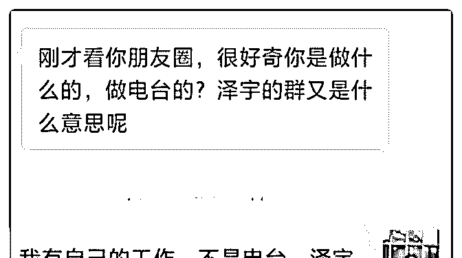
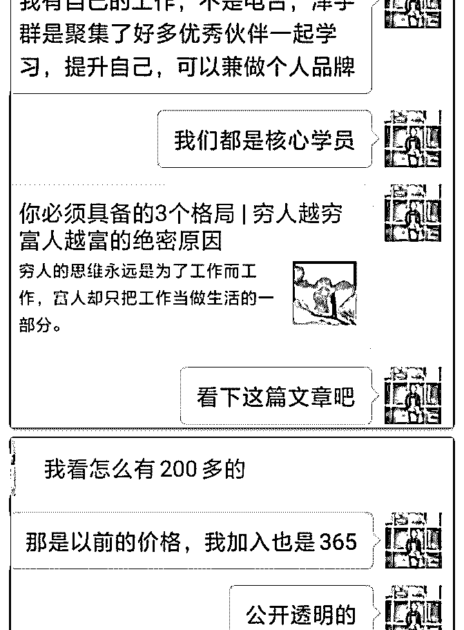
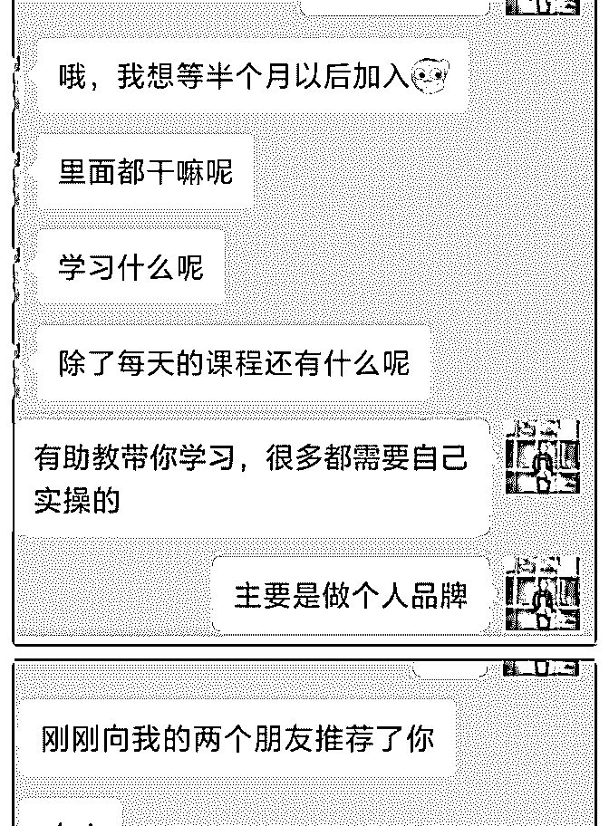
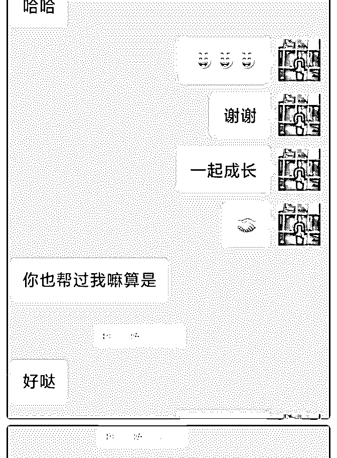
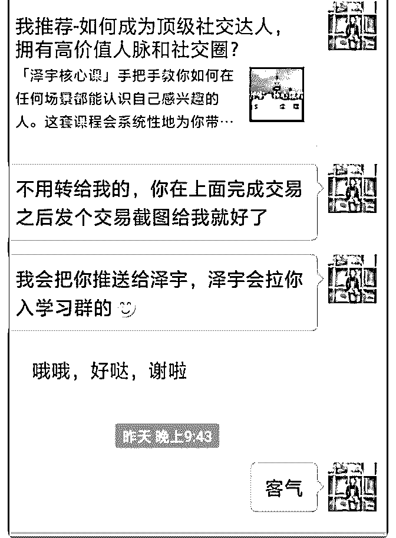
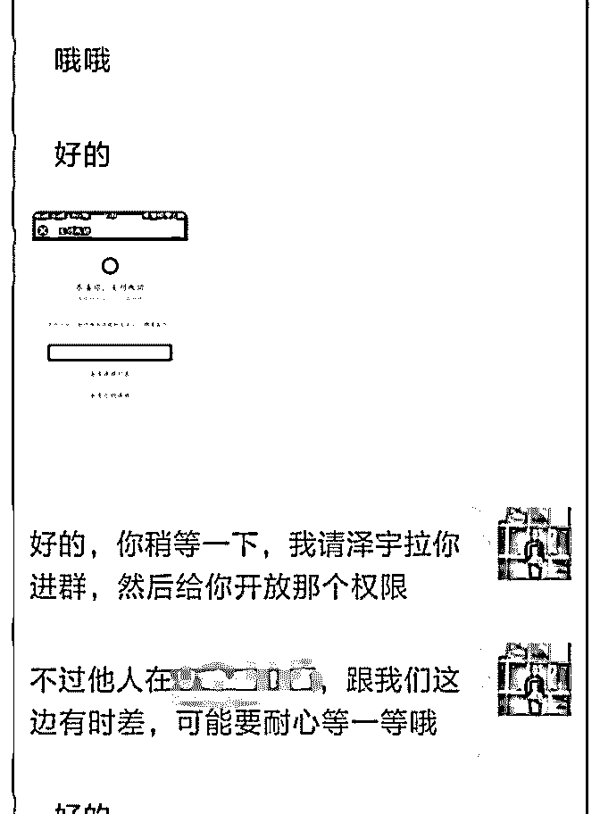
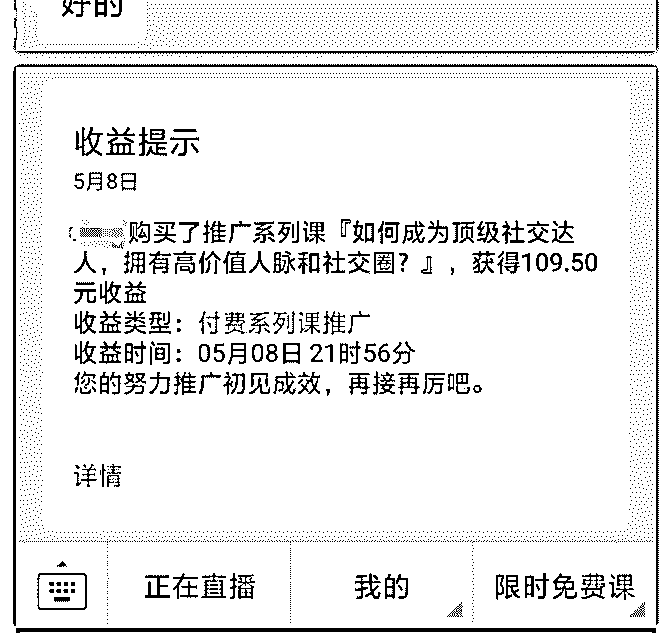

# 打卡 D5 看到了微信

看到了微信的一个免费课程，关于研究生学习期间的安排

的。我加入了群，但并没有按要求发朋友圈，也就是说，并

不能上课。我的目的是-加好友[调皮][调皮]，一连加了十几

个，通过了不到十个吧。有一个聊天，说他并不能帮我什么

（我也没说让他帮什么忙啊），一个群友说他原以为我是推

销什么的微商……其实我自己也发现，除了在泽宇的群里，

经常遇到主动添加好友的以外，其他的群，大部分时候只有

微商会主动添加[尴尬]。

大部分人不主动人，我们泽宇学员却做到了，这就是加入泽

宇核心课的收获吧[呲牙]

2018-05-08(7 赞)

评论区：

Fanny : 我也遇到过类似情况，大部分人不愿意加陌生人，前几天主动加别人时，别人回复请问有什么指教吗？

文亭 : 是的呢，我也遇到过

关注公众号"懒人找资源"，星球资源一站式服务

# 20180508

寂恒 Sam : 20180508 第 44 次打卡 第一个伙伴核心课程成交复盘 相信输出高价值去帮助人，是会有回报的，相信朋友圈的展 示是会有小伙伴在看的。 这位小伙伴是从知乎引流过来的，我提供了帮助，她关注了 我朋友圈发的泽宇 1 对 8 答疑的截图，产生了好奇心。 进而询问我，我直接将泽宇课程文案发给她，她表明会在五 月份购买核心课程。 我跟她就像好朋友，几天不定期会打打招呼，前两天我把泽 宇教育的公开课分享她。 她自己听了两天之后，在昨天晚上，介绍了两个好朋友加我 的微信，并且表示今天会购买泽宇教育的核心课程。 从加我为好友，到今天加入核心课程，一共是经过了 20 天的 时间。

毕竟是第一位成交的小伙伴，还是挺有成就感的！

2018-05-08(10 赞)

白白 : day7

白白的主题

《四月成长记录》

关注公众号"懒人找资源"，星球资源一站式服务

# day7 白白的主题

五月份已经开始，拖了五天的总结终于在今晚补上

“在此之前，从不知道自己可以想这么多，从不知道自己也可

以认识到那些大咖，从不知道原来自己这样擅长，从不知道

原来活了十几年的自己真正想要的是那个”

那些原本以为是幻想中的人.东西，竟然有一天真的出现在我

的生命里

1.七天前认识了高效学习的大咖，并受到指导，受教指导，找

到自己的定位

2.又认识了一批理财大师，思维导图大咖，自媒体清流公子，

记忆力学者，创业大神，剑桥大学留学生等各领悟优秀伙

伴，交流甚欢

3.学习快速阅读与记忆力训练，且用于自己的学业中

4.受到某大咖指导，在定位路上的偏移终于回到正轨，认识到

自己每天都在“假学习”，且成长不断加快

5.结合自身经历，知乎以及其他平台，解答多位小伙伴的问

题，并给出指导

6.构建知识体系，加大输入，深化定位，未来不迷茫

有的人可能过了一生，都没有找到自己想要的，而那些热爱

着并一生努力的人，我很幸运，遇到了一群志同道合的朋友

我们都知道一个人可以走的很快，但是，一群人才可以走的

更远

2018-05-05(4 赞)

关注公众号"懒人找资源"，星球资源一站式服务