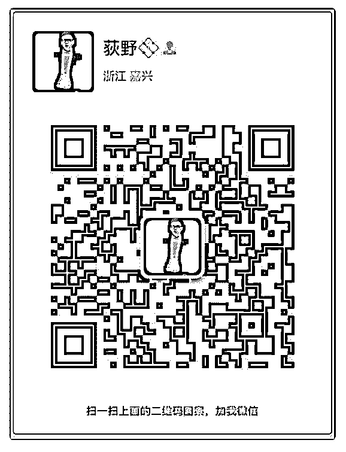

# 【如何正确学习核心

荻野 : 【如何正确学习核心课程】【流程篇】

『第一阶段』

1.一字不差的阅读群公告

2.准备自我介绍

3.备注“内部学员”添加泽宇好友

『第二阶段』

1.学习情感自由手册

2.学习核心课程

3.打卡笔记复盘

4.打卡社交实践复盘

『福利』 打卡 10 次：助教一对一指导

打卡 20 次：送助教的高质量知识星球 打卡 30 次：可以申请加入知乎写作群 打卡 40 次：想要的任意一个高质量学习内容 打卡 50 次：超高价值投资理财内容 打卡 60 次：送你定位超高价值大礼包 新增好友 1000 人：和泽宇一对一指导 新增好友 3000 人：泽宇送你去波士顿机票带你玩一圈 神秘大礼：

从核心成员到泽宇合伙人成长之路

福利：

1.泽宇核心课程学员，完成打卡 20 次，我免费送你我成长知识 星球，为你免费服务一整年。

2.你要学什么课程，我有很多好的内容给你推荐，因为我就在 这个圈子里的。

2018-04-28(30 赞)

关注公众号"懒人找资源"，星球资源一站式服务