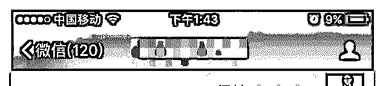
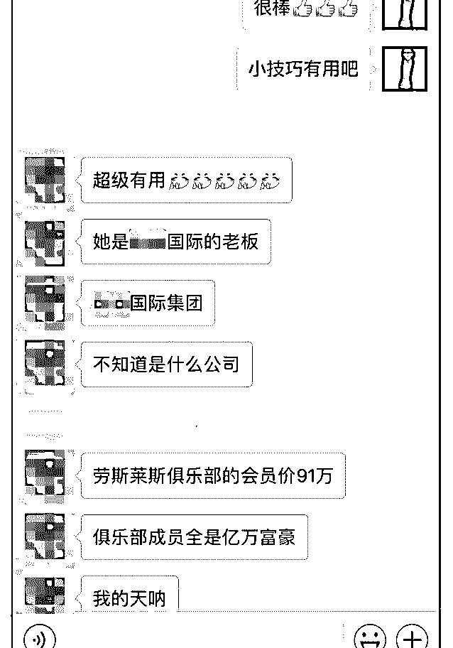
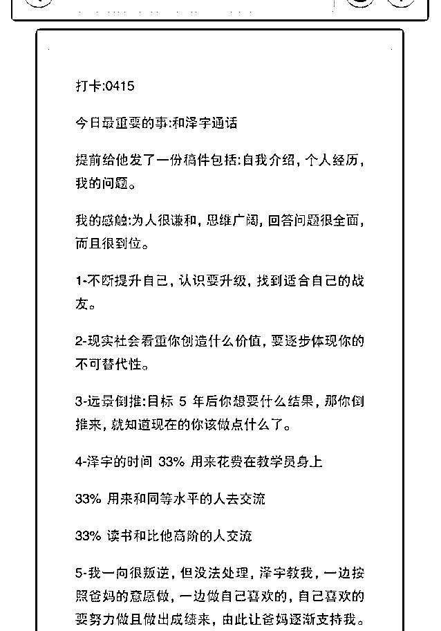
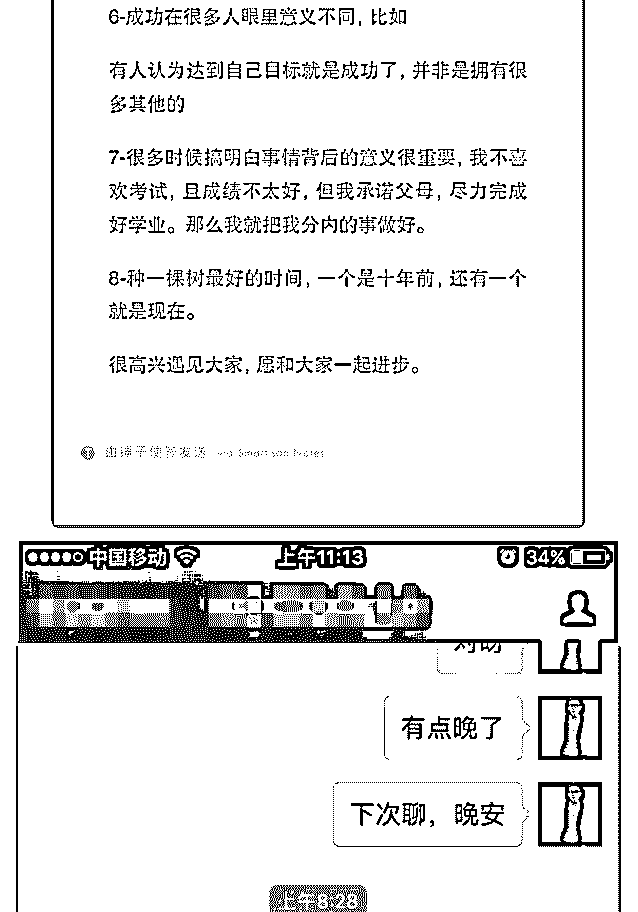
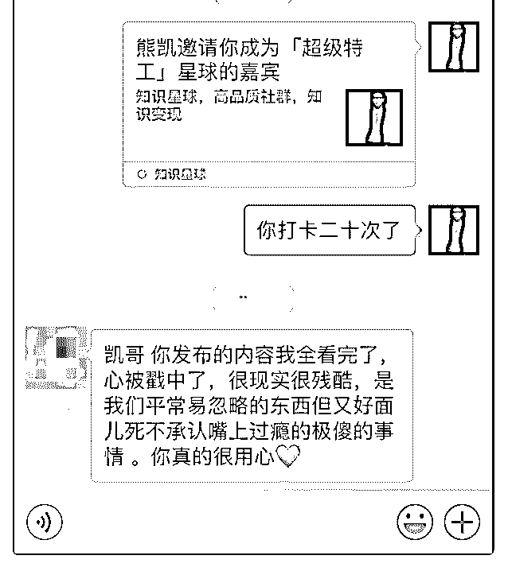

# 【如何向泽宇提问？

荻野 : 【如何向泽宇提问？】

如果你加入核心课程后，好友新增一千人，就可以获得和泽 宇一对一私人指导。

我自己当时的做法分享给你

核心：尊重对方的人和时间

1.提前准备好问题 我当时超级尊重泽宇，平时有问题就会收集下来，留着一对 一指导问泽宇，这样不用当时去想，那样想的问题质量很 差，生怕浪费泽宇的时间。

2.筛选高质量问题 例如其实情感自由和核心课程有写过，是自己学习力不够， 忘了，又再问了一次，这种问题要筛选掉，解决办法是再去 学一遍，或者复习笔记。简单的问题，百度能解决的问题， 例如我为什么感到紧张？因为你缺乏练习。这种问题也筛选 掉。

3.问题具体化 例如，我该如何扩展我的朋友圈？我遇到陌生人我很紧张怎 么办？我如何处理和父母的关系？这些问题都特别虚拟，有 千万种可能，让对方觉得无从下手，结果为了弄清楚事实， 可能泽宇为了了解你的情况，会问你一些问题，不要把时间 浪费掉来让贵人来问你问题。

具体化例如：（以下会很长） 方式一

『我是别人眼中公认的社交“大神”——大一就当上了学生组 织的部长，谙熟学校的各类人物，做项目、办活动、带团队 一切都在周围的人中属于佼佼者，口才也不错，每次做研究 项目我总是能轻而易举的说服别人请不动的人，在实验室里 也是负责人之类的角色，在演讲口才社里担任二辩，也曾是 最佳辩手，各种社团组织，学校组织的面试里，被人称为“面 霸”，基本上一两分钟之内就可以 100% 过。朋友也很多，基 本上属于社交圈很广的那种人。 可是，这都是别人看到的我，我知道真正的我并不是这样。 真正的我发现自己在某些场景中特别拘谨，没有自信，完全 不是平时那个幽默开朗，自信满满，思路清晰的状态，甚至 可以说是恐惧。这种场景往往是面对一大群陌生而健谈的 人，甚至有时候，在一个或者两个陌生人中，甚至在一些关 系一般的朋友中也会出现这样的情况。这让我特别痛苦。 自己也一直在思考原因，目前分析出的一些结论如下： 内心里还是把社交当成了一种证明自己的方式，害怕自己在 社交中不能有精彩的表现，害怕失败。 因为在某些场合社交能力很强，无意中总是给自己定下要更 强或者至少不差的心理期望，造成了面对不熟悉的场景时的 恐惧心理。 这种拥有双重人格的感觉实在是糟糕透了，时而自信满满的 在台上侃侃而谈，时而面对众人无话可说，这让我很苦恼。

请问泽宇能不能给点建议，告诉我我应该如何去克服？尤其 是克服这种把一切都当成证明自己方式的心理，让我能表达 真实的自己。』

或者是方式二

『我时而社交能力特强，时而特别恐惧社交怎么办？』

如果是你，你会更喜欢对方询问你的哪种方式呢？

4.不要打断 前面说的是尊重时间篇，现在说的是尊重人。不要打断别人 的说话，如果你不知道对方什么时候说完，有个小技巧就 是，你别等对方说完之后，停顿五秒，再说。

5.不要武断 如果泽宇说了你不认同的观念，不要快速的下判断评价，去 反驳，可以把自己疑惑的觉得不理解不支持的地方先问出 来，如果泽宇之后的表达你也不认同，可以表述自己的观 点，健康交流。但是永远不要去判断和评价，例如“不对，你 错了，不是的，你想多了”这样的武断句

6.赞美具体化 如果你觉得和泽宇沟通之后，对你的成长有帮助，不要急着 去夸奖“你好棒，你真厉害，或者发表情 ”之类的 话，这样有一种长辈夸奖晚辈的感觉，平辈可以使用，长辈 对晚辈可以使用，但是如果你尊重对方，向对方索取价值， 千万不能这么去表达你的感谢之情。你可以尝试一下在你微 信好友列表里，选择三位你觉得最牛逼的人物，然后问他们 相关专业的问题，他们回答了之后你去赞美他们“你真棒，好 厉害，或者发表情”，你觉得他们会是什么感想。

如果觉得对方提供给你的价值真的有帮助的话。可以直接把 内心的感受说出来。例如【下方图片】

如果觉得一般般，简单的回复一句，谢谢你，也可以。

7.后续反馈 如果你使用泽宇的方法，或者认知的提升，对你的生活和社 交有实际的帮助，在之后可以及时的反馈给泽宇。

一位导师或者帮助过你的贵人，他最希望的就是看到你的成 长，看到他对你的帮助是有用的，他对你的期望没有辜负， 投入的时间没有白费，低自尊的人真的很不尊重自己的时 间。 例如：上次交流之后，我进步很大，认识了我没有想到能认 识的人，最近我认识了一位千万富翁，用你教给我的方法， 我和他相谈甚欢，相见恨晚，他说要手把手的教我怎么学习 投资。太感谢你了！泽宇

最简单的方法就是在群里，看到别人发的消息对你有帮助， 可以及时反馈。你看到消息是信息输入到你的大脑中，你发 出反馈是你从大脑中输出信息，这个就是一个输入到输出的 过程，对你去做到这件事情是有极大的帮助的。可能是因为 触及隐私的原因，更多的人是选择私聊我来谈这个事情，希 望大家可以勇于在群里反馈，这也是对大家提供价值。

8.（想到了再补充） 福利：

1.泽宇核心课程学员，完成打卡 20 次，我免费送你我成长知识 星球，为你免费服务一整年。

2.你要学什么课程，我有很多好的内容给你推荐，因为我就在 这个圈子里的。

2018-04-26(26 赞)

评论区：

杨承节 : 我打卡 20 次以上了，求进“超级特工”星球[憨笑]

蒙小凤 : 打卡 D2

关注公众号"懒人找资源"，星球资源一站式服务