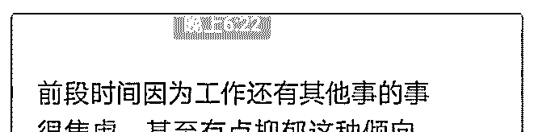
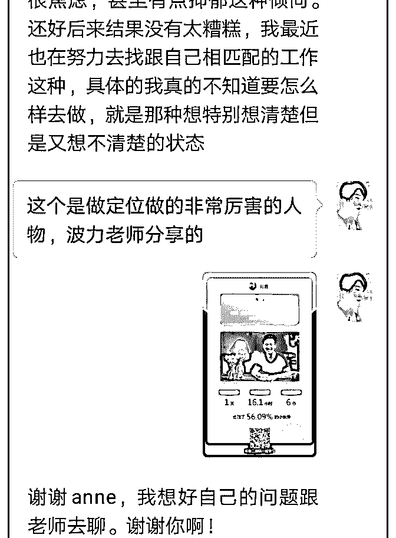
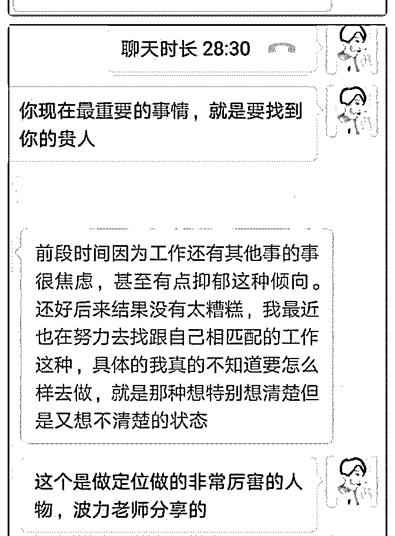
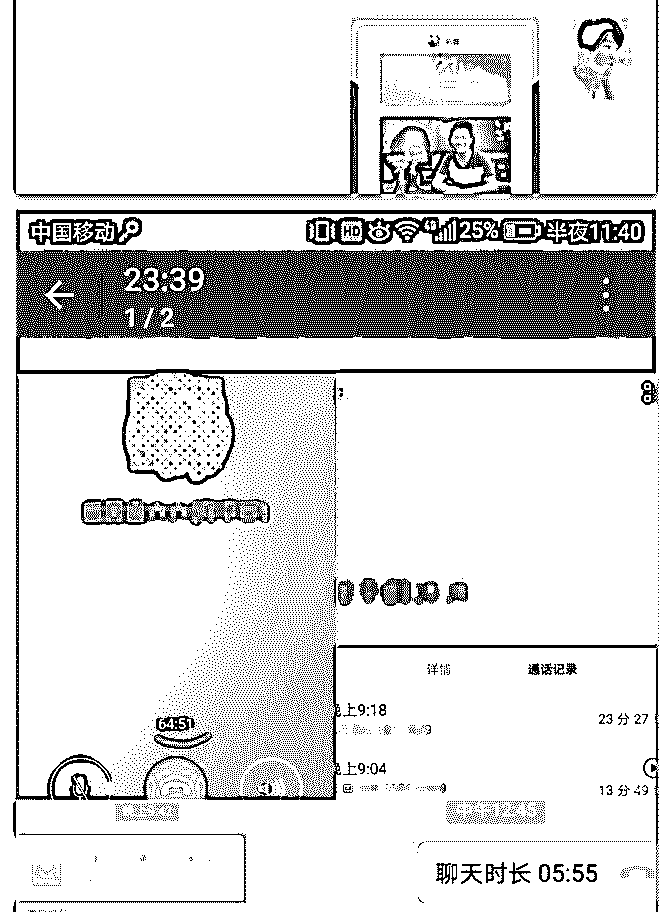
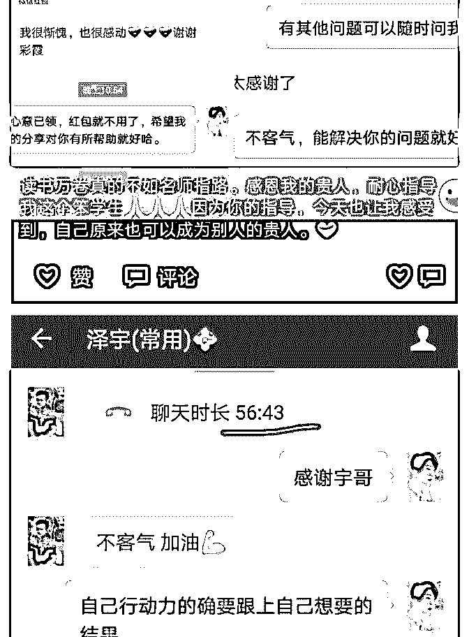
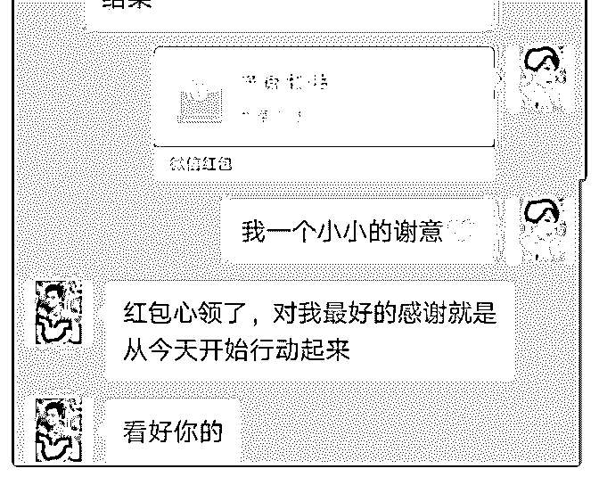

# 我分享的主题《要学

anne : 我分享的主题《要学会找到你的贵人，以及成为别人的 贵人》

我想用 4 张图，分享三个故事： 第一个故事(如图一图二)，是刚刚发生的，从知乎上追过来的 一个伙伴，一开始是想跟着我学写作。后来我们交流更多， 她对定位非常的迷茫，我鼓励她要去找到自己的贵人，让贵 人带她才可以成长更快。

第二个故事(图三)，是昨天发生的，在跟泽宇一对一沟通之 后，我兴奋地找了五个小伙伴儿分享。他们给了我积极反 馈，我也感到自己，从未有过的喜悦与力量。

第三个故事(最后一张图)，是我终于有机会被泽宇一对一指 导。(不要羡慕我，这是导师计划学员，打卡满十天的福利 哦。你们若是导师计划的学员的话，可能会比我更加会利用 资源)我也是再通过泽宇一对一指导后，发生的前面两个故 事。

所以，真的是像波力老师说的，要学会去找到自己的贵人， 让贵人带你才可以成长更快。

2018-03-21(26 赞)

评论区：

廖阿凡 : 对于现在的我的确是需要学会找到自己的贵人，让贵人带着我成长

