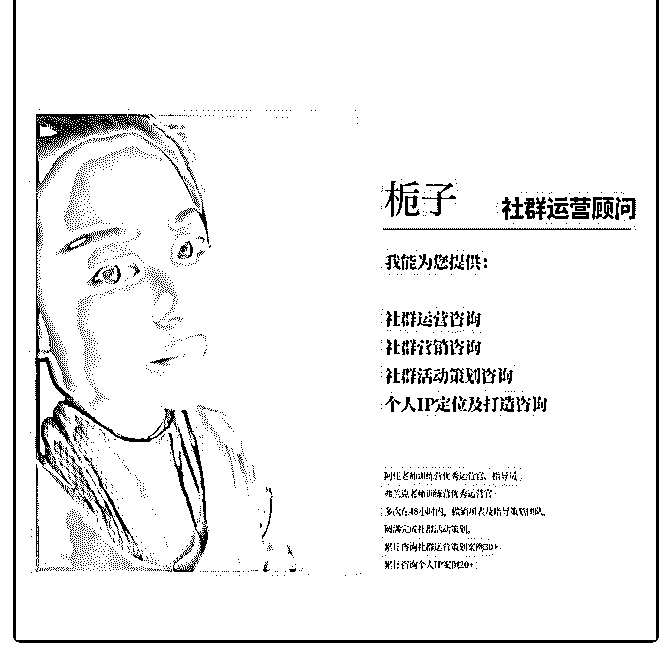
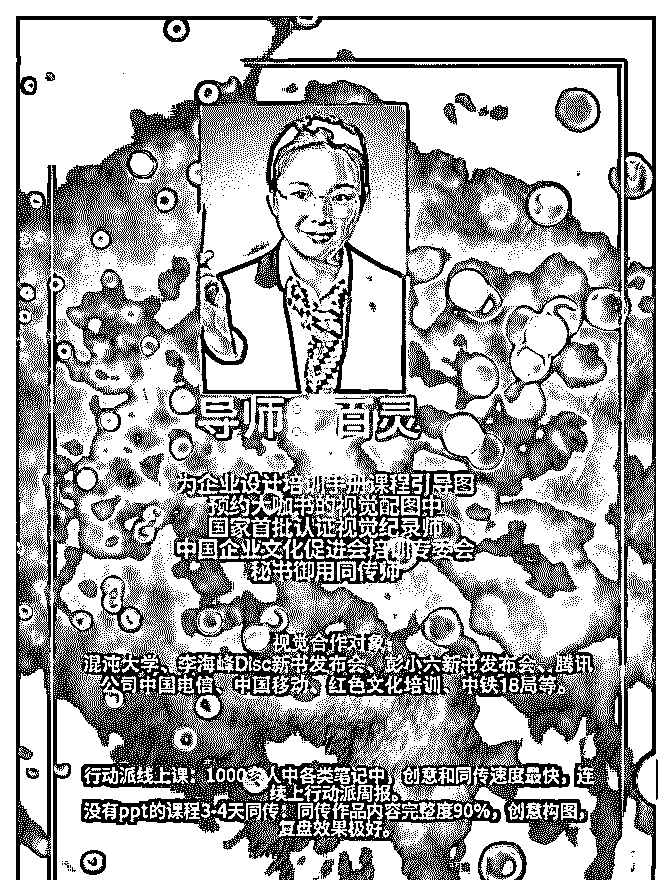
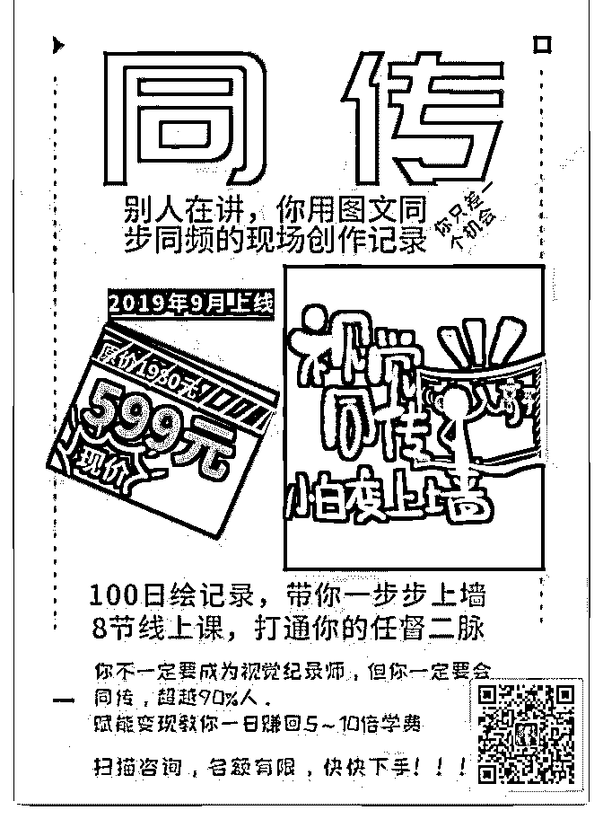

# 通过输出价值赚回学

栀子 : 通过输出价值赚回学费 我是一名有十几年教学经验的钢琴教师，对于线上营销这 块，原本是一窍不通的，也就是大家俗称的小白。

偶然的机会，接触微营销这个领域，但是不太懂怎样打造个 人品牌，后来有幸学习了泽宇教育的课程，更加幸运的是， 认识了言姐——这样一位极致负责利他的泽宇教育金牌助 教，从我开始购买泽宇课程，就经常会得到言姐的督促指 导，非常感谢！

我对自己赚回学费，总结了以下几点： 1.通过学习，对自己有了清晰的定位，定位社群营销顾问，专 门针对解决社群运营、社群活动策划、社群变现等方面问 题。 2.在其它付费社群学习，做到深度参与，输出价值，所以我基 本都是被动吸粉，并且比较精准。 3.真诚帮助来咨询我的人，只要有人咨询，无论是一开始的免 费咨询，还是后来的收费咨询，都是认真对待。 4.后面还会有更多变现方式，比如设置课程，开训练营，因为 还是有很多学员期待我开课的，希望自己极致运用所学知 识，做好个人 IP 定位打造。

感谢： 1.感谢泽宇教育，在这里我学到了自己需要的知识，又认识了 好多优秀的同学伙伴，感谢泽宇提供这么好的平台。 2.感谢言姐，对我的耐心跟踪辅导，特别负责任。我们亦师亦 友，她会跟我分享她的经历，也会帮我一同策划海报，帮我 出谋划策，给出很中肯的建议，言姐是我最大的一个收获， 结识这样一位朋友，真的比赚回学费还开心！

百灵 :

关注公众号"懒人找资源"，星球资源一站式服务

# 1 这周发布海报，开

1 这周发布海报，开启自己的线上课的宣传。

2 截至目前为止赚钱快到了导师课程的学费。

背后所做的努力

1 几年的不断地，利用业余时间去学习，让我转型到目前的职 业做教育培训，同时也把这个爱好一直坚持在业余时间，一

直坚持不断地学习和实践。 2 感谢，背后支持我的朋友和导师，能遇泽宇教育，从未接触 课程到现在。很多的人生限制，打开了不少。对自己理想的 生活状态更加接近。 3 一边输入一边的输出，在行动中完美。2017 给彭小六做同 传，就鼓励我大胆的开课，还有之前服务过的很多企业大 牛，一直拖拖拖到现在。错过了很多的机会，比我起点差的 人，现在做个人品牌做的很好。现在不要让自己留遗憾，抓 紧行动，让自己开课去变现，把自己的技能也能分享给别 人，同时在一边的学习新的东西，这样的感觉真的是很美 妙。 4 刚开始几天很焦虑，晚上思考问题太多，睡不着，现在学会 放下，做好当下的事情，尽力而为，好好生活，已经有个良 好的开始，不错，继续加油

开始变现，可以听下一课了。上次偷偷听了一半，泽宇说要 变现了才能听。 上节课的作业，个人标签的做了张海报，自己想用另外一种 形式，目前在打磨课程，还没做，要做和别人不一样的，有 自己的特长，加音频，做几个版本的，把课程打磨完就做。 先完成再完美，之前做的，赶不上现在成长的步伐。

2019-08-25(2 赞)

评论区：

百灵 : 欢迎大家来交流

关注公众号"懒人找资源"，星球资源一站式服务