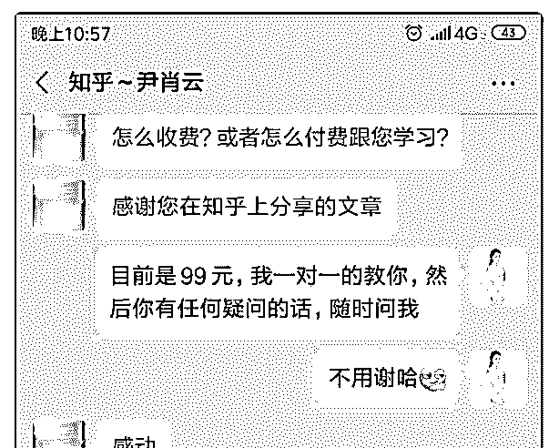
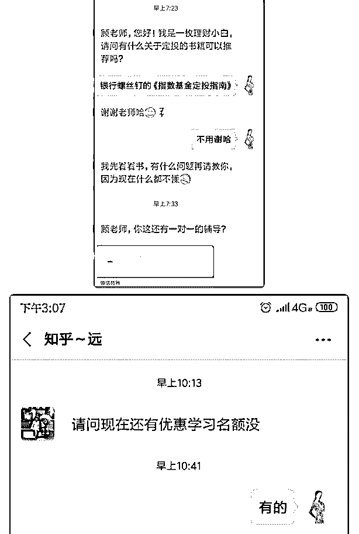
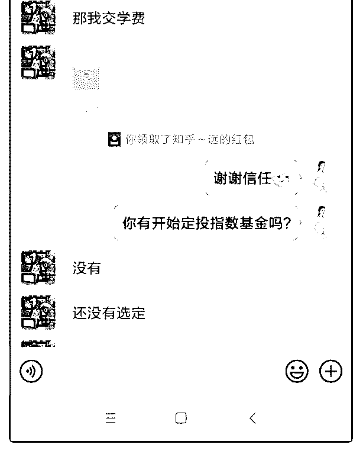
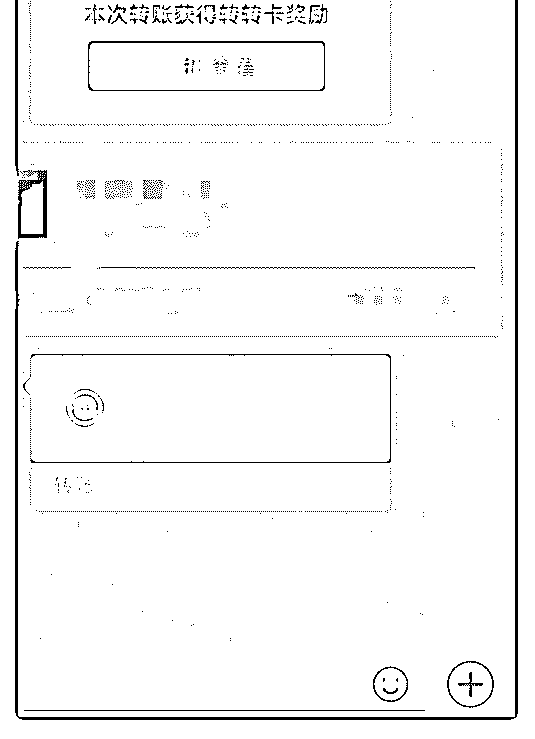

# 我赚回核心课的学费

我赚回核心课的学费了。

我进入泽宇半年了，前期都是两天渔三天晒网，而且经常处

于自我怀疑中，而且做指数基金定投的人那么多，我真能行

吗？

还有一点，我是完全的 0 流量，我用一个新号在做个人品牌， 从第 1 个人加起来的。

一、建设知乎 最初的时候，也买了一个低价的读书社群，发现没有任何作 用。然后开始写知乎。写知乎是在波力老师和艾伦老师的指 导下，我开始建设知乎，边学习边写知乎，6 月份底写了一篇 知乎，7 月底就上了热门，而且现在每天的点赞量越来越多， 目前这篇文章引流过来 40 个人左右了。 写知乎，我感触很深的有两点，第一点是不要自己去瞎琢 磨，而是要找导师要教程，这会让你事半功倍。 第二点是，要不断深耕自己的专业。知乎是一个以干货为主 的平台，干货越干，效果越好。

二、打造朋友圈 当我从知乎引流十几个人过来的时候，我就去找波力老师要 打造朋友圈的教程了。在打造朋友圈的过程中，米娜也给了 我很多帮助。然后我就开始一天发 2-5 条朋友圈，展示我的进 步，我对指数基金的热爱，展示我在不断的学习中，还有一 些免费咨询的反馈，我的生活等。 开始的时候，看了教程，我也不知道该怎么写，但是当我开 始给自己规定一天一定要发一条圈的时候，我对发圈慢慢就 有感觉了。所以说，很多事情，只要去做，慢慢就会好了。

三、成交 我成交的 4 位学员都是从知乎过来的。第一位学员一过来直接 问我有没有付费学习，我说有，问了我多少钱，就直接给我 转账了。然后就把这件事情发圈了。然后接下来的几天陆续 过来 3 个学员，直接转款。 也就是说后 3 个学员是被第一个学员的转款给刺激的。做好前 面两步，成交就变得很简单了。

四、多找波力老师 波力老师在个人品牌年入百万群里说过，听话照做+及时反 馈， 成功一定是很轻松的。 因为波力老师的认知与我们的认知不在一个维度上，他一句 话就可以解决我们思索很久的问题，还有就是他可以给我们 自己不会想到的更高维度的解决方式。

2019-08-24(8 赞)

关注公众号"懒人找资源"，星球资源一站式服务

# 成果分享 8 月 2

蔡霞教练 情绪平衡｜* : 成果分享 8 月 23 号上午 9 点 15 分给一个预约的小伙伴做了免费个案，上 次她参加平台线下课赠送的这次个案。即便是免费的，我仍 然同收费个案一样做的效果非常好。在工作中的焦虑、委 屈、压力大、对未来的期待，从工作中的情绪处理到与家人 相处的情绪，一一平衡。个案中她不停的咳嗽、流泪，被压 抑的能量开始流动，个案结束时非常平静喜悦。她讲效果非 常好，对我很信任。希望以后在与孩子的相处中有情绪仍然 找我。我顺带提了下个月涨价的事情，她毫无犹豫交费 2000。

19 号加入泽宇教育，开启了我生命中崭新的生活。这几天在

聚星会的群里接触到非常多的优秀伙伴。安娜老师在团队内

训时仍然抽时间回复我的信息，并约定了一对一的语音指

导，个人介绍中标签太多需要改，我准备要做的一对多的训

练营安娜老师也给了指导，非常感恩老师，加入泽宇我感受

到了满满的爱。我带着这种感觉和个案沟通时我充满了信

心，我知道她是对我非常信任的，就像我信任泽宇教育肯定

会带我达成年收入 7 位数的顶级咨询师一样。我给我的个案能 带来的是她也可以成为和我一样拥有自我疗愈能力的疗愈

师。感恩所有遇见，继续加油！ 小伙伴们如需深度链接，可以扫码加我。谢谢！我爱你们。 2019-08-23(1 赞)

新页心语 :

关注公众号"懒人找资源"，星球资源一站式服务