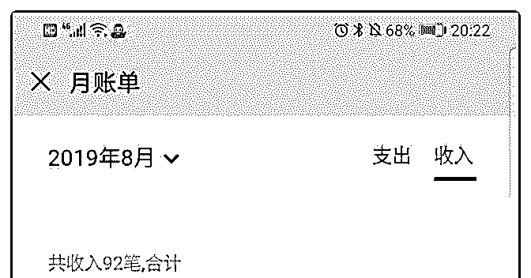
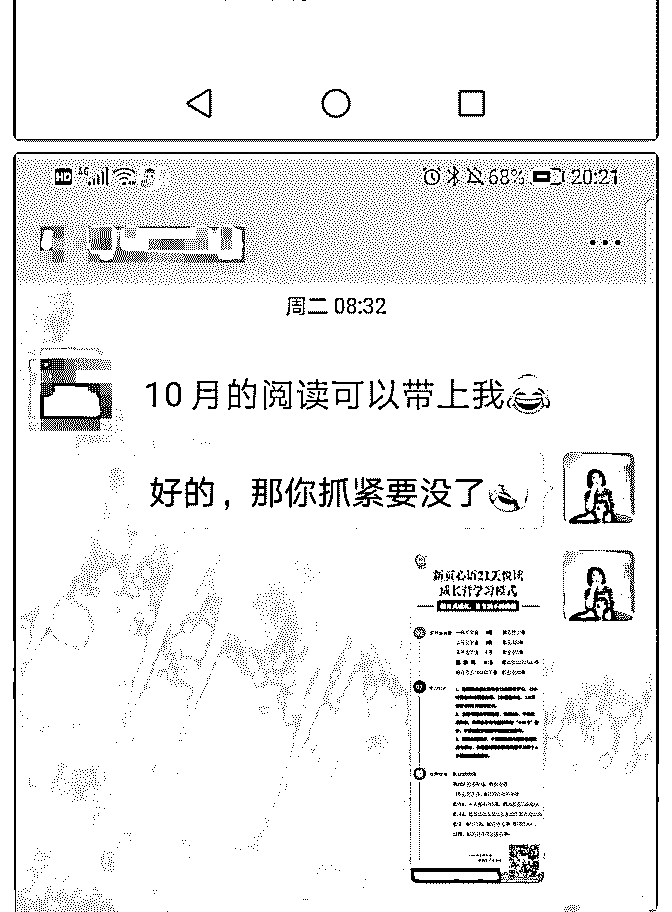
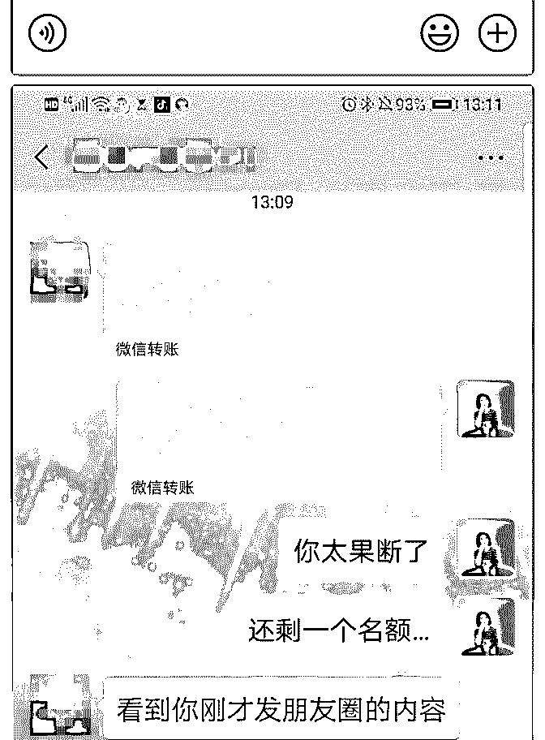
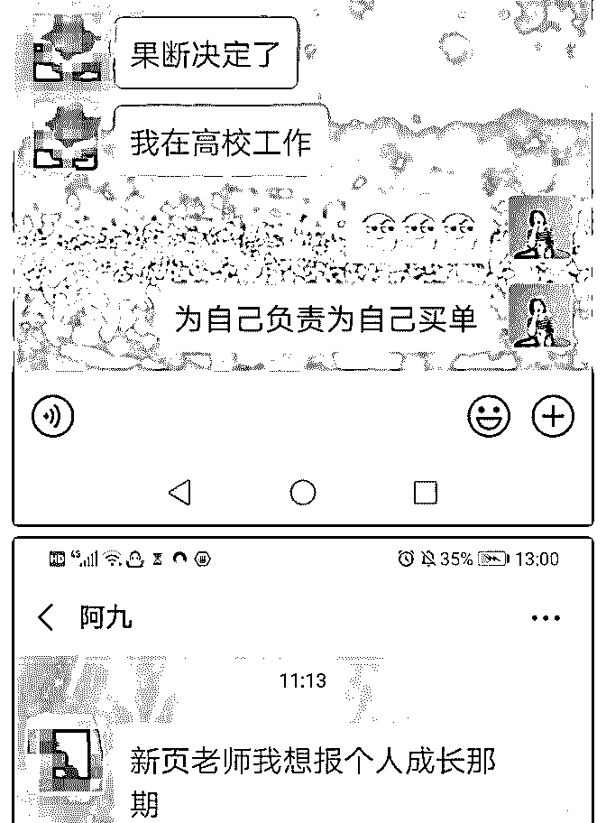
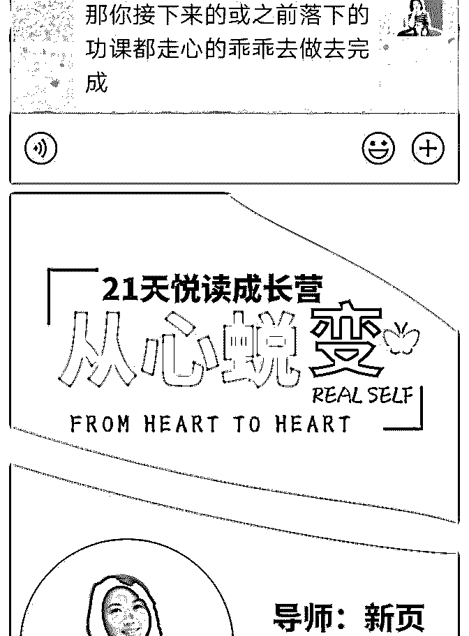
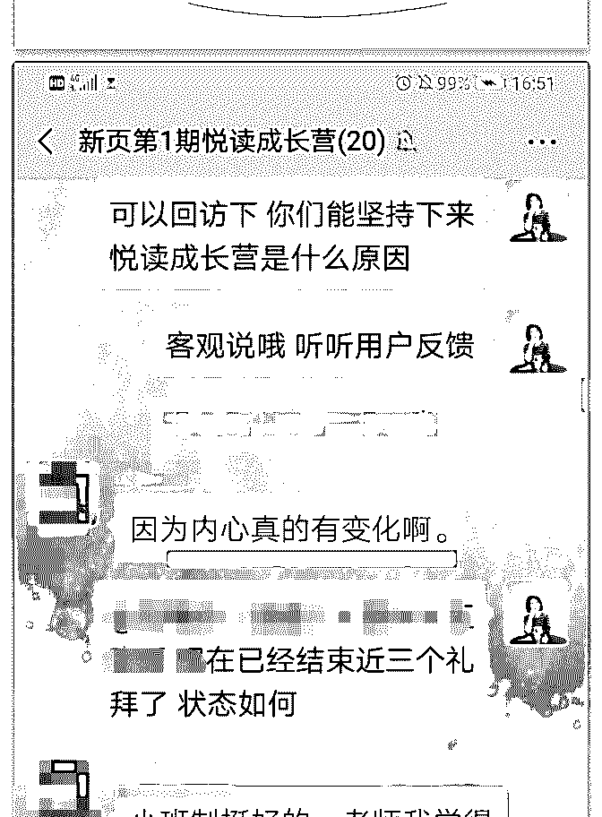
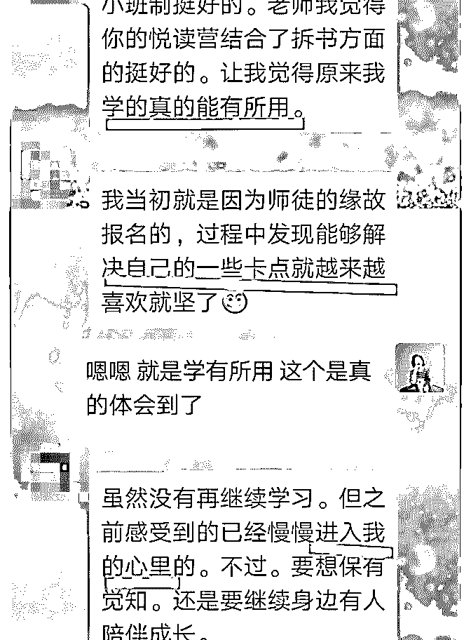
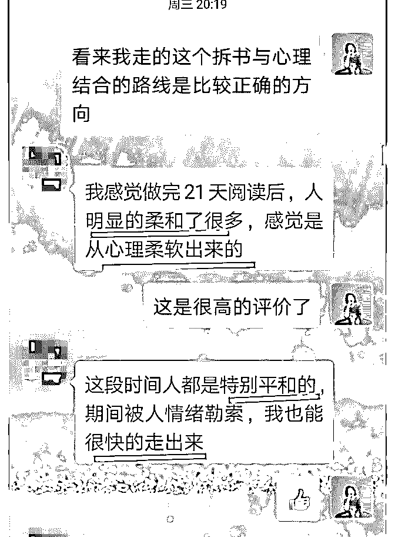
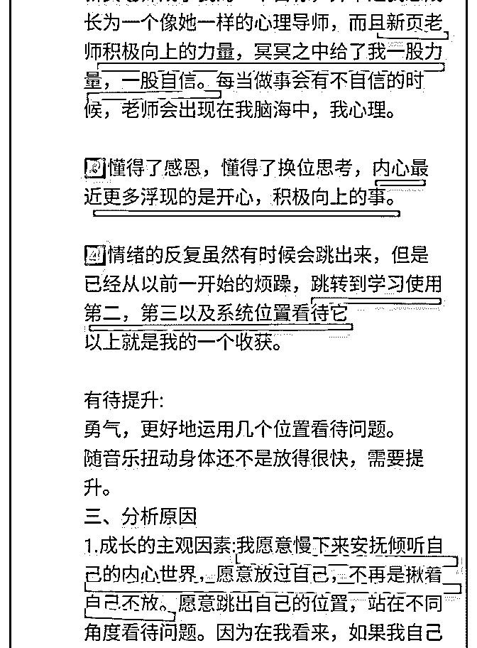
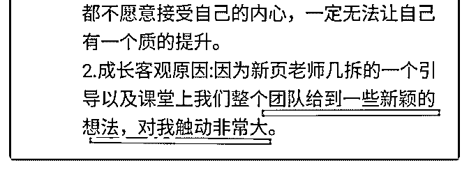

# 加入泽宇教育三天赚

加入泽宇教育三天赚回学费（收入 15720 元）

8 月 18 日导师芬芬的一通咨询让我毫不犹豫的加入了聚星会， 因为我自己有非常清晰的个人定位，包括产品也获得很好的 口碑，只是对于如何引流和宣传包括成单存有卡点，所以特 别需要有专业导师能给予指导，也许是宇宙冥冥之中的安 排，就这样我链接上了泽宇教育，被公众号的文章所吸引， 被这样一个 97 年的超跑少年所震撼~

“快、准、狠”是我近三年的座右铭，也许是 36 岁的年纪让我 明白了我不能让我的光阴再虚度下去，于是我很清晰的看清 自己要什么，而不像之前一样只知道不要什么！

虽然我 5 年时间做了 1000+小时的付费个案咨询，虽然我 3 年时 间的授课让 3000+学员受益，可是我总觉得进步节奏可以更快 一点，可是更快一点又是什么我的脑海似乎又没有清晰的图 像......直到我发现每次我在成交个案或课程的时候总是一副无 条件接纳的状态，我才明白，我不该把做心理的那种心态用 在营销上。顶级销售心经是贩卖未来才能快速成单，而我却 完全不懂，真的是隔行如隔山，难怪总觉得节奏有些慢却又 说不出哪里出现了问题...

买了课程之后，我隔天就开始泡课了，说过了嘛“快准狠”是 我的座右铭。正巧当天晚上有个读书会的会长邀请去做分享 是个 15 人的小型分享会，正巧是分享关于我对阅读的一些心 得与体会（这和我的产品悦读成长营相关性太强了），我尝 试着把泽宇在导师课上所讲的要找到并加深客户的当下状态

同时强化理想状态的美妙愿景，在这个差异间造出一座桥梁 告诉客户，我可以帮他们做到。结果也就 15 人的分享会，扣 除 5 个小孩子，我竟然打动了 2 位客户，在隔天立即成单了。 正巧我的悦读成长营因为太受欢迎了，在 7 月举办第一期时就 已经把 8 月的学员招满了，因为 50%的老学员回购率。而我 8 月的课正当开营，9 月的课程也已爆满了。8 月的课还在 上，11 月和 12 月的课程就被老学员包班带走了，就剩下 10 月 份的 12 席位。本来我还想等 9 月份新学员上课后觉得好会回购 再来销售，结果使用了泽宇教育的技法，也就在我参加完分 享会的隔天下午 15 时，12 位学员全部招满，并且轻松不费 力，而且还有好 3 位新学员缴费锁住了明年课程的名额。这简 直太不可思议了~

我本来想赶紧来写复盘了，可惜泽宇的课程实在是太棒了， 除了悦读成长营的授课还有做个案，就一直泡在泽宇的课程 里，甚至困得睡着了，泽宇的声音还陪伴在我的耳边......而现 在我终于把所有课程全部听完了，我现在更加清晰接下来我 要做什么了，那就是超级课程，期待我给大家播报更震惊的 成果吧~芬芬，我说过的，回头会给你一个惊喜！

2019-08-23(1 赞)

关注公众号"懒人找资源"，星球资源一站式服务