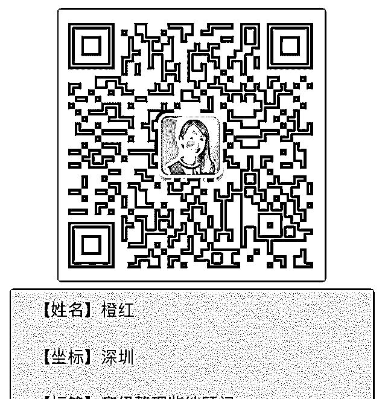
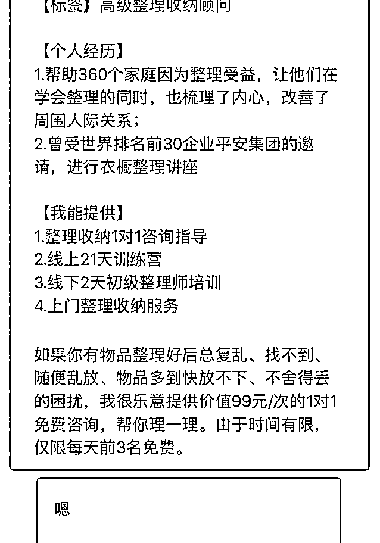
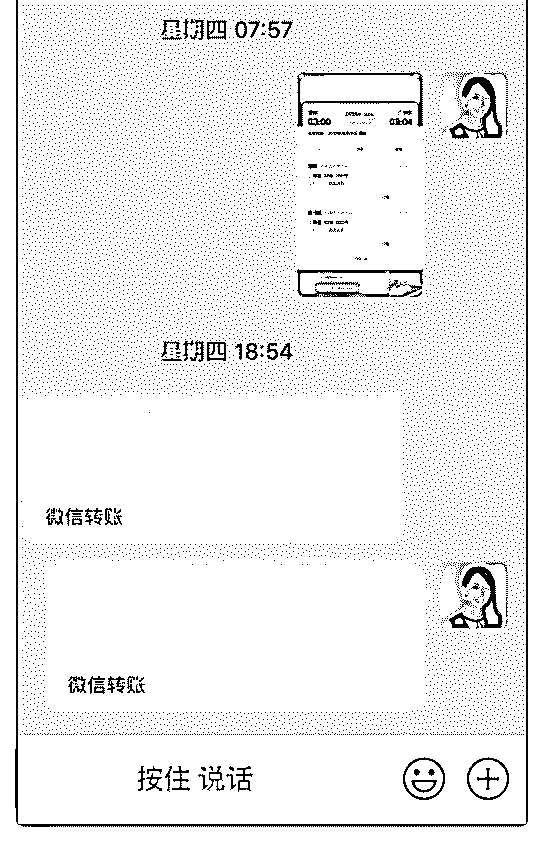
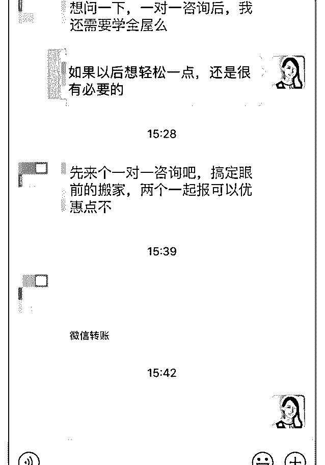

# 一周内变现 1579

橙红-高级整理收纳顾* : 一周内变现 1579 元。 （上门 311+培 训 1169+咨询 99）

上周四到广州帮合伙人的前同事做半公益的上门整理，然后 和两位合伙人继续着手准备周末两天线下初级整理师培训的 课件，加班加点终于在开课前写好。最后在我们的配合下， 课程顺利结束并收获学员一致好评，太不容易了！回深倒了 三天的生物钟，才把那几天的觉补回来，哈哈！

昨天成交了一单搬家整理咨询。之前跟客户有弱链接，她说 学完泽宇课程跟我学整理。昨天突然问我扔东西的标准，知 道她要搬家后，顺带提到要不跟我来个 1 对 1 咨询，解答了客 户疑惑后，最后成交。

总结：

1、打破自我设限。 放下所谓的师傅的脸面，跟异地前学员合作接异地上门整理 服务和线下课程，毕竟她有资源，学会资源共享，互帮互 助。另外我们三人头脑风暴碰撞出好多新内容，算是一个小 小的进步。

2、先完成再完美。把一年内学到的整理收纳知识和实践的经 验，内化到我们的课件里面，通过输出给学员，复盘，倒逼 输入。之前一直有开线下课的想法，但没执行。利用泽宇咨 询本质通过解决方案帮助客户从当下状态到达理想状态的思 路，打造课件，逻辑思路比以前更清晰。

3、利他之心。帮客户做咨询，可以从类似于弱链接的沟通和

微帮忙来建立信任和刺激咨询，当客户感受到你的专业和用 心时，自然就成交了。

4、坚持发朋友圈。展示自己正能量、充实的一面；通过案 例、干货、感悟等展示个人价值和成果。

反思： 还有很多方面没有完全执行到位，需要再加把劲。 2019-08-23(3 赞)

关注公众号"懒人找资源"，星球资源一站式服务