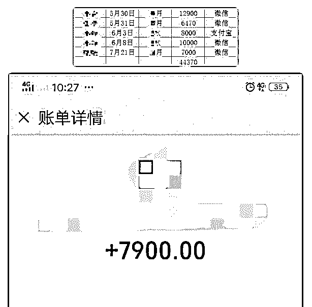
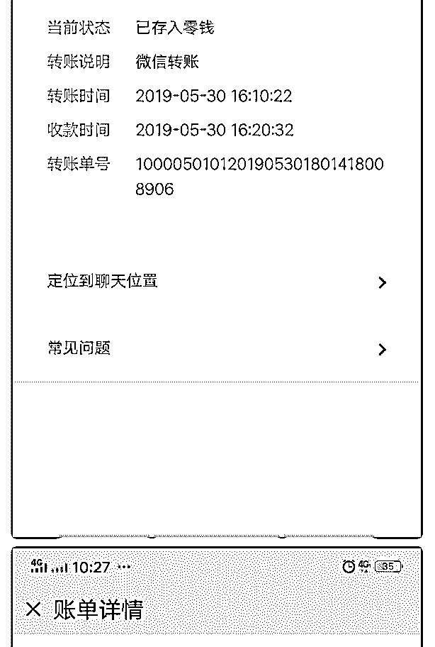
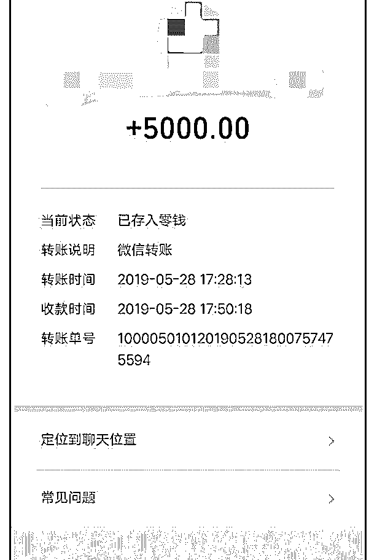
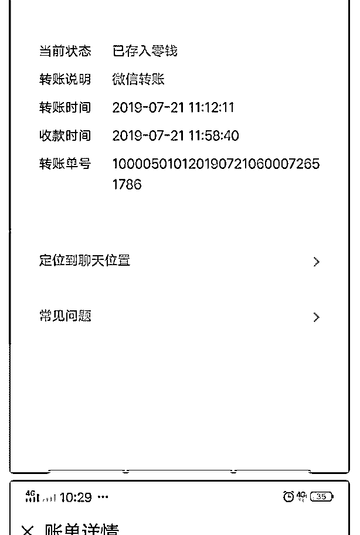
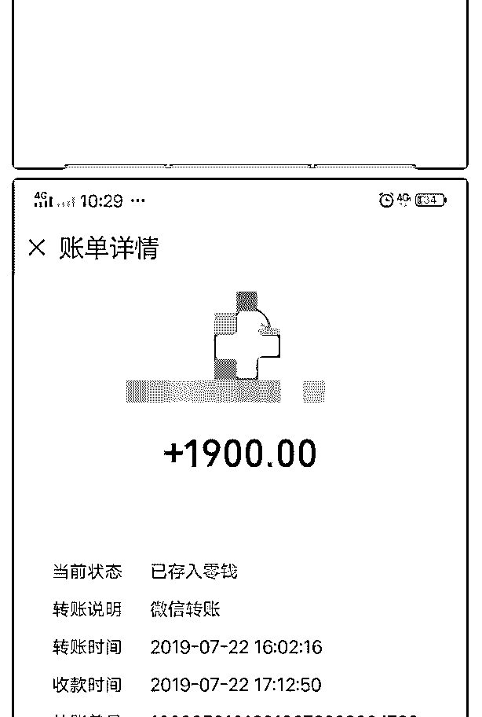
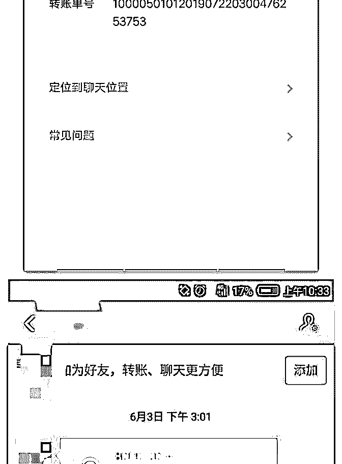
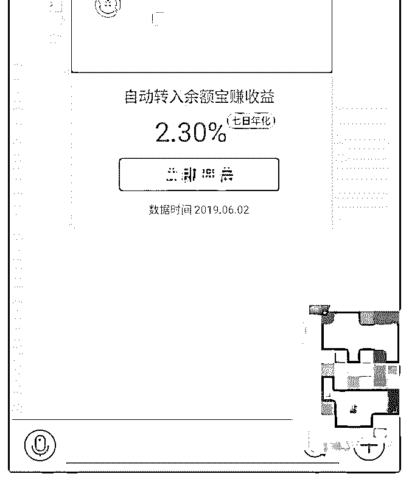

# 破蛋壳收 99 元员学

破蛋壳收 99 元员学员 4 名复盘 5 月底加入泽宇教育，光是定位花了 1 个学多月的时间，通过 各种单独咨询波力和小鱼老师 7 月终于定好位，开始行动 8 月 7 号开始招收学员，变现 400 块

最近是在招募的免费学员，招满了 10 个，还有其他同学过来 咨询是否还有没有名额

我告知没有了，一开始没有在意。没有想到要转化成位付费 学员。

免费的学员还刚开始学习，课件也没有做好。所以过来免费 咨询的学员我就询问他们存在的问题，是否有投资经验，根 据每个人的情况我就就做了解答和建议。

晚上的时候还是有人来问名额，后来我灵机一动就发招募学 员的朋友圈，说只招募 5 位 99 的学员，然后分别@了之前免费 咨询的学员。

没有过多久，就有两个学员很快就付款报名。第二天再发 圈，继续@意向人员，以前聊得比较好，很快也有两个付款

了。

总结：

1.本次招募 4 人源于之前的私聊建立的信任关系，很快成交。 随属意外，这也说明，信任是成交的基础，信任的前提就利 他价值，一开始，没有抱着转换的心，觉得免费名额没有 了，挺抱歉的的，就耐心解决的了他们的问题，获取了信 任。

2.招募开始了，名额放的比较少，后面没有形成发圈继续追 销，导致报名就没有了，只找到了 4 个。

3.发朋友圈对陌生人的吸引力还不够，这说明，提供的价值不 够，信任度建立得不好

4.朋友圈陌生人比较多，自己的权威不够，没有成功案例的展 示。不容易建立信任。

改进：1.每天抽出时间来跟微信好友互动是很有必要的，没有 联系就没与关注和成交

2\. 聊天的时候一定要想给到对方价值，而不是想着快速成 交，解决客户的问题才是关键

3.多在朋友圈送出福利，积极收集学员的反馈，做案例展示

4.在与基金主题相关的朋友圈当中，评论区写上招募信息

2019-08-14(12 赞)

评论区：

蜜柚～ : 套路:聊天互动，给价值，解决问题。送福利，集反馈，展案例，构成吸引。先免费，设置名额，增加稀缺性，带

来付费学员转化。

静享拾光～芳芳 : 只要自己不放弃，终究会看到希望

关注公众号"懒人找资源"，星球资源一站式服务

#庆祝成果 加入泽 情感咨询导师若水 : #庆祝成果 加入泽宇教育 2 个多月了，变现 40000 多。

开始学习课程时候，感受到泽宇教育的大格局，深信自己选 择是对的。

我本来做了 4 年的情感咨询经历，开始定位时候，我就定了自 己擅长的【情感咨询】。

在经营个人品牌过程，我遇到不少困难，比如如何写文章， 如何引流，如何经验朋友圈，如何让客户在我这里咨询。

我经常找小鱼和波力老师，哈哈，不懂就问啦。 开始我比较抗拒晒单，后来觉得我不晒单，我可以分享和客

户的聊天记录，让大家知道我是在做什么，做的有多好就够

了，

然后就开始晒和客户的聊天记录。[愉快]

真的是办法比困难多呀。

5 月比较努力，客户认可比较高，续费咨询。

6 月外出学习，佛系状态，主要是做好朋友圈，客户主动续

费。

7 月专注输出，做引流，没太关注转化，也是做好朋友圈建 设，加强了和客户粘度，有了好几个转介绍。

目前一共转化 44370 元。

真的做好了服务，其他一切也是自然而然到来，谢谢努力的 自己 [耶]

我认为我加入泽宇教育是非常对的选择，如果更早知道泽宇 教育，那一定更早有突破了[愉快]

感恩泽宇教育[爱心][爱心][玫瑰][玫瑰] 2019-08-13(7 赞)

评论区：

蜜柚～ : 晒聊天截图提高客户认可度，做好朋友圈增加客户续费，价值输出增加客户粘度，最终带来转介绍。每一步都算 数！赞一个

七月 :

关注公众号"懒人找资源"，星球资源一站式服务