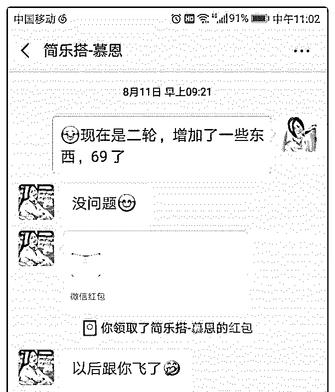
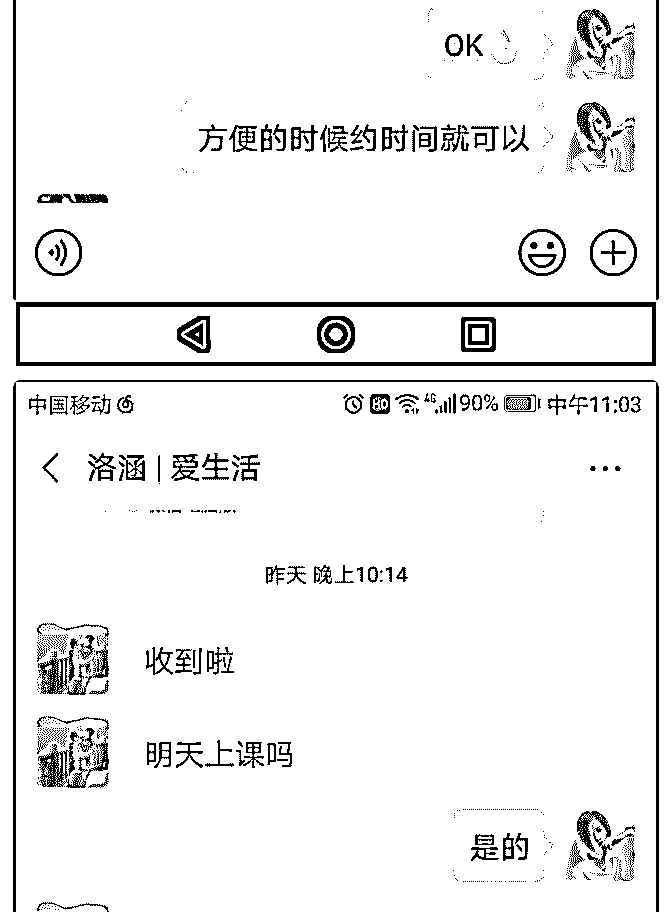
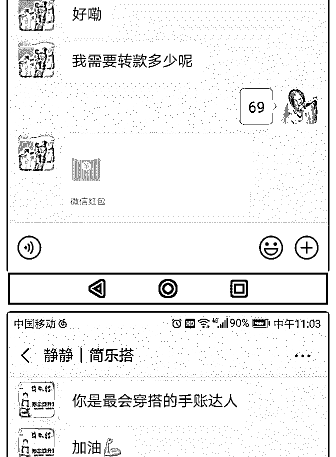
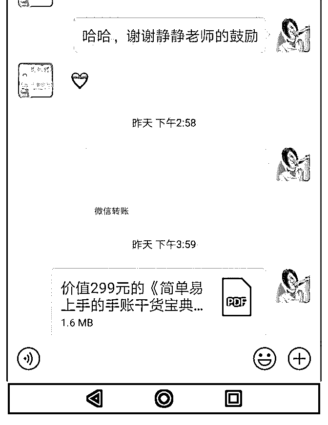
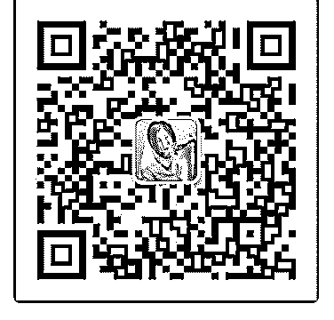

# 二轮手帐课程验证，

二轮手帐课程验证，计划收 6 人，实际收付费 5 人，免费 2 人，

共 7 人，收费 345 元。

第一轮体验课收 10 人，每人 9.9，实收 100。

手帐课实际收益共计 445 元。

下面是实行过程中的一些问题。 1:两次招募都是被动的，不是主动招募。都是因为有人来咨询 课程，想要学习手帐，就开课了。第二次招募也是佛系招 募，只发了两次收款图，人就招够了。虽然达到了招募的目 的，但是太被动，不利于建立良好的信任感和体验感。 2:课程本身：一轮体验课结束后，砍掉了绝大部分的手帐形 式，专注规划生活和提高效率。但是很多课程内容是边学习 边补充的，有些方法因个人原因，实践后效果并不好，导致 自我质疑，一直停步不前，停了很长一段时间。 3:对未来发展方向的焦虑，总是想着以后要发展到哪个方向， 特别是看到偶像的高度，觉得自己就算顺着她的路走，也无 法超越她，内心里也担忧，她已经是做到了这个方向的第一 名，感觉自己无路可走了，心理设限非常严重。 4:懒惰，也是之前提过的间歇性颓废。前段时间出门半个月， 没有迅速适应不同的环境，总觉得工作要在家里做才行，出 门就没办法完成任务了，这种设限也是导致停顿的一个原 因。 5:自我否定：自我目标不够明确，导致不敢想不敢做，行动力 不足。还觉得自己不是帅才，没人带领就不知道该做什么。

解决方法：

1:找小鱼老师，陈述问题，解决心理焦虑和自我质疑。

2:做好目前的课程，先完成再完善。

3:确定主要任务，一次只做一件事。

4:每天都做一些任务，可以慢，但不停。

5:可以做自己的领导，明确要达成的效果和期限，为自己安排

任务 。

久等了， 很开心遇见，简单的自我介绍一下[太阳]

【昵称】七月

【坐标】山东济宁

【标签】手账/打造生活仪式感/过看的见的 365 天

【我能提供】

①帮你摆脱“感觉什么都没做一天就过去了”的盲目焦虑

②简洁高效的成长手账

③落地实操性强的复盘方法

④打造生活仪式感

【近期内成长】：

①创建个人手账风格

②做日常手账 35 天，熟悉各种手账

③助力 10+位小伙伴规划生活、记录成长

【爱好】手账、赚钱、成长 很开心同频链接，关于手账的疑惑和心得欢迎多多交流。 如果你对手账有兴趣，想抓住一个改变人生的机会，我愿意

陪你一起。回复暗号［手账］，免费赠送价值 299 的《简单易 上手的手帐干货宝典》。

2019-08-13(5 赞)

评论区：

黄黄 : 七月老师棒棒哒

关注公众号"懒人找资源"，星球资源一站式服务