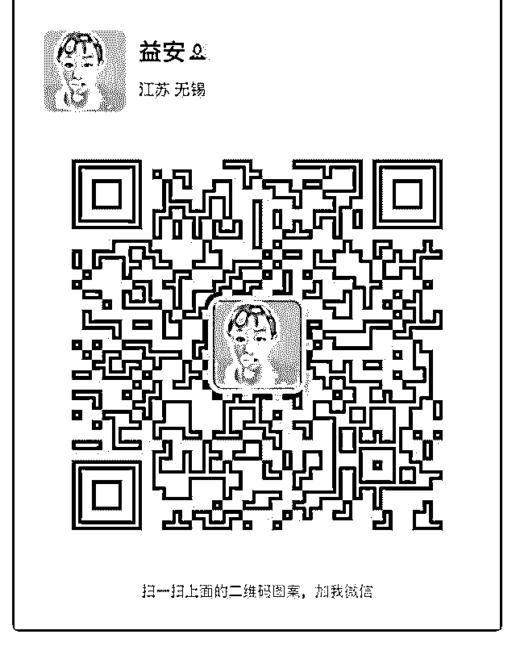
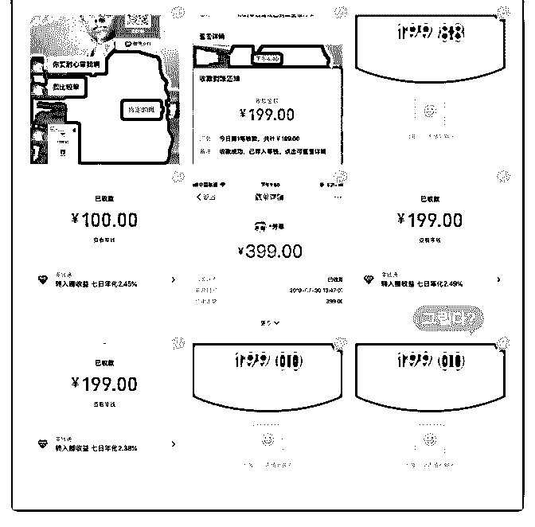
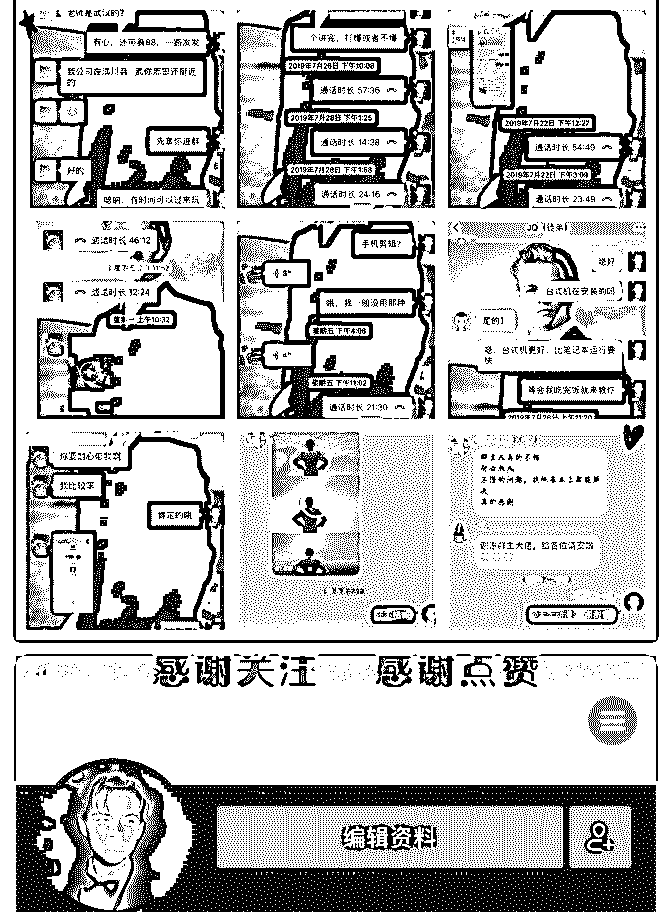

# 庆祝成果# 一个护

护肤达人-益安 : 庆祝成果# 一个护肤咨询，收款 500+赚回学 费！

大家好，我是护肤达人-益安。说来惭愧，报名泽宇老师的课 程是 5 月份，中间一直断断续续。最近在可爱的猫大莉老师指 导下，开始小有收获，今天写个复盘，给自己的脚步留下印 记。

❥ 原来的我是 35 岁+的职场宝妈，在银行业工作多年，勤勤 恳恳埋头苦干很多年。因为自己对工作狂热，靠谱且有责任 心，中间顺利晋升到中层。

然而有了家庭和孩子之后，自己再也不是可以陪领导加班到 最后的那个人，事事时时考虑到孩子和家庭。作为一个完美 主义者，在经过两三年内心的拧巴和实践磨合后，我知道如 果想事业和家庭两全，累的是自己，辛苦的是孩子。

终究自己只是一个平凡的普通人。没有人脉资源，没有所在 行业的关系网，靠自己牺牲时间和精力换来的工作业绩，必 然要牺牲掉孩子和家庭。所以我选择退出中层，做一个本分 踏实肯干的基层员工。

❥然而我的忧患意识一直在脑子里盘旋，本来这个行业就是 竞争激烈，淘汰很快，我害怕自己会走到被行业和时代抛弃 那一步。所以我开始在主业之外找缺口。之前我对自己的定 位是私人护肤咨询师，但是心里一直很虚，所以根本不敢在 朋友圈公开叫卖。

直到遇到了大莉老师，她热情又直接，让我毫不保留的说出

自己的犹豫和不确定。大莉老师帮我诊断以后，告诉我把标 签改为【护肤达人】并且加上，【让你看起来年轻 3-5 岁】

虽然这是一个小小的改动，我突然就觉得自己不再被原来“护 肤咨询师”的招牌给压抑住了，因为我知道凭自己目前掌握的 知识，心里确实很没谱。但“护肤达人”就不一样了，它更接 地气，更让人有亲近感，而且明确传递给大家，“年轻 3-5 岁”

同时，经过大莉老师的梳理。她很快的把我现有的产品线总 结为“抗衰老”，确实，我的产品都是抗衰老的，但我就是没 有想到这个词。

这个定位下来了，我的发圈文案主题也就明朗了。老师看了 一些我的产品介绍之后，给我定下了“胶原蛋白”这个主打产 品，并指导我每天发圈的内容。

除了生活打造这一块，一条可以普及胶原蛋白的知识，一条 可以晒产品效果的对比图，或者客户的咨询成交晒单图。

❥一下子我的思路就明确了，不再像之前每天犹豫，那么多 产品，到底朋友圈发哪一个好。有的时候，上午对 A 产品有灵 感，就发 A 产品，下午又觉得应该 B 产品也很不错，又推一下 B 产品。如果我是客户，也会觉得很迷惑。

这样我就开始盯住胶原蛋白产品开始发圈。每天 3-4 条，其中 产品占 2 条。我先森的同事看到我的标签下面多了一个“护肤 达人”，就开始私聊我，但是一上来没有说护肤的事，只是问 我上次粗去好不好玩。

我意识到她可能会有护肤需求，也不着急，顺着她的话先聊 下去。她后来说起工作上的烦心事，让她身体很疲劳，最近 还去看了医生。正好我也有过相似的症状，但是比她轻多

了，就开始切入女人的自我关爱话题。她觉得我很厉害，在 社群不断分享，自己也不断学习。我表示自己已经积累了相 当长一段时间，也为一些客户提供付费咨询，并告诉她收费 标准。

我没有让她先付费再给她做咨询，而是顺着她提出的皮肤痛 点问题，给她直接解答和开处方。而且给了她几个客户的使 用效果对比图。

到最后，她直接给我转钱，我一看金额，是 1 罐胶原蛋白+咨 询费的金额。当下我心里非常激动和意外，这个客户，据我 了解，并不是一个花钱大手大脚的人，能在和我第一次认真 讨论皮肤问题的时候就直接下单，是不是证明一方面我的专 业正好戳中了她的痛点，另一方面她迫切想给自己一个机会 走出现状（皮肤的现状）。

❥事后我简单复盘了一下 1、她肯定是关注我的朋友圈的。对我的胶原蛋白产品有一定 的了解。 2、她对我这个人是认同的，不然不会主动找我聊天。

3、一开始的聊天话题只是铺垫，而我也能及时把握住她真正

想聊的内容。

4、相同的病症，拉近了我们之间的距离，让她更有认同感。

5、她的皮肤痛点问题，我在专业上给出了她比较满意的回

答。

6、没有直接让她先付费再做咨询，赢得了她的好感。

❥ 这来之不易的第一单，至今让我觉得不可思议，未来的路 还很长，期待用一单又一单的咨询来累积成功。感谢猫大莉 老师对我的督促，这是对她辛勤指导的小小回报。

❥我也想对自己还有和我一样，毫无信心的同学们说：不要

和别人比，只和昨天的自己比。

看不到未来的路的时候，就先埋头行动吧，努力的向前走不 回头，跟着老师，听话照做，时间会给我们答案。

2019-08-12(3 赞)

评论区：

linda413 : 加你学习

护肤达人-益安 : 感谢支持。

蜜柚～ : 用专业戳中痛点，用利他改变现状。

无道 : #庆祝成果 文/凯勒

关注公众号"懒人找资源"，星球资源一站式服务

# #庆祝成果文/凯勒

加入泽宇教育第 20 天，收了 10 位学员，产生直接价值 2190 元，潜在价值未知，从 0 到 1 我是做到的呢？ 泽宇教育，一个思维之上，聚星荟萃的地方，让我在短短 20 天里认识到一个深刻的道理：思维决定行为，行为产生价

值。 在加入泽宇之前，一直在寻求抖音流量最大的变现，但是由 于思维局限性，努力的方向不明确，所以浪费了很多的时间 和精力，在听完四节课和参加了一次答疑后，写完复盘后， 心中不由产生了一个想法：抖音网红教学，又去听了笔盖老 师推荐的其他抖音变现课，发现他们讲的大多是概念且抽象 的的教程，而且零基础视频制作这块还是空白，我想我能在 这块提供价值。有幸在泽宇这里时间里，陆陆续续有人来问 问题，都一对一指导，其中也有 10 人成为了我的学员。199 的 九人，399 的一人，共计 2190 元。这让我越来越坚信，懒惰是 问题的根源，唯有行动，才是正道！ 一下是收费截图和学员反馈，需要抖音上的任何问题可以来 问我哦，欢迎链接

2019-08-08(11 赞)

关注公众号"懒人找资源"，星球资源一站式服务