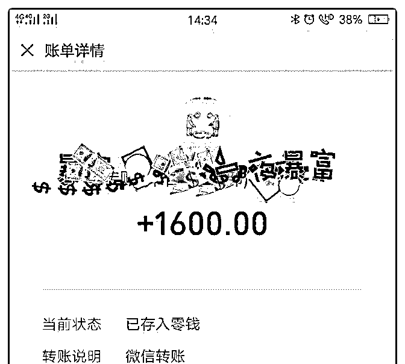
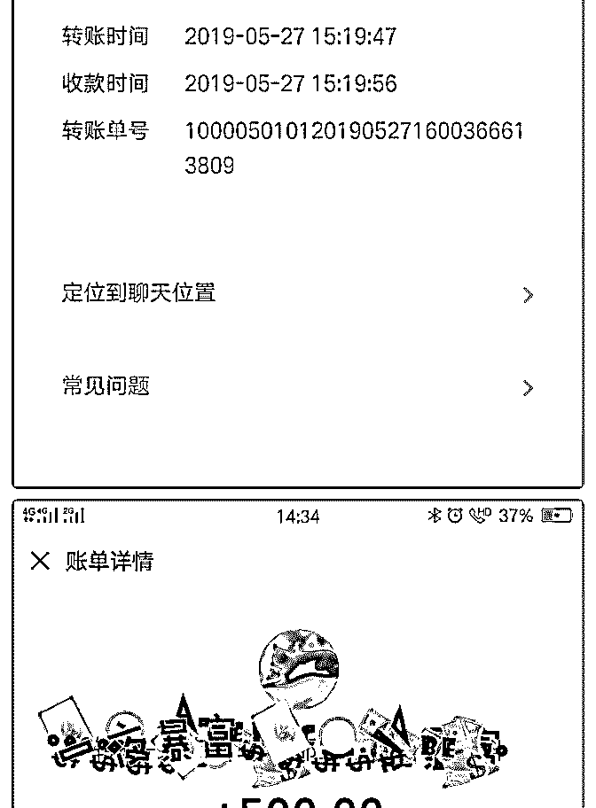
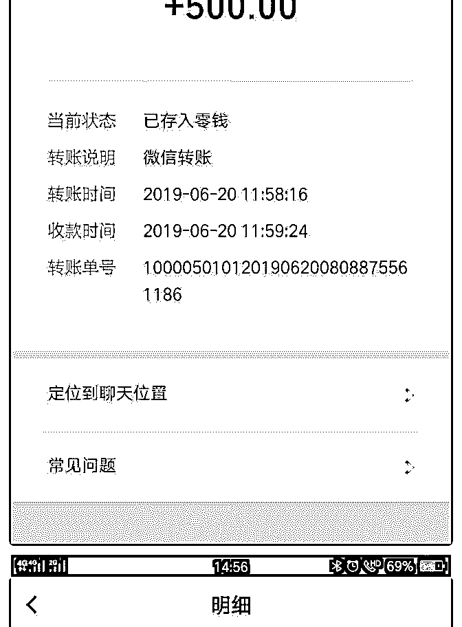
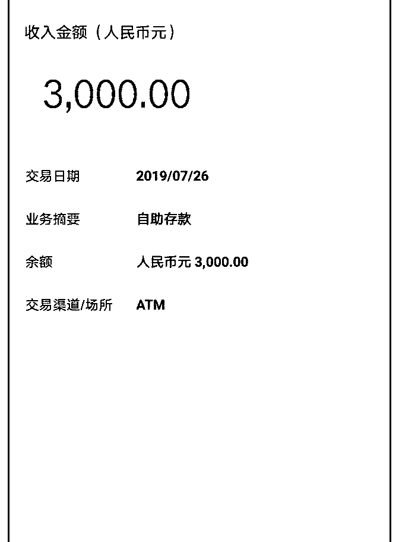
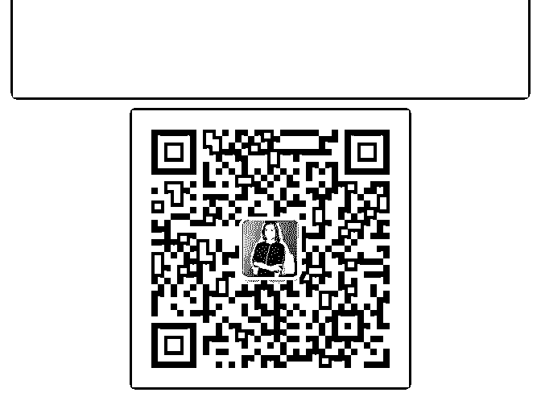

# 从不敢收钱到 2 个月

从不敢收钱到 2 个月变现管道收入 5100 元并逐步确定定位

一、变现经历复盘 我在写复盘之前特意去查了入账单，5 月 27 日收钱 1600 元，6 月 20 日收钱 500 元，7 月 26 日收钱 3000 元。这些金额都是属于 一类金钱管道的收入，都是需要我去跑的，办完这件事一般 都能得到 500-3000 元不等的劳务费。 在这里就提一下 3000 那笔的收入。当天这个客户他没有空， 说让我直接去办，我就去办了，办完之后我就把所有单据给 他看，让他把应付给我的 3000 元劳务费转给我，然后他就开 始跟我磨叽了好久，说他现在没有钱，让我给他缓上一个月 的时间。接着我就对他晓之以情，动之以理，到了晚上终于 去 ATM 机把这 3000 块存给了我。所以当天也是特别感慨，跑 腿花时间花精力不说，还要磨很多的唾沫星子，赚钱真的不 容易啊。哈哈哈。

其实我在复盘课程的时候也写到，我属于那种不敢轻易和人 谈钱的人，如果想到即将要跟这个人谈钱，我就会特别地紧 张跟不安。我会怕因为我提了这个事，是不是会伤害到我们 之间的关系(我的金钱木马之一)，更怕自己无法服务好对方， 让对方觉得这钱花的不值，所以我一旦开始为某一位客户服 务的时候，我总是会倾尽全力，可能对方会提出一些超出我 的服务范围的要求，所以在赚钱的过程当中是不太敢为自己 叫价的，之前的状态就纠结了非常非常长的时间。

但是当我我想通了:既然这件事非我不能做，而我确实也是给 他提供了价值，他也接受到了我的这个价值，那么我觉得向 他要价也就不为过了。于是我就鼓起勇气踏出了敢于要价这

一步，并根据自己为对方提供的价值估了个价格。现在也是 越来越认识到自己后来改观的这个意识是对的，所以在给对 方提供高价值的同时，我也就不再害怕自己服务不好对方， 更加敢于为自己叫价。

虽然这些管道收入不多，虽然也都还不是因为我的定位与标 签而得到的收入，但都是通过我对于他人的帮助而实现的。 所以这几次收款于对于我自己来说就是突破金钱木马的重要 事件。

二、定位过程复盘

(1)在 5、6 月的时候其实我就给自己做了一个初步定位，因为 在价值表现研习社 6 个月运营整理精华的经历，让我在精华整 理方面的技能突飞猛进，也被动链接了近百名小伙伴并给予 帮助。在 7 月进入新一期价值变现研习社，我已经是带领了团 队的，从 5、6 给自己定位的“社群精华整理师”到 7 月份后迭代 升级为“思考力整理师”，迭代的原因是我认为其实想做好任 何一件事，肯定要带上自己的脑子，根据黄金圈法则，从事 情的 why, how,what 方面，想把事情做到什么程度，能不能做 得更好，等等这些角度，都要进行全面思考之后(以终为始)， 再去做这件事，那么事情的效果一定是事半功倍的，所以我 把前期的这个标签给迭代为了“思考力整理师”。

(2)“金钱木马查杀咨询师”是我新增的另外一个标签，通过学 习，已精准地为自己查杀了金钱木马并成功突破，进而将在 短期内(一个月内)推出咨询项目，当你发现明明你一身技能却 一直无法变现，那么在你的身上，一定有你找不到的金钱木 马。有需要的伙伴可以关注我，链接我，提前占位，让我来 帮你查杀出你的金钱木马，搬走阻碍你赚钱的绊脚石。

写在最后，其实在进入核心课之后，一直都是我们的助教言 姐手把手地带着我们，在群里也时不时给我们加餐，给予支 持、鼓励以及能量；当我们提出问题的时候也是特别耐心地 帮我们分析并梳理，过后还耐心地询问我们的状态与进度。 虽然认识言姐的时间不长，虽然也没有见过面，但是我深深 地被言姐这种以帮助学员为己任的精神所感动，所以感谢言 姐的不断鼓励与支持，让我有了现在的里程碑，往后，我会 更加努力的！

后附收款截图

2019-07-31(23 赞)

关注公众号"懒人找资源"，星球资源一站式服务