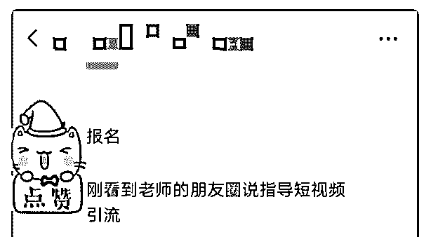
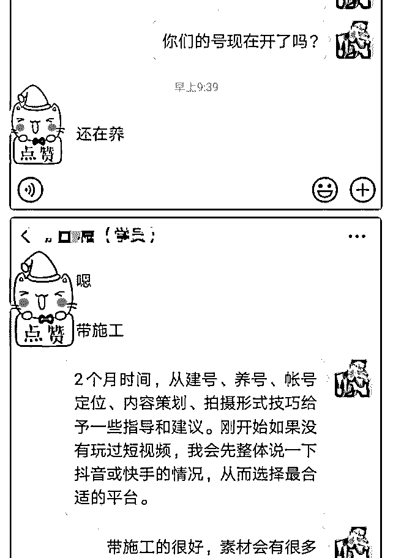

# 赚回学费 行动复盘

赚回学费 行动复盘

从 6 月 8 日加入泽宇教育，到实现赚回学费，用了 47 天，这个 过程相对来说是比较慢的，但对于个人来说，让自己看到了 另外一个可能性。回顾过去一段时间，复盘自己的行动过 程。

1、学课程，养思维，找定位 刚加入泽宇教育，兴致勃勃，一口气看完《情感自由》，内 容干货非常多，在日常生活、工作中，【定势思维】这个知 识对我影响最大，让我每次凭借过往经验或自身思想去判断 一件事的时候，会下意识的问自己，这是定势思维吗？如果 是，赶紧抽离，开放心态去拥抱更多的观点和可能性。

随后一个星期学习核心课。除了第五周《颠覆未来，掌控属 于你的人生》，其他课程已经听了至少两遍。在助教 Anna 的 指导下，每次听课程后完成复盘，让课程干货成为自己的知 识体系之一，加深印象，这一点非常重要。核心课里的一些 认知会在后面的招募行动中给我的思想打下基础。

要实现个人 IP，必须在某一领域专注发展，在找定位这个阶 段，我用了一个多月的时间，按核心课的推理方法，兴趣

——技能——天赋。我竟然发现自己兴趣很少，技能多样但 不精，天赋不清晰，迷茫纠结让时间一点一点地过去。当我 们迷茫的时候，不应该一个人封闭起来，向别人寻求帮助， 兼听则明。期间，我尝试找熟悉的伙伴、助教 Anna 沟通分 析，甚至发朋友圈征集大家对我的印象标签。

找标签，找定位，对我来说是艰难的过程，可能很多人都会 在这个过程中徘徊，但我想说，只要有 50%的把握，就可以 开始干，只有迈出第一步，才会知道是否合适自己；如果永 远停留在想的层面，结果就只会是想象。

2、定位精准、精准再精准 我过去工作履历多样化不聚焦，从世界品牌 500 强企业、世界 行业 50 强企业到自主创业，销售、策划、市场、文案、视频 雨露均沾，自我介绍中难以取舍。定位，是一个去繁化简的 过程，是涅槃重生的蜕变，去掉所有干扰项，留下主干。综 合评估后，我最终确定了以短视频精准引流为定位。

3、朋友圈铺垫，获得回响 如果放在过去，我未必这么快开始在朋友圈招募学员，一是 核心课打开了我的思维，不要给自己设限；二是助教 Anna 不 断给予我鼓励。如果过去我是思前想后的思维，那么这次招 募就是想干就干的行动。

其实，在招募开始前半个月，我已经慢慢铺垫自己的朋友 圈，保持每天 4 条朋友圈，按日常、干货、读书分享、互动四 个类型穿插发布，每条朋友圈精心准备文案，招募前就已经 有 4 位朋友因我的朋友圈内容而主动跟我沟通关于短视频引流 方面的合作，其中 2 位更是很少联系的通讯录好友。

朋友圈的铺垫对标签定位的传达非常有价值，我过去是做策 划，接触很多媒体和客户，如果你问什么是个人最低成本的 广告位，朋友圈就是不容置疑的首位。

4、招募小试，价值体现 短视频是当下最热门的话题，也是引流的新风口，在知识付 费平台上，课程售价一般是 100 至几千不等，且不提供跟进辅 导。17 年接触抖音，18 年开始研究短视频，这个世界，要不

花钱买时间，要不花时间赚钱。我用几千元听了很多课程， 结果是大部分课程的通病，学起来像是那么一回事，执行起 来四不像；后来找到百万粉丝中哥 1 对 1 咨询（线下课程 50000 起，1 对 1 咨询 1000 多），加上自己实践摸索，做出 300 万+热 门视频，一次引流变现 10 万+。

在线下服务客户一般收费 5000 元/月起，这次招募原想设定 299 元，后来考虑到是模式验证，最终定价为 99 元 1 对 1 辅导 2 个 月，限人数 4 个。经过 2 天的限时招募，最终招募学员 7 名，赚 回核心课程学费。

有西安的学员说，99 元？有空来西安我请你吃饭就不止，真 的吗？ 有做装修的学员说，先抢占报名，等 1 个月青海工程结束后开 始拍 有卖鞋的学员说，本想做拼多多但考虑运营成本太高，还是 短视频好 有做故事分享的学员说，只是图文分享，第 6 条视频上小热门 了，播放量 40 多万，抖音真的大流量。

……

5、服务好每一位相信我的朋友 不管是免费咨询、99 元还是 5000 元，我都会一视同仁，尽心 服务好每一位相信我的朋友。

短视频是风口，正如 5 年前的微信，9 年前的微博，在 5G 的商 业环境下，肯定会带来更多大的变革，如果你想在短视频的 蛋糕上勺出一块，如果你在纠结想做但不会做短视频，如果 你在引流上有迷茫，欢迎加我微信 xpp99986（注泽宇），让 我为你梳理出合适的方法。

————————————————————

5 秒钟了解一下我～

【我是】泓帅

【坐标】广东

【标签】自媒体精准引流咨询师

【个人经历】 1、传统行业从事策划工作 8 年，2018 年裸辞进入自媒体行 业，在小众平台写出 12 万+爆文。 2、通过百万粉丝百变中哥 1 对 1 指导和 100+个案例拆解，创作

300 万+热门短视频，实现被动引流持续变现。

3、帮助学员定位公司新业务方向、指导运营，用 20 天打造出

当地文化类 IP 抖音 NO.1，成功拓宽客户资源。

4、帮助学员通过引流与微信群结合，社群销售 3 天进账 12 万

【我能提供】

1、短视频引流实战技巧，每天免费为 2 位朋友分析解疑。

2、全国主流媒介资源，打造百度霸屏增加权

2019-07-31(20 赞)

评论区：

Anna : 恭喜恭喜，加油 大海 : 恭喜

Meggie 傅 : 短视频是风口

蓝皮书 :

关注公众号"懒人找资源"，星球资源一站式服务

# ——最好的成果是改

——最好的成果是改变自己，不再内耗

在金融证券从业奋斗四年的我，从普通客户经理晋升到营销 管理岗，却在去年得创业浪潮里毅然决然地选择辞职创业， 但一切并不是像我想的那般容易～

辞职后，和朋友创建了属于自己金融工作室，本以为一切会 顺风顺水，却在一次邮轮学习的旅途中得知自己怀孕，家里 人并不支持继续创业（确实压力大），只能退出股份，安心 养胎…

生完孩子后，却发现一切不如人意，孩子小无法实现自身的 价值，很多的机会也随之流逝，这个时候发现了怀孕前报名 的泽宇教育，并在明哲老师的启发下，恍然大悟个人品牌才 是未来的趋势～并为之全力以赴！

本身就毕业于金融专业的我，且家中一老母亲是十几年的老 股民（牛熊市对她影响不大，几乎都有赢钱）以至于在选择 标签的时候并没有太多犹豫，只是在选择具体定位的时候， 我犹豫了很久，毕竟，金融行业细分的模块也是比较多，最 后在和导师的沟通交流后，决定做家庭资产配置咨询师，帮 助大家有一个比较系统完整的理财理念，并教授财务等知 识，自己管理自己的财产，真正可以让财富增值，且培养财 商。

生完孩子两个多月里，收到 9 位 199 的付费学员，并帮助他们 真正实现自己管理自己的财富资产，了解财富的秘密～

如果，你也有这方面的困扰，欢迎随时联系我！

2019-07-30(9 赞)

关注公众号"懒人找资源"，星球资源一站式服务