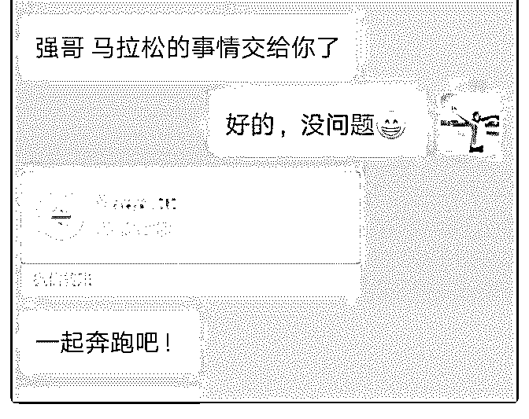

# 加入泽宇教育好个月

小强 : 加入泽宇教育好个月了，最开始是被明哲助教的一条朋 友圈吸引的，那是去年十二月底，看了他发了他和华丹的故 事，被泽宇教育吸引了，然后加入了核心课，但是一直没有 行动。

最近看了课程，发现这套方法颠覆了我的认知，于是准备行 动。

我是毕业没多久的学生，现在在核电站做安装，以前当过 兵，大学时期参加了很多次马拉松比赛。有一次跟明哲助教 交流，他说我可以做那种马拉松赛前准备的咨询，教别人比 赛之前怎么训练，怎么饮食，怎么休息，怎么选衣服，鞋 子，总而言之就是我怎么备赛的，就教别人怎么备赛。他说 我这个价格可以定得很高，因为需要一段时间跟踪，完全的 一对一指导。我想起之前有好几个人是想让我带他们，于是 问了其中一个准备参赛的朋友，要不要接受我的这个服务， 对方果断同意。明哲助教说我的价格可以定在 500 以上，我就 选了个吉利的数字，666。其实很担心对方不愿意付钱，但是 他直接 666 就转过来了。

内心是激动但是也是害怕的，因为第一次尝试，我准备把这 个朋友带好，再试试扩大规模，去带其他的人。不过一把就 赚回学费，感觉还是非常不错的！谢谢明哲助教！

2019-07-30(9 赞)

评论区： 羊少羽|中医运气学 : 厉害

Karma :

关注公众号"懒人找资源"，星球资源一站式服务