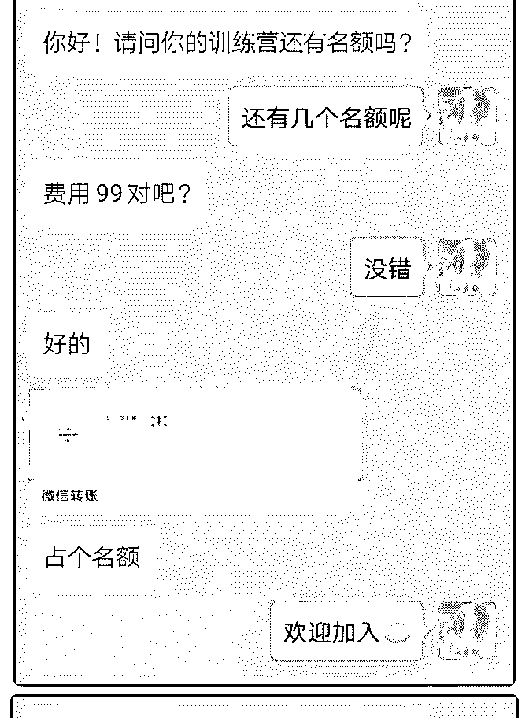
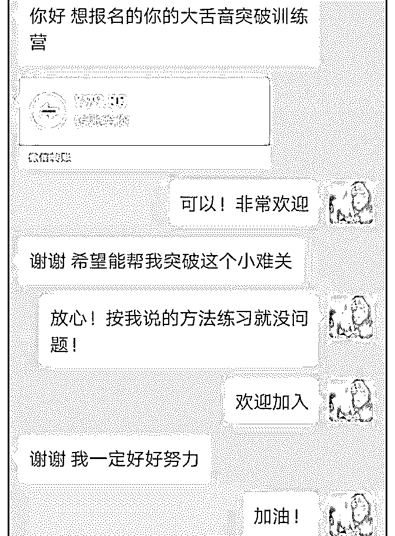
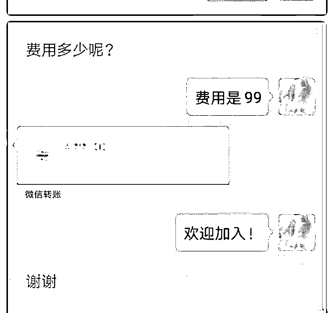
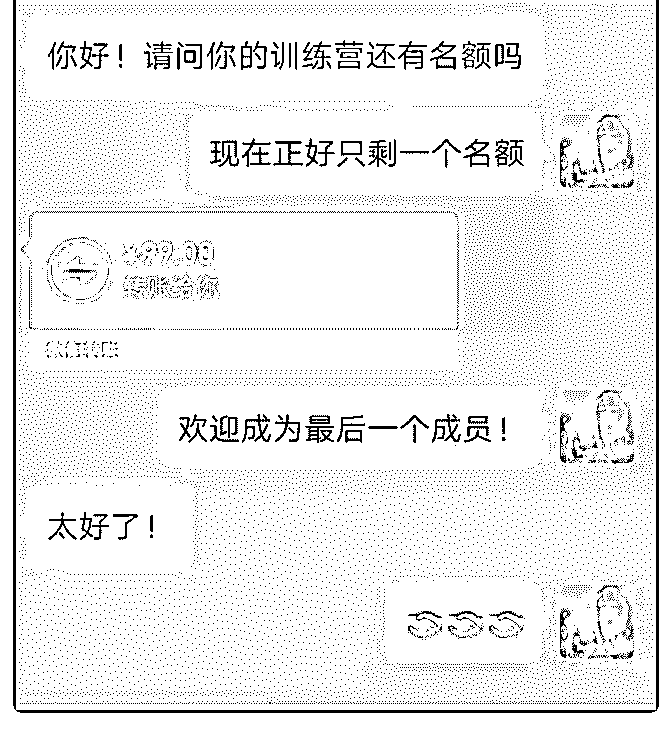
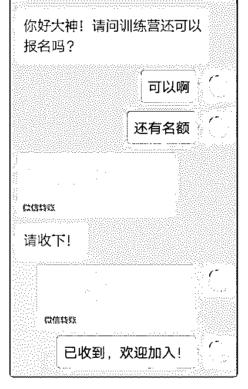
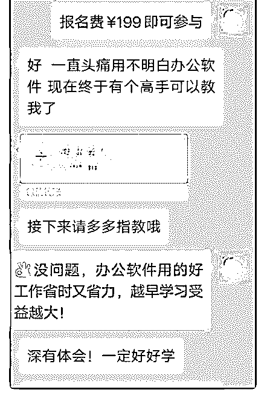
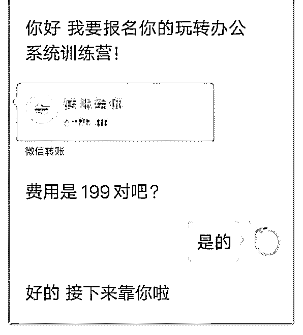

# 第一次庆祝成果！我

第一次庆祝成果！

我是一名在校大学生，几个月前被泽宇教育吸引，加入了泽 宇教育。平时看见很多大咖在群里分享一些自己之前闻所未 闻的东西，还有人能赚好多钱，对于刚高中毕业一年多的我 来说，真的是打开了新世界的大门。 但是因为学业繁忙，主要是因为贪玩，一直没有付出行动， 但是我一直在观察明哲助教的朋友圈，也自己去看了课程， 参加了几次明哲助教的答疑，发现变现其实没那么难。于是 自己开始仿照明哲助教在杭州的时候涨价进行招募的思路， 也发了个朋友圈试试，结果是出人意料的！ 第一，我是学俄语的，其中一个大舌音很难掌握，但是我掌 握得很好。按照第四课，我确定了我的这个定位。 第二，看了明哲助教在群里说概念验证的方法，我问了身边 的 10 个人，果然大舌音是他们觉得很难的事情。 第三，我问了明哲助教改怎么操作？他了解我的情况之后， 让我写了个招募，而且只招募 5 个人，收费是 99。因为我的朋 友圈大多数是大学生，他们没有很多钱。 第四，招募发出去之后，每当有人报名，就继续发朋友圈， 告诉大家还剩下几个名额，名额没了就不招人了。 第五，收钱，两个小时招募满了 5 个人。

这个过程就跟做梦一样，因为没想到赚钱其实还挺简单的！ 我也不明白明哲助教为什么只让我招 5 个人，但是我知道他肯 定是有原因的。他让我把这几个学员带好，接下来，就好好 进行教学，把我怎么搞定大舌音的经验，传授给他们！

2019-07-30(14 赞)

茧 : #庆祝成果

关注公众号"懒人找资源"，星球资源一站式服务

# #庆祝成果很高兴终

很高兴终于写下了这篇复盘。

其实今年年初就已经加入泽宇教育了，看到群里小伙伴们变 现，觉得离自己很遥远，因为自己没有什么可变现的能力。

直到参加了明哲助教的一次答疑，他说只要能帮助别人解决 问题，那就可以做咨询。有种恍然大悟的感觉！不一定是需 要特别高大上的技能才对啊！对了，我是一名坐办公室的职 员，除了专业上的工作，大学的时候办公软件用得很熟练。 想到一些办公室小伙伴说办公软件用不明白，我想，那肯定 还有其他人办公软件不会用，于是就问了一下明哲助教，能 不能教别人使用办公软件做自己的定位？他说完全可以，然 后还帮我制定了一个招募文案。我把我的招募文案发到了我 们这边一个很大的工作交流群，非官方那种。结果，一下午 就赚回了学费！

虽然变现之路开始得很晚，但感谢自己走出来了，谢谢明哲 助教一直鼓励我让我打破自我设限，不然我绝对不相信可以 教别人使用办公软件可以赚钱。谢谢泽宇教育，让我对赚钱 有了新的思路。

2019-07-30(8 赞)

关注公众号"懒人找资源"，星球资源一站式服务