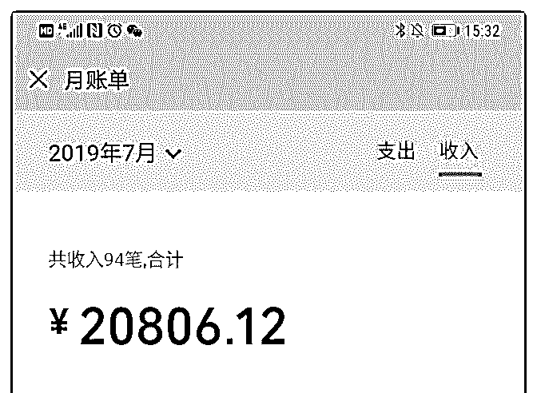
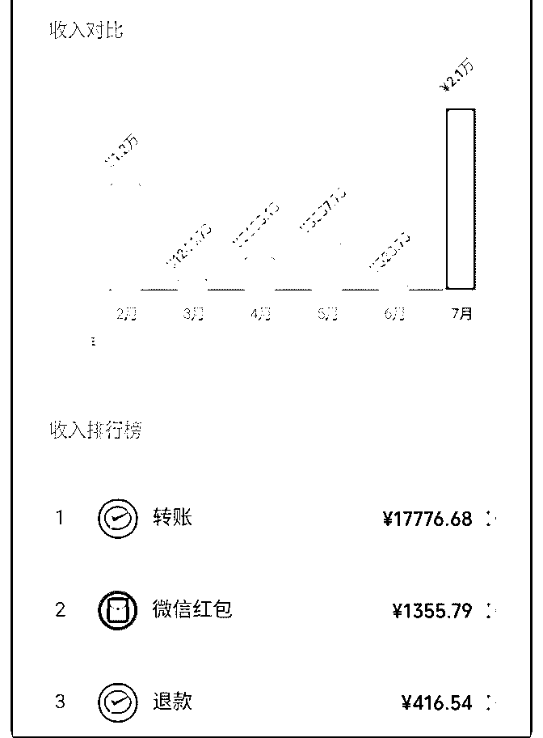
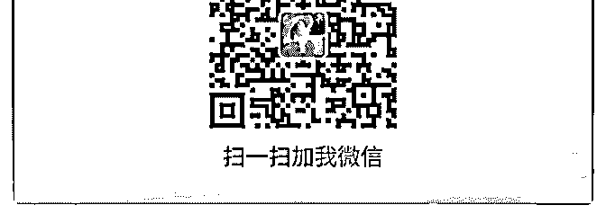

# 一个月收入从 528

快乐魔法师暖风 : 一个月收入从 528 元到 8600 元.

截图是 2 万多，要扣除 3 个泽宇教育收费和 3000 的处理钢琴的 费用。

如何做到的我在之前的复盘里面有详细的步骤，这里就不重 复了。

总结下我觉得重要的几个点。

1.定位定位定位。没有定位等于没有方向，只能原地打转。没 有定位无从开始。

2.引流。星球分享，付费进社群，互推，公众号，老客户推 荐。

3.朋友圈打造。自从进了泽宇教育，我的朋友圈大改变，不少 朋友私信我说很喜欢我的朋友圈，看起来在打鸡血，但是又 不反感，谢谢华丹老师的指导。

4.百万营销话术。

【姓名】暖 风

【坐标】蒙特利尔

【标签】潜意识解读师

【个人经历】

两个孩子的妈妈，曾经的我内向自卑，把所有的情绪都向内

自己承受，幻想要做一个别人眼中的“好人”。在乎别人对我 的评价，感觉活在别人的眼光中，看谁谁都比我优秀。

但自从我孜孜不倦的通过大量身心灵领域的学习、开拓和研 究，现在的我焕然一新，不仅自信、大方、充满激情，而且 最重要的是，我还有足够的能力去帮助到其他人看到其自身 内在的潜能，并像我一样绽放能量和光芒。

【权威】

完成英国催眠大师 Marisa Peer 的线上课程； 完成阿卡西记录的培训课程；

完成玛雅 13 月亮历的培训课程； 综合运用所学技能并结合个案实际情况，帮助超过 160 位客户 更加清晰的认识自己，从潜意识的 层面解决不自信、自卑、 焦虑、迷茫、定位不清楚、两性关系、亲子关系和金钱关系 等的卡点，跳脱出无限循环的内耗旋涡模式。只要 1 次咨询， 最快 6 分钟抓出潜意识深处的木马，1 句话破解木马程序，活 出精彩，翻转自己的人生！

2019-07-30(10 赞)

关注公众号"懒人找资源"，星球资源一站式服务