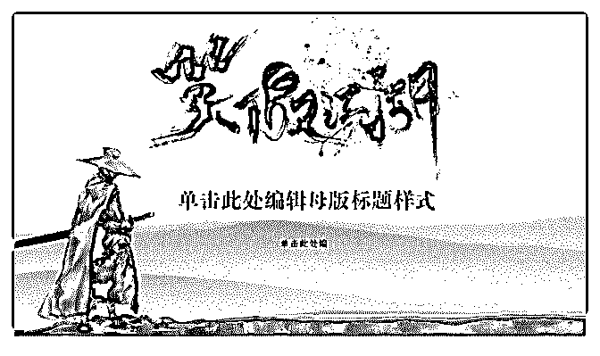

# 【核心课程 2 星期后

那个设计老师 : 【核心课程 2 星期后开始变现，副业变现 2000

＋】

5 月 26 日，做了一个倒逼自己的决定，购买了一个不便宜的 课程。

5 月 26 号以前

3 月，辞掉画室的工作和朋友一起创办画室。我们一直是画

室里面的主讲老师，一线教学，接触的都是高三的艺考的学

生，主要时间和精力都是在教学上。

3 月到 5 月这两个月里面，我们走访画室谈接业务，像一个生 意人那样去谈业务。可想而知我们是怎么被暴击的，被拒绝 不被信任常有的事情，自己不断进行调整，还要帮助朋友做 心理建设。最后，朋友因为个人原因退出，得知他的原因， 我一句都不挽留。

撑了那么久，还是崩塌了。突然间，觉得没有什么可以给我 支撑的力量练，任何人都靠不住，还是得自己变得强大。 缘分，让我认识了 Lisa。很晚了，她都愿意和 2 我沟通交流。 两次沟通后，思考了一番，最后决定学习，是做了一个重大 决定。之所以一开始犹豫不决，是因为，工作室的创业，没 有收入消耗了之前的积蓄。但是，不对自己狠心，不会有突 破。

拿到课程后，每天早上起来听课，听完写复盘。从一开始的 的不自信，自我设限，慢慢地去梳理自己，做自我暗示，寻 找自我价值。按照里面的方法去做去思考。

一个星期，课程听完了，计划找一个机会实践。于是报了营 销写作大咖弗拉克老师 6 月 2 号的广州的线下活动。在这线下

活动之前，我给自己的目的是——验证自己的定位，验证自 己的价值。

可在这一天前一晚病毒性感冒发烧，第二天早上看了医生吃 了药休息 2 个小时后，去参加线下活动。过程是迷迷糊糊的， 既然来了，就要捉住机会曝光自己。于是，我很幸运，三个 自我介绍的机会，我抢到了一个。那时候上台，我还是迷迷 糊糊的，但是意识中知道，我要让别人记住我。

在穿着上，我很个性，一身黑色，一双皮靴，一头卷发，高 领套头衫，不规则的长裙。

在表达上稍微弱了一点，烧还没全退脑子有点迷糊，不过我 强调了我是专业的艺术设计，平面设计师，可以给大家提供 朋友圈和公众号排版的视觉优化的帮助。无心插柳在活动 中，主讲老师的 PPT 的视觉上做的得可以更好，并且提出了建 议。

所以，在这次活动中，就记住了，做 PPT 设计，就找我。 这次活动，很多朋友加了我微信。

一个星期后，这位老师微信找我，给他的 PPT 做优化，答应 了，报价 500+。赚回了核心课的学费，并且还给我建议，教 我收费要收高一点，我收得太便宜了。是因为担心自己没做 好也不敢收多。PPT 优化完成后，弗兰克老师给我在他的圈层 中打广告，又有一波朋友加了我，并且有一位上海的老师找 我设计个人独特的 PPT，1400+。最后，弗拉克再找我设计了 直播背景海报，收费,600+。

图片: 1

定位明确后，就会产生一种驱动力。同时，你想要的的也会 一点一点地靠近。

美学，这个词太大了，我能做的只有那么一点点。通过我有 的，去给需要的人赋能。

相信，美学美感，在未来工作生活中越来越越重要。而这种 美，不是表面的美，是人格魅力，品味，由内而外的呈现。

每个人对美的认识不一样，求同存异。

我是老王，艺术设计科班出生，毕业作品与 199 位世界大师 的艺术作品在中央美术学院一同展览。视觉设计师，高考设

计主教。

如果，有对美感培养有困惑，欢迎勾搭，希望我有的能够赋 予你强大。

2019-07-30(11 赞)

关注公众号"懒人找资源"，星球资源一站式服务