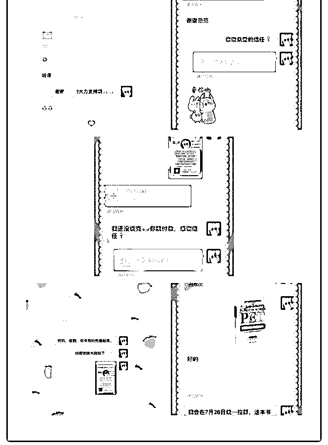
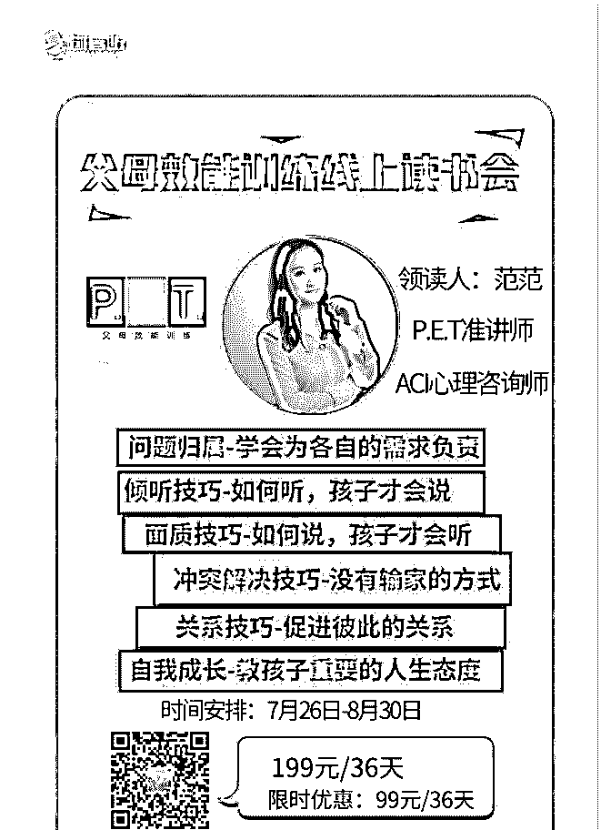

# 原谅我一直很懒，没

范范 : 原谅我一直很懒，没有写复盘。 截至目前，我已经收款 700+，成功赚回了核心课学费。 下面，我把变现的途径写出来，给小伙伴们一个参考。

相较于一次两次的咨询，我更喜欢用读书会的方式，系统地 教给父母们教育理念和方法。

所以，从 PET 讲师班回来以后，我就决定开父母效能训练读书 会。

制作海报、准备内容、推广、宣传，自媒体人就要有一个人 活成一个团队的能力。

在这个过程中，我做了很多之前想都不敢想的事情。 截至目前，我成交了 7 个客户来到了我的 pet 读书会，其中 5 个 都是素不相识的陌生人。

对于从来没有开过读书会的我来说，第一次读书会能招到 7 个 人，跟我预计的差不多。 总结下来，我觉得主要有以下几点：

1、建立信任。在朋友圈持续的分享与定位有关的、高价值的 内容，这是建立客户信任的第一步。

2、点对点推广。推广的时候，除了在朋友圈宣传，我还做了 点对点推广，都是平时会对我的分享点赞、评论的小伙伴， 以及听了分享之后加我的小伙伴。

3、利用人脉推广。一个人的力量和流量总归是有限的，所以 我也发动了一部分我要好的小伙伴来推广我的读书会。

4、投放社群。因为我自己运营一个 400+的妈妈成长公益社 群，在得到了群主的同意之后，我将我的海报发到了这个社 群，马上就吸引了两个人报名我的读书会。

5、心态放平。在这次读书会的过程中，我觉得自己最大的转 变是心态上的转变。因为我觉得自己值得、我的读书会值 得，所以在我做了自己该做的、能做的事情之后，就专心投 入到内容的准备上来，对有几个人报名我不是特别着急。另 外，如果有人犹豫或者怀疑，自我说了能说的话之后，我也 不会“死缠烂打”，因为我对自己的课程有信心，对自己有信 心，反而这样，客户马上就付款了。

与其说，是我自己的心态变好了，不如说是泽宇教育从根本 上改变了我的认知和思维方式。泽宇的听话、照做、执行、 出成果就是王阳明的知行合一。

谢谢懒猫助教，一直以来，帮了我很多，也给了我很多很好 的建议，简单直接地给了我针对性的建议，打开了我的思 路。

接下来继续好好执行，收获更多更大的成果！

【昵称】：范范

【坐标】：舟山

【标签】：父母效能训练讲师、ACI 心理咨询师、美国认证正 面管教家长讲师

【成就事件】：

1、至今已帮助 10+人解决亲子沟通问题，改善亲子关系

2、《好妈妈一定有办法》作者红老师的父母社群的核心成

员。

3、运营一个 400+人的妈妈成长公益社群

4、第一次做免费咨询就收到了 66.66 的感谢红包。

【我能提供】

如果你有亲子沟通方面的困惑，我可以为你提供一对一咨

询。

不是每一个父母都能成为自己的育儿专家，有的是因为缺乏 系统的育儿知识，有的是因为没有专业的老师指导。如果你 只是看一些育儿书籍，浏览一些支离破碎的知识碎片，是很 难成功的。

成为自己的育儿专家，最重要的是遇到一个专业的老师，教 给你一套系统的育儿理论。

我是范范，一名父母效能训练讲师、ACI 心理咨询师。我有一 套系统的亲子沟通技巧，助你实现高效亲子沟通，改善亲子 关系。

目前，我正在做 PET 读书会，欢迎预定我的第二期 PET 读书 会。现在报名，99 元不涨价，并且赠送我的知识星球和一个 1 对 1 咨询名额。

2019-07-30(9 赞)

评论区：

瘸子熊 : 范范，优秀

范范 : 谢谢老铁，来到泽宇，你也会很快出成果

关注公众号"懒人找资源"，星球资源一站式服务