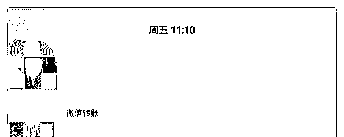
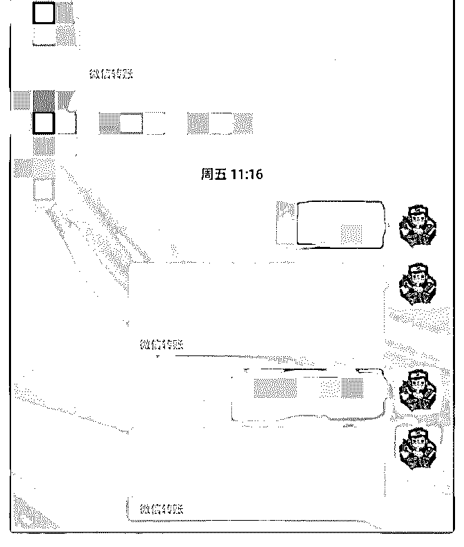
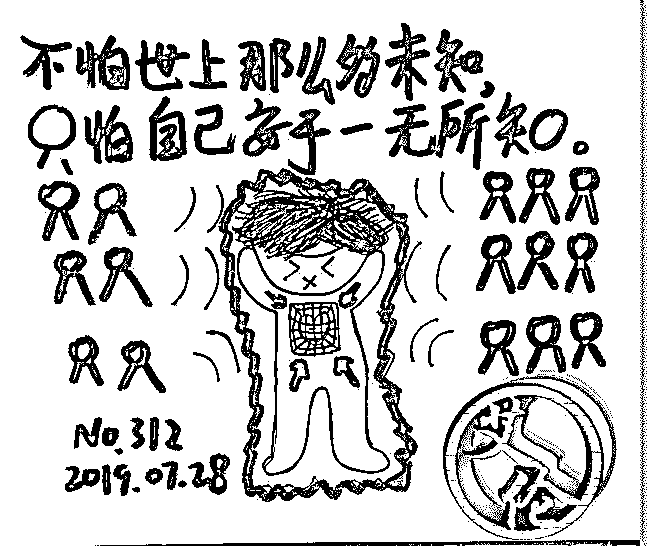
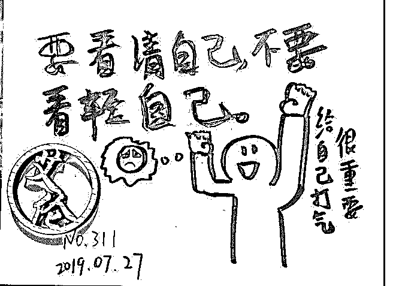
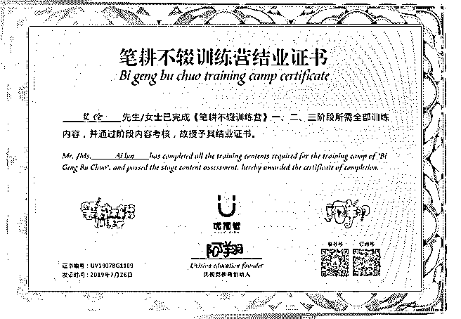
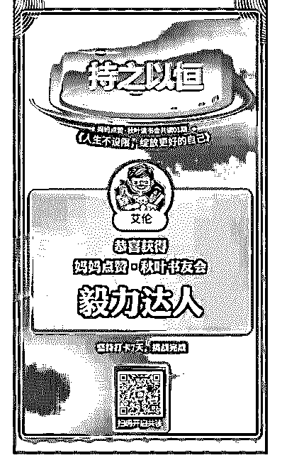
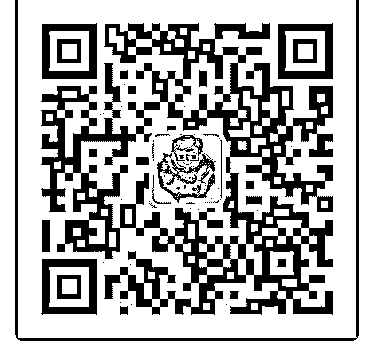

# 我通过在泽宇教育之

艾伦*沃克 : 我通过在泽宇教育之后成功变现 4000 我在加入泽宇之前，一直是作为一个自媒体在进行相关的写

作变现，但是由于我的领域比较单一，所以赚的稿费不是很

多，加上之前的手绘技术不是很好，通过转发朋友圈海报，

来进行相关的变现操作，朋友圈的变现，与我本人的朋友圈

定位不相符合，而且我本人也朋友圈的定位不明确因此变现

的渠道很少，而且我也不太专注，因此弄得我十分的焦虑。

我之前一直有一个爱好，就是喜欢逛朋友圈，在一次很偶然 的机会，我看到之前认识的一个朋友，居然在朋友圈发得到 别人认可和咨询的截图，我好好奇的去问他，之前一段时间 没有消息，怎么突然间发付款的截图，是不是遇到了什么好 事？

这位朋友很热情的给我介绍了泽宇教育，以及谈了他的变现 之路，他经过一段时间的在泽宇的学习和启发，和在泽宇老 师的辅导已经成功的定位了自己，而且还通过朋友圈和他个 人领域的专注，不断给身边的朋友提供价值，得了很多朋友 的认可，他已经报名加入了导师计划。

这位朋友之前帮了我一个大忙，我对他非常信任，而且他发 了相关的成交截图和成长经历截图，为人说话很靠谱，我一 直在为了变现，问题很苦恼，我怀着试一试的态度，报名了 泽宇教育。

报名之后，波力老师拉我进群，而且看到他在和其他的学员 进行解答，而且准备要进行相应的问答辅导，我一开始半信 半疑，潜伏在了群里面，观察了很久，报名的都是对变现有

疑惑的，对他们相比我来说比较专业，而且学历也比较高， 我一时不知道如何说话因此，只能在群里面继续观察。

虽然我在群里没有说话，但是我有学习时教育的相关课程， 毕竟我已经报了名了，不进行相关的学习和输出，实在是对 不起自己和对不起学费。

在上了第一章之后并没有多大的收获，可是我也还是耐心的进 行了学习，而且一直在群里面观察，其他学员的学习状况。

直到有一天波力生病了，然后进来了一个新的助教，也就是 后来的助教老师笔盖。

她一进群就给我们讲了如何坚持自己的理想和相信自己所相 信的东西，然后如何让自己经济独立和如何积极的进行朋友 圈的输出以及坚持个人定位和如何分析自己的强项和可以变 现的能力。

一开始听了一头雾水，可是在有一天听他讲了自己的变现故 事之后，我发觉我做的实在是有点少，应该开始进行专注 了，虽然我仍然很少写相应的课程复盘，但是我有默默的做 笔记，只是没有在群里发而已。

因为我本身有一份自媒体的写作工作，而且加上那段时间， 我的画画也开始有了一定的成绩，有人要求我不断的发画给 他，他觉得可以的话就会用在他的客人身上，因为这个人是 一个纹身师，因此我就不断的把话交给他，那么我就很少在 群里面出现。

在朋友圈坚持了很久，一开始根本没有报多大的希望，只是 当画画是一种兴趣，可是经过一段时间之后，我画画开始有 了很多点赞和关注，就在这个时候这个纹身时开始关注了

我，而且真的有一天他有两个客人，要把我画的画，纹在他 们的身上，虽然有一个人，最后还是没有纹，可是有一个人 纹得很成功，他还拍了图片给我看，我一下子精神了起来， 因为我的作品可以得到别人认可，而且纹在别人的身上是一 件十分光荣的事情。

我也开始通过这件事反思我自己的这段学习的经历，而且不 断的进行相关领域的输出，和开始把朋友圈一些无关紧要的 海报都没有进行转发，只是专注的输出我，把画画内容而之 前不断持续的日更也在继续。

我坚持了一段时间之后，我终于在 567 这三个月每个月的收入 都超过了 3000，这个月更是达到了 4000 多，让我觉得很意 外，而且我是由于持续在朋友圈进行相关的输出和画画，而 且我在其他各大平台也有做相应的画画输出，因为之前朋友 圈可能受的关注度不是很大，而我在其他平台恰好输出被某 一些大咖看见了，他就觉得我很不错，进行了相关的转发， 所以刚好被某一位老师看见了，他邀请我去帮他进行相关的 培训，且我的输出能力得到了他的认可，所以我成功得到了 这一笔报酬。

突然间觉得泽宇课程里面说到的，坚持和不断的输出以及复 盘和反馈都非常重要，因为有的时候坚持的力量，必须要时 间去检验，而如果我们 boots, 不断的进行，持续专注，那么我 们很可能在遇到那个可以给我们带来改变的节点，就会提前 放弃。

我加入了泽宇教育，不但刷新了我的三观，还让我变现之路 变得更加顺利。

我可以得到收入提升，主要有 5 点，都是通过则与教育得来的

相关的经验。

1.首先要明确自己的定位，而且要进行持续的专注和输出，但 是不能拘泥于单独一个方式，持续的输出不单是不断的进行 学习复盘，而且还要不断的给他人提供自己力所能及的价 值，让别人可以从心里面认可你，先你自己要有一定的自 信，而且你要不断的提升你的专注能力和专业能力。

2.积极互动。在社群以及在朋友圈要积极与他人进行相关的互 动，别人感受到你的存在和你的与众不同，你还要不断的给 别人以及你想要对方认可的人及时的互动和点赞，而且要给 对方提供，你可以做出力所能及的努力和价值，我在社群里 面有人需要帮助，你可以按照你的方式去帮助他，这样不但 可以得到社群人员的另眼相看，他们也会开始专注你，就算 你的能力不是十分出众，但是你愿意出手去帮助社群成员和 社群管理员，他们也会因为你的表现而开始加你好友，而且 这样的好友会更加有价值，因为你被动加的好友，他们正是 由于你的闪光点才加你的。

相比之下，如果群里面有一些厉害的人，一旦展示能力你就 急于加他好友，可是后期并没有任何的互动，也没有给予对 方一定的帮助，根本就没有产生相关的链接，那么你只是单 纯加了一个好友或者是微信,里面多了一个这个名字或者是符 号，对你而言，和对他而言，都是在浪费彼此的时间。

3.不断尝试。既然大多数人都会做自己熟悉的事情，而对自己 没有尝试的事情会感到恐惧，但是如果我们愿意没有做过的 事情和不断的挑战自己，那么也许我们无意间就会让自己的 能力不断的加强，而且我们应该根据相应的互联网趋势，去 学习一些相关的技能，做到一专多能，虽然拥有相关技能的 人会很多，但是你一个人如果拥有多像别人都拥有的技能，

那么你被选中的几率就会大很多。

4.不断坚持和相信。我一开始加入泽宇教育抱着试一试的心 态，可是看到很多人变现之后我才开始重视起课程与我自己 本身的关系，然后进行自我梳理，因为你既然已经报名了相 关的课程，无论你是否相信你都应该相信你所相信的，因为 他会给你带来变化，如果你连自己都不相信，那么你如何去 相信别人呢。

5.与其不断的去总结别人的成功经验不足，不如找出别人失败 的原因。然后不断的让自己去警惕，让自己少掉坑，这样你 就可以少点挫败感，和给自己多点信心。我们大多数人都会 认为对方的成功经验是十分宝贵的，可是往往失败经验更值 得我们学习。因为我们每个人都想避免失败，可是如果我们 没有总结失败的经验和找出如何避免失败的可能性和失败的 原因，我们很可能会不断的掉坑，而不断的让自己意志消沉 而让我们一开始拥有的梦想，到最后都成了泡沫。

我要感谢笔盖助教的监督和鼓励，因为有她的监督和群里的 呼吁，我才开始重新复盘哲宇的课程，感谢泽宇教育给我带 来的变化，还要感谢我每天做的复盘，复盘，复盘，重要的 事情说三遍。

2019-07-28(4 赞)

Lavender :

关注公众号"懒人找资源"，星球资源一站式服务