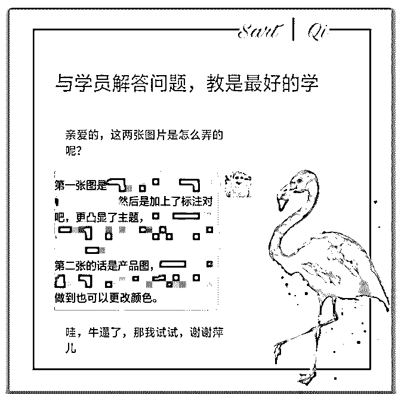
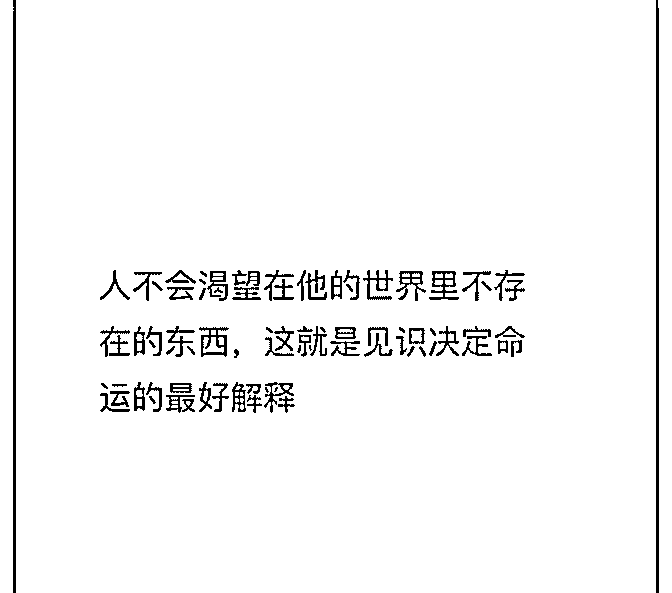
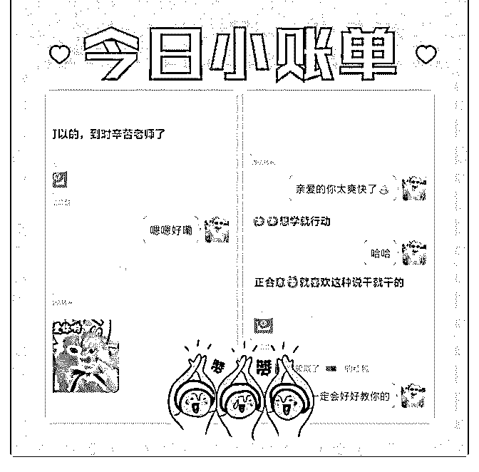

# 赚回学费的心路历程

赚回学费的心路历程

＃庆祝成果＃

文/萍儿姑娘

泽宇教育，一个改变认知的地方，俗话说思维决定出路，思 维先行，之后再去行动，就会事半功倍，行动是挖掘潜能的 唯一途径。

2.18 加入泽宇，那时候是每周听一节课，复盘两次，两节课 听完以后，在之后把手上理财课程结束以后就开始加快行动 了，三月初始复盘，听课，复盘，听课，去找标签，那时候 看到小伙伴们一个个出成果，有焦虑有迷茫，因为我什么都 还没有，但是我也知道每个人的资源基础经历是不一样的， 成长的速度也是不一样的，有时候慢慢来，比较快，不急不 慌不忙。

3.15 我那时候在学朋友圈美学和自律管理，只是在学习但是 不知道后续怎么所以我带着问题去找答案去找笔盖，笔盖说 边学边输出，用输出倒逼输入，因为这样子能检验自己是否 合适。也因为基础差没有任何的积累，所以我就细细分析了 一下如今的优势和兴趣，找到一个不仅喜欢易学更加容易变 现的那就是美学，是最简单被市场接受的，零基础易理解我 就去往这个方向去做去输出，用输出倒逼输入，找到标签最 好的方式就是向市场检验。

在这之前我都没有去答疑，我想说小伙伴们有问题去找导 师，去向牛逼的人请教，自己一个人闭门造车是会钻牛角尖 的，多问多问，思路就会打开，打开再打开，一切难题就会

游刃而解。

3.22 之后又去找笔盖(我的贵人)，概念验证，发招募令然后 免费咨询，那时候积累不够引流不够所以咨询人数很少，就 非常的难过，当时小伙伴们都安慰我，所以我又去写了复盘 发到核心群里等等，就有很多小伙伴们的咨询，得到了很多 正向反馈，反思做的不够好的就是没有去朋友圈反馈，也一 直在改变。

因此不管做什么，如果得到了回报好的反馈就要去输出，才 能让别人看见你的价值，让自身的价值放大，吸引到别人。

3.23 后来就有很多人咨询，当我和小伙伴在聊天的时候感受 到了他们对我的信任，双手翻飞在手机上， 只差跟他们面对 面讲了，后来又吸引到了两位小伙伴，她们就是(我的贵人)因 为想要深入了解打造朋友圈，按照勾勾(也是我的贵人)在咨询 的时候给我讲的方法给他们深入分析想要去打造背后以后的 原因，然后去输出自己能够提供的价值，他们打造朋友圈的 目的微商，所以朋友圈都要去好好经营，用些美图还有发圈 思路，个人名片，背景页面，如何晒单等等去打造朋友圈。 我的承诺是一对一的指导，给予他们充分保证，最后成交， 所以你们也是我最最大的贵我的承诺是一对一的指导，给予 他们充分保证，最后成交，所以你们也是我最最大的贵人， 真的超级超级感动，置身在这样一个圈子中，能量就很满 满。那么方向是对的，接下来在一对一指导中把方法改善进 步，再去迭代。

还有真心换真心，自身的价值服务远远大于所给予的价格， 给予最好的服务，当学员有疑问时就去解答，在问题中成 长，迭代更新。

之后第三个学员到了 4.3 有个理财群的小伙伴特别同频就看到 了我的朋友圈说你的朋友圈好好看呀，怎么样做的呐，就吸 引了她的注意力，真的很开心能够给别人带来一些感动，然 后我就很真诚的和她讨论和提供服务，她的目的只是想去打 造的美美的又好看的，所以给她看这个课程的大纲，没谈两 句就成交了，因为她也是一个舍得对自己投资的人，因为信 任，所以成交。

4.5 第四个学员是自律群的时候，可能真的是同频，遇见的一 加上来就问朋友圈美学怎么样学，学什么怎么做，我就耐心 的说可以教给你作图，小视频等文案的打造，她就说想学 习，我最后还问了句真的现在你需要嘛？她说是的，所以我 就收下了她，只带想学习的人。搞清楚学习的动机，也不要 去盲报。

当朋友圈进行打造时我们还需要去坚持利他，利他才能利 己，这个是格格告诉我的，我现在也在践行，输出自己的价 值干货，对朋友们做出分享，利他利他利他。当我们没有干 货时就要去制造干货，输出价值。也是因为如此收获了很多 财富能量包感恩红包，很多鼓励很多正能量的话，很多高阶 的思维。

至 4 月 5 日，三个 69+一个 99 还有给很多小伙伴的作图和两篇 复盘的投稿就这样我也赚回了学费累计 400。

还有这句话也同样分享给你们，感悟多多， 爱出者爱返，福 往者福来，财出者财进！

美学之路很漫长，还有其他的领域，也必须要有自己的稀缺 性，差异性，要持续不断地进行自我建设，增加自身的稀缺 性，怀疑比信任的成本更高人和人的差距是认知、信息上的 差距，这两个会把人之间的拉得越来越远。所以得去修炼自

己，提高自己的差异性，向下一步前进。

希望一起共勉，一个从 0-1 小白的变现的心路历程，希望对你 有所启发。

——来自还是学生的萍儿姑娘 2019-07-28(5 赞)

评论区：

雨珊 : 你的微信？

Lavender : xixi2065454264

多芬 :

关注公众号"懒人找资源"，星球资源一站式服务