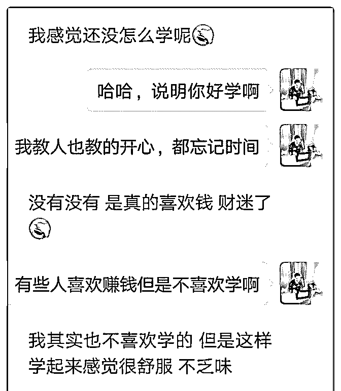
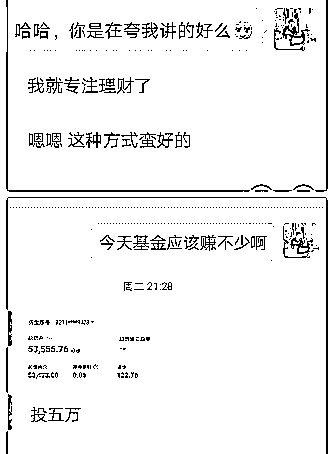
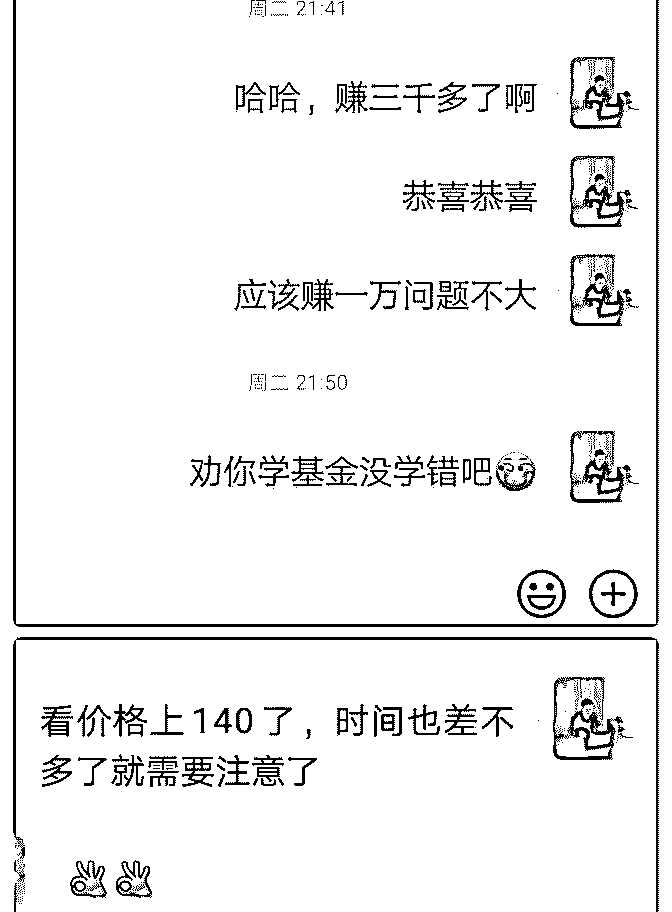
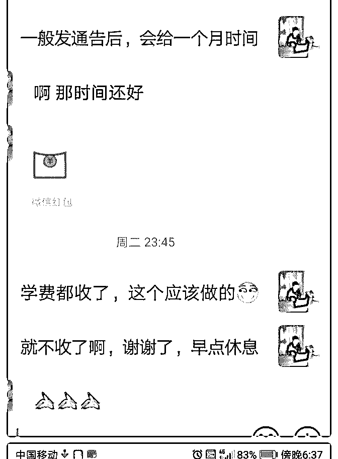
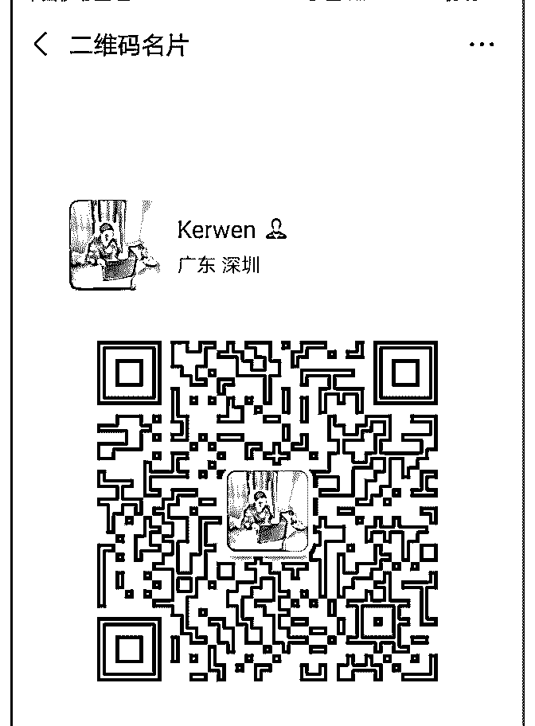
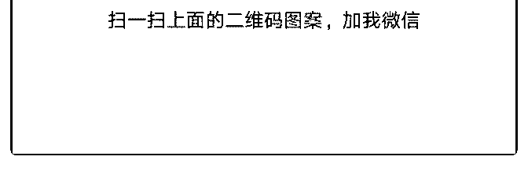

# 个人搞理财咨询，以

Jimmy : 个人搞理财咨询，以前只是想带着朋友们一起赚钱， 后面在网上了解了个人 IP 和营销类的，加入泽宇和其它一些 老师的课程，学到了很多，就想着把自己学到的东西教人。

据我看到的情况是国内很多人没有投资经验，钱只会放支付 宝和银行理财，跑不赢通货膨胀。大胆一些的人放 p2p，可能 被公司卷款跑路。而很多人在股市低估的时候不敢投入，而 等股市大大高估，身边的人都天天眉开眼笑说翻几倍的时 候，自己就忍不住冲进股市，而自此挂在高高的山顶。

一个朋友就是鲜活的例子，他理财只相信支付宝和银行，对 基金这些一直觉得是赌博，但是在 2015 年牛市结尾的时候， 身边人每天赚几万的消息不断充斥他双耳，他终于冲进了股 市，然而没多久，股灾来临，因为投资知识点缺乏，也没有 及时止损，投资损失了 90%.

个人从 2014 年开始学习理财，花了无数的金钱和精力，了解 到各种投资的风险和收益。花了三年多才算找到一些稳定盈 利方法，也想帮助一些对投资理解比较模糊的人真正理清头 绪，搞懂投资的本质。而本人也线下帮助了几十位朋友学习 到了基金和可转债这种低风险，但是长期下来年化收益能达 到 15%以上的。因为想把这种方法复制到线下上教人。

做营销，方法和产品同样重要。我主要是去社群分享些基金 和可转债投资经验。刚开始吸引一些人过来咨询，当他们真 正感受到价值的时候，就愿意来报我的课程。刚开始，课程 也定价很低，只有 99 元，但是我可能会花上几个小时来手把 手的教，确保学员能把每个难点问题搞懂。学员真正感受到 物超所值，也开始帮忙推荐，慢慢开始学员多了起来。

感谢小鱼，让我思维开化，让我知识能真正的服务他人。如 果朋友们有对理财感兴趣的，可以与我微信：zhongtaoan 联 系，可以帮你理一理，由于精力有限，每天只有一个免费名 额。

2019-07-26(5 赞)

关注公众号"懒人找资源"，星球资源一站式服务