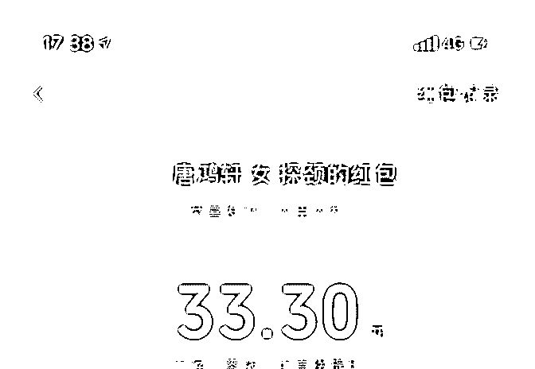
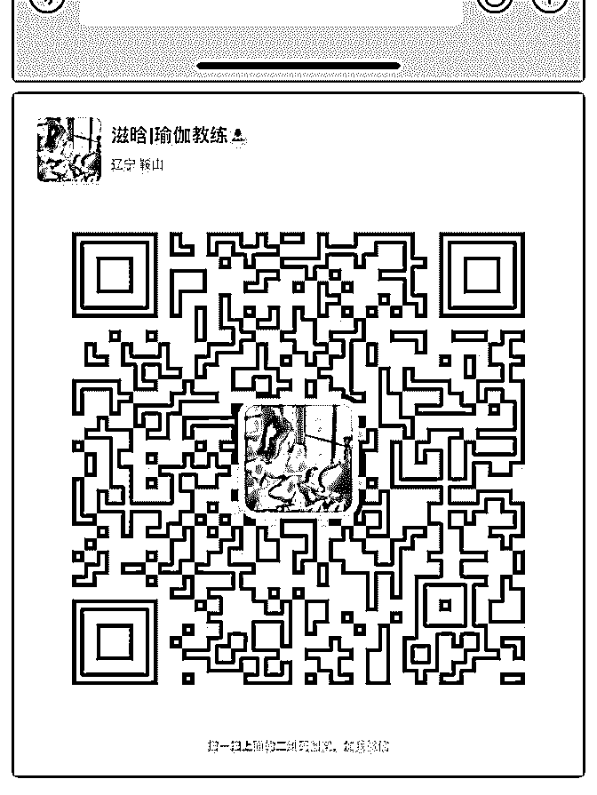

# 零基础高中毕业生一

滋晗 : 零基础高中毕业生一个月赚回核心课学费

一、踩雷总结。 1.和别人咨询的时候一定要先提供价值。不要推销，推销的话 自己都产品就变成大白菜了。我要明白一件事，我的课程价 值是很高的。自己现在这个价格其实是有点赔本的。

2.进入社群之后要和群主有互动。比如“我真的好喜欢瑜伽 啊”“想尽一点力帮助更多人”。不要出现明显的“私聊”，这会 给人感觉我在带人跑。

3.我现在的阶段是概念验证，暂时不用去知乎引流。

4、开始发朋友圈的时候，发很多也没有人来咨询。自信心受 挫，经常连续两天“躺尸”，不行动。多亏穆穆经常和我交 流，并且鼓励我，才能坚持下去。关于心态，自己一定要记 住：心态要稳定，不要太着急去成交别人。我是值得别人付 款的。

5、在有的群里，发自我介绍时不要带客户的效果图。容易被 误会是在打广告，被踢。

6、当问客户问题，对方没有回答时，就不要再追问了。通过 发朋友圈戳他的痛点，她有兴趣会再来咨询。

7、刚开始发朋友圈，来咨询的人肯定很少。但一定要坚持发 朋友圈输出价值。你的客户其实一直在暗中观察你。

二、我现在的阶段：练手，概念验证。积累成功案例，为后 期导师计划的学习，打造奢侈品牌做铺垫。

三、现在应该怎么做？ 1.塑造朋友圈。客户痛点（可以拿不良体态的图片戳她们）、 人们想要的理想生活去刺激、浅显易懂的干货（大家都爱看 简单易懂轻松的东西）、成功案例、成交截图（红包）。 2.在朋友圈下面的评论区打字：今天提供三个免费咨询名额。 这么写可以促进她们咨询我。 3.与客户咨询交流。提供价值，不要推销。

4.咨询交流结束之后，询问她“你觉得建议有帮助么？”。她回 答“有”。我：“可以象征性地给我发个红包么？不是多少钱的 问题。发个红包可以给我信心，让我坚持下去帮助更多人。”

然后我可以把这个红包截图，当作价值展示。（毕竟不点开 红包，别人也不知道里面有多少钱）。

5.然后和客户说：“我现在很专业。价值 1298.00 的课免费系统 带教一个月。最多收 20 个人。你愿意加入么？”她肯定会 说“愿意”。然后我说明进入规则：“进入微信群需要支付 33.3 的挑战金。一个月内打卡 30 次，退还挑战金。”

6.关于设计的体式：设计一套动作能缓解圆肩驼背的问题，也 能减肥，也能瘦腿。

四、感恩贵人。 真的非常非常感谢穆穆手把手教我个人品牌。上面这些全都

是穆穆教给我的。

一开始的时候，对一些概念理解的不透彻，比如“痛点”。一

开始发朋友圈不明白“痛点”到底是怎么回事，来咨询的人总 是很少。但自己一直坚持行动，和穆穆积极交流，穆穆对我 也非常耐心的指导，最后利用“痛点”发圈，每次都能有人来 咨询并且付费。所以一定要坚持行动，并且和助教老师积极 沟通。

刚开始的时候，对自己特别没有自信。但穆穆一直鼓励我， 赞美我。经常夸我“牛逼”。这样一点一滴的积极的心理暗示 让我变得越来越自信。

感恩穆穆和泽宇教育的每一位导师和助教。 向月入过万的目标努力

以上。

2019-07-21(14 赞)

关注公众号"懒人找资源"，星球资源一站式服务