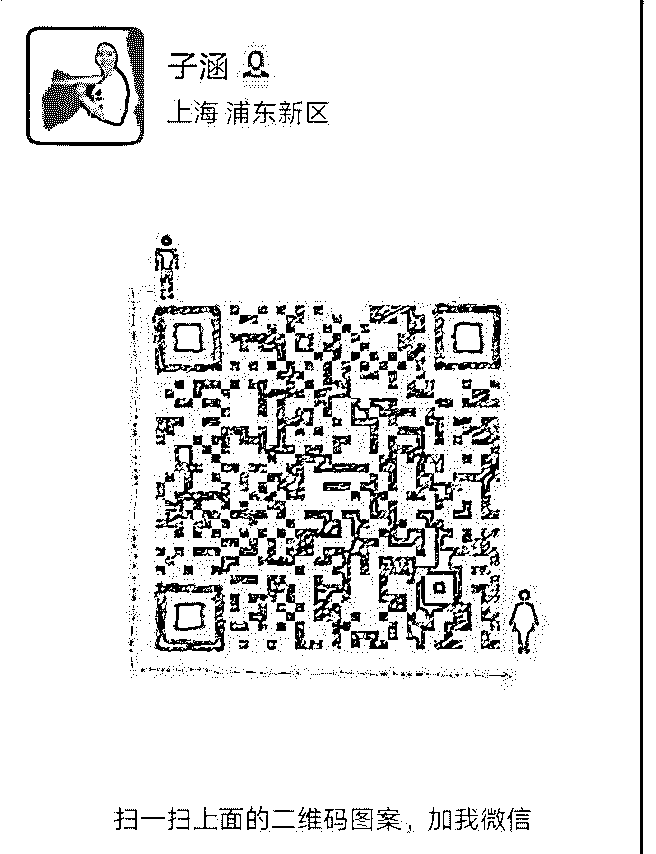

# 我是 7 月 4 号晚上加

马子涵 : 我是 7 月 4 号晚上加入核心课的，但之后两天都在忙， 直到 7 号晚上才开始听课。听课后，立即展开实操。

我的定位：帮助女性由内而外建立自信（女性成长领域） 变现形式：课程+一对一咨询 拉完课程架构，写好自我介绍发给导师帮我把关。听取他的 建议，立即进行修改。

7 月 8 日当天，变现 1763,龙哥在群里帮我庆祝成果，发了奖状 和红包。7 月 12 日，变现 4000+。那几天，每天都有变现。

我根据课程中的要求，持续打造朋友圈，输出有价值的信 息，并展示成果。但是第二周的情况就不太稳定了。时有时 无。再次用泽宇的话来提醒自己，要有好的心态。不断仍硬 币，增加概率。目前正在做引流和转化。

有做女性方面产品或者课程的小伙伴，我们可以一起啊！只 要听话、照做，我相信一定会出成果的。[调皮]

2019-07-20(9 赞)

关注公众号"懒人找资源"，星球资源一站式服务