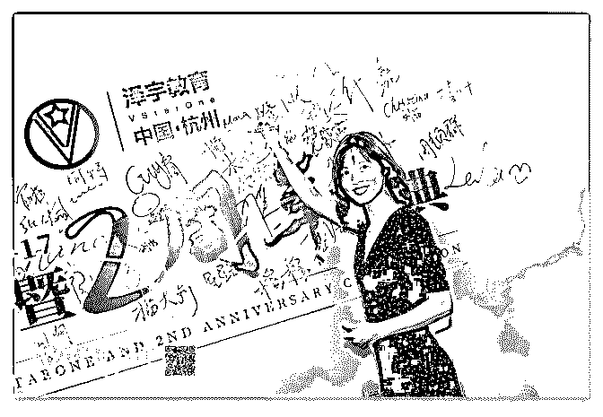
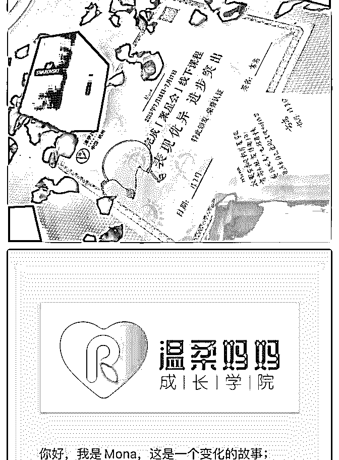
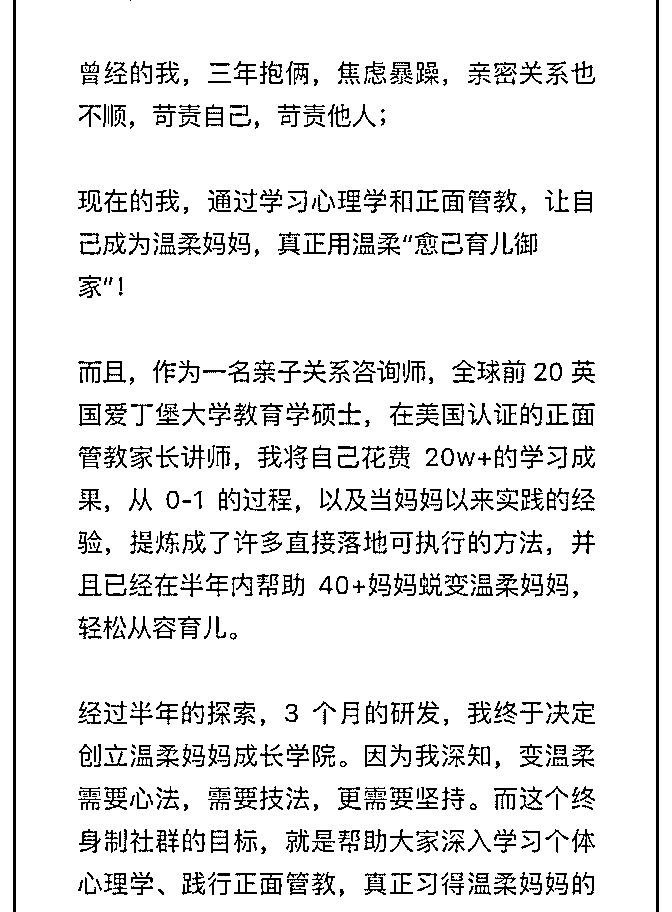
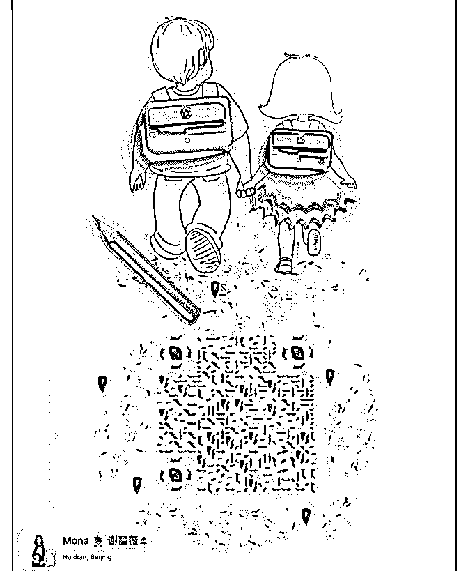
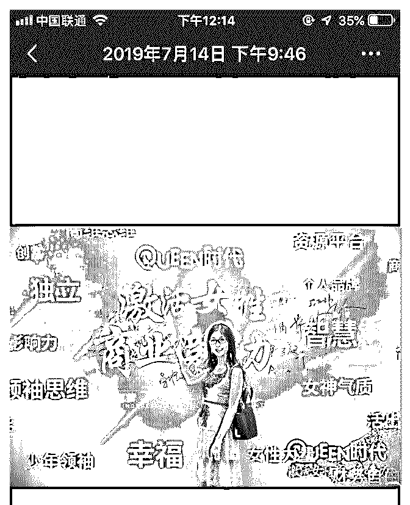
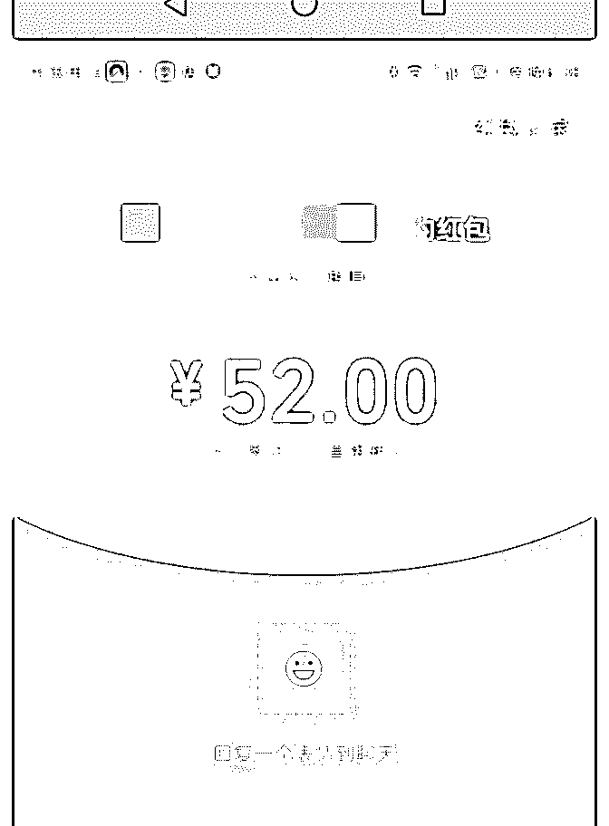
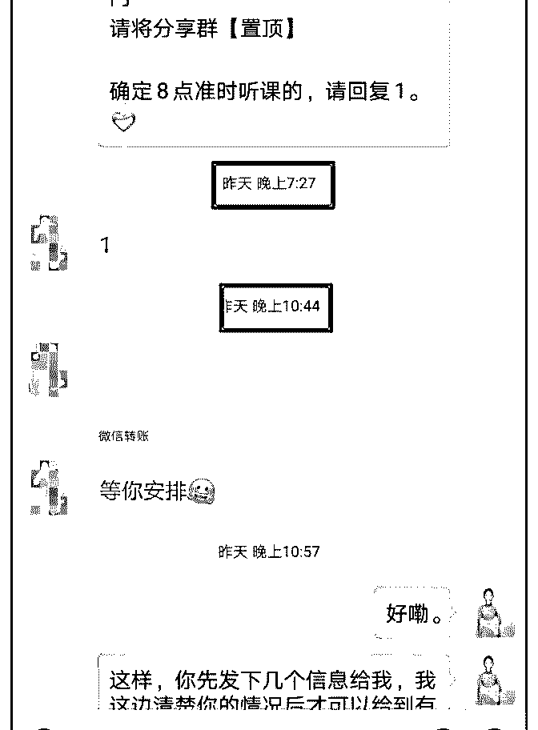
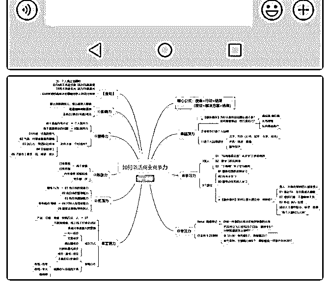
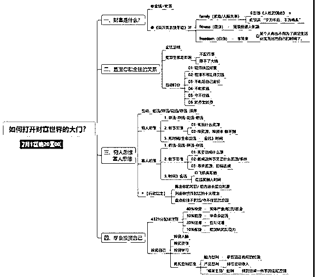
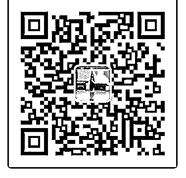

# 俩娃老妈子的高光时

萌娜-亲子关系魔法师 : 俩娃老妈子的高光时刻 II：杭州聚星会 线下 24h 不到变现 1.5w+，获芬芬组第一名

Hello 我是 Mona，亲子关系咨询师 Mona，俩娃老妈子 Mona， 和泽宇在波士顿面过基的 Mona。现在要多一条标签，我是温 柔妈妈成长学院创始人+院长 Mona。

6 月底知道泽宇教育会在杭州办一场线下，立刻报名，期待参 加。7/15 到了杭州，因为住在洲际，晚上约到芬芬进行指导。

其实，我从 6 月就开始构思如何招募，至于为何一直没有做， 是因为我自己的一些原因，后面会说到。后来跟芬芬联系 后，多方考虑，决定把招募时间就定在杭州线下这两天。于 是，可以说，我是带着目的去的杭州线下！

我计划 16 号晚上 7 点正式开始招募，但这里有个小插曲，晚餐 因为是 7 点开始，并且我正好坐在泽宇对面，然后，就尬聊了 几句话，聊到 7.15pm 我才发现我忘了什么事！于是慌慌忙忙 开始掏出手机发招募文案......对自己无语一把。

最终大约 7.20pm 发出招募文案，然后现在就是汇报高光时刻 了！

a. 30min 内，20 个 99 元优惠名额全部抢完！ b. 当晚，招募学员 35+！

c. 截止 7/17 晚 6 点，共招募学员近 60 位，变现 1.2w+！

d. 一位朋友加入导师计划，变现 2980！总变现 1.5w+；荣获导

师芬芬组第一名

看到上面大家应该也知道了，这其实是一场“蓄谋已久”的变 现活动。说实话，我做了很多准备，但是最终 24h 小时内，变 现 1.5w 也是超出了我的意料，刷新了记录去，也是新的里程 碑！

接下来是复盘，我想我做对了以下几点！

1\. 梦想是要有的，万一它实现了呢？ 这样说起来，似乎有些功利，但是跟芬芬联系之后，确实就

把招募安排在了线下，也是希望可以得到一对一的指导！

在去杭州之前，我就给自己定下了一个目标，那就是变现

10000！这样的话，我需要收 20 个 99，10 个 199，16 个 365。

最终，我收了 23 个 99，12 个 199，22 个 365。不要问我为什么 前面多收了，真的是因为大家转太快了，我算错了

其实 16 号晚餐的时候，泽宇说，你这低价怎么放这么多。我 说，我想给我以往咨询者多点福利来，结果事实是，一放出 就被抢了。但是真正支持你的人，依旧会支持你！我好几位 咨询者都是 365 转给我的！对于这些支持和信任，我无以为 报，只能更加用心的打磨课程，更加高效的解决大家的育儿 问题！

所以，梦想还是要有的，因为很多时候，不敢想，才是失 败！

2\. 听话照做 我一直认为，听话照做是一种能力，并不是所有人都有。而

我，也不是一直听话的学生。事实上，当有一种模式，既有

过程，又有结果，而且被验证，那么，取得结果最方便的事 情就是听话照做，复制过程，才有可能取得相应的结果。

我从一周前就开始发朋友圈剧本，开始铺垫和蓄势，制造悬 念，放福利，宣传我的温柔妈妈成长学院，把 Logo 放出来混 眼熟等等；想了解朋友圈剧本怎么发的话，可以联系我，或 者我导师芬芬！

3\. 你的过去，每一步都算数！ 变现是从招募文案发的那一刻开始。组内同学都说我文案写

得好，谢谢大家的鼓励（搁以往可能会自谦一下，现在有意

识的去 take 所有的赞美，并从内心去认同自己）！

下午 2 点，泽宇说些文案的时候我是拒绝的，我不知从何写 起。我是准备好了社群招募的信息和内容的，但是，晚上 6 点，everybody 都在写，或者写好了，我也开始了。

花了三分钟，定了定思路，10 分钟不到就写出来了。 这使我突然想起，半年前的我，还写过朋友圈的文案，价格

多少？3 块钱一条，我一小时只能产 6-8 条。然而，就是这些 事儿，能让我快速提炼要点，并且准确达意。

我们每个人都需要对自己的现在负全责！过去的每一步，都 要承担一些责任，也许是好的，也许是坏的，但是都没有关 系。未来，我们可以更好！

4\. 突破自我设限，大声说 Yes，I can！ 我是一个害怕失败的人，这与我的成长经历有关。我害怕得 到不好的结果，而这只会带来两个结果，那就是要么不敢开 始，要么完美主义。

7/16 招募，其实也是一个借口，告诉自己，到那天了，不能再 拖了，必须要去做。我做了，但是途中依旧有些设限。

大家都在芬芬房间发文案，我的进度比较快，已经开始收钱 了。但是，收到 199 的时候，我就说，感觉待会涨价到 365 会 没有人来。懒猫说我自我设限，说实话，我其实也不知道能 收到多少。

到后来 365 收了 3 个 5 个，发现之前确实自己又给自己设限了。 但是设限又来了，感觉自己 365 收不到几个人。到最后截止之

前发现，一共收了 22 个人！

这件事也给了我自信，有时候就是自己认为自己不行，下 次，对着镜子说，yes I can！然后就去做吧，又不是没那条 件！

5\. trust the process

这句话是我在美国学习正面管教的时候，我的导师 Branda 说 的话。意思是我们作为正面管教家长讲师，再去带领家长课 活动的时候，多多少少都会遇到一些挑战。因为每个人的水 平不同，实践的对象不同，带领活动的过程当中也必然会碰 到不同的问题。但是，继续走，要去相信整个流程，根据个 体心理学这样安排肯定是有道理的！

再说道，泽宇教育，大家用这个方法，都可以变现，甚至实 现自由办公，那么，先去相信它，trust the process！

最后，由于变现结果是小组第一，还获得了芬芬精心挑选的 手链。爱芬芬，爱爱爱不完！

加入泽宇教育半年多了，从没有定位，到开展一对一，到创 立自己的社群，到一天内变现 1.5w，一步一步我在突破自 己，也逐渐清晰了自己的目标！感觉自己特别好命，所有人 都在帮我！我也一定会在教育行业继续努力下去，早日成为 泽宇教育在教育界的 KOL！

为我自己加油，也祝看到文字的你心想事成！ 都说复盘最好 24h 内完成，最迟不要超过 72h！终于赶在 72h 内

完成了！杭州的我，实现了自己的小突破，认识了各行业的

大咖，被注入满满的能量！

现在的我，正带着娃去下一个地方体验人生！ 谢谢泽宇教育，让我可以一边带娃，一边实现自我价值。感

恩永远铭记于心❤

最后的最后，奉上刚更新的 Mona 简介一份～

【姓名】Mona 萌娜老师

【坐标】北京

【标签】亲子关系咨询师

【个人经历】

❶5 年英美生活经历，全球前 20 英国爱丁堡大学教育学硕士； 在美国学习并认证成为正面管教家长讲师；

❷曾经带俩娃焦虑暴躁，亲密关系也不顺；后专研正面管教 和心理学，成为温柔妈妈；

❸用【陪伴式咨询】和原创【亲子目标管理 7 天计划】指导

40+妈妈变身智慧温柔妈妈，熊娃变成天使娃；

❹创办【温柔妈妈成长学院】，致力帮助 10000+妈妈用温柔

愈己育儿御家，正在招募中！

【我能提供】情绪管理与亲子沟通技巧、正面管教和科学育 儿指导；

价值 198 的育儿宝典免费 送，专治熊娃行为不当，专治睡渣 晚睡不睡，每天仅限前 3 位

正在带娃去海边的 Mona 2019.07.20

2019-07-20(20 赞)

评论区： 屈源 : 厉害了

小倩 :

关注公众号"懒人找资源"，星球资源一站式服务

# 7.15-7.18

7.15-7.18 号 四天变现近 1200 元。

说来惭愧，我是 17 年就接触泽宇教育的，报了核心课，再是 导师计划，今年 3 月份加入聚星会。但我一直没采取行动，没 怎么去听课，也没参加活动，一拖再拖。

站着不动，你永远只是观众。 走着走着，你就成为了风景。

7 月 12、13 号参加完两天一夜的商学院后，我突发奇想想做做 一个三天快闪群，把这三天学到的东西分享出去。于是 14 号 晚 10 点发了条朋友圈，“想听的伙伴打 1，邀请入群”。15 号下 午拉群，9 点开讲。15 号第一天开讲，9 个快闪群 9.9 元，一个 免费咨询后发红包 68 元，课程分享完后收红包 66+9.9+5.2 元，第一天就变现 238 元。

一开始建这个群时初衷很简单，就是告诉自己，我要行动， 我要去实践“干海绵理论”，一点就通，学到就用，“凡事皆为 我所用”，我走出去了，打开自己了，为别人赋能了，钱居然 也自然而然被我吸引来了。

第二天，纯公益，收两个红包，6.66+8.88=15.54 第三天，最后一次分享的是《如何打开财富世界的大门》，

在分享的过程中，我意外地发现我内心的金钱木马被打破

的，我敢于谈钱了，敢于收钱了，敢于展示最真实的自我

了。也在课程结束时推了自己一对一的咨询项目和费用。课

程结束后收到第一个 99 元咨询，两个红包，52+8.88，共 160

元。

7.18 号，课程结束后，又接到一 99 元咨询，咨询完后又发给我

52 元红包，说价值两千，随后转账报名 599 元包月咨询。当天

变现 750 元。

庆幸自己敢于迈出第一步了，打破自我设限的枷锁。 再分享的过程中，我又找回了自信。我这两年在学习上投资 了近三万，听了大大小小的课，原来看过的书、听过的课、 见过的人，当你用顶级投资思维，赚回学费的心态去行动 时，你就能拿回你自我觉醒的力量。

在分享过程中，我也意外地发现能力是可以迁移的，我之前 从事四年多教培行业，从一名实习助教成长为学科负责人、 教学主管、公司合伙人。授课 1000+小时，教小孩，培训老 师，开讲座，做 400 人年会主持人，讲课和分享是我最大的竞 争优势。那三天课程，是密集型的开讲，我基本都是在下午 才着手去准备当晚的内容。1 小时收集素材，半小时做思维导 图，半小时做课件，半小时过课+文字性互动问题。一个课 3 个小时就搞定，不用写逐字稿，直接开讲。甚至一开始是想 把线下两天内容分享出来就行，结果发现我基本是按自己风 格在讲课，30%左右是线下内容，70%是自身感悟。这是意外 的收获和发现。

在此要感谢核心课导师笔盖，导师计划的芬芬导师，还有赚 回学费群里小伙伴的赋能，感谢感恩。

[爱心]原来，当你决定出发的那一刻，眼前将不再是迷雾重 重。

当你内心真正觉醒时，你将不再追求爱，因为你就是爱； 你将不再追求光，因为你就是光。

以此共勉。

2019-07-20(10 赞)

关注公众号"懒人找资源"，星球资源一站式服务

# #庆祝成果 7 月 1

Joyce 国际贸易 : #庆祝成果 7 月 18 日成交一位商务英语课学员，知识变现 2980。 复盘：这位同学一开始对英语课程询问了很多问题，我都耐 心解答。后来说要考虑考虑，再决定是否报名。这种情况 下，如果不进行后续跟进，可能就不能成交。 于是，我昨天继续问她是否考虑好了，她还是很多纠结，其 实根本原因是改变的决心不大，对自己想学习这个事情没有 信心。我就直接跟她说：请树立终身学习的观念，学习之路 本来就没有尽头，重要的是，我们每天都在进步。

2019-07-19(0 赞)

杨熙 :

关注公众号"懒人找资源"，星球资源一站式服务