# 通过给学员提供面试

通过给学员提供面试指导，变现 1000+。

回顾进入泽宇课程学习以来，在导师的指导下，经历了几次

定位的调整：从「职场三国」到「职业规划」，再到职场的

细分领域「面试教练」。

个人品牌的打造过程中，经历了一些波折，一度出现停滞：

（1）主业工作比较繁忙，时间有限。

（2）需要多陪伴孩子，以免缺位。

（3）家里人不太支持，担心影响工作。

在免费咨询阶段，也收获了一些好评和感谢红包，但由于做 做停停，效果比较有限。

自己尝试着第三选择：

（1）早起 1 小时学习，规划好时间输出。

（2）给孩子讲睡前故事，高质量陪伴。

（3）个人品牌的收益，买东西送家人。

在一定程度上，缓解了个人品牌与主业、家庭的矛盾点。

通过请教了导师，探索着进入付费咨询阶段，成交第 1 位学习 群小伙伴。连续 3 天，成交 3 位小伙伴，过了几天又成交了第 5 位，很开心，进行及时复盘也很重要。

第 1 位小伙伴 在学习群中添加后，由于有一定的信任度，加上她马上要参 加面试，问了基本情况后，很快就付费学习了。

第 2 位小伙伴

其实是前一周从知乎加过来，进行交流过的。 但当时的交流话术没严格按流程用好，加深痛点不足，当对 方问起了价格时，给予报价后，对方表示还要依据面试结果 再考虑，当时没有成交。

我继续打造朋友圈。 结果该小伙伴的近几次面试情况不太理想，几天后就再度找 过来，这次直接报名求助。

第 3 位小伙伴 是在我发复盘之后，从内部群吸引过来的。

由于是内部的小伙伴，我根据他的需求，直接发了一些学习 资料给他，然后预约第二天晚上交流。 第二天晚上，直接开始分析交流，通过 50 分钟的咨询解答， 帮他从点线面体多维度梳理了职业规划，结果他给了好评， 还发了 99 元的感谢红包。也是很感谢小伙伴的高度认可。

第 4 位小伙伴 也是从知乎添加过来，有一个月时间，可能是看到我近期的 朋友圈好评，过来表示希望我帮他做职业规划，预约了第三 天晚上的交流。 这一次，严格按照百万营销话术进行交流，对方改变的意愿 也很强，行动力也很棒，通过愉快的交流之后，就付费了。

第 5 位小伙伴 从知乎添加过来后，用了百万营销话术，同时结合额外合作 课程作品赠品，成交了 188 的职场面试课程+520 的财富自由之 路合伙人。

在付费阶段，变现 1000+，新的起点，新的征程，继续前行！ 对于这个阶段，总结了几个要点：

1.专注于细分领域，进行面试指导；

2.帮助学员找定位，助力升职加薪；

3.百万营销威力强，一步一步递进；

4.写朋友圈与知乎，稳扎稳打前行；

5.用心服务好客户，让客户出成果；

6.一旦遇到卡顿点，及时请教导师。

感谢波力老师、小鱼老师、荻野老师的悉心指导。 用心、专注，集中优势力量重点攻关，技能强化专业技能， 当遇到卡点，要及时请教老师。

【小福利】：欢迎加我微信 yangxi_2019，送你价值 99 元的

《面试指南针》，助力升职加薪。

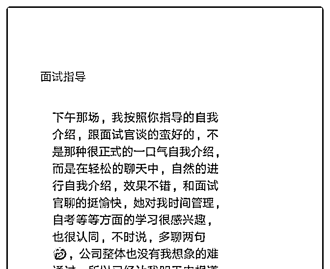

2019-07-18(1 赞)

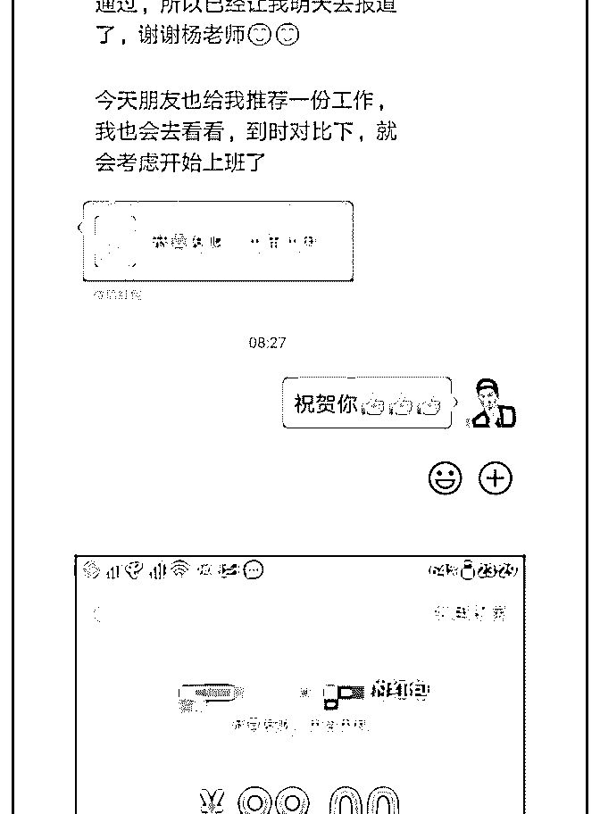

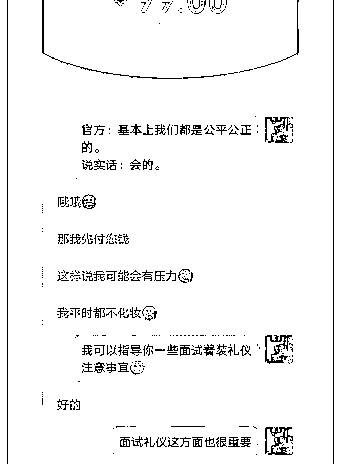

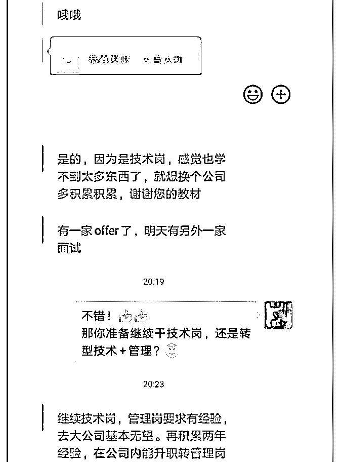

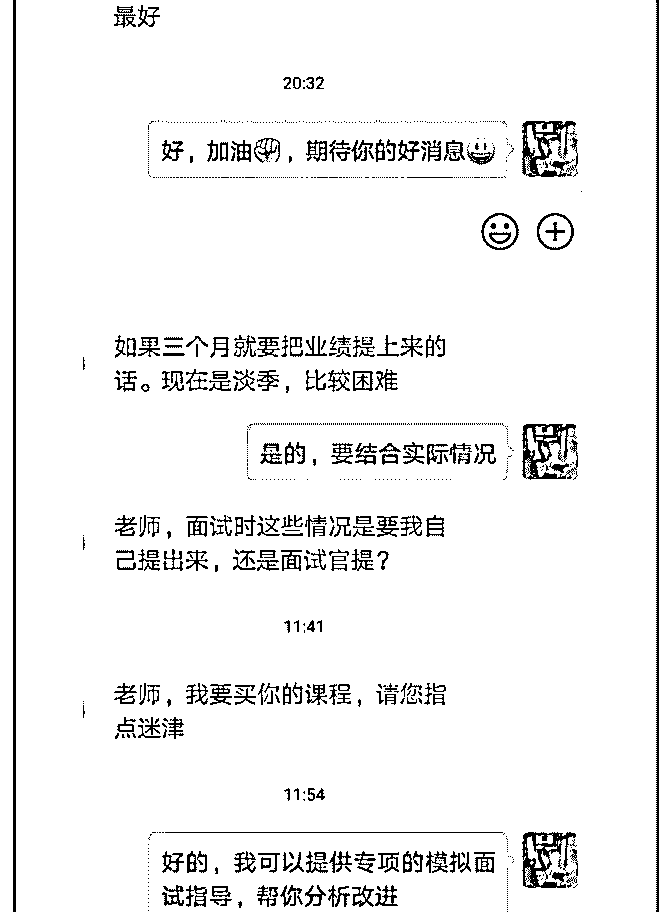

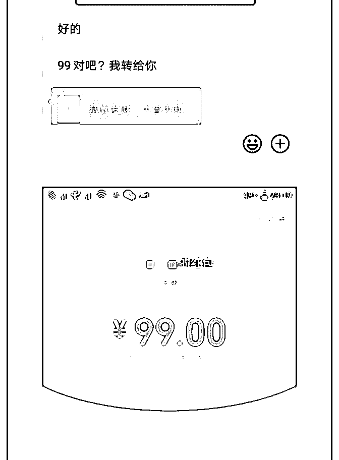

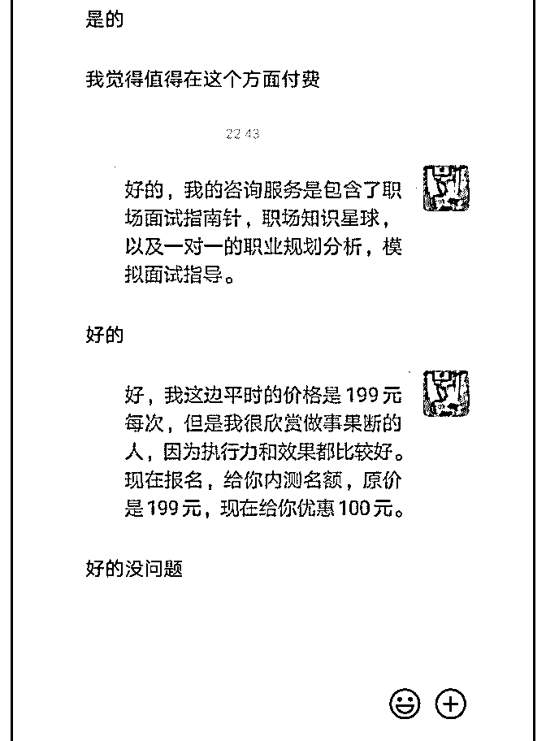

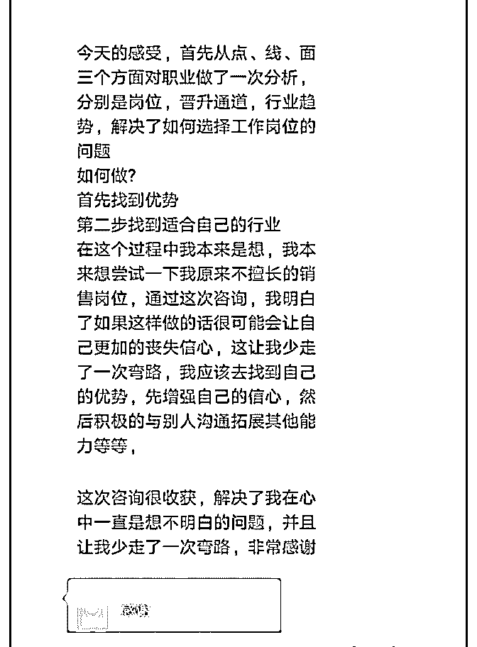

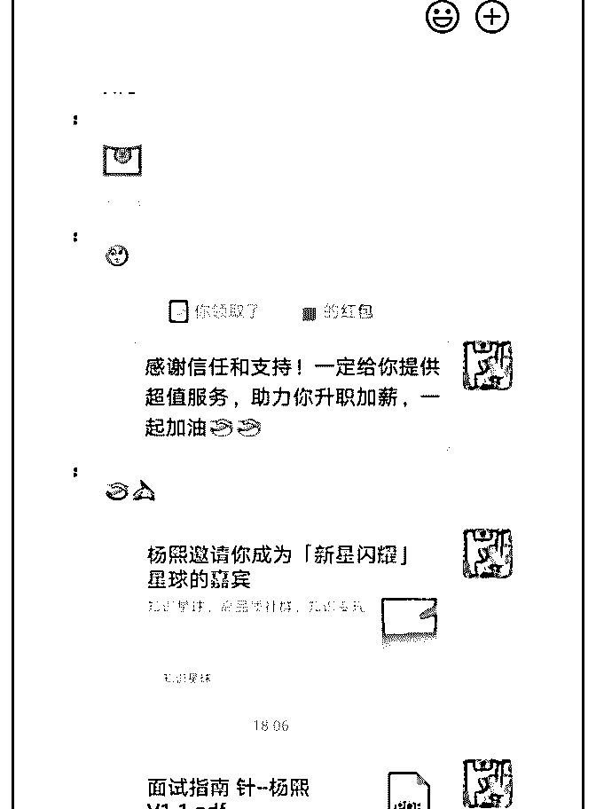

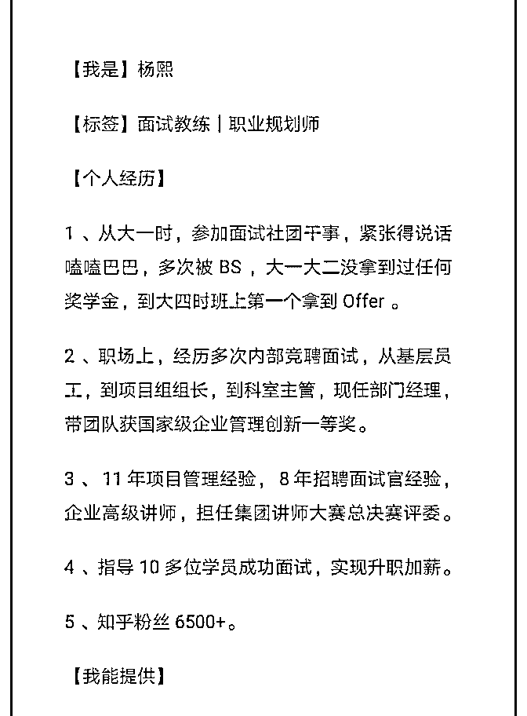

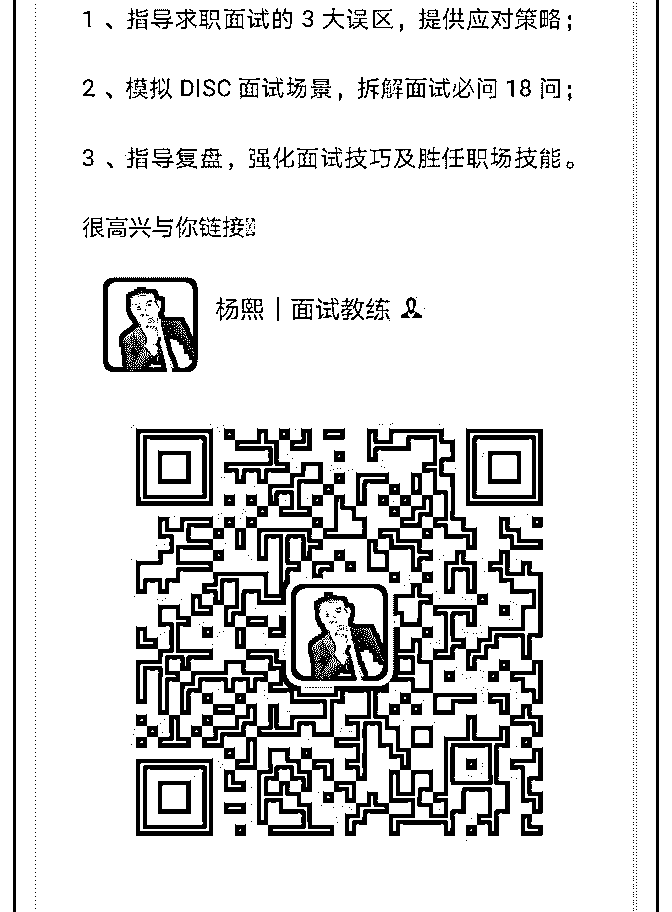

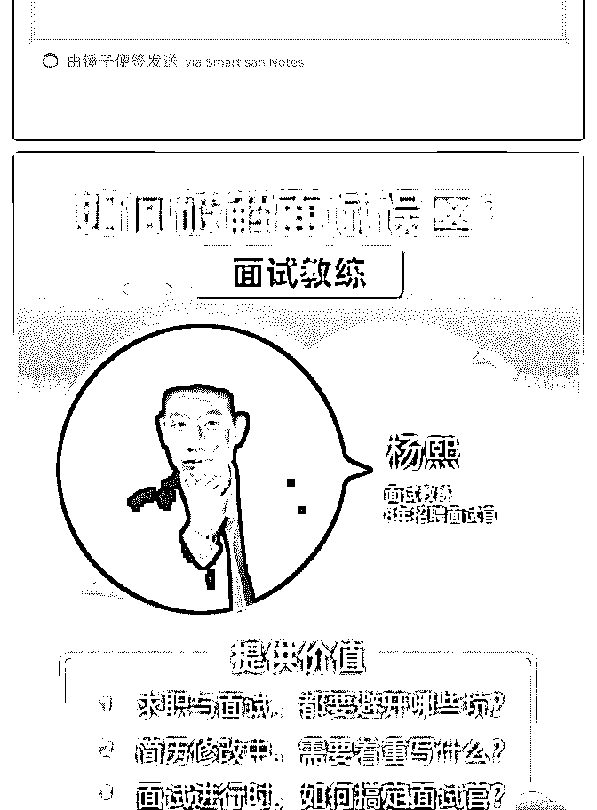

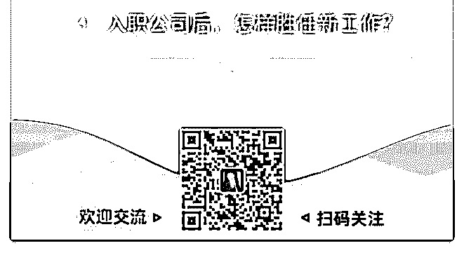

创业少女·零零七 :

关注公众号"懒人找资源"，星球资源一站式服务