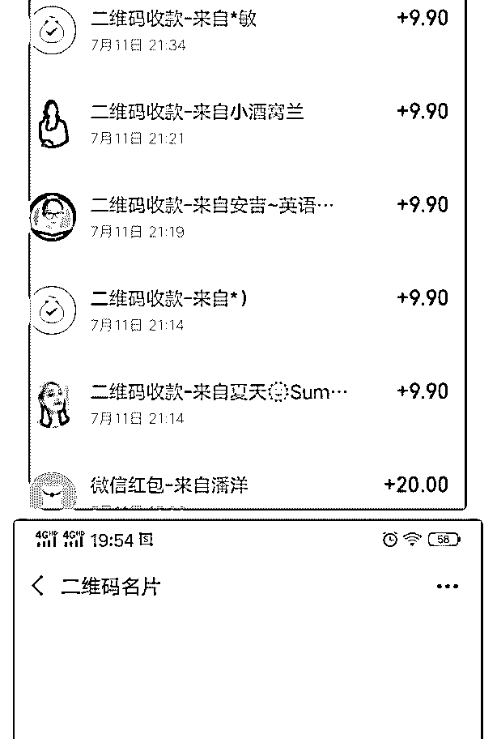
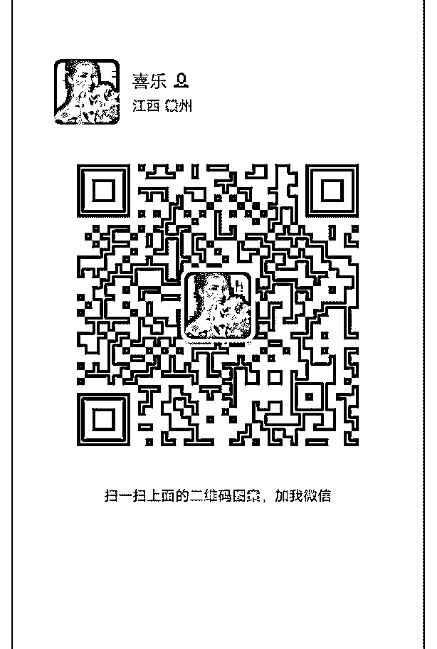

# 感谢泽宇教育，让我

感谢泽宇教育，让我学会以服务学员为第一。

在美食训练营里，一直秉承以服务学员为第一准则，无条件

的利他思维。在多次主题分享日，用心抓取对方自我介绍的

闪光点，结合要的主题写文案，做推荐，给予学员展示的机

会，也给他们的个人品牌助力，扩大影响力。

学员反馈说，我写的文案好，问我为什么不深耕文案。经过 反复推敲，发现朋友圈诊断很合适自己的调性，符合自己爱 思考，注重细节的特征。有了想法后，进行概念验证，自己 说的不算，市场说的才算。

在某个社群，群主将大家的产品包装好，在群内统一时间， 进行拍卖，有 6 个人来买我的朋友圈诊断。

6 月变现 160 元，7 月目前变现 118.88 元，累计变现 278.88 元， 离賺回学费只差 86.12 元，离 1000 元，只差 881.12 元。

我相信我能賺 1 元，我就能賺 100 万。 你好，我是喜乐，朋友圈诊断咨询师，打造你的专属流量

池，让你的朋友圈从付钱到收钱。

2019-07-12(10 赞)

金风℡ :

关注公众号"懒人找资源"，星球资源一站式服务