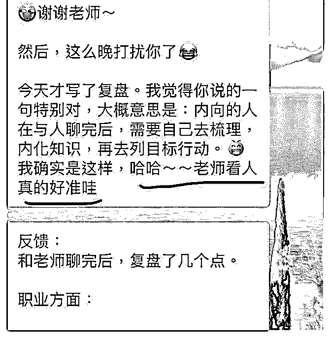
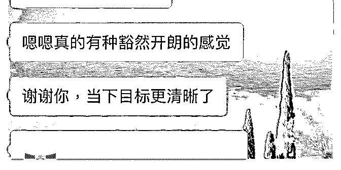
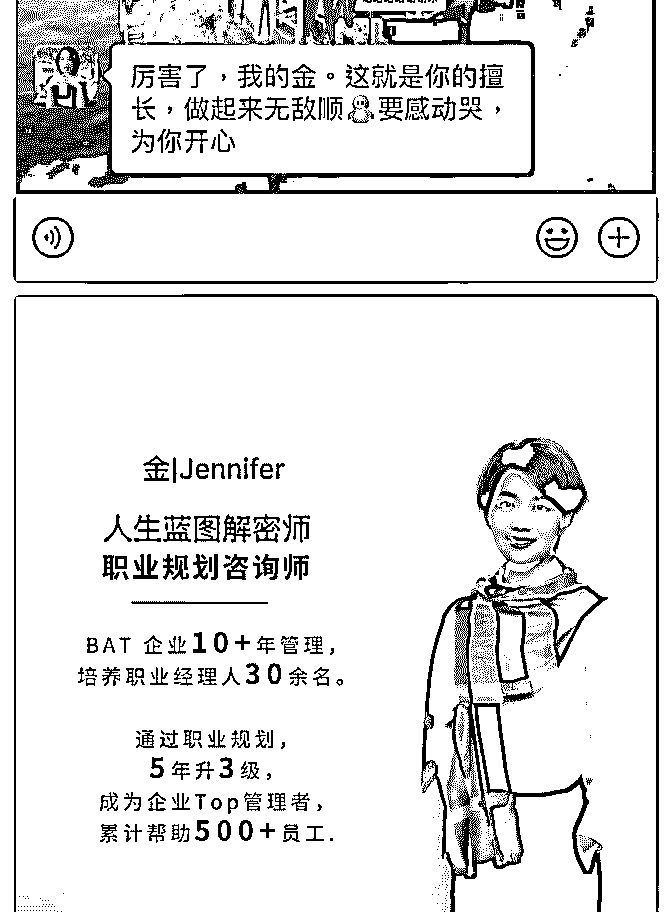

# 加入 1 个月，从定位

加入 1 个月，从定位到咨询，在摸索的过程中不断学习，内测

阶段在职业生涯规划+人生蓝图解密 2 个方向咨询，助力大家

快速走出迷茫，对人生更有了自己的节奏，让自己成为光。

我也随之小收随喜红包 500+。 谢谢小鱼老师的不厌其烦，猫大莉的鼓励与支持、分享。谢

谢小鱼老师拉了 2 次小课找出问题，解答疑惑；谢谢猫大莉给 我做了第一版海报，非常用心，专业的事情果然要交给专业 人员才靠谱。 由于工作圈层原因，很少在朋友圈记录生活、工作相关内 容，导致初次接触个人品牌，不知道如何发朋友圈，另一个 朋友很善于展现自己的生活，知道我想开始这条道路，脱口 而出：“你这需要很长时间的沉淀，你看我，我都把最优秀的 一面展示给别人看，当然，都是真实的我……”哈，那时还 想，自由人士和职场果然有着太多不同！经历一个月的我看 来，其实在于心态，是否对外界打开你的内心。让她人对你 了解越多，越能产生更多链接的可能性。 开始分组朋友圈，分组…… 开始从我最擅长的职场规划入手，很多问题涉及到心理学， 乃至人生木马，果断入手更多课程学习，整合，梳理，从不 同纬度来快速让咨询融会贯通，即刻践行。给大家社群分 享、线下沙龙，来公益给更多小伙伴，改变当下茫然状态。 内测期间，答谢&随喜红包从 66.66 到 99，实现了从 0 到 1 的跨 越。

猫大莉老师总是这样不厌其烦地推动我前进 目前开始全面木马查杀、蓝图解密，职场规划系列咨询服 务。看到职场伙伴找到清晰方向、运用蓝图笃定当下和未来 7 年，倍感欣慰。解决了他们的茫然，无助的同时，也让我找 到使命感，倍感幸福。

再次谢谢助力推动我前行的猫大莉、小鱼老师。 感恩遇见！

2019-07-11(10 赞)

关注公众号"懒人找资源"，星球资源一站式服务