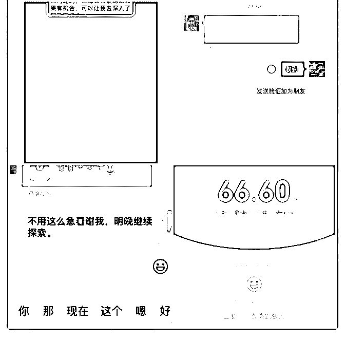

# 成果复盘一个星期赚

李鹃－生涯咨询师 : 成果复盘

一个星期赚回核心课学费。前天收到我的第一位付费 99 的咨 询客户。这大大的增加我的信心，我还记得刚加入时我给自 己定的目标是一个月成交第一位付费客户。没想到两个星期 不到就有了第一位付费客户。昨晚又收到一位咨询 99。再加 上这周末约了一位线下的咨询。再加上之前免费咨询的用户 的随喜红包。顺利赚回核心课的学费。

在报名之后我就特别兴奋的听课，很想一天就把课听完，但 还是克制了自己的冲动，因为听完是一方面，践行又是另一 方面了。我给自己一个大的定位是生涯规划咨询师，期间也 有过自我怀疑，但是笔盖女神就给我说在没有细分之前就是 要先去尝试，先要什么都会的。

所以就开始进行概念验证，在开始进行了大概 7 个免费咨询之 后，大家给的反馈也都很好。但是我不知道怎么收费，心理 还是不敢给自己定价。记得前几天一位朋友给我介绍了一位 客户，当时其实是听了百万营销课程的，但是听了没有写复 盘，所以不知道怎么去用。第一次失败，不过后来又运用了 百万营销给挽回了。

于是我再去复盘百万营销的每一个步骤，为此我还去请教一 位用百万营销用的好的小鹿 ，她说她最开始就是照搬课程 里泽宇教的那几句话。慢慢的摸索出了能够应对自己定位的 话术，百试百灵。我就更有信心。

那天就有一个朋友来咨询我，目前有职场困惑，想让我帮她 做一次咨询。前一天没有详细聊下去，第二天我就跃跃欲试 想用下，于是跟她用了百万营销的的那 12 步。最后很果断的 转账。

我总结能够成交的原因： 1.朋友圈宣传，在朋友圈输出，也让别人看到我在成长，我在 改变。自然会好奇，等她主动来询问的就证明她有需求的， 等她把自己的问题发出来，就可以运用百万营销了。

2.百万营销 12 步，还需要再多去实践转化为自己的。

3.接下来我需要做的是每天有 5-10 个流量进来，开始知乎去回 答问题。

要谢谢笔盖女神和波力大大，平常我的问题也比较多，包括 怎么写文案，朋友圈打造，怎么去成交话术，他们都会非常 耐心细致的给我解答，直到我领会为止。真是太幸运了。 2019-07-11(5 赞)

评论区：

清菡 : 亲爱的，你微信号多少？ 李鹃－生涯咨询师 : jer1241

金叶 家庭保障教练 :

关注公众号"懒人找资源"，星球资源一站式服务