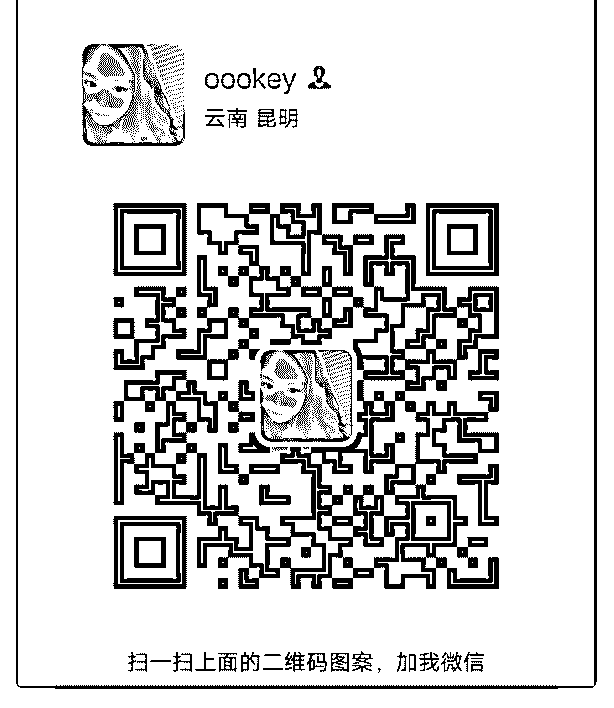

# 加入一周，赚回核心

oookey : 加入一周，赚回核心课学费两倍 认识了 50 位新好友友，找到了同频的伙伴，得到了他们的指 点，结交了真挚的友谊，得到了丹丹女神的集赞礼物，收到 了耐心哲哥的文案红包奖，为小姐姐文案提供了帮助.... 这些都值得我庆祝，但是更加值得庆祝的是 我开始在蜕变。

首先，我可以理性的认识了自己。比如发现了我的优点，也 察觉出了我的缺点。我喜欢跟人聊天，喜欢交朋友，可以很 自然的引流。我非常守时，这是对人起码的尊重，我会在上 课前的两分钟提醒，还有两分钟进入课堂。我也会在学员们 上进的时候，给他们发些小红包..我喜欢思考，发现我的思维 很敏捷，喜欢从不同的角度去看问题，新的维度可以带领我 看到不同的方面，我喜欢帮助别人，我喜欢去感恩....但同 时，我的缺点也在学习的过程中一一暴露。我对有些事情过 于苛求，比如我为了一个人在安静且全神贯注地听一节课而 错过了很多的空闲时间，导致课程跟不上时间的脚步。我偶 尔会很心急，想快点儿见到成果，但却不知在我期盼的时 候，时间已经悄然流逝，与其这样不如多探索些如何成功的 方法，千万不能因为心急而抓住了虚幻的小尾巴。

其次，受泽宇这个大家庭的影响，我变得非常努力。在这个 经理大叔，来咨询的时候，我跟他说了很多没有价值的花， 后来经过哲哥的指导，我学会了自己作出努力。为了不耽误 时间，我跟他约好通话时间为 10 分钟。所以我要在这有效时 间内说出重点的事情，我提前在一个小时内归列出了，他的 问题，他的需求，我的方案，我的输出，他能做的以及我能 做的，我们共同努力有什么是可以做到的，又因为哪些原因 是不一定能做到的...8 分钟之内我讲完了我的规划，于是他欣 然接受，我们开始实践执行。

最后，我一点点有了自己的目标。 曾经开始加导师的时候，我的目标是要赚 500，结果真的提前

实现了。如今我有了新的目标，我想双倍赚回导师计划，也 许他真的可以实现。仿佛有一个明哲的声音在耳边说：加油 你可以做到 让我想到了课程当中的一句话，行动和计划二者不能分离， 我终于做到了知行合一，因此我的心灵得到滋养，心境得以 升华。瞧， 一个星期的成长比过去几年的成长还要大，这就是泽宇教育 的魅力~ 加入一天的朋友，就发现口齿清晰，声音响亮，这就是有声 语言的魅力~ 当有天你的声音变得好听，你的热爱变成副业能够赚钱，你 的灵魂你的人格变得独立，这才是你的专属魅力呀！泽宇育 是学员的连接，而我想跟你，拥有更多的连接。我的微信在 下面，有缘的人定会相聚[爱心]

2019-07-10(12 赞)

评论区：

星愿^O^ : 超级优秀，加速向你看齐

关注公众号"懒人找资源"，星球资源一站式服务