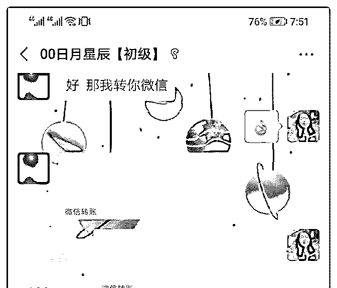
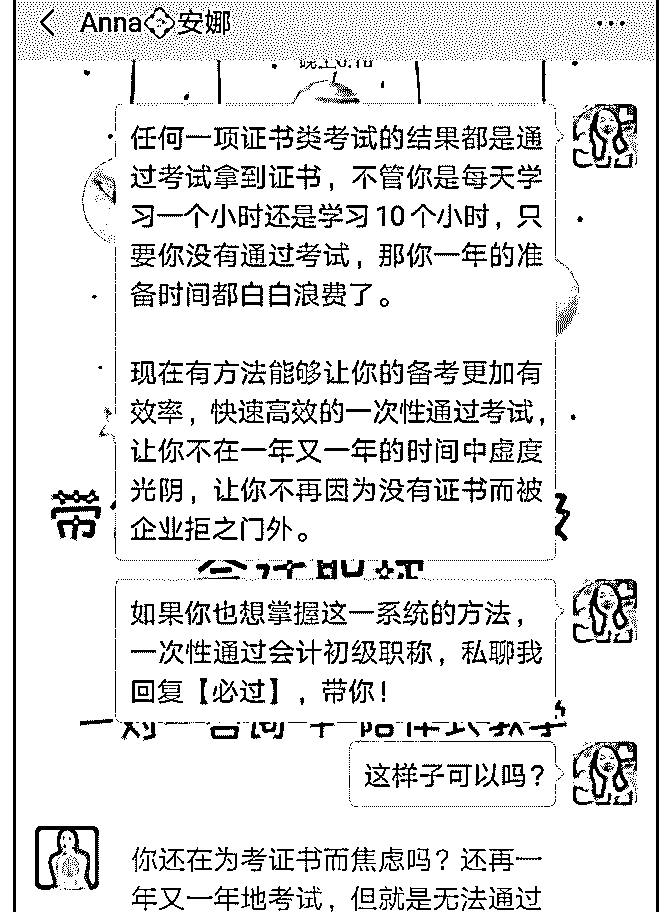
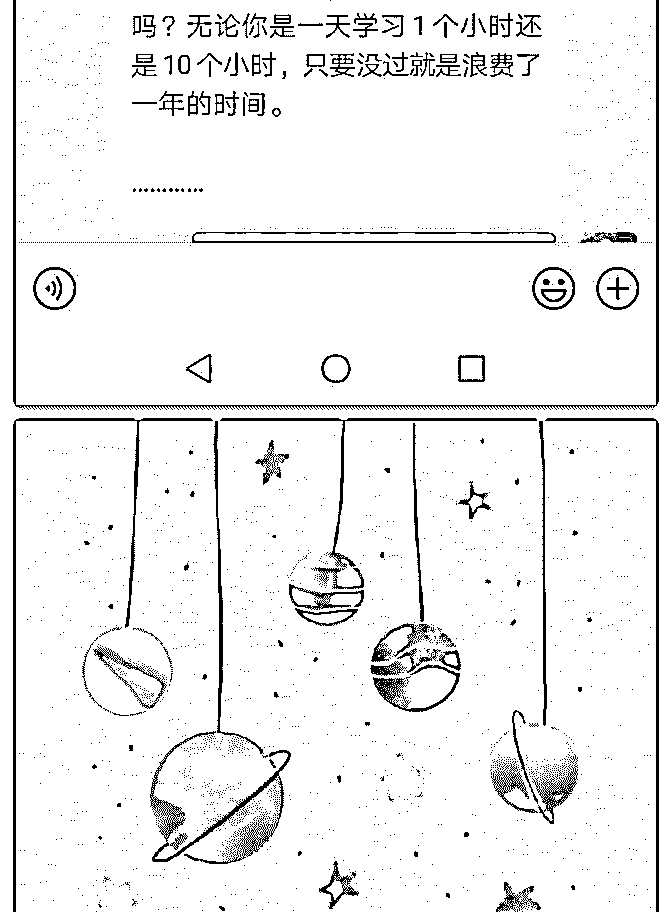
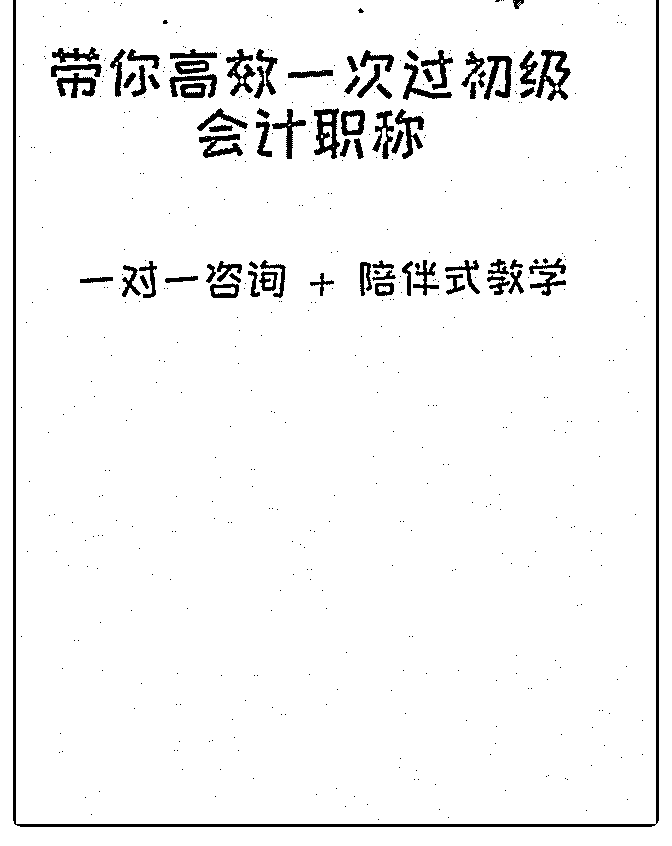

# 听话照做！！！傻瓜

李青耘考 CPA : 听话照做！！！傻瓜式成交 299！百万营销话 术牛逼了

分享一下我今天的成交案例。 我是做财会方面咨询服务的，6 月底的时候参加了成都泽宇课 程的线下活动。 虽然导师们都分享了很多很多的干货，但是我尤其记得两 点：

1、定位越细越容易出结果；

2、如果你的社群不去持续做输出，那么就解散吧。

经过这次的线下活动，我把自己的定位从最开始的才怪小白

成长咨询师细化到初级会计职称备考咨询师；第 2 点，我开始 在我的社群做持续的输出，从最开始的几个人到现在已经 30 多个人了。

经过这一段时间的实践，我发现还是没有人主动来向我进行 咨询。我就像安娜老师请教是为什么？ 安娜老师说我发的文案根本就没有去做到一点就是刺激咨 询。 安娜老师给我发了她自己发的文案的模板，我自己照着她的 写了一个，然后她又手把手的给我改了之后，我用了她的文 案发了一条朋友圈。 然后一分钟不到的时间，就有人回复了我，跟我进行咨询。 我没有信心跟这一个客户进行语音，因为我觉得用文字的方 式会比较利于我反应，来实践百万营销话术。 严格按照百万营销话术的步骤，到了最后一步，客户已经向 我来询问价格了，也就是临门一脚的时候，我向安娜老师求 助。

在安娜老师的帮助下，果断成交。 经过这一次的成交，我总结出来了 3 点： 1、有问题千万要向老师及时的请教；不要自己一个人闷头瞎

搞，不会出结果的，还会挫伤自己的信心。 2、百万营销话术是个好东西，一定要执行起来，融会贯通； 即使跟我一样，真的对于这个不是很擅长，开始不熟练，你 可以像我一样把笔记打开看，然后一步一步的照套路来。 3、要持续不断的输出价值，建立最基础的信任感，有利于后 续的成交。 我在社群平台的输出价值，是有效果的，长期来看，要坚持 下去。 真的特别感谢安娜老师今天的帮助。我希望现在很多还没有 出结果的同学，尽量的去多学习完课程，有问题就早老师， 尽早的解决了。

2019-07-10(7 赞)

关注公众号"懒人找资源"，星球资源一站式服务