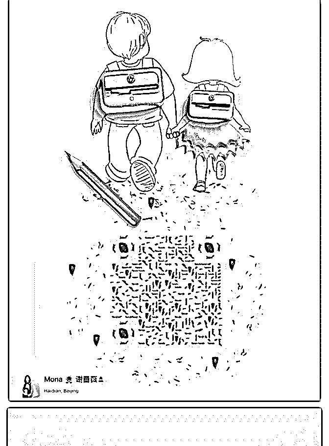

# 二娃老妈子的高光时

萌娜-亲子关系魔法师 : 二娃老妈子的高光时刻，10 天变现

5000+

我是 Mona,萌娜，亲子关系咨询师，二娃老妈子。

6/26 到 7/5，10 天成交 5 单一对一定制方案，每单价格 799，收 入 4000 左右。加上朋友信任直接加入泽宇课程，10 天收入破 5000！大约刷新自己的记录啦！

相比于各位大咖，其实这并不是很大的成就，但是毕竟是自 己的里程碑，而且自己操作的套路也有些调整，特此复盘， 给自己一点鼓励。

之前因为回国、探亲各种调整，整个 6 月工作状态都不太对， 经历了长达半个月的无人来找的状态，虽算不上至暗时刻， 这也侧面证明了我被动引流的失败（这也将会是接下来工作 的重中之重）。

简单来说：这 10 天，我做对了这几件事：

1\. 听话照做，听话照做，听话照做！！！ 听了芬芬导师的话，写复盘《全职二娃老妈子吭哧吭哧做咨

询，终于赚回聚星会学费》发在星球，复盘被收录为精华

帖，点赞无数，吸粉 20+；

2\. 筛选，筛选，筛选！！！

以往，经常有人来找我，就是为了套话（你懂的，有些人不 想付费咨询，就是想聊聊天套套话那种）。我也经常很认真 的对待，但是聊到最后没有成交，受挫又浪费时间，这就是 不听话照做的后果：（

现在，我终于采取了咨询单策略，当有人来问问题，我简单 聊两句就会告诉她：建议先填一份咨询单（以前都觉得语音 直接沟通更有效，也更加真诚，所以迟迟米有采用）。

不要小看这一份咨询单，有些人就不填了，自动被筛选出 去；当然也有填完咨询单选择不走接下来流程的，但这里也 节省了很多时间和精力，不需要一对一文字或者语音去跟进 了。这 10 天，共有 10 个人问问题，其中 8 个人填写咨询单，3 个在填完咨询单之后选择自己调整，5 个在通话之后直接成 交；成功率比较满意；

3\. 抓住机会，抓住机会，抓住机会；

6 月 27 日，我以往的咨询者邀请我去她的社群做育儿分享，因 为跟随我学习特别受益，也希望能够让更多妈妈受益，分享 时间是第二天，也就是 6 月 28 日。我那几天其实特别累，但是 我心里有个声音告诉我，去吧！我就答应了。

后来发现是一个轻创业社群，两个群加起来有 600 人啊，虽然 最后吸粉不多，但是，直接带来了一位付费客户啦。还有一

位妈妈直接就把我转介绍给了 3 位妈妈朋友~分享即传播，抓 住机会，你也不知道未来会有多少可能！

4\. 碎片时间用起来，碎片时间用起来，碎片时间用起 来！！！

因为带娃，我经常只能用碎片时间看手机啊摔。在娃娃独自 午睡的时候，我都会点开知识星球，那几天连续刷了三天的 老关星球，每天在灵感 12 点进行留言，连续三次留言入选“用 心评论”，获得关健明老师评论赞赏及红包，吸粉 15+。

5\. 互推大法好，互推大法好，互推大法好！！！ 那几天我跟我的大长腿芬芬导师做了一次互推，芬芬问我要

不要做互推的时候给我激动的小心脏乱跳。谢谢芬芬的影响

力，吸粉 25+。

最近的我，正在乖乖听芬芬的话，发朋友圈剧本，因为我 7 月 中要开始【温柔妈妈成长学院】的招募啦~一直在跟芬芬沟通 细节，真的非常感谢芬芬的指导！！！表白表白表白~

最后，奉上刚更新的 Mona 简介一份～

【姓名】Mona 萌娜老师

【坐标】北京

【标签】亲子关系咨询师

【个人经历】

❶5 年英美生活经历，全球前 20 英国爱丁堡大学教育学硕士； 在美国学习并认证成为正面管教家长讲师；

❷曾经带俩娃焦虑暴躁，亲密关系也不顺；后专研正面管教 和心理学，成为温柔妈妈；

❸用【陪伴式咨询】和原创【亲子目标管理 7 天计划】指导

40+妈妈变身智慧温柔妈妈，熊娃变成天使娃；

❹正在策划【温柔妈妈成长学院】，致力 3 年帮助 10000+妈妈 用温柔愈己育儿御家！

【我能提供】情绪管理与亲子沟通技巧、正面管教和科学育 儿指导；

价值 198 的育儿宝典免费 送，专治熊娃行为不当，专治睡渣 晚睡不睡，每天仅限前 3 位

【我的需求】找到想变成温柔妈妈的你，一起用温柔愈己育 儿御家！

如果你想变温柔妈妈，践行正面管教，学习个体心理学，记 得来找我~

2019-07-10(10 赞)

关注公众号"懒人找资源"，星球资源一站式服务