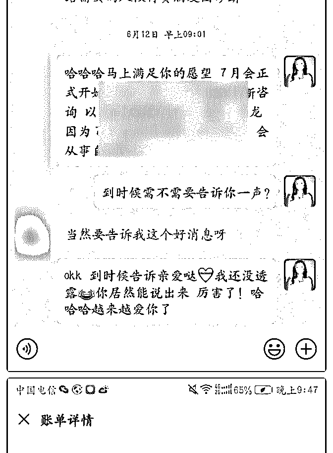
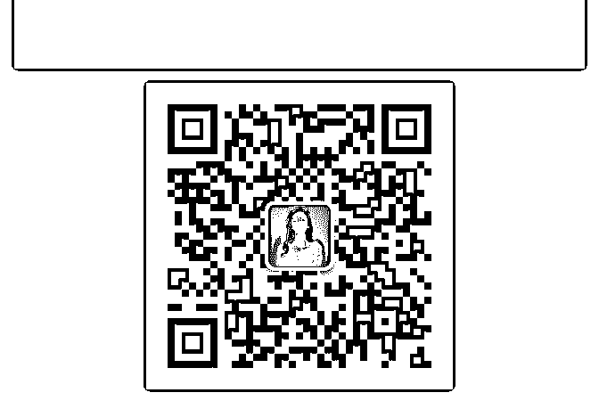
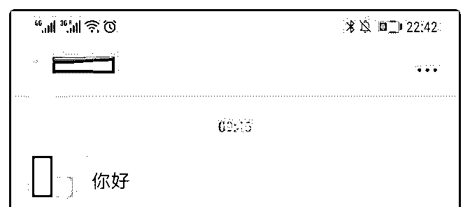
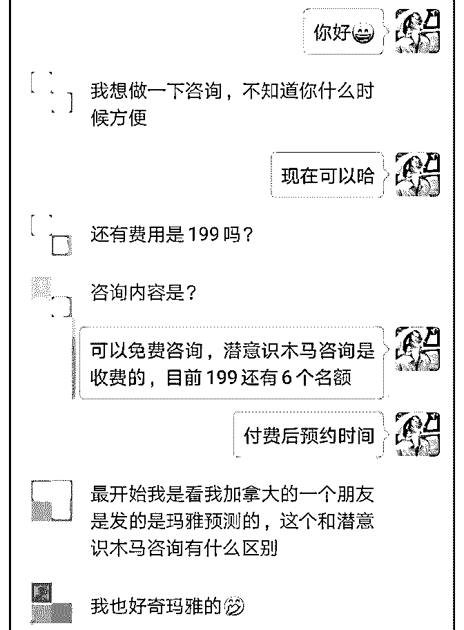
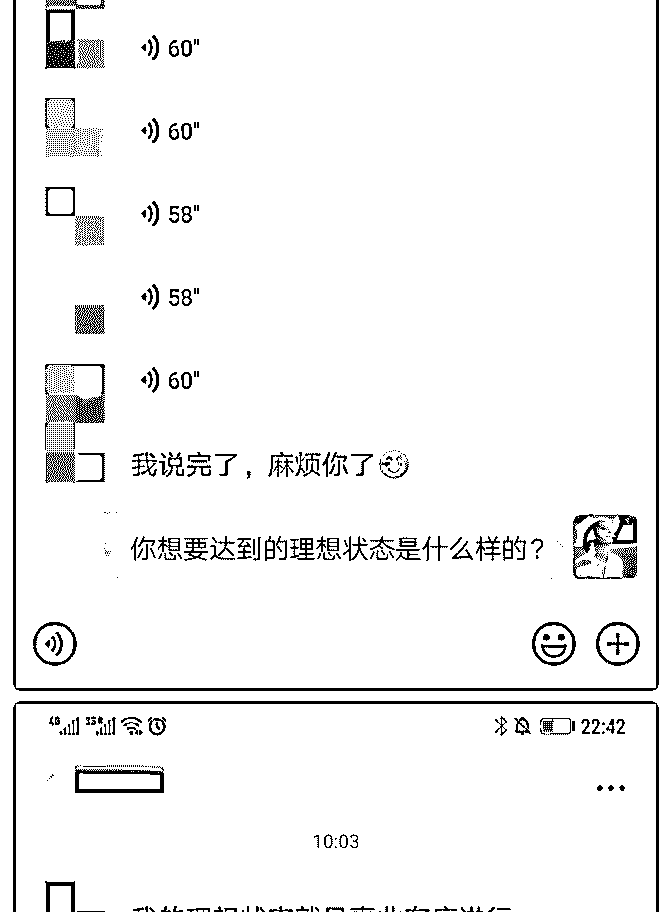
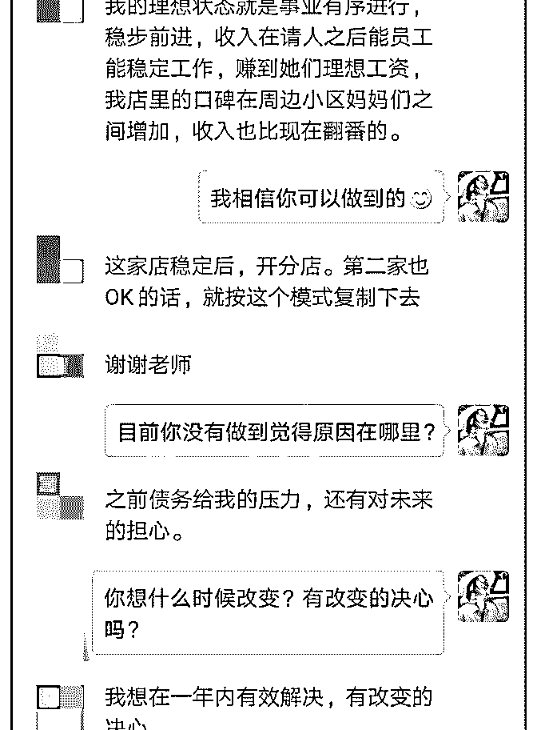
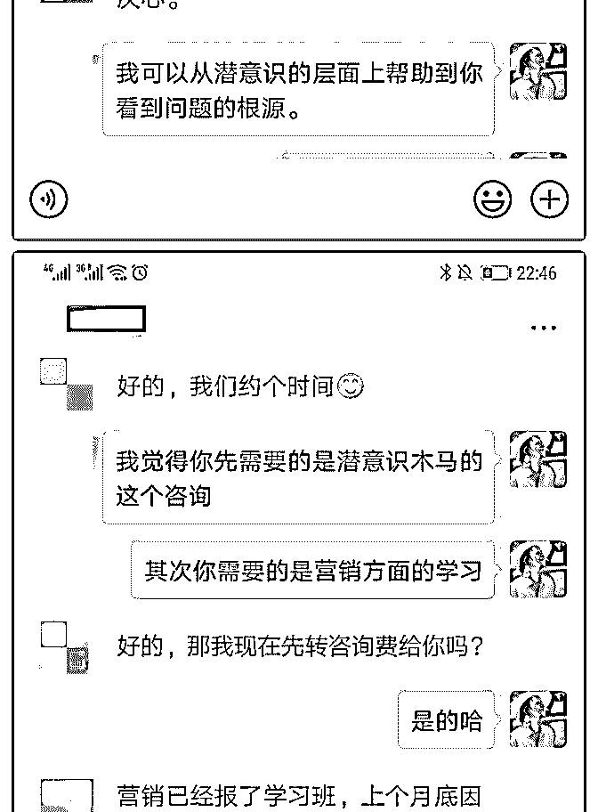
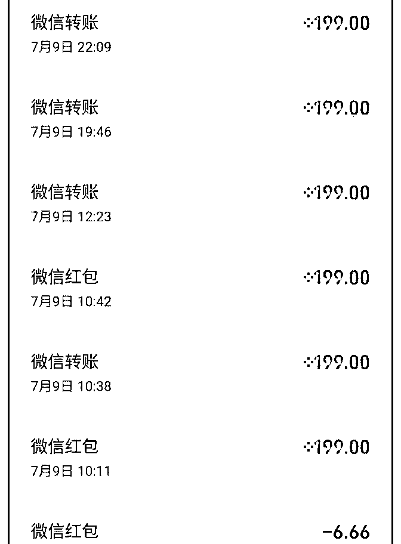
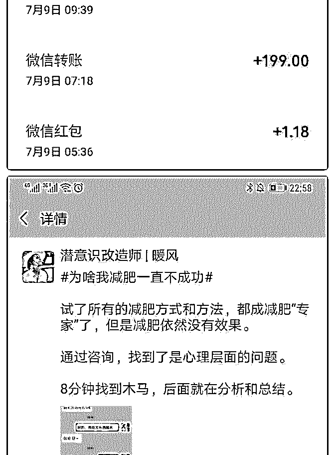

# 正式加入泽宇教育第

李大胆 : 正式加入泽宇教育第一天变现 8800‼ 王建林曾经说过：清华北大不如胆子大，我是李大胆。你可

能好奇什么叫正式加入的第一天呢？我是 6.1 日全款 9800 加入 泽宇教育聚星会的。当时正值我的期末考试复习周 以及需要

处理的实习事宜等琐事超多的 又不想拖到 7 月再加入 借着 6.1 儿童节和朋友约定好 以送自己成长大礼为由加入了泽宇教育 开启了长达一个月的‘窥屏’‘打酱油’想搞事坐不住的日子

终于！在昨天我解除了封印 正式开始卖自己 也在今天迎来了 我今年第一位知识付费客户 变现 8800 元 心情还是蛮激动的 毕 竟信任无价嘛！（我对于自己的价值还是很自信的 毕竟也是 卖自己的老手了哈哈哈）

我要感谢我的导师 Lorna 小姐姐的帮助呀 一直鼓励我 一直期 待我 还有泽宇 言姐 C 宾等泽宇教育所有工作人员给予的帮助 还有优秀的小伙伴们的激励 接下来复盘 8800 怎么来的。。。

先总体总结一下： 一是掌握流量 二是输出价值 分享的能力

三是真诚（做人让人喜欢 做事让人踏实 离开让人想念） 详细的唠叨一下：

今天付费 8800 的小姐姐是我去年在一个付费社群中结识的 当 时我在该社群做了一场分享 被动链接了 200 多人 其中就包括 她 她表示很喜欢我和我的分享（划重点：❶多展示自己 学会 营销自己比一味的营销产品有用！！❷多输出价值 真诚永远 是最最最打动人心的）还给我邮寄过信和蜂蜜 感恩。这算是

小粉丝了吗哈哈哈

中间我们断断续续互动 私聊其实蛮少的（李大胆童鞋，你要 多主动出击深度链接一些人 这里需要反省一下‼ ）就在上个 月她突然找到我 觉得我应该开拓一个新板块 做良心的知识付 费 额 …当时我已经在泽宇教育了 这算不算心有灵犀。。我发 誓我没告诉任何人哈哈哈

接着就是我与她的斗智斗勇啦 她追着我要跟我学习 我‘赶’着 她 让她再等等 等等我放假 并且我也需要和她沟通好 不能让 她不带脑子付费

她想改变的心情特别强烈 字里行间流露出的劲头感受的到 已 经聊得很透了 我们沟通很多 基本上谈心为主 我倾听她的故事 也愿意诉说我的规划 结果中间一顿一拍即合 约好 7 月约。

昨天跟她深度谈了谈 她要做我的徒弟 今天中午直接付费 8800 中间没有任何的犹豫 因为之前做的沟通很好（之前我做过很 多次企业／团队内训，她是纯小白，需要从最基础的地基开 始，开始为她做详细的方案 我是那种只要服务 就必须最好的 人 要永远超出用户的期待）

我的总结： 1、想要一直有输出价值，就要保持输入，多积累。这意味着 活到老学到老 2、雷打不动每天更新朋友圈，输出价值。多渠道布局引流

3、多纬度展示自己 多夸夸自己 学会营销自己比一味的营销

产品有用

4、多与自己微信里的小伙伴 沟通 双向互动。（多种方式搞 起来）

5、多多走出去！链接更多有能量的同频人。彼此赋能

6、成交过程中，真诚第一。想着真正的帮助对面人。百万营

销话术流程不变 话术可以随机应变

我是李大胆 从小爱钱，取之有道。热爱助人，竭尽全力。

20 岁不想过四点一线的校园生活开启副业 一篇软文招募 97 个 经销商，赚到第一桶金 100000+ 21 岁累计服务 87 名一对一付费学员，为 3 家品牌／团队提供朋 友圈变现系统内训 累计帮助近 1000

【我能提供】

1、小白改造 0 基础玩转朋友圈变现

2、轻松写出“可以出单的文案”。让文案成为自动出单机器

3、各大平台增强曝光度 布局被动引流

……

很高兴认识有魄力的你！遇见就是缘。扫码关注 期待与你一 同变美变富变屌！！一起喜提兰博基尼哈哈哈

2019-07-10(13 赞)

关注公众号"懒人找资源"，星球资源一站式服务

# 1 天 7 个咨询，10

快乐魔法师暖风 : 1 天 7 个咨询，100%转化率，收入 1393

元，我是怎么做到的？

此时此刻的心情应该是激动吧，从来没有想过自己会有 100% 的转化率，这一切都是泽宇教育带给我的，感谢我的导师华 丹老师，给与我细心的指导，没有她，我不可能做到这样。 除了感恩，就是希望有更多的人能来到泽宇教育，绽放自 己。

我自己总结对于转化的问题，最重要的两个部分，对于我来 说是朋友圈的打造和百万营销话术的使用。流量是另外的话 题，今天就不提了。

1\. 朋友圈展示。（重点，减轻转化难度，主动下单）

A：增加定位，华丹老师说，你在国外，有很好的定位的优 势，毕竟很多人会觉得国外比较好，虽然只是一个小小的动 作，但是给别人的感觉是不一样的 ，可以展示出自己的特 点。所以今天的朋友圈我都加入了定位。我当然会听话照 做。

B：评论区的位置。华丹老师审核了我的朋友圈，发现我的评 论区是空白的，没有很好的利用起来，少了动作指令这个动 作。我经常看泽宇伙伴的朋友圈有发，但是没觉得有什么， 现在才知道，原来会有暗示的一个作用。每次发完朋友圈， 我都会写上：私信***，就****，我当然会听话照做。

C：成交截图的文案。被华丹老师抓到啦，光是截图但是没有 特意地植入痛点。所以，现在的截图会写上稍微具体一些的

内容。

之前跟华丹老师说过，我做的是身心灵，帮助别人解决问 题，很多时候都是隐私，不方便在朋友圈展现出来，华丹老 师让我把它总结为社会大众的问题，这样就不会觉得很冒 犯。

我当然会听话照做。

发一张截图（最后一张照片），正因为这样做了，别人才知 道我能干什么。当有人回复：“这也行”的时候，我知道起作 用了，还起到让人觉得意外到要来评论区留言。

D：我每天会发 12 条左右的朋友圈，华丹老师让控制在 7-10 条，我删除了转发别人的链接，现在控制在 10 条以内。我当 然会听话照做。

2． 百万营销话术。 这个部分就是自己使不使用的问题了，宇哥已经把步骤清清 楚楚地写出来了。

刚才有朋友私信我怎么介绍自己的产品和服务，我直接把今 天的一个沟通过程的截图发出来，这样应该能看得明白吧。

通过这两个部分的改变，让我的转化率迅速提高，因为昨天 有 5 个人咨询，最后 1 个人成交（还是使用百万营销话术成交 的），转化率只有 20%。但是我很开心我经历了这样的过 程，才能从内心深处去优化自己的朋友圈和话术。

这两部分的优化需要相辅相成才能达到最好的效果。 发下我的自我介绍，欢迎链接围观我的朋友圈。

【姓名】暖风

【坐标】蒙特利尔

【标签】潜意识改造师

【个人经历】 两个孩子的妈妈，曾经的我内向自卑，把所有的情绪向内自 己承受，想要做一个别人眼中的“好人”。害怕别人对我有不 好的评价，活在别人的眼光中，看谁谁都比我厉害优秀。通 过大量在身心灵领域的学习，现在的我自信，大方，帮助别 人去看到每个人内在的热情，自信和力量。

【权威】

完成英国催眠师 Marisa Peer 的线上课程，完成阿卡西记录的培 训课程，帮助 100+的客户更加清晰的认识自己，从潜意识的 层面解决不自信，自卑，焦虑，定位不清楚，迷茫，两性关 系，亲子关系，金钱关系等的卡点。跳脱出无限循环的内耗

旋涡模式，翻转自己的人生。1 次咨询，最快 6 分钟抓出木 马，1 句话打破木马程序。

2019-07-10(16 赞)

评论区：

橙红-高级整理收纳顾* : 学习了。虽然还没看百万营销，但从截图内容好像看到了一些套路。[强]

雨珊 : 我是个内向自卑的人，总是自我否定自己，想咨询了解潜意识怎么改造呢

雨珊 : 怎么联系到你

快乐魔法师暖风 : 忘记留联系方式了 加我微信 S179683009

掌公主 0_0 :

关注公众号"懒人找资源"，星球资源一站式服务

# 7 月第一周已经赚回

7 月第一周已经赚回核心课程学费啦～

我记得是 6 月末加入泽宇教育的，我这个人比较死板，我觉得

光加入还不算，要学习了课程后的进步才是真的进步

但是很可笑的是我现在也才学习完了核心课的第一课严格的

来说的话～

可是，让我有如此进步的却是课程的序言和每天群里大家的

分享

以前我是不喜欢常常刷朋友圈的，因为是代购，觉得只要证

明我在日本，你们想买什么就找我好了，一开始这样有新鲜

感的客人还可以，但是逐渐的大家几乎都不找我买东西了，

我的行为就是泽宇老师序言里说的“酒香不怕巷子深”类型 的，但缺点是现在好酒很多，不表现就没人认识你，这句话

改变了我的思维，我开始慢慢的发朋友圈，从不怎么发到 2-3 条到 5-6 条，每条都认真筛选，认真写反馈和文案～逐渐的有 一些很久不买东西或者加了我不说话的人开始买东西了 这个时候每天看导师计划的群里大家的聊天，我不记得谁说 的了，就一句：一定要认真的对待你的客人。虽然看似一句 很正常不过的话，但是却提醒了我，因为这句话付诸了行 动，收到了回报，一个从来没在我这边买过东西的客人以后 就认定了我了，这两天消费了近 2000，感谢群里老师的无意 提醒让我收获了一份坚固的信赖～ 其实，6 月末进入泽宇的时候就听了序言，我的这些成果在接 触了新思维决定改变的时候就产生了现在的结果～ 总结：接受新思维就要做出行动的决定，群里的精华也不可 以错过～万一哪一位看似正常的话就打开了你呢？ 新目标：一个月赚回导师计划的课程

2019-07-08(11 赞)

评论区：

赵媛媛 : 赞同 有时别人不经意的一句话，确可以让我们灵光乍现，就开窍了。不过老师的灵敏“嗅觉”更重要，学习 了！！

曾乐 : 核心课

关注公众号"懒人找资源"，星球资源一站式服务