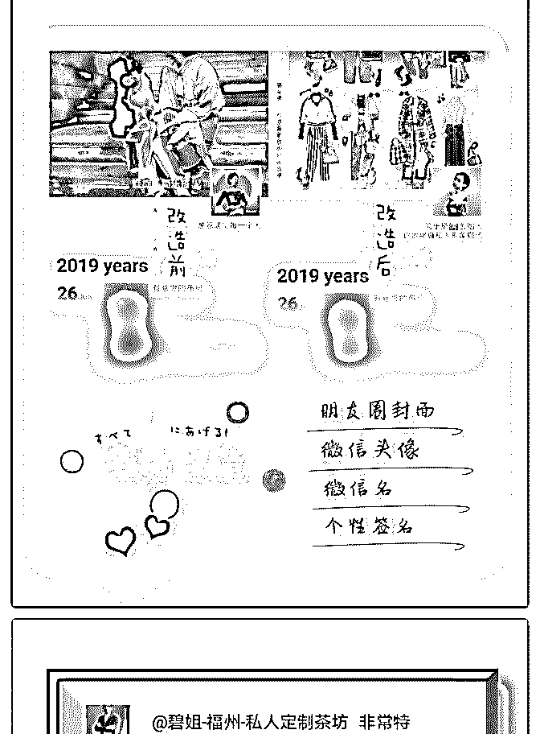
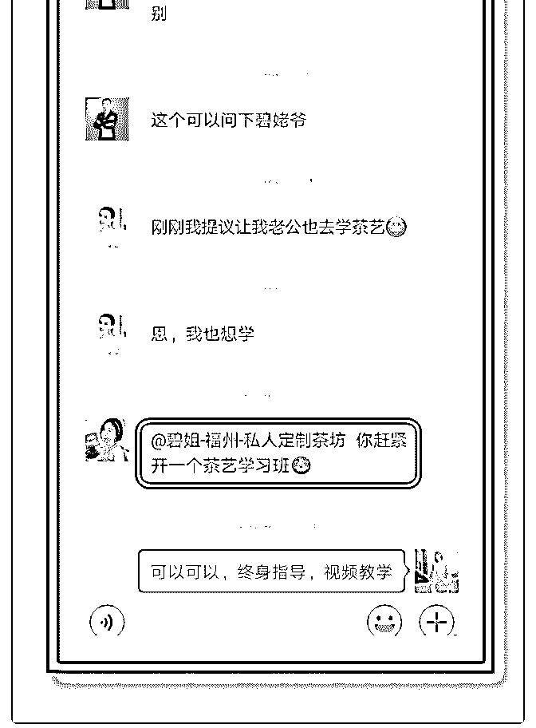
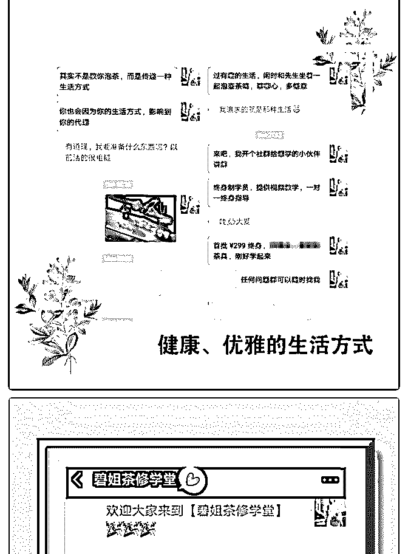
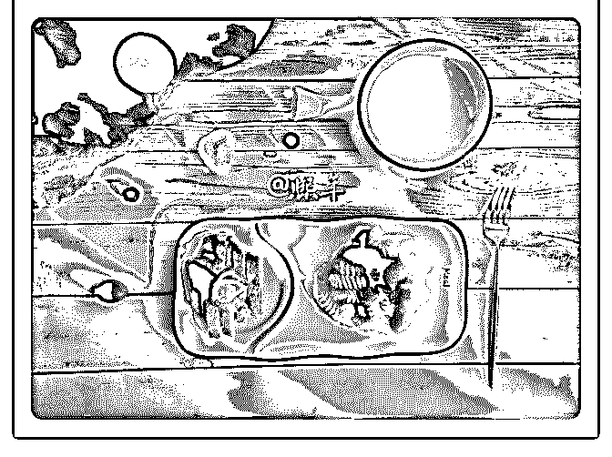
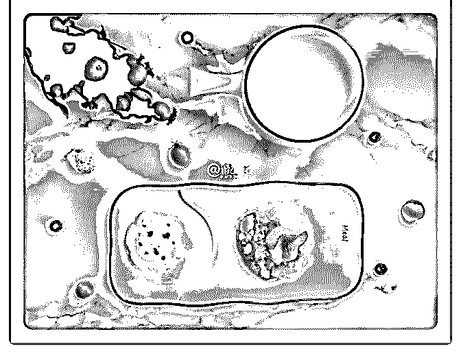
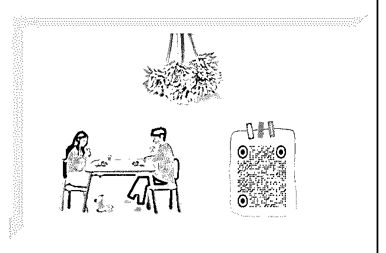

# 还未开启招募，就收

碧姐 : 还未开启招募，就收了 3 位 299 学员，从 0 到 1 我都做了 什么？

先讲讲我的心路历程。在我想拓展线上最迷茫的时候加入泽 宇教育，因为喜爱茶而从事的茶行业，所以我很清晰自己的 定位：与“茶”相关的。然而，这个定位太大太广，很难施展 开来去吸引真正的精准客户。看着群里小伙伴们在不断变现 时，我也焦虑过。

好在泽宇教育与其它线上课程不同，而且最接地气的是每周 都有答疑。我重新听了一遍课程，把定位缩小到“健康养 生”方面，然后报名参加了笔盖的答疑。

笔盖针对朋友圈建设指出，不要只是刷产品，很容易让人审 美疲劳，在持续输出与茶相关的干货的时间，多晒晒自己， 晒晒自己的生活，让圈友们觉得这是个有烟火气息、有趣、 有料的朋友圈，吸引圈友关注。

建设好朋友圈，下一阶段就是要引流。于是，我参加了第二 次答疑。引流可以是多方面的，利用现有朋友圈资源的基础 上，在社群里积极参与讨论、踊跃发言，获取社群小伙伴们 对你的熟识度。然后大胆地展示你的天赋，利用天赋被动引 流。再者就是建设新媒体，多平台写作输出，关注你的都是 精准客户。

复盘：从 0 到 1, 我都做了什么？

1､ 找准定位 定位不能太大，从最早的“健康养生”到“精致茶生活”到“茶

修”。

2､ 打造好朋友圈

朋友圈就是我们的名片，不断深耕、持续输出定位相关的内

容及干货，通过“21 天蜕变”的坚持，传递健康、精致的生活 方式，吸引社群里同频的优秀小伙伴们，

3､ 引流 社群里积极活跃、传递正能量，新媒体建设（知乎、头条、 百家号），并建设自己的社群。

4､ 建立社群 “21 天蜕变”，引领小伙伴们全方面突破早起晨读（自律）、 读书笔记、感悟（写作能力）、电台主播（口才）、摄影

（审美）。

总结： 如果你刚加入泽宇教育，还没找到自己的定位，那么你需要 开始洞察和挖掘自己的天赋，找到自己的兴趣爱好。

如果你已经找好定位以及又洞察到自己的天赋，请在大胆地 展示出来，利用天赋被动吸粉。发现先加入群的小伙伴们在 持续不断变现时，一定要保持好自己的节奏，不要焦虑。

敲重点：有想法，一定要去行动。先完成，再完美。从 0 到 1 的突破，并没有你想像中的难。

自我介绍

【昵称】碧姐／碧老师

【坐标】福建.福州

【标签】8 年资深评茶师、茶修践行者、喜马拉雅电台主播

【个人经历】

中国人民大学商学院茶文化研修班深造。【碧姥爷】茶品牌

创始人，拥有自己的私人定制茶坊。举办 10 余场百人申时茶 会，为 1000+ 提供茶小白蜕变，学会健康养生、鉴别茶叶品

质、泡好一壶茶、过精致生活做优雅女子。

【我能提供】 正能量、健康、有趣的生活方式

如果大家对茶生活感兴趣，欢迎微信链接（9022974）, 可获 得价值 ¥199《茶叶基础课程》及《茶修学堂》内部报名优惠 价。备注“泽宇教育”更快通过哦。

2019-07-05(6 赞)

关注公众号"懒人找资源"，星球资源一站式服务

# #庆祝成果 早餐打

张熙年 : #庆祝成果 早餐打卡 24 天，我变现了 1194 元

在 6 月的时候，我把自己的定位确定为早餐美学，并且每天会 在朋友圈里发一条早餐的图片。

自从确定自己的定位，我每天都用心做好每一天的早餐，不 管是食材的搭配，还是它们的摆盘，都用心去做好，慢慢开 始有很多朋友为它点赞，也不断有人过来跟我说，我的早餐 做得很好看，她们很喜欢，并且有人开始问我能不能教学早 餐的做法。

之前参加笔盖的答疑，曾问过是否适合马上开训练营，笔盖 跟我说，先从一对一的指导开始，积累了成功案例之后再考 虑训练的事宜。

所以，当朋友问我学习早餐的相关事宜时，我没有往训练营 的方向去想，只是一对一服务她们，解答她们的困惑，积累 成功的案例。

而这些朋友，她们都表示很喜欢这种生活中的小小仪式感， 觉得跟我在一起很有能量，有意向想报我的训练营，所以， 我也慢慢筹划训练营的招募。

其实在正式发出招募海报的时候，有个姑娘已经几次问我什 么时候可以正式跟我学习，但我当时准备并不充足，所以跟 她说，再缓几天。

后来海报完成之后，我把海报发给她，她也在第一时间付费

给我，成为我在早餐美学的第一个学员。

第二天晚上把招募海报发到朋友圈，当时就有 3 个朋友过来了 解，并且很快就付费成功。

从确定定位到我开始训练营第一期的招募，一共是 24 天，目 前变现的金额是 1194 元，其实这个钱相对大神来讲，真的太 微不足道了。

但对我来说，它的意义真的很大。这份小小的收入证明我所 选的领域真的能让我赚到钱，只要我不断深耕，不断精进自 己的技能，就能在早餐美学这条路上得到更多的变现。

而复盘这次从选定位到变现的过程，我发现有两个点比较重 要：

1、找到自己热爱的定位 今晚临睡前，有个朋友找我聊天，说她很茫然，找不到自己 的定位，我建议她报泽宇教育。

自从 2 月底进入泽宇教育之后，才知道自己之前走了那么多的 冤枉路。因为我以前从来没有想过找准定位，以至于耗费很 多的时间去做无用功。

比如说，那时候我写稿，如果能够找位定位，就知道自己适 合深耕情感小故事，因为自己很早以前就曾在杂志上发表过 这类的文章。可是因为定位没找准，我一会写观点文，一会 写育儿稿，每样都想试一下，结果这两样都没做好。

只有选好自己的定位，把精力投注给它，不断去精进，才能 让自己的每一份行动都能产出价值，都能让自己变得更好。

2、持续在朋友圈输出 如果想通过朋友圈变现，那么输出自己的价值是非常必需的 事情。没有输出就没办法跟同频的人有更深度的链接，就谈 不上变现。

我把每天的早餐图都发出来，让朋友通过我的朋友圈，而加 深对我早餐美学的印象，这样以后她们想起我的时候，就会 自然地把我跟早餐美学联系在一起。

也恰恰是这些朋友圈的输出，让我在最开始的时候得到这笔 变现，它也会变成一份鼓励，鼓励我更加努力去做好我的早 餐美学，让它在将来能赚到更多的钱。

我所得到的一切，其实都要深深感谢泽宇，因为我一直是个 喜欢给自己设置很多障碍的人，觉得自己什么都做不好。

加入泽宇之后，开始不再自己设限，面对自己对朋友圈美学 的喜欢，不再觉得自己没有美学细胞，而是选择它，然后去 找有结果的人学习，让自己因为朋友圈美学而收获了几十个 学员。

如今选择早餐美学，也不会担心自己的早餐做得不好看，就 算暂时做不好，那继续用心去学习，只要聚焦在自己热爱的 领域里，并持续精进，总有一天会得到爆发式的成长。 感恩遇见泽宇教育。

我是熙年，专注早餐美学的宝妈。如果优秀的你想建立一个 美好的小习惯，恰好又喜欢早餐美学，欢迎你跟我链接，我 的微信号是 xuexi0913，期待与你相识。

2019-07-05(29 赞)

评论区：

星愿^O^ : 厉害，向你学习

米拉 Mila :

关注公众号"懒人找资源"，星球资源一站式服务