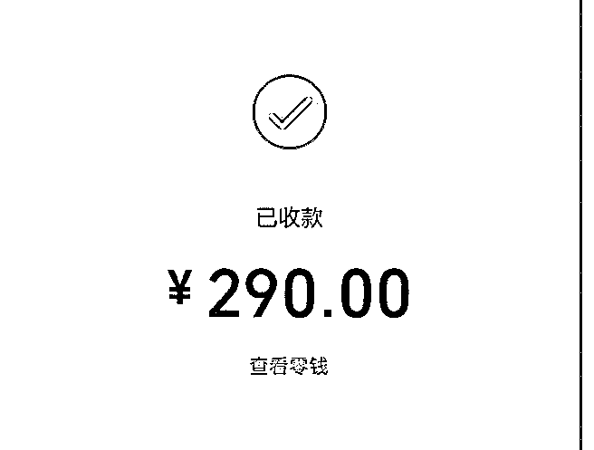
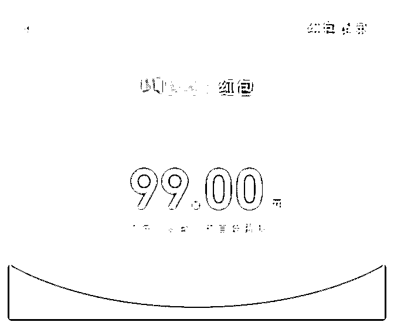
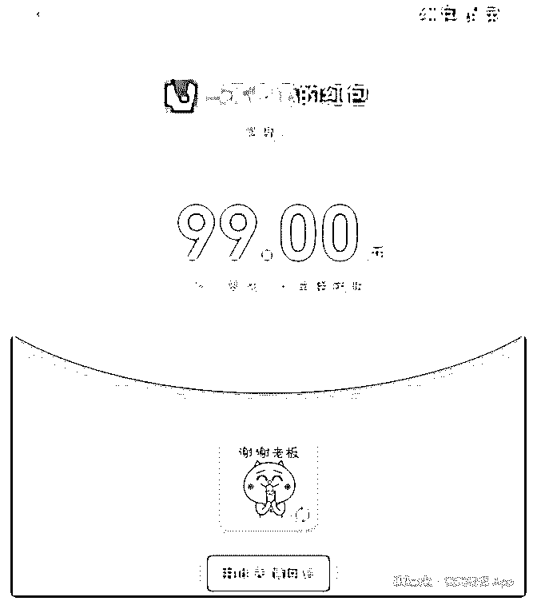
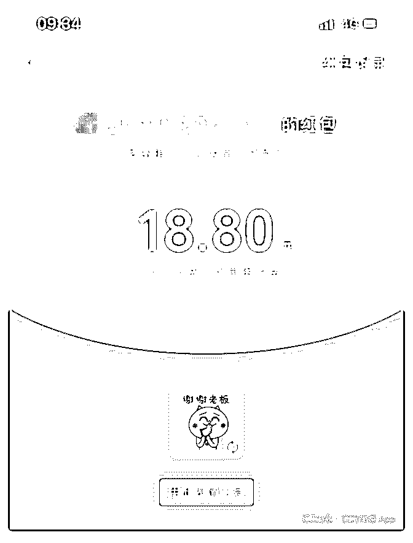
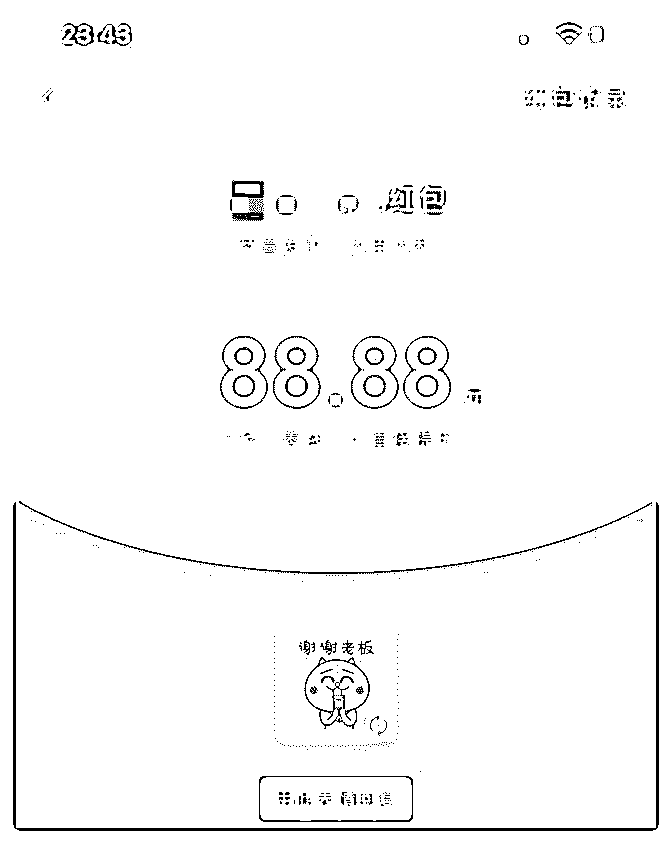

# 完成核心课程赚回学

晖 : 完成核心课程 赚回学费已经好久了，目前的状态是 1 对 1 咨询，收费 299 客单 价，最近换了新单位，有一阵子没搞副业了，想想做人还是 要有点仪式感，决定写这篇复盘，拿毕业证。 一路上发力是在五月份，除了学习核心课程和导师计划，就 是听华丹的分享，包括如何打造朋友圈，如何用知乎引流。 目前知乎大概每天 3-4 个加好友，有大概 5000 阅读量，打算再 开一篇问答，回答一个黑马问题，做到每天 10 个被动引流。 之前是学习了艾伦知乎写作的分享，也买了写作课，但只是 拙劣模仿的程度，并没有内化。 要有执行力！在核心课程阶段，听话照做是最有效的方法。 在导师计划，我也是经过多次定位调整，先是做地产操盘， 再到设计管理，再尝试做电话 1 对 1 咨询，慢慢走向收费。 这个过程中，发现有很多客户还是会问“很基础”的问题。这 就是咨询师的意义所在，我原本以为很容易的问题，是因为 我经历过，对很多学员来说还是很有意义。帮助过三到四个 学员是找职业定位的，解答了他们在求职过程中的疑惑，做 出更有选择。 这让我更有信心做这个定位，我原本不是一个很会理解他人 需求的人。 下一阶段两个目标，第一，把课程做出来，帮助更多的人； 第二，活成最好的自己，把现在的状态展示出来。

2019-07-01(12 赞)

关注公众号"懒人找资源"，星球资源一站式服务