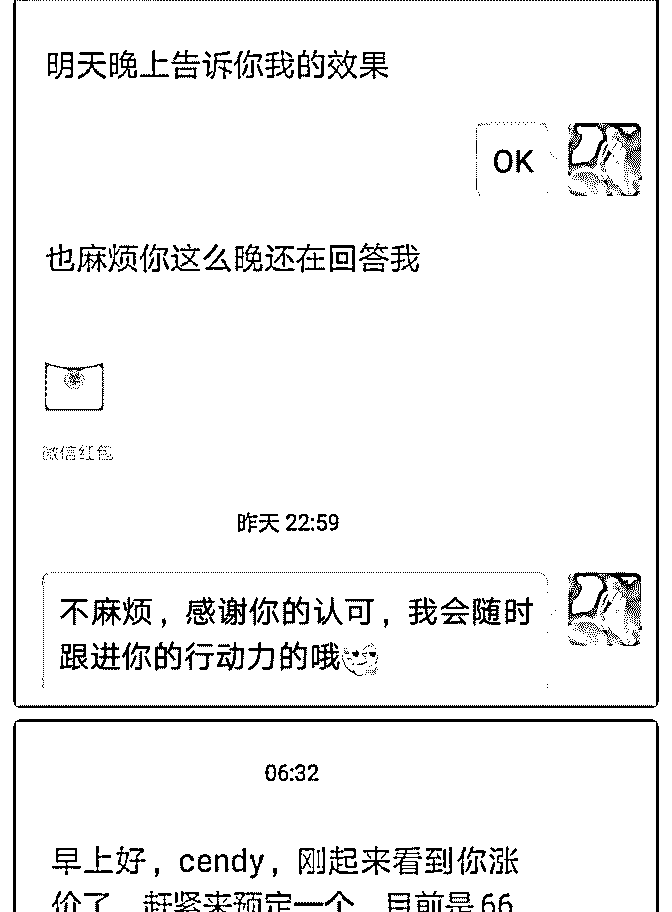
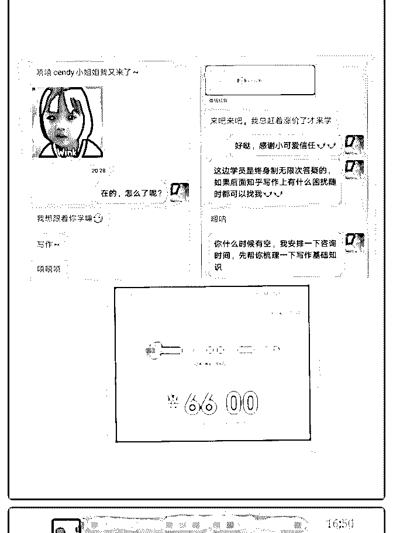
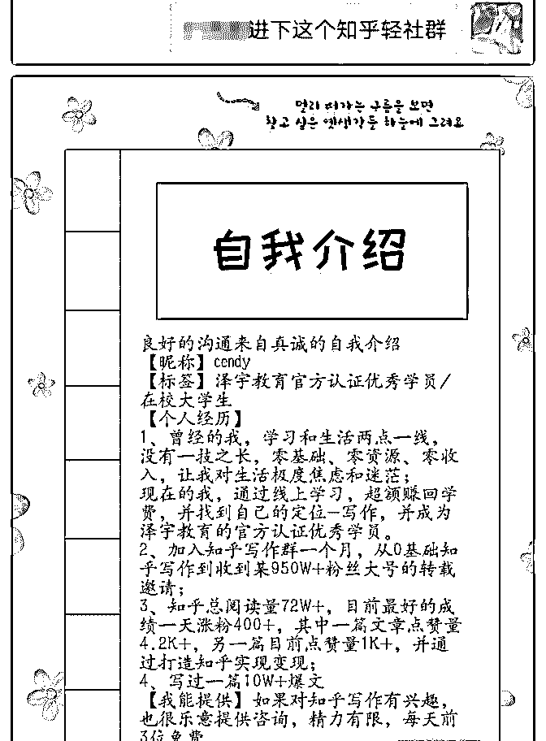

# 『在校大学生如何一

cendy : 『在校大学生如何一个月通过写作咨询赚到 976.3 元， 说说我这一路的成长吧』

我是从 6 月初开始的写作一对一咨询，在开始复盘之前我想先 感谢两个人，就是我的理财导师 Judy 姐，还有荻野老师。

首先在这里要感谢 Judy 姐，我的理财导师，记得 5 月 10 日的时 候，我和 Judy 姐按照原来定好的时间，进行一对一定投咨 询，到最后的时候 Judy 姐教我开源的方法，问我的定位是什 么。我说写作，然后 Judy 姐问我有开写作训练营之类的吗？

其实我之前也有想过开写作训练营，一方面是想运营训练营 需要耗费很多精力，另一方面是对自己不够自信，虽然有写 过一篇 10W+爆文，以及多篇知乎高赞回答(最高的一篇目前 4.2K+高赞)，但即使有这些成绩，我也很少告诉别人，可能 是因为朋友圈里知乎大佬太多了吧，光知乎粉丝上万甚至高 达十几万的就有二十几个，我总是给自己暗示:和大佬们比起 来我这点成绩又算得了什么呢？

于是结果可想而知，因为我给自己设限，不敢晒自己取得的 成果，后来也就不了了之，但其实我自己已经有想好朋友圈 招募文案，只是一直不敢发出来。可是看到朋友圈里好多小 伙伴都利用自己的定位开启自己的副业之路了，内心还是有 点着急。

后来的转变是因为和 Judy 姐的一次偶然聊天，有一句话我到 现在印象深刻:酒香也怕巷子深，你不展示自己，别人怎么会 知道呢？这句话一下子击中了我的内心，我原来不就是这样 的吗？不敢展示自己。于是我鼓起勇气把我的写作成果发给

Judy 姐，Judy 姐说我被埋没太久了，之前都没看我朋友圈展示 自己，于是让我发到朋友圈。

也正是在 Judy 姐的鼓励下，我才有勇气在朋友圈展示自己， 令我意想不到的是，之前从来没有交流过的微信好友居然也 给我点赞留言了，这又令我大受鼓舞。

于是我又把我之前写的朋友圈写作一对一咨询招募文案发到 朋友圈，并沉诺终身无限次答疑，以及赠送价值 198 元的知乎 轻社群，按照阶梯咨询收费价格

1~10 名 9.9 元

11~20 名 66 元

20~30 名 99 元

30 名后 199 元

意想不到的是 10 个 9.9 元的早鸟价名额一下子被预定完了，目 前 10 个 66 元的咨询名额也被全部预定完。学员包含有奥运冠 军的英语金牌教练、玩信用卡日入 4 位数的信用卡规划师、月 入过万的理财咨询师等。

甚至一对一咨询过程中还有小伙伴发红包表示感谢，真的很 感谢小伙伴们的信任。

加上一些小伙伴们自发的红包感谢以及小伙伴的写作咨询报 名费、复盘投稿红包等等总共 976.3 元，虽然跟其它小伙伴们 比起来有点少，但我相信我还会越做越好。

另外一位想要感谢的是荻野老师，荻野老师真的是一位很负 责任的导师，

荻野老师平时很忙，但碰到学员的问题还是会很耐心地解

答，无论多晚。记得有一天晚上已经凌晨快 2 点了，荻野老师 还是很耐心地帮我解答个人品牌的问题，当时印象很深刻， 已经是凌晨了，本来我想的是要不跟荻野老师说第二天再咨 询，一方面怕影响老师休息，但是我最终还是没有说，坚持 将问题问完。

我主要问了以下几个问题:

①关于如何增加精准粉丝量?

②招收了学员，也跟学员进行了一对一咨询，但是有些学员 缺乏行动力怎么办?

荻野老师给的建议是这样的，首先要做的就是社群输出引 流，让别人看到你的专业性，这样别人才会愿意相信你。其 次就是要服务好学员，每天至少花一个小时辅导，然后要求 她们复盘，先服务好学员做好口碑很重要。

说实话，从以前到现在，我买了这么多线上课程，但还是第 一次见到有哪一位老师把学员的成长看的比自己还重要，学 员遇到困扰的，无论多晚也坚持答疑完，自己才安心地去休 息。

同时，这也是我一直想要跟随泽宇教育的所在，有助教一对 一手把手指导，这样我们作为学员也就少走了很多弯路，不 然我们连自己错在哪都不知道。

有一句话是这么说的，读万卷书，不如行万里路，行万里 路，不如名师指路，荻野老师就是我个人品牌路上很重要的 一位指路者，如果你们也有什么困扰，可以多向荻野老师请 教，相信你们也会少走很多弯路。

2019-07-01(9 赞)

关注公众号"懒人找资源"，星球资源一站式服务