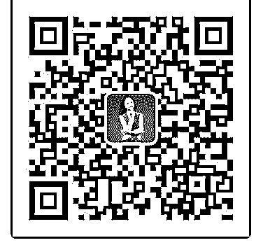

# 一个月四倍赚回学费

Helen : 一个月四倍赚回学费 我之前抱着试试看的心态，加入了泽宇核心课程。因为我一

直想成为一名咨询师，而它又被称作是培养咨询师的黄埔军

校。当我听外核心课程的第四课之后，我开始按照课程里说

的去发圈，招募咨询者。由于时间的关系，我每周只接三个

个案咨询，但是当我做完三个，按照助教荻野教我的方法去

发圈之后，到第二个星期，就有咨客直接转账，然后预约辅

导时间了。这种感觉非常的好，咨客给我的红包也从刚开始

的 66 元，88 元，99 元，一下子主动给我涨到了 188 元。虽然在 加入泽宇之前也有人找我做咨询（收费比较高），但是从来

没有像现在这样排着队找我咨询的。

在这里有几点感悟：

1、作为一名优势教练，发现泽宇教育的个人品牌咨询师课程 和我的优势辅导正好相得益彰。自从成为一名优势教练以 后，我就想着要在个人核心竞争力，个人品牌上面做些研 究。我帮助人家发现了优势，怎么让他可以聚焦优势，然后 在某些方面有所造诣呢？泽宇教育的个人品牌课程给到了我 很好的实践路径。我时常在想，自己作为一名优势教练，一 定要先在个人优势发挥发展上有所结果，才能让别人更信赖 我。在加入泽宇教育之前我也一直在探索，加入泽宇教育之 后我开始欣喜，确信他的这套模式可以帮助到我实现优势发 展之路。在我实践之后，我更可以分享给我的咨客，帮助他 们找到优势发展，变现之路。

2、泽宇教给我们的打造个人品牌的商业模式，让自身价值变 现变得轻松简单。以前吧，老是想着要在线下开公开课，做

演讲，这样来吸粉，然后去开拓我的优势教练之路或者说我 的咨询师梦想。但是有时候我并不擅长去找关系、找平台， 而且根据我个人的特质，我更喜欢一对一的深入交流。当我 接触泽宇教育之后发现，其实利用互联网平台，通过自身价 值的不断输出，我就可以吸粉，还可以变现。最重要的是不 受空间的限制，且互联网的蔓延速度要比线下快多了。这个 商业模式顺应了时代的发展需要。

3、社群氛围、助教荻野都很给力，让我的学习上瘾 社群的小伙伴们都很上进，各自都在各自的领域努力学习， 持续价值输出。这个平台让我结识了很多优秀的伙伴，看着 他们一步步的成长，无疑对自己是一种激励。他们是我努力 地方向，以前是有劲不知道往哪里使，现在的目标很清晰， 就是跟那些优秀学员取经，争取更早地成为年入 6 位数的咨询 师。另外，就是每当你在实操方便遇到困难，助教荻野都会 一对一地帮你解答，直到你可以解决这些问题为止。这些让 我觉得学习体验很棒，以后我也希望有自己的社群。只要开 始，就会有收获。刚开始助教荻野让我做免费的咨询的时 候，我真有些不屑。感觉我可是响当当的盖洛普优势教练、 生涯规划师、企业高管，做这么 low 的事情吗？后来我才慢慢 发现里面的奥妙。其实，一方面这种模式让我积累了经验， 另一方面助我吸引了粉丝，最重要的是我在实践的过程中， 可以不断总结什么样的咨询方法更有效，同时也给了我一些 录课的一些启发。

下一步继续做好咨询，价值输出。争取尽早可以建立自己的 优势成长部落。

2019-07-01(7 赞)

关注公众号"懒人找资源"，星球资源一站式服务