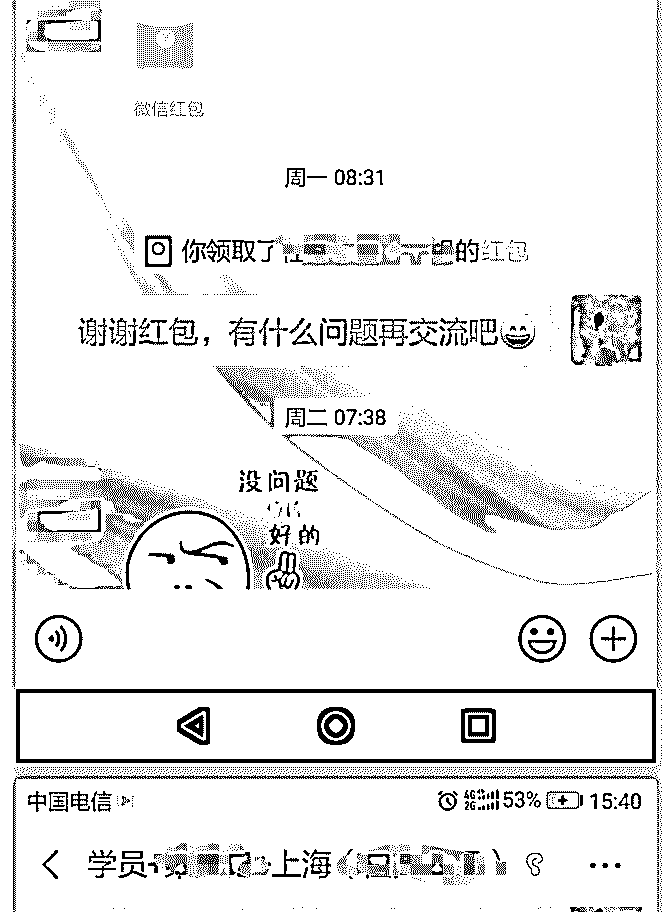
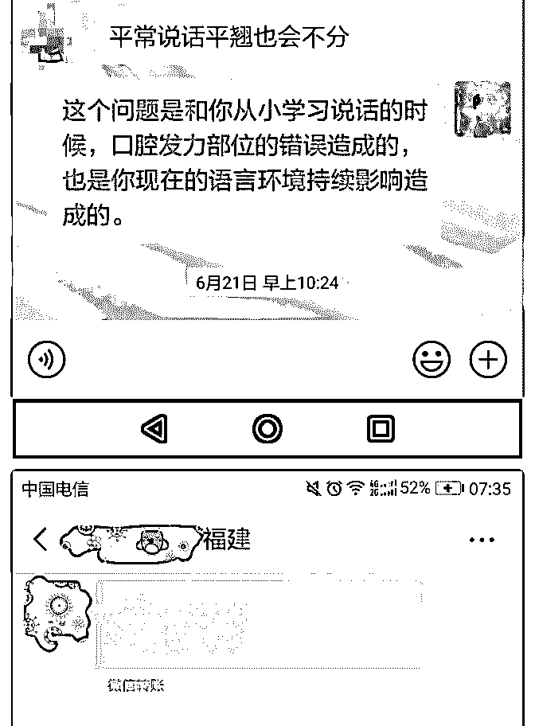
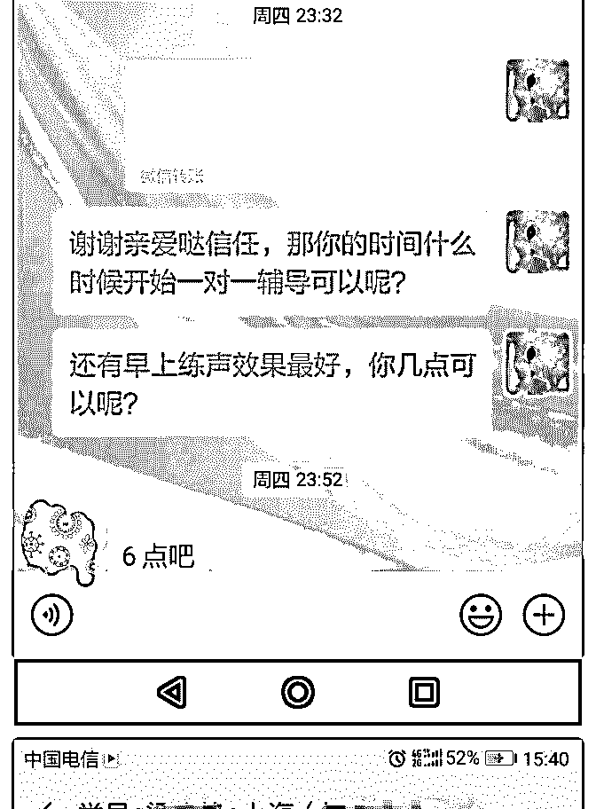
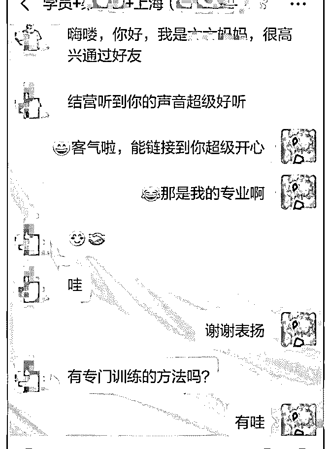
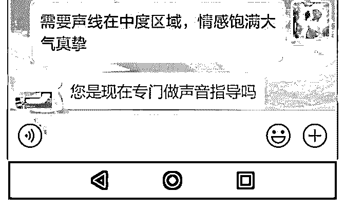
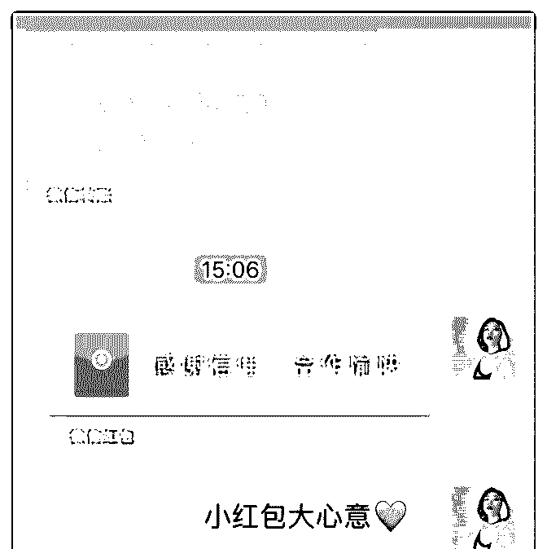
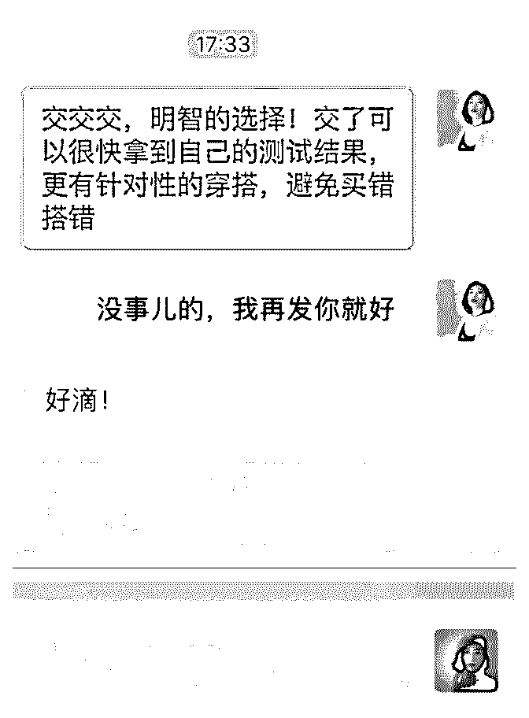
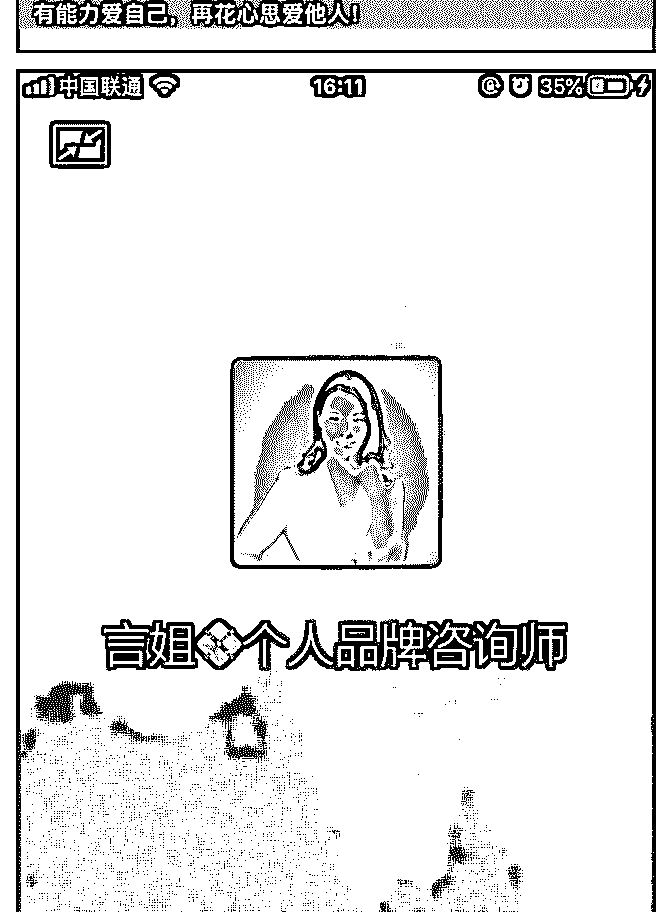
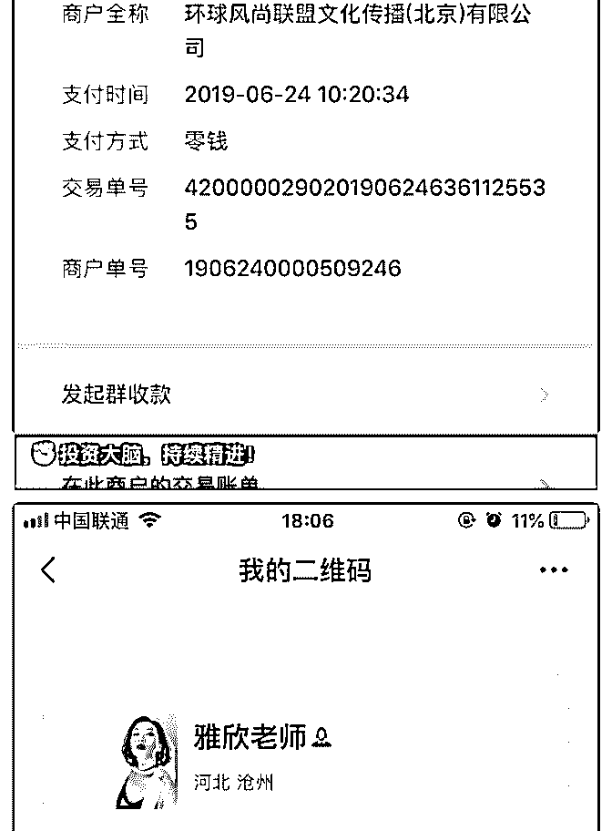

# 六月，我的变现月，

心中有清荷 hh371* : 六月，我的变现月，感谢言助教。 2019 年的六月忙到飞起，生活从大起到大落。女儿高考终于 结束了，从稳操胜券到跌落谷底到勇敢面对，整个过程像过 山车，跌宕起伏。还好，她很勇敢，她说:不甘心就此起点变 低，她要再冲一次！ 不管怎样选择，不丧失信心，不得过且过，明确目标，齐步 走！就是好样的！ 这个月我的生活全程围着她转，核心课没有反复学习，很迷 茫，也找不到突破点。和言助教语音通话两次，时长 2 小时， 她告诉我，要自信，要打造朋友圈，要敢于发声要持续输 出。和她聊完，我的心中豁然开朗。在自己的遇见阿慧美学 研习社，分享服装搭配和形象管理知识 15 次，目前社群人数 150 人，即便高考这段日子，分享没有如期举行，伙伴们依然 在等我，有人等，很开心。 持续录制喜马拉雅遇见阿慧晚安电台、声入人心练声房转发 至朋友圈，在其他社群开营仪式上敢于用语音自我介绍。终 于，有一天，一个关注我朋友圈很久的伙伴私聊我:你的声音 好好听，我是南方人，普通话不好，可以教教我吗？我想让 我的声音也和你一样，悦耳动听。第一个学员就这样不期而 至。199 元，虽然不多，但是是对我声音的肯定。我发了朋友 圈，紧接着第二个、第三个学员也来了，他们的问题大同小 异:普通话不标准，说话有乡音，平翘舌不分，前后鼻韵不分 和持久说话嗓子会痛会痒。更有让我帮忙指点一首毛泽东诗 词:沁园春长沙，直接发 52 元红包的伙伴。9 天前，收到本月最 后一个学员 399 元。而我和合伙人筹建的童声时光机亲子共度 训练营，28 天 499 元，课程尚未上架，已有两个学员缴费报 名，更有预定者 4 人，我们的训练营除了有亲子共读绘本以 外，亮点就是培养有声小主播，对接有声书资源，更有 1 小时 1200 元的薪资。我想，是我们的核心价值吸引了他们吧。

这个六月跌宕起伏，这个六月赚回了核心课的学费，感谢言 助教不厌其烦指点迷津，感谢遇到泽宇教育。 声音是人的第二张名片，好的声音让人如沐春风，好的声音 瞬间提升你的形象，好的声音后天也可以练成。 我是心中有清荷，国内形象管理师、国际注册服装搭配师、 声音教练。我是能帮助你内外兼修，整体提升的小姐姐，如 果你有变美，声音方面的问题，可以找我来聊一聊，我这里 有整体变美的方案，还有美化声音说话不累的法宝。 我来了，你在哪？

2019-06-30(10 赞)

雅欣老师 :

关注公众号"懒人找资源"，星球资源一站式服务

# 5 个月从 0 打造个人

5 个月从 0 打造个人品牌，成功成交 10 人，30 倍赚回核心课学 费

我是雅欣老师，本职工作是体制内的高中物理老师，也曾经 花费一万二在古典老师的新精英学习过生涯规划，当初就纠 结过到底选择做与自身拥有相关资源的学业生涯规划师，还 是做跟兴趣爱好相关的形象管理师，还为此咨询过当时授课 的老师，老师的建议是前者，可能我自己对此兴趣不是很高 吧，课程结束后也没有开始着手做，更是一分钱都没有因此 获利。（汗颜）

还记得是 1 月底加入小星的马甲线训练营，通过她的朋友圈知 道了泽宇教育，觉得不可思议但是内心蠢蠢欲动，觉得泽宇 教育就是自己一直在找的品牌课程，抱着试试看的想法加入 核心课学习，想着反正也就几百块钱的事儿，即使不成比起 之前浪费的一万二也没什么。

其实我到目前为止只听了序言跟第一节课（大家不要学我 哈，我也要尽快补听完毕），就确定了我的定位是做自己坚 持了 6 年的兴趣爱好——形象管理师，也是在这个过程中结识 了同为泽宇学员的旋旋，当时的她是在做免费分享群，在她 做付费形象蜕变社群品牌-简乐搭的最初，我主动找她提出做 她的助理，当时还跟她说免费都可以，跟着她一步步把简乐 搭由几个人做到几十个人一直到现在的 240 多人，简乐搭团队 也有最初的我们俩到现在专职形象管理师-静静、郁欣、风灵 还有负责公号海报等的姝童加入后的 6 人团队，我自己也在兼 职做并且 0 基础的情况下成交了 10 名客户，朋友圈中都有记

录，不一一呈现。

感谢言姐带病哑着嗓子为我做语音答疑，查杀我的内心木 马，打通我的思维模式，感恩！

已经报名更为系统的形象管理师课程，持续精进，只为学员 提供更好更专业的服务！

以下为我的自我介绍

【昵称】雅欣老师

【坐标】河北沧州

【标签】高中物理老师

形象管理咨询师

简乐搭联合创始人

【个人经历】

1.曾经的我，怀两个儿子产前体重都高达 182 斤，现在二宝不 满三周岁，体重降至 125 斤；

2.曾经的我，是时尚黑洞，逛街被人认作老大妈；

3.先天的我，身材很多 bug-脚宽、踝粗、腿短、腰长、腰粗、 肩宽、脖子短粗；

4.现在的我，在痛定思痛之后，关注时尚穿搭六年之久，如今 不仅自己蜕变为时尚达人，成长为形象管理咨询师，更跟国 际品牌设计师朋友联合创立简乐搭线上形象蜕变营，开发 100 家工厂店铺资源，帮助 200+位付费学员在短短 1 个月时间用 100+元打造价值 100W 形象，助她们精致时尚不吃土，还被学 员们评为最犀利穿搭点评师！

【我能提供】 帮助伙伴短时间完成蜕变，

用 100 元建立价值 100W 形象。

如果大家也想提升个人形象、完成蜕变，我很乐意花时间给 大家些建议，但时间有限，每天仅限前 3 名咨询免费，感兴趣 的朋友可以加我微信：yaxinlaoshi

2019-06-30(10 赞)

评论区：

king : 是沧州人吗？很高兴认识你，加油[强]

雅欣老师 : 嗯嗯，沧州人，老乡吗？

king : 是啊，已经在天津定居了，每年只有过节回去几次。

关注公众号"懒人找资源"，星球资源一站式服务