# 不发声=没发生，我

不发声=没发生，我是如何在淡季一天卖出 1000+

从前只说酒香不怕巷子深，但在这个吃太饱的快节奏里，你

存不存在我不会主动来关注你！只有自己创造价值，展示价

值，输出价值才会有事情发生。

（一）当下的状态都是自己造成的，该对自己的现状负全责

进入泽宇三个多月，断断续续听课，总给自己找理由松懈怠

慢。也不参加答疑，不去思考总结，就默默的观望群里的大

神们讲自己的丰功伟绩。总觉得生活没有那么迫切需要我拼

命挣钱，慵懒松懈，简直就是我那一阶段的代名词。何况身

上并没有一项突出的标签，又是个人品牌打造的小白，还没

起步，我就已经感受了压力山大。

直到 5 月底，我的宝宝也快一周岁了，他开始学会走路，会喊 爸爸妈妈，会学模学样，我的任何举动，他看了几次就会模

仿。我逐渐开始反思，这样的我对他将来会有什么样的影 响？

（二）再等等，等的别人都挣大钱了，还有你机会吗？ 有了重塑自己的想法以后，就要计划怎么改变？这又让我陷 入了另一个困境。于是我找到了笔盖老师，她马上安排我参 加了答疑。泽宇教育一直强调行动。行动力是一切事物成功 的第一步。老师让我先把核心课听完，于是我又认真的听了 泽宇的核心课，翻出了之前课程的答疑和复盘。梳理了一下 思路参加答疑。笔盖老师毫无保留的跟我谈了很久，首先要 打造个人标签，相当于一个品牌的建立，有了个人品牌基 底，行动起来就仿佛有了坚强的后盾。然后了解到我微信好 友并不多，就给我建议，建立引流渠道，让我每天加人，无 论是主动加还是被动吸引，都要坚持。第三就是认真经营朋 友圈，结合我的摄影技术和烘焙技能，定期高质量的图片输 出。只要行动起来，先完成再完美。1.个人标签的打造

一直以来在做私家烘焙，所以标签的选择我很笃定。那么接 下来的就是怎么开始，我也认真的执行了笔盖老师的话。 朋友圈是个人品牌打造的后花园，一定要好好经营，有温度 有生活又能带货。当然，我的产品虽然是淡季，但是也不能 松懈自己的发圈，依旧输出，等到旺季来的时候，不用很可 以助推，别人已经知道并了解，下单过来就是弱咨询直接转 账的状态。

2.引流方法 做好产品的输出之后，最大的困难就是引流+精准客户。 笔盖老师梳理了一些比较精准的引流渠道：如知乎：回答问 题，定期输出，在精不在多。公众号也是每天更文。社群引 流，大范围 vs 细分领域。 例如我现在主营阿胶糕，那么我的大范围 就是女性群体，精 细化领域就是爱美，注重养生的女性。

3.朋友圈打造

朋友圈每日定位输出 3-4 条。生活兼顾带货，不要毒鸡汤不要

长篇大论。我经常是发一些积极乐观的生活，爱好摄影的我

会拍一些照片，或者我在学习画画，也会发一些我的作品博

关注。链接或者二维码和广告一类的基本不会发，这样朋友

圈看上去会让人舒服很多。就算没人评论没人点赞，也许他

们正在默默的看着，默默关注。

（三）不发声=没发生，你的成交展示就是最好的广告 持续品牌输出固然重要，但是客户反馈会比广告更有效果。

客户成交过程在你的眼里，但是其他客户并不知道，你只是 默默的卖货，我怎么知道你生意怎么样？所以成交记录就是 给到观望客户最好的定心丸。这就是为什么逛淘宝我们要去 选销量高的，评价好的点评铺购买。 以前我没有关注这些，就只是一味的宣传产品，成交并不显 著，而且阿胶糕市场也进入所谓的淡季，在发圈方面，我也 没有积极。就在昨天，我晒了一波反馈，立马成交 1000+，三 倍挣回学费。所以引流过来的客户，大部分都是处于观望阶 段，人的高价值输出就是她们对你个人品牌的认知，成交展

示会是你挣钱的临门一脚。（四）卖产品单干？不如团队 这里以我为例子：我的标签：纯手工阿胶糕打造者。赚钱的 模式就是零售+找代理，这是一个模式的问题。做零售就相当 于开小店，可以赚些小钱，找代理就相当于开超市。如果是 真想赚钱那招代理是必不可少的环节哦。一味的做零售会有 局限性，所以才需要有招代理的模式。招代理的过程其实就 是一个将流量池扩大的过程，每个人的资源是不同的，每个 人的能力也不同。 所以我要招徒弟，不光是我个人挣钱，也会尽力去让整个团 队挣钱。 在这里感谢笔盖老师在我差点要放弃的时候用小鞭子抽我， 激励我继续学习。还给我机会参加答疑，泽宇真的是一个能 让人学到很多有用知识的团队，不说废话，只要行动，只要 找笔盖，她会一步步教我你怎么做，听话照做就会成功。如 果你跟我同频，欢迎链接！

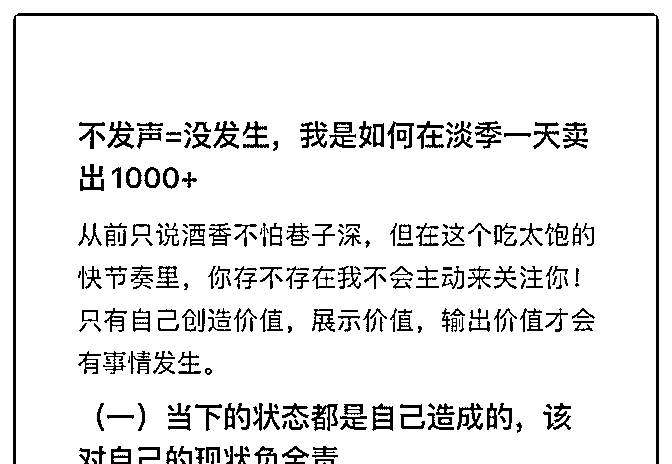

2019-06-28(5 赞)

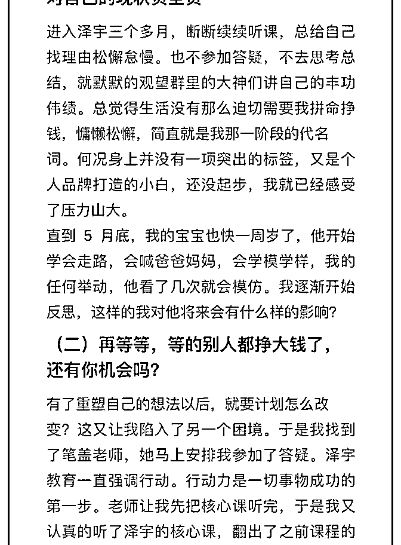

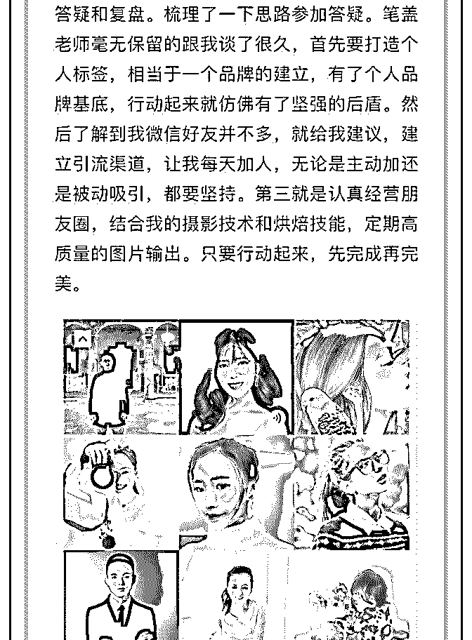

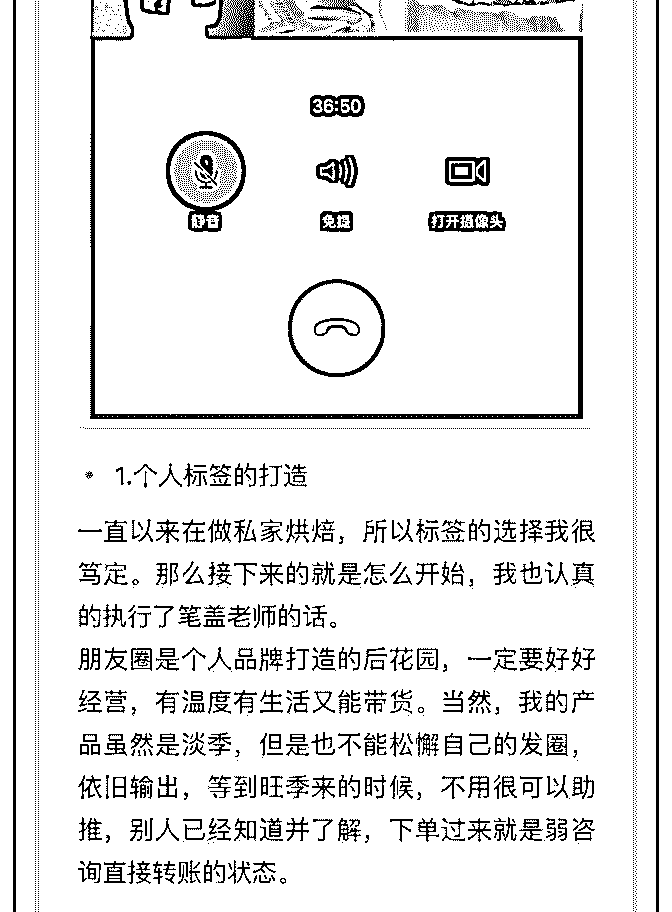

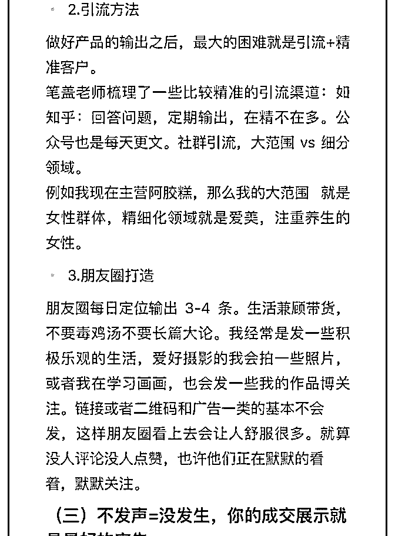

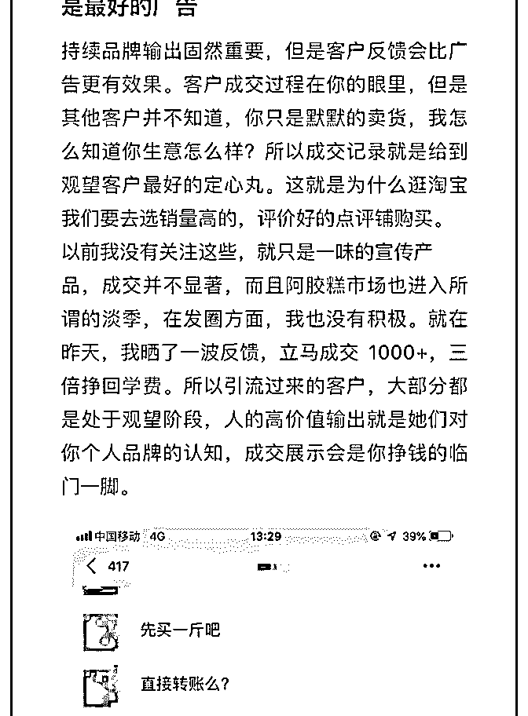

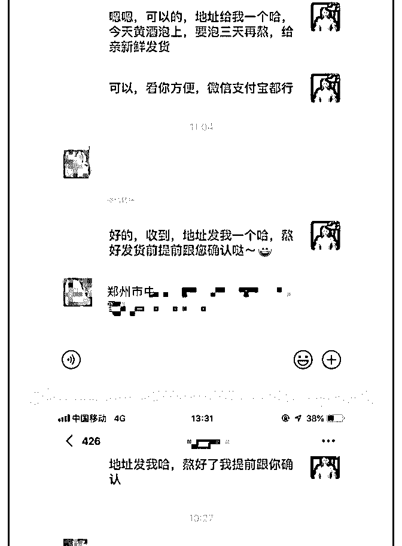

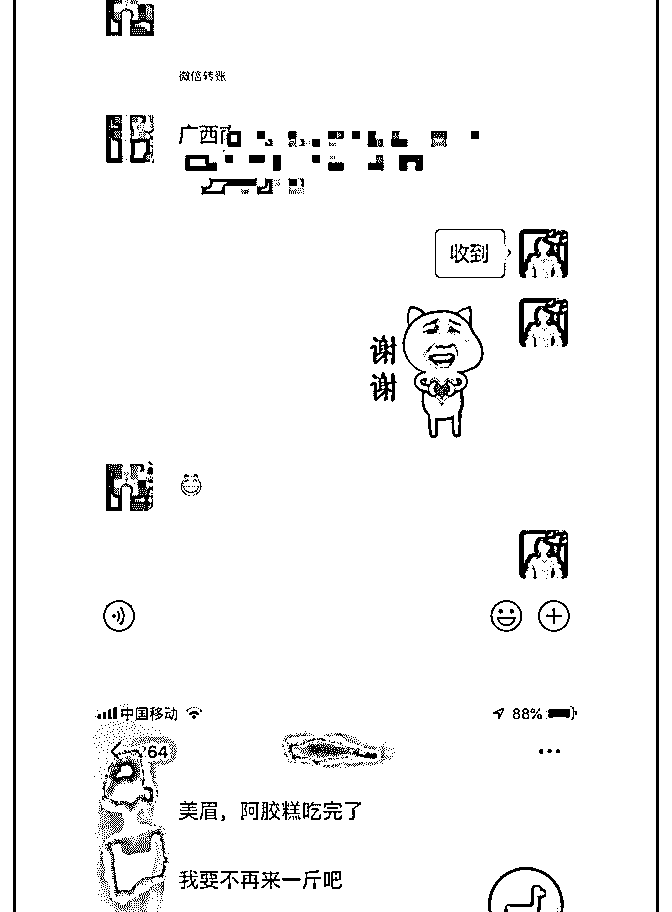

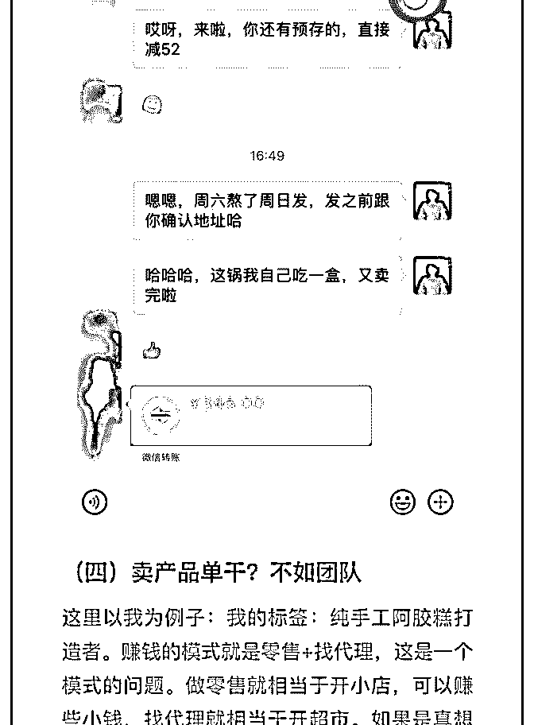

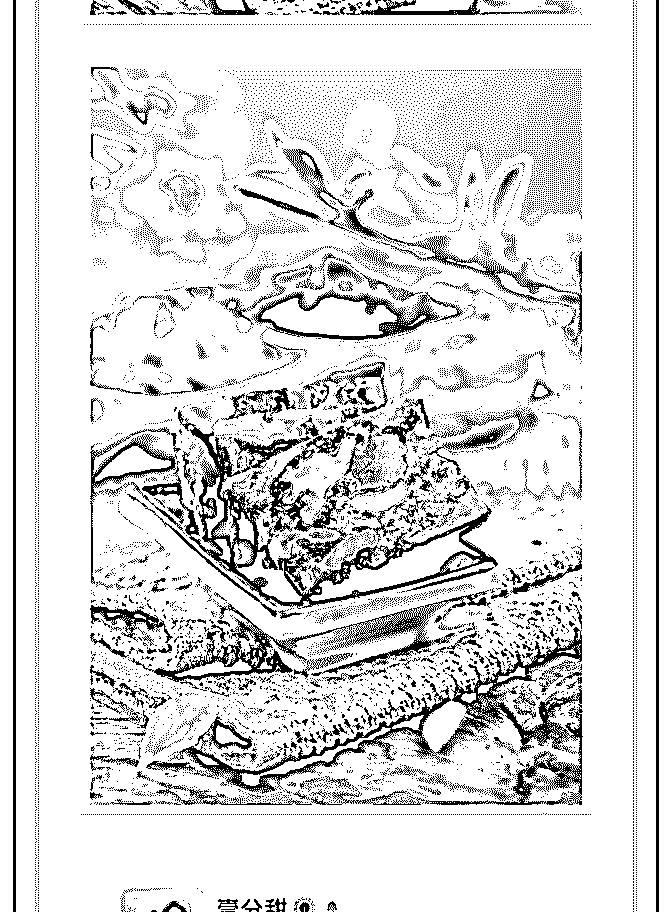

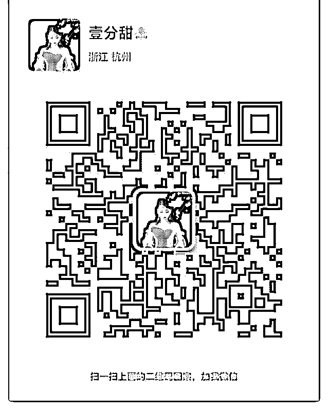

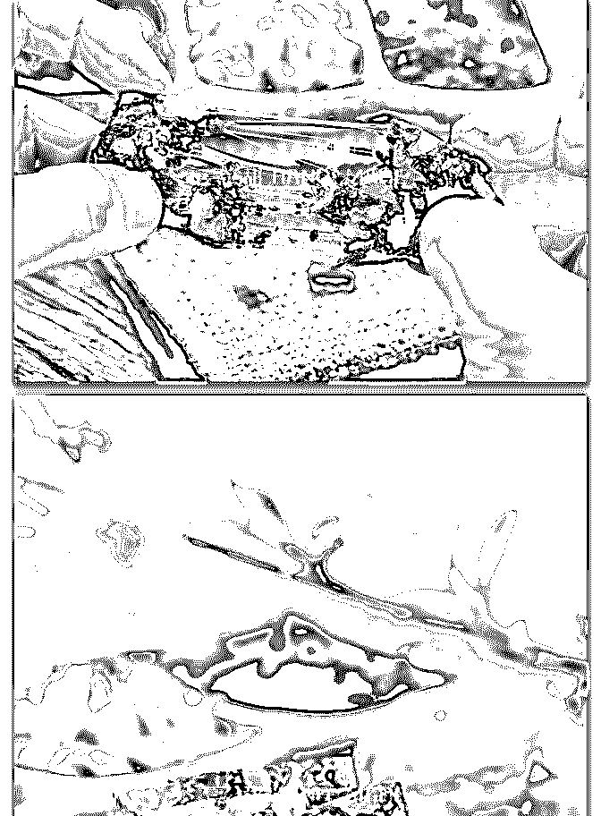

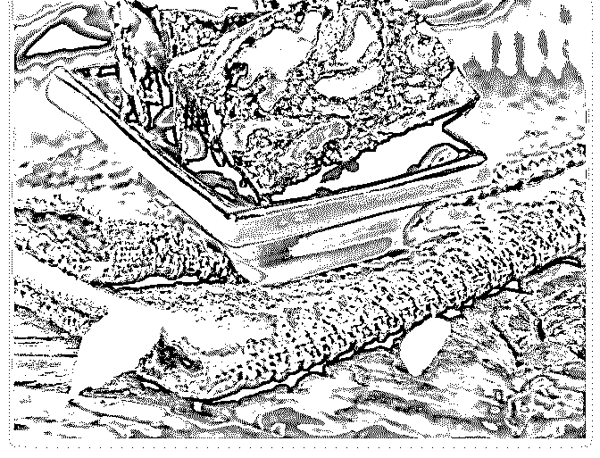

关注公众号"懒人找资源"，星球资源一站式服务