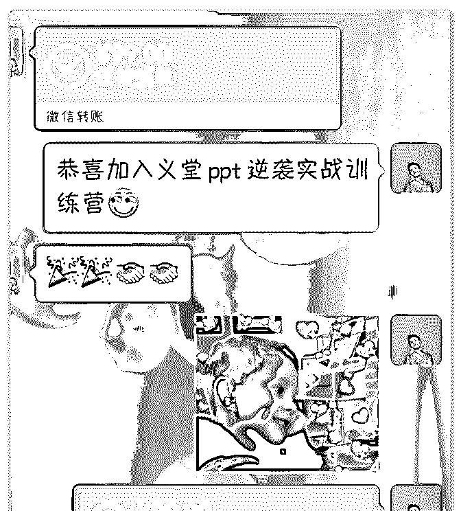
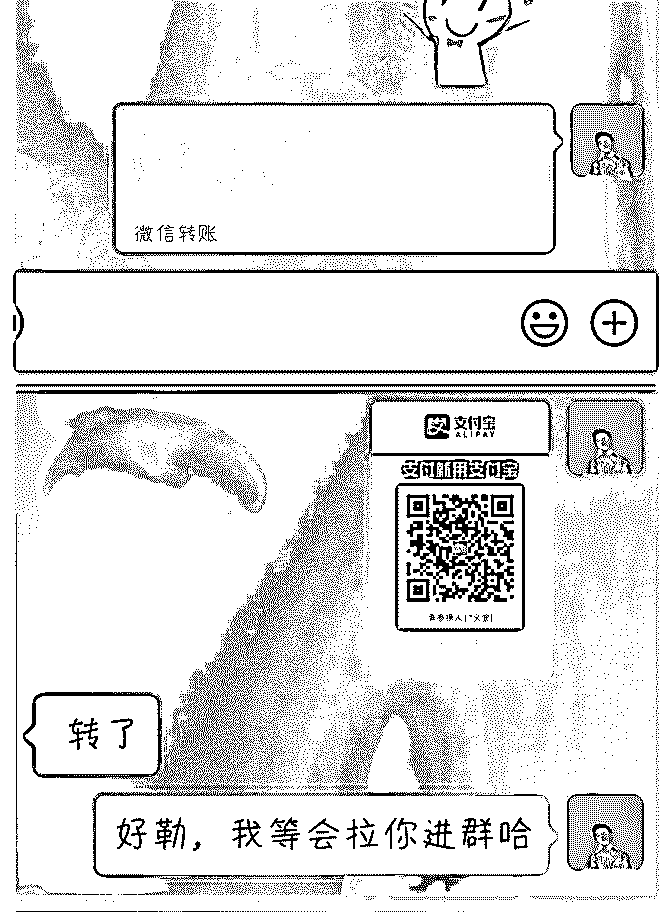
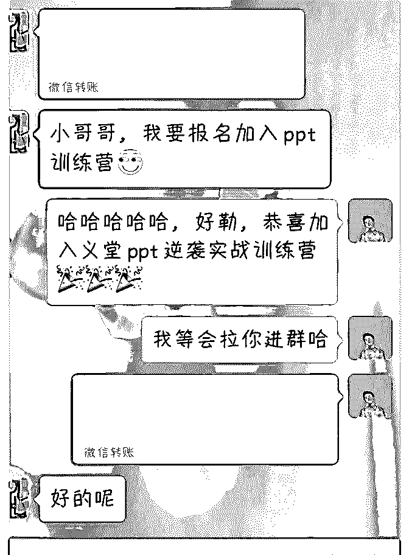
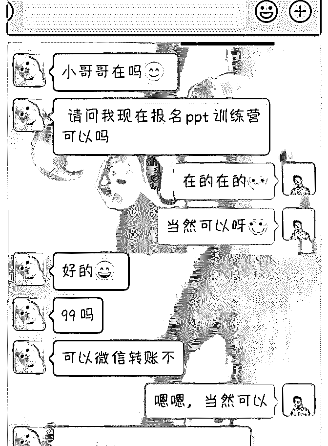
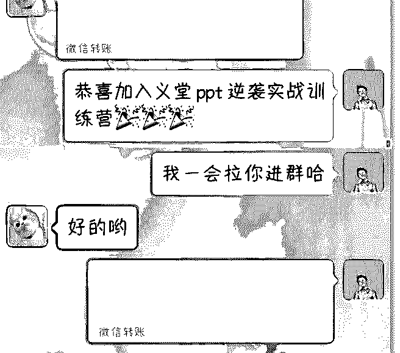
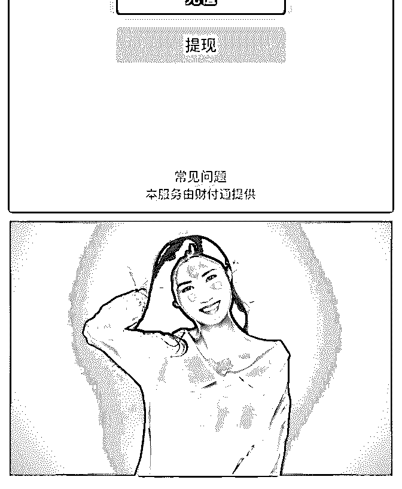

# 终于，可以用上这个

青春撩人 : 终于，可以用上这个话题庆祝成果了！！！ 记得五月中旬的时候就加入泽宇教育，到现在才变现其实是

因为自己的执行力问题。

刚开始学习课程的时候，激情澎湃，一听完课就感觉头脑发 热，收益很多。后来由于我是在旅游社工作的，那段时间超 级忙，门店店庆，各种网络节日堆积在五月份，忙着策划组 织等等，就开始对课程不上心了，三天打鱼两天晒网，明哲 助教也看出我有点散漫，执行力不够，还特意在群里鼓励 我，真的很感激明哲助教❤

后来忙到搬出学校后，明哲助教发过微信问候近期的情况， 我才直接说出我执行力差，不是一个果断的人，处处为自己 设限，对自己的定位也模糊不清……明哲助教帮我一一分 析，才找到了自己的定位:ppt 培训师

彻底知道自己的定位后，就开始整理思绪，着手资料，准备 在朋友圈招募 5 个人作为 14 天逆袭实战 ppt 训练营。刚开始也是 挺蹑手蹑脚的，担心会不会没有人报名，会不会被别人怀 疑，会不会……（这也是至今为止的坏毛病，总是没有开始 做就处处设限）直到身边有一个好朋友支持我，我才大胆去 做，两天就收满了五个人，赚回了学费！！！（每人报名费 99 元，5 个人 495 元） 虽然还没有正式上课，但是能得到别人的信任，是真的很激 动！

之前一直认为自己还不是某个领域的专家，也没有多大的本 事，等学到 100%再去教人，不然心里没底儿，但是明哲助教

跟我说，要学习输出倒逼输入，先去向别人展示自己，才能 知道自己的缺陷以便更好的查漏补缺。虽然我保持质疑，但 是我还是听话，照做，执行，终于开启了知识付费的大门， 让不可能变为可能，感谢明哲助教，感谢泽宇教育，以后我 会一边好好听课，一会狠狠执行

2019-06-28(9 赞)

佳慧|塔罗师 :

关注公众号"懒人找资源"，星球资源一站式服务

# 365 元加入泽宇核

365 元加入泽宇核心课，四天时间纯收入 4188！对于一个在家

带孩子的宝妈来说真的很满意了！还有什么是不可能的呢？

不知何时身边的朋友开始和我推荐泽宇教育，当第一个朋友 推荐的时候，我有一些怀疑，但是接下来有两三位朋友都说 加入了泽宇教育，于是我就想试试。恰巧连接到芬芬老师一 直关注她的朋友圈。后来果断地报了核心课程。

在开始收听核心课程的时候 ，并没有很快的进入状态，并且 那时候对自己的定位很迷茫。第一节课我就反反覆覆听了三 四遍，并且做了很多的笔记。接着听第二节和第三节课的时 候，就有一种突然开悟的状态。最大的改变就是思维的转变 和提升。这一点对我特别重要。

于是，我选择更改了微信名，去海马的重新拍了，照片换了 封面。在个人简介上对自己进行定位。我圈的发布内容也开 始改变的路线。就是这些细节的改变，以及我思维上的提 升，开始为我带来源源不断的金钱。

其实加入泽宇核心课程已经有一个月了，由于白天一个人要 带孩子精力有限， 但即使在这样子的情况下，自己会利用做 家务的空闲时间来听泽宇的课程反反复复的听。于是创造月 入 8000。

所以学习真的很重要，跟对人学习更加重要，避免让自己走 弯路。也特别感谢 coco, 在核心课的群里氛围很好，很多优秀 的朋友值得学习。加入泽宇教育让我相信这个世界没有是不 可能的，只要你想就可以去创造！！！[呲牙][呲牙][呲牙]

2019-06-27(24 赞)

评论区：

石斌-时间管理咨询师 : 优秀 西流 : 优秀

西流 : 加油 豆豆 : 好厉害

关注公众号"懒人找资源"，星球资源一站式服务