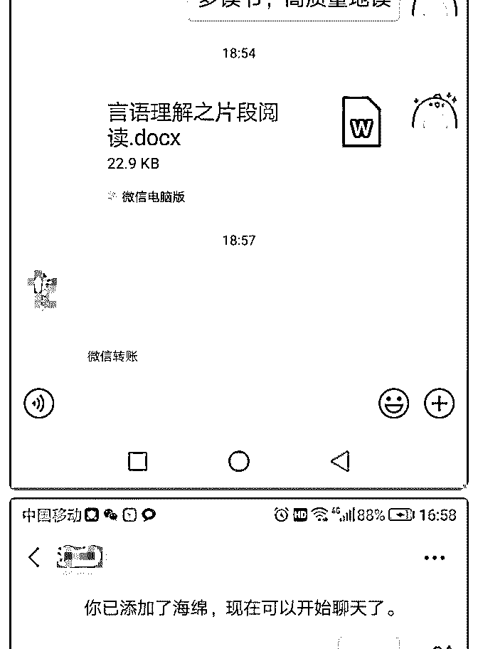
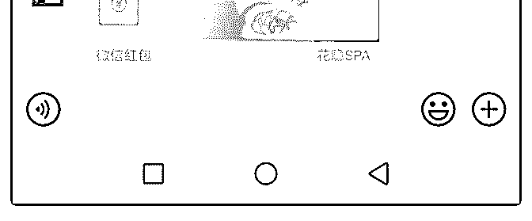
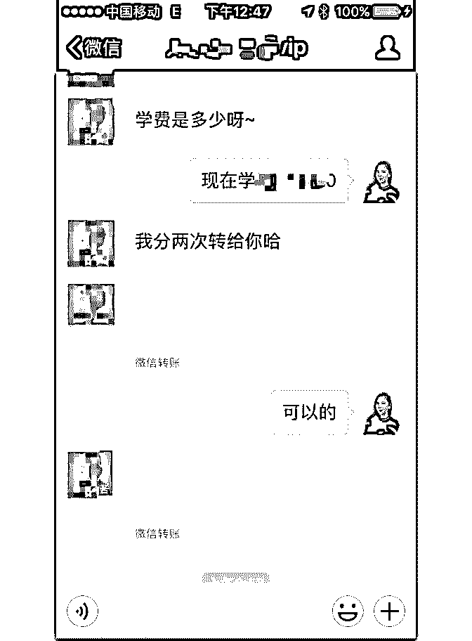
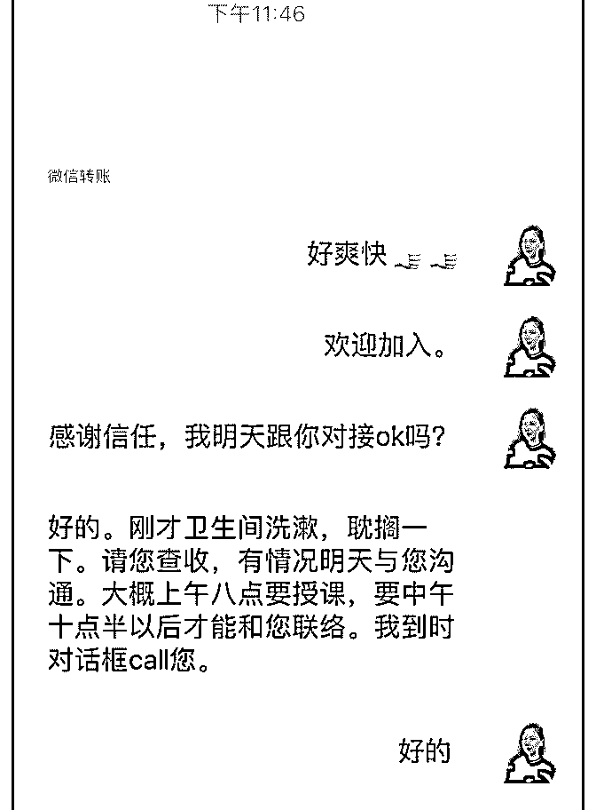
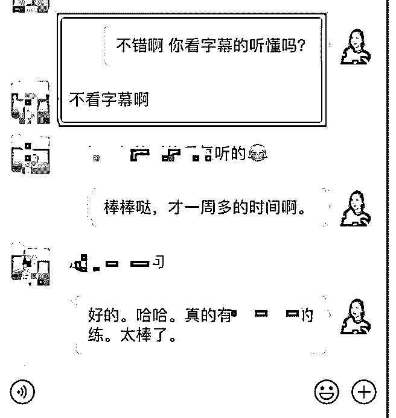

# 一次大大的突破 谢

七公子 : 一次大大的突破 谢谢助教 Anna 耐心指导答疑，谢谢 泽宇教育帮我构建了全新的世界观，还链接了聂思、昕小 小、大象帮主、范林、金叶等小伙伴。 起初我是不好意思谈收费的，因为都是一起考试的战友，原 计划把核心课程学完再去考虑收学员，后来聂思告诉我，我 有怎样的价值和资源，时间对自己而言是非常宝贵的，作为 一名宝妈，牺牲陪伴孩子的时间学习个人品牌打造课程，应 该尽快变现。就这样，只学了一节课程的我，就开始收学员 了，当然这也是基于我一开始很明确的个人定位，公考咨询 师。 泽宇说，商业的价值是解决问题，能为客户解决好问题才是 重点。就更加明确自己的价值和方向。就这样开始了第一次 收费，怕吓跑学员，所以制定的方案是收 1000 元，笔试不进 面全退，面试没上岸退一半。对于为期一年的督学服务来说 真的太便宜了。 但是在收学员时学费迟迟收不上来，学员总是跟我谈条件， 第一个学员要等上岸后再付钱，第二个学员要分期，首期 500，分三次给。跑去问助教 Anna 老师，可不可以等学员上岸 再收钱，先教学员，当时已经收了第一个学员了，Anna 老师 说只有付费顾客才会珍惜重视学习机会， 安娜老师跟我沟通 后提出了按 99 元每月，不退费的策略，我回去把这个策略跟 那个犹豫的学员聊，没想到他很快把首期 500 转来了，就这 样，一波三折，终于把钱收到手了！[耶][耶][耶] 有了这次突破，我开了个减肥营，现在有 2 名学员。每天收钱 的感觉太棒了[机智] 感恩相遇，这也是在泽宇感受到的，每一位助教、小伙伴都 耐心帮助解决问题，非常感谢。感谢聂思鼓励我迈出第一 步，感谢助教 Anna 一次次在我遇到困难时耐心答疑。赚回核 心课学费，助教 Anna 还与我通话将近 50 分钟。

我是七公子， 一位公考咨询师、减肥咨询师，也希望我们会 有更多链接一起帮助更多的人。

2019-06-26(3 赞)

关注公众号"懒人找资源"，星球资源一站式服务

# 4 个月变现 2200

Joanna : 4 个月变现 22000，我做了什么？

大家好，我是 Joanna，我的定位目前是成人英语口语。这四个 月，不仅收获了一定的副业收入，也帮助到了很多同学突破 口语听力的障碍。

这个过程中有很多成长，和蛮有意思而且有意义的思考，分 享出来给大家参考。

其实加入泽宇已经有一年了，之前一直在定位上面有点纠 结。当中也尝试过很多。

今天就写一个复盘给大家作参考

1.关于定位

2.关于自我设限

3.关于自我提升与思考

1.在定位上面，其实我挺纠结的。之前也试了几个我自认为比 较喜欢的定位，后来觉得都不行，一个是比较小众，一个是 自己其实不是很专业也不是真的会花大量精力去做的事情。 后来还是回到我最擅长的英语上面。

我的建议是，快速的去试。如果你有几个喜欢的事情想做。 那就一个一个的去试。其实一般试个几天到一个月左右就能 试出来了。

我之前就是太拖。归结到底就是行动力太差。建议大家快速 行动，快速去试，不会有人笑话你的。你的客户也只喜欢真 的强人，能给他们带来价值的人，如果你不自信、怯懦那么

就无法吸引到别人。

另外就是要真正的知道客户的痛点，这也就是前期免费咨 询，一对一咨询的好处，这样能发现大家的痛点，和需求。

比如我之前的音标课，虽然这块很重要，但是发现大家并不 是很在乎这块。招募也不顺利。当然也可能跟我之前不会发 朋友圈有关系。

后来换了定位，主要帮助大家学会语法，0-1 背单词和看懂句 子看原版书，拿到高分。

这个其实就是大家问的问题里面总结出来的，大家比较在乎 的一部分。所以我在这个定位下面招募的时候，就轻松多 了。

但是这个定位对我来说，后面又有过一次升级。就是因为很 多人问我，想提高口语。口语也其实是我最喜欢教的。所 以，后面我又定位到口语了。也吸引到一部分学员。

但是现阶段流量还不够，还在研究如何输出价值，获得更多 流量。现在的问题是行动力不够。

2.自我设限。 总觉得自己做的不够好，完美主义倾向。

但忽略了客户想要什么。客户想要的只是从 A 到 B。你只需要 有足够的能力帮他们达成就行了。纵使你有 CDE，客户可能 也并不是很需要。

太完美主义反而不好。

多花点时间去想客户需要达到什么状态，我能不能帮他，怎 么帮他。

曾经我一边觉得自己不行，一边又觉得别人能做好的事情， 我也应该能做好。一直反反复复的很矛盾。

现在其实还会有这种时候，但是我会尝试着锻炼自己的思 想，把之前的——怕自己做不好，转变成——如果我想做好 这件事，我需要做哪些事。 一个简单的思维转变，会改变一个人的行为模式。

当你的大脑被前一种思想占据的时候，会一直自我怀疑，患 得患失。用第二种思维的是，你的大脑里面装的都是，我该 跟谁去学，我该问谁 ，我该怎么学。

但是说起来简单，现在还在努力提升中。

3.关于自我提升与思考。 其实在答疑的过程中，和其他成功的小伙伴分享中，都能发

现很多灵感，和能用在你自己身上的蛛丝马迹。

他们能给你灵感，触发你的思考，让你可能想了很长时间都 想不到的事情，突然就通透了。

但是这都需要你主动去思考，即使导师可以帮你解决一些问 题，但是还是有很多东西，比如专业性的东西，要自己去思 考。

另外，如果你很迷茫，想要快速提升，我可以告诉大家一个 秘诀，就是去结交群里面优秀的小伙伴。参考他们在做的，

你也去试着做做。永远主动去学习。

其实泽宇教育不仅是教育方面做得好，更大的宝藏，就是我 们群里面已经能稳定赚到钱的同学。

他们不仅能刺激你，还能让你学到很多东西。 这是我最近才有感的，然后我觉得我应该去认识他们，所

以，我就加了很多优秀的小伙伴。我去学习模仿他们的朋友

圈，学习他们的话术。

之前总觉得，这样认识陌生人还蛮不适应的。但是因为最近 被好多同学刺激到。所以我就加了好多优秀的同学。我发现 完全没有之前想的那样别扭，虽然没有报他们的课，大家一 般也很乐意跟我聊，回答我的问题。

不要让这些厉害的人躺在你的朋友圈或者群里面。 再有就是自己真的要花时间，不断的引流和提升自己的专业

能力。不要误会了“躺赚”。之前我总觉得躺赚，就是自动的 流量，自动的成交，不用付出任何努力。其实不是的，我现

在对躺赚的理解是，我们可以一分产出 n 份收获。虽然收了钱 很开心，但是背后需要付出的，是我们给到学员的价值，真 正的帮助他们从 A 到 B。

4.其实到现在差不多 4 个月的时间已经变现了 22000 左右了，但 是跟其他一些小伙伴比起来还是逊色很多，而且我自己有一 些不安全感，很怕这个收入是不可持续的，所以我一直没有 发复盘。

但是经过几个月的实践，我感觉有一些信心了。我觉得信心 这个东西，一定是掌握了被验证过的知识才能拥有的，而不

是盲目的乐观自信。感谢波力、小鱼老师给的指导帮助，也 感谢华丹、明哲、judy、蓉蓉等等。我都在默默的学习他们的 朋友圈。虽然我自己做的还不太好。

5、最开心是还是收到学员进步的反馈。有些学员，平时要上 班，甚至会半夜发作业给我，有了进步特别兴奋，他们进 步，我也像老母亲一样很替他们高兴。最重要的是，这些反 馈让我知道我在做的事情是对的，有效果的。 以上就是我的复盘，希望对大家有帮助。 欢迎大家的链接，我的微信：joan634。

2019-06-25(9 赞)

评论区： 美丽.快乐~勺珈 : 好棒

关注公众号"懒人找资源"，星球资源一站式服务