# 参加笔盖答疑一次实

职业生涯规划咨询燕子 : 参加笔盖答疑一次实现赚回学费！来 自觉醒者的复盘： 3 月份加入核心课，一口气听完 4 节课，笔记记的刷刷的，感 动了自己之后行动了几天，也找到了自己的定位，好像瞬间 拥有了全世界，然后就被束之高阁，就在快被遗忘的时候， 经不住笔盖女神一次又一次的提醒，终于我反思了自己最大 的问题：不敢变现！ 害怕变现其实就是害怕承担责任，害怕承担责任就是不认可 自己！ 我是怎么突破的？一句话：你想拥有的要先给出去，而我确 确实实在学完系统的职业生涯规划课程之后改变了自己的职 业轨迹人生轨迹包括家庭轨迹，所以这是百分百有价值的事 情，我不能自己藏着！我就先从免费提供价值开始！ 2019.6.10 报名参加第一次笔盖答疑，答疑问题是：如何打造 朋友圈 我之前朋友圈很少发东西，也很少看，所以对于朋友圈还是 很迷惑的，总觉得自己发的内容没有人看也没有多少人关注 更别提点赞了。 经过笔盖女神的指导，我走出了第一步开始发朋友圈，我真 的是践行最低的标准，每天最多发两条朋友圈，一条关于咨 询的一条关于学习的，虽然少但是我觉得养成习惯更重要， 泽宇说过不怕一个人一天踢腿一千次，就怕一个人一天踢腿 一次踢一千天，对，我就是要做这样的人。 当然这些都不是重点，重点是我出现在了核心课群里，这是 笔盖女神强调的，要利用好核心群这个圈子，这是优质并有 付费意识还上进的一帮人，虽然就冒了几次泡，却为我赚回 了学费且让我看到了自己的价值，让我更加坚信我要打造的 职业生涯规划这个品牌！（图片在下面好像不能中间放么） 特别感恩小伙伴的信任！

总结：核心课多冒泡多发现自己能为别人提供什么价值，并 且如果有机会要不断的给他人提供价值，这样别人才会信任 你，才会愿意把自己交给你！ 朋友圈坚持，听笔盖的，让发多少发多少让不发啥杜绝发啥 想你能提供的帮助，不吝啬帮助，让自己成为资源池 好了，我是一名生涯规划咨询师，成功逆转了自己四年的工 程预算工作，并且一步步找到自己理想的工作，一名高考升 学规划咨询师！我们做了一次职业规划并不能直接找到自己 的天命，需要在正确的方向上找正确的位置，直到找到理想 的点位，这是规划师的重要作用！而高考规划就是职业生涯 规划的前置，所以我的目的只有一个：让还没踏上弯路的孩 子走上正确的道路，帮走在弯路上的迷途羔羊重新找回赛 道！ 服务他人，用生命影响生命，如果你有职场的困惑，标签的 困惑，定位的困惑，亦或者就单纯想对自己进行扒皮了解， 找到自己独有的天赋优势，欢迎咨询，非常开心有机会帮到 你[爱心]

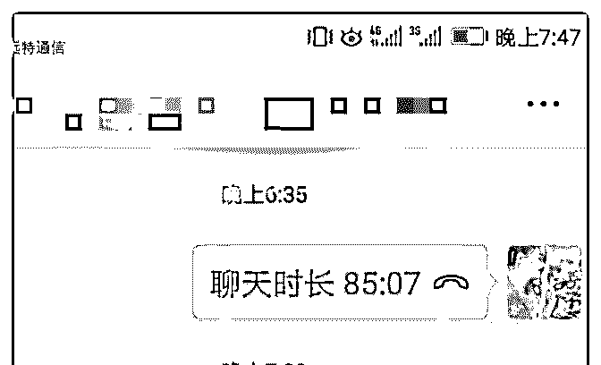

2019-06-25(10 赞)

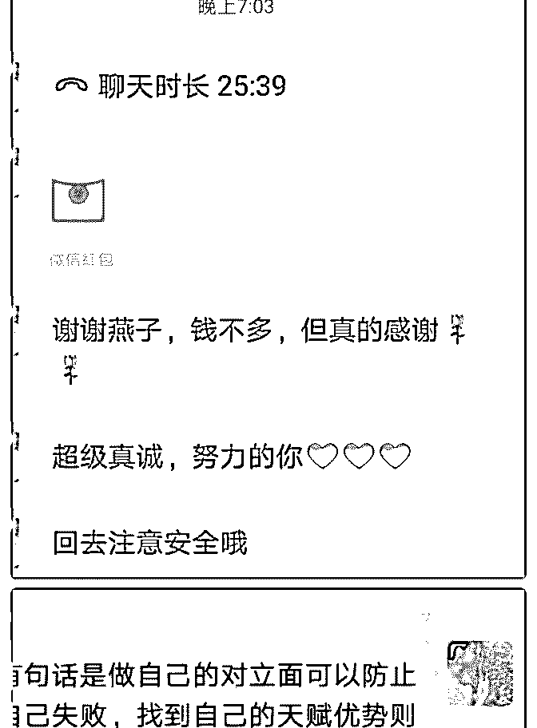

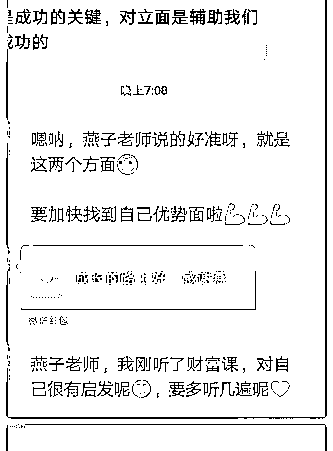

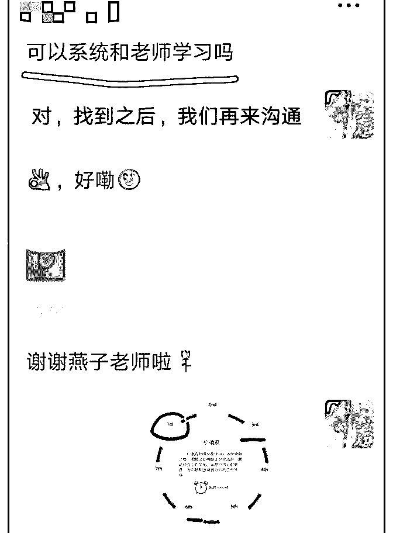

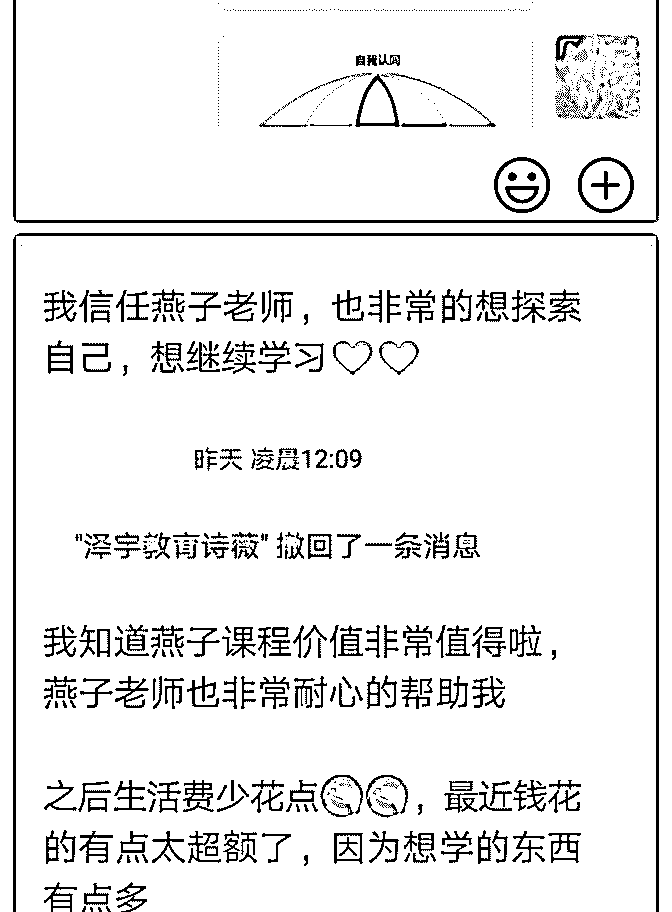

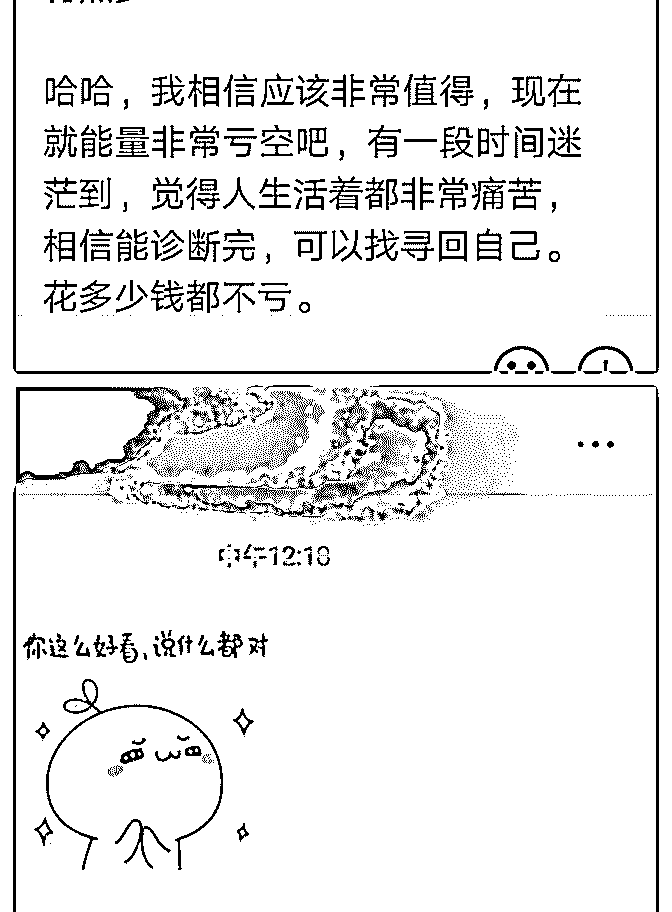

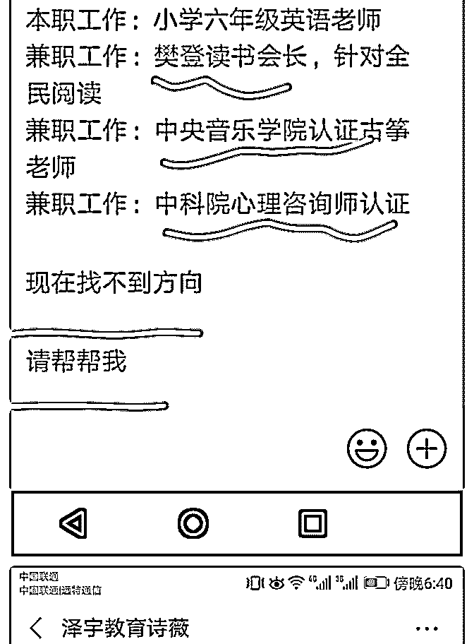

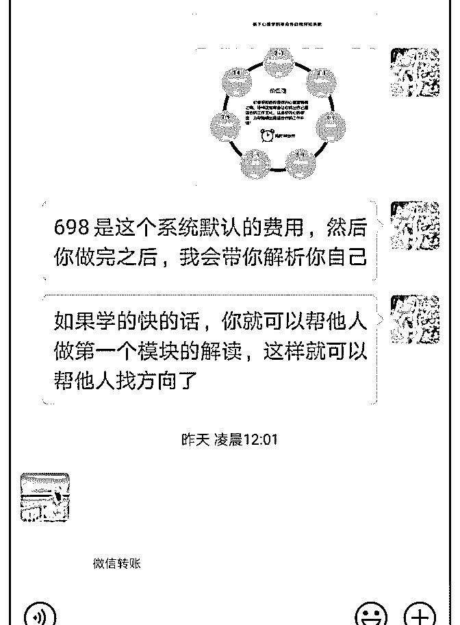

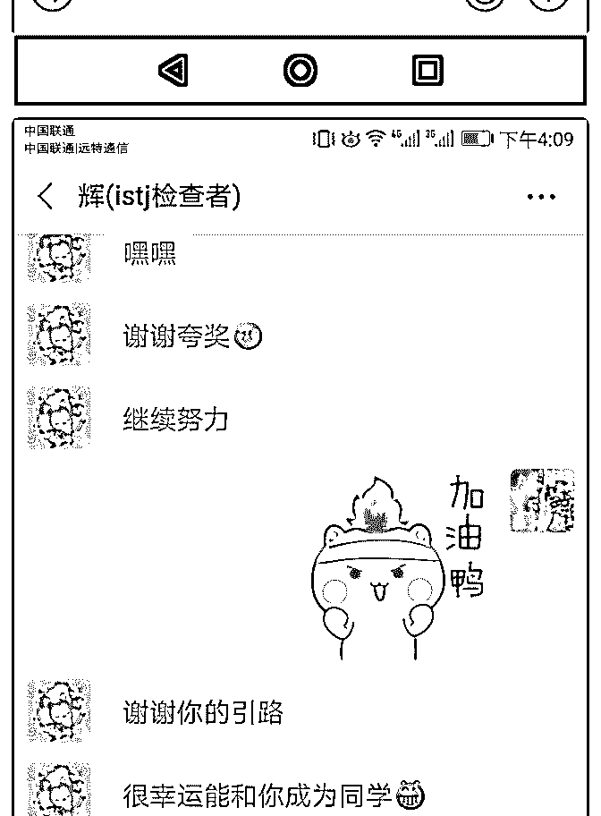

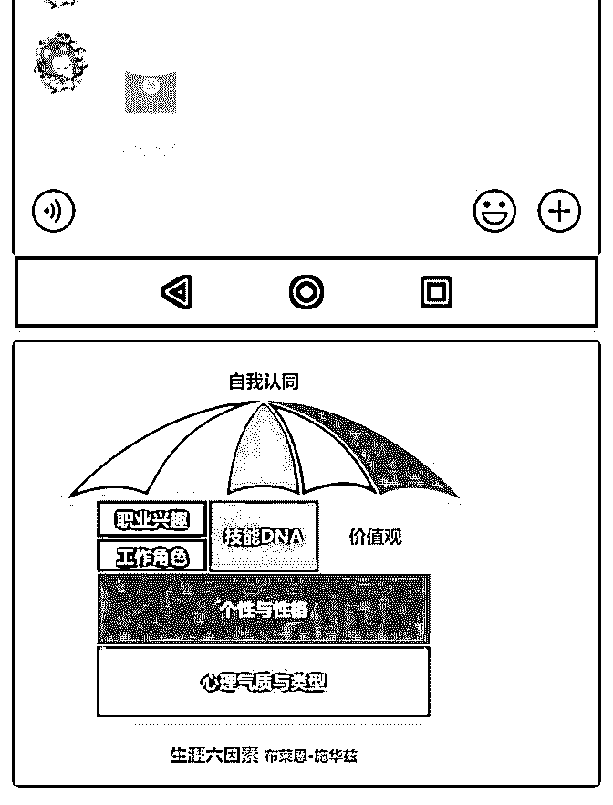

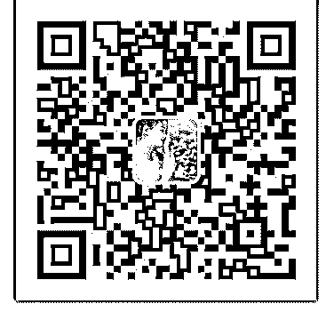

关注公众号"懒人找资源"，星球资源一站式服务