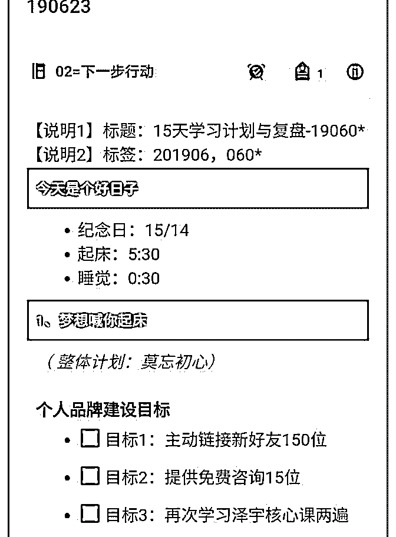
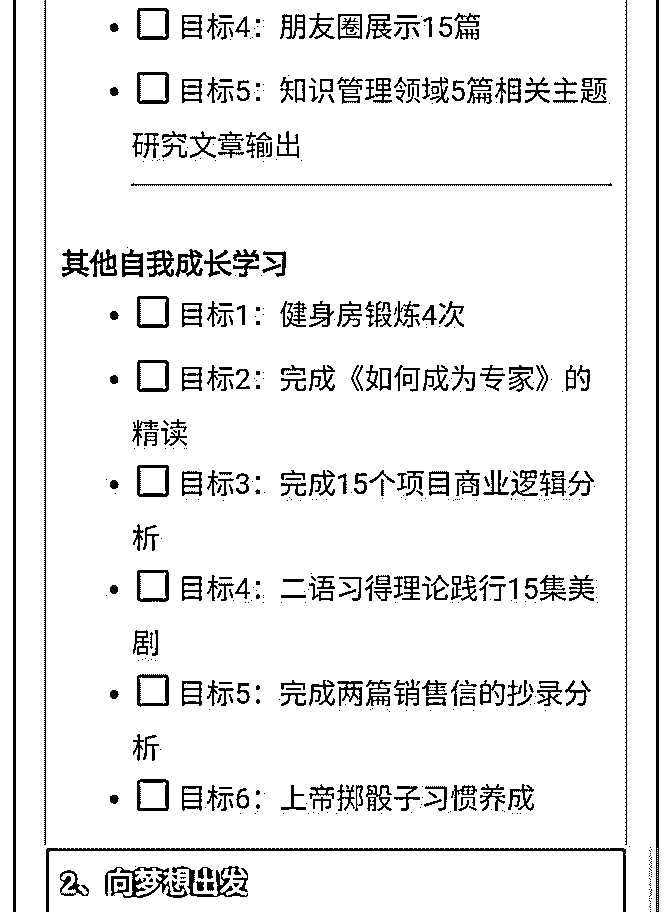
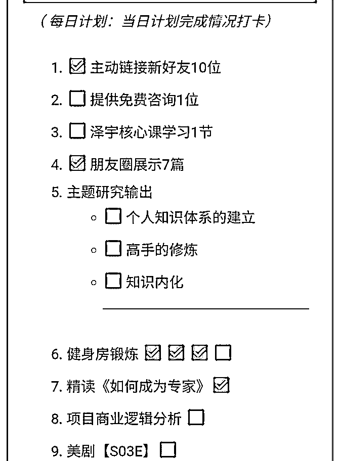
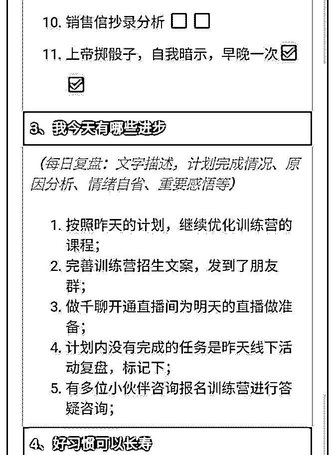
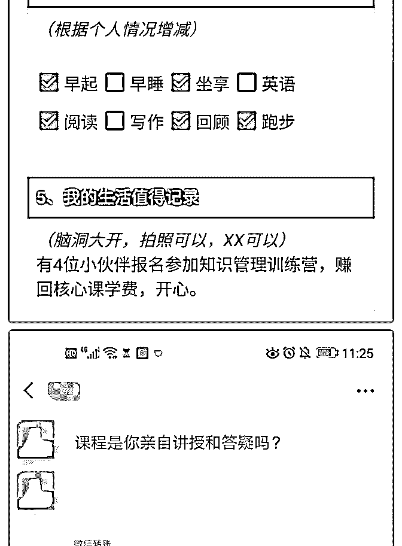
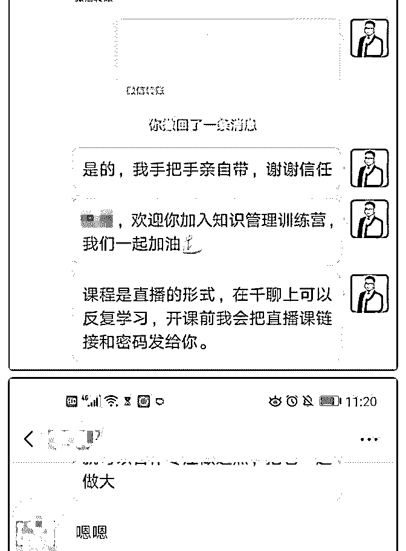
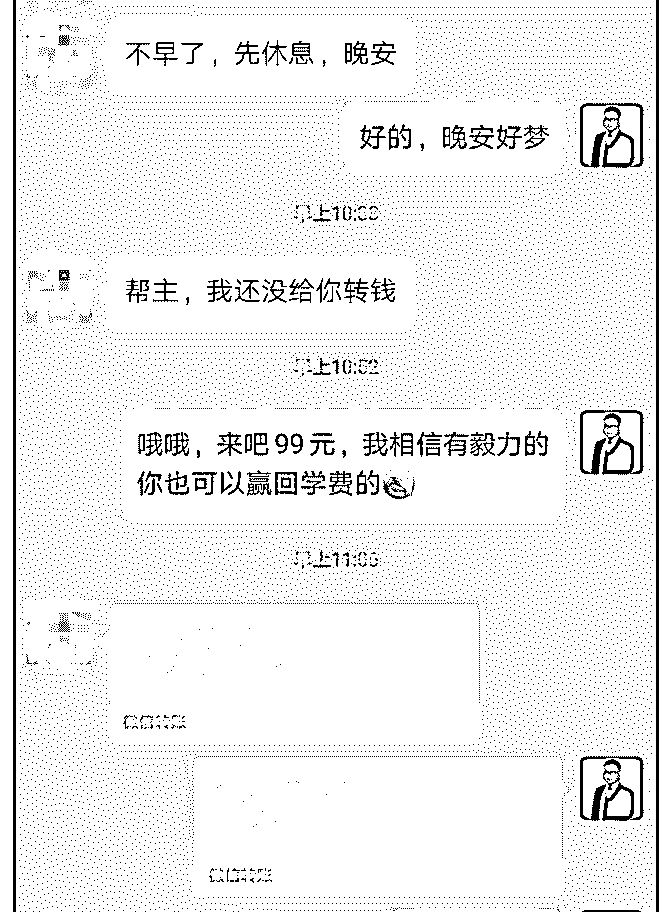
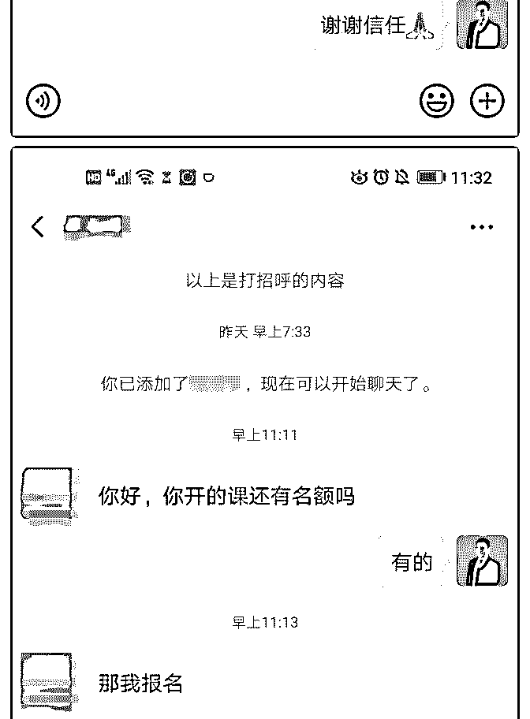
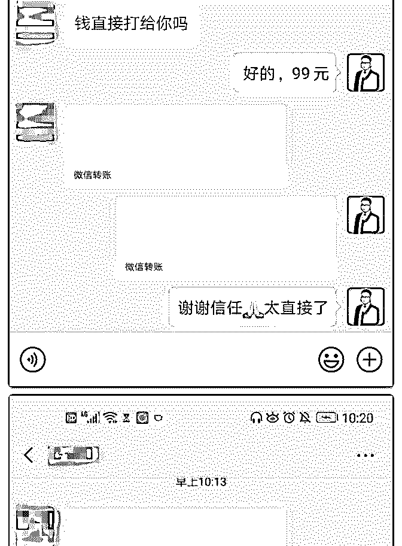
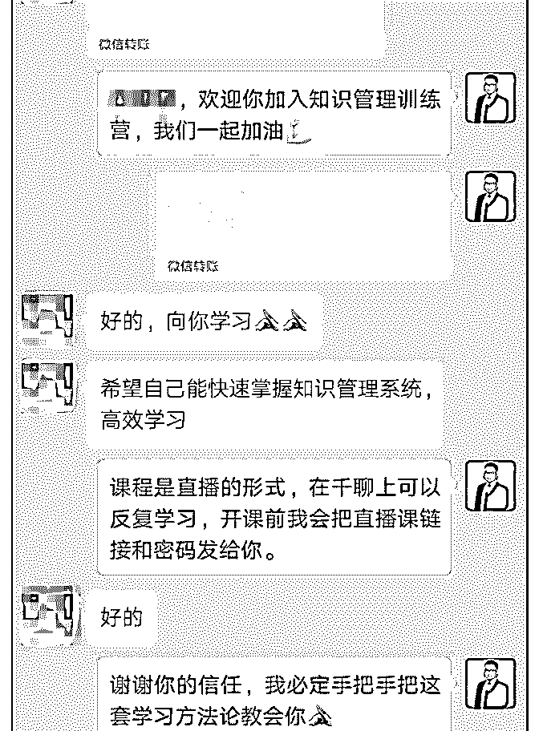

# 每日复盘跟 Anna

大象帮主 : 每日复盘 跟 Anna 老师的约定是 1 个月赚回学费，到今天正好 3 周，还好 提前完成约定，开心。

我加入泽宇比较早了，记得是 3 月份，当时纠结于定位的选择 跟 Anna 老师进行了第一次通话，之后由于各种原因包括海外 出差等就一直没有怎么行动。6 月初处理完工作上事情，才算 是回归泽宇，重新学习核心课程，一课一课去学习和复盘， 新微信号从几十个好友开始做。由于 3 月份我已经明确了自己 的定位，下一步的任务也很明确，完善了个人介绍后，就去 做免费咨询进行市场验证。刚开始的前两天就连接上两位小 伙伴做免费咨询，并收到了第一个因给对方提供价值而得到 的红包。然后接下来的一周除了定位相关专业的学习，干的 最多的一件事情是“爬楼”，核心课群，泽宇几大导师朋友圈 的内容几乎遍历了一遍，边爬楼边感慨自己到底是错过了多 少精彩啊。我不建议新进来不久的朋友这么去做，因为比较 耗时，而且容易比较受刺激。那这一周的收获和成果是什么 呢，除了刺激，就是我得出了这样一个结论：听话，照做， 出结果（收钱）。快速赚回学费的同学绝大多数都是这样做 的，尤其是小白，当然加入泽宇前期有很好积累的小伙伴除 外。

接下来我也是这么做的，之后就是加入了 15 天计划，今天是 15 天计划的第 14 天，在这 14 天我做了哪些事情呢？在印象笔 记上做了 15 天详细计划，并制成了模版；开始有意识的去发 朋友圈，每天晨跑时顺手拍照发个朋友圈；因为要记录当天 睡眠时间，第二天早晨利用模版写前一天的复盘，并发知识 星球和核心课群；每天主动加 10 个好友；每天做计划中的内 容。

这样又过了一周，微信上的朋友逐渐满满多起来了，朋友圈 点赞的朋友也开始慢慢多起来了，可是愿意免费咨询的人还 是很少。这种情况下我参加了答疑，Anna 老师指导后瞬间明 白该怎么做了。听话、照做、出结果：今天上午赚回核心课 学费。所以，大家有任何问题，如果自己努力尝试解决后仍 搞不定，一定要及时找老师解决，往往老师一句话就能解决 困扰你好几天的疑问。

总结下，想快速赚回学费怎么做呢？听话、照做、出结果

（收钱）。

今天各地高考成绩陆续发布，想起了一个段子： 那一年，

我们上知天体运行原理，下知有机无机反应；前有椭圆双曲

线，后有杂交生物圈；外说英语，内修古文；求得了数列，

谈得了马哲；渊源中华上下五千年，延推赤州陆海百千万；

知音乐美术计算机，修武术民俗老虎钳。

那个时候，每个人都堪称一部人类知识大百科， 可是现在……

高考多年后的你还记的多少？

假如我有一个方法能让你都记得，你会感兴趣吗？ 假如从上学识字开始一直到大学毕业你学到的所有知识你都

记得，现在的你是不是很厉害？

你也许会说，帮主我都大学毕业好多年了，这些对我还有用 吗？

那我再问你，如果你家有正在上学的小朋友呢，从小就有这 样一套知识管理系统，多年以后，他/她在学校接受的知识都 能记住或者迅速调用出来，你愿意学会后教给他/她吗？

假如老板问你上个月或者去年跟某个客户合作情况，你能很 快的给出合作细节，那你在老板心目中是不是加分呢？

你是否因为学习成长的焦虑，网上知识付费囤积了很多课， 很多都还没有开始学，即便学了也记不住，即便记住了除了 增加些谈资，貌似也没有给自己带来太多的改变？

那如果我有一套方法论，不光让你学的会、记得住，还能落 的地，帮你摆脱知识焦虑，你愿意学吗？

小时候爱看武侠小说的自己，最爱看的剧情是武功初始平庸 的男主由于某些机缘误入秘境获得绝世武功秘籍，从此武功 增进笑傲江湖。时常想自己啥时有男主的好运获得一本绝世 武功秘籍呢？

如果有这样一套秘籍指导你从小白快速成长为自己领域内的 高手，你愿意了解吗？

熟悉我的朋友都知道我做了相当长一段时间的项目管理，如 果我们把考试当成一个项目来管理，我们是不是就可以大大 增加考试通过的概率呢？来吧，这个方法我教给你。

看到这里，你可能早就心里嘀咕了：帮主你在吹牛吧？ 曾经有位学长告诉我，任何时候你都不孤单。你面临的一切

问题，这个世界上一定有人也做面临同样的问题，同样有人

早已解决了你面临的问题。

一切都有方法，只是你不知道而已。

大家都看过蒋昌建老师主持的最强大脑节目吗，你是不是感 概那些世界记忆大师的厉害和神奇？线下我曾经接触过一个 教授记忆的老师，GRE 和托福单词书能倒背如流，他给了我 一本 GRE 的单词书，让我随意翻一页，告诉他页码和第几个 单词，我尝试了多次，他都能迅速告诉我这个是哪个单词以 及单词的含义，当时我都惊呆了。

后来自己研究一段时间记忆方法，明白了其中的原理，无 他，方法而已。

就像现在我能帮你在 30 分钟内记住圆周率小数点后 50 位数字 一样，只要知道了方法，练习出成果也很简单。

跟大家说说我是怎么接触知识管理的吧？ 多年前，有次我管项目组的一个同事要 2 个月前的一次实验数

据，当时我是该项目的项目经理，他很快就给我了，除了准

确的实验数据，还有详细的实验过程、实验条件，参与人以

及实验结果。一次也就罢了，好几次都这样，我就很好奇他

是怎么做到的就问了这位同事，他向我展示了他的云笔记，

上面详细的记着每个时间段的输入和产出以及复盘，甚至具

体到哪个时间点哪位领导给他布置了哪些任务，以及领导的

嘱托和注意事项。我当时就震惊了，心里想以后跟这小子布

置任务得谨慎了。后来得知他做的工作其实属于知识管理的

内容，从此对知识管理产生了浓厚的兴趣。

有人说我们的人生就是一个信息流，从这个角度看知识管理 可以管理我们的整个人生。确实如此，我就是这么做的，除 了学习课程、读书、晨晚间日记，各种复盘、灵感，包括各

种生活经验、银行密码、与妻的经典聊天记录，亲自活动照 片等等，我都把它们放入自己的知识管理系统。而且这个知 识管理系统是不断完善的，比如某个技能某个领域的知识 树，我也是定期回顾更新的。

但前提是你得先有个这样的知识管理系统，别担心我可以帮 你做到。

在训练营，我们不光帮你一步步搭建起自己的知识管理系 统，

它其实相当于一个外挂大脑，或者一个随身携带的私人图书 馆。

我们还教给你一套做事方法论，帮你释放大脑内存，提高大 脑运转效能；

我们不光给你指明从小白到达你所在领域的高手之路，还教 你一套完善自己特定技能的主题研究方法；

我们不光教你一套从输入到输出到完整读书闭环方法，还教 你怎样把考试当成一个项目进行管理，轻松搞定考试的元技 能。

一个月 20 节课，活动期最后一个名额，绝对超值的体验。

2019-06-24(11 赞)

关注公众号"懒人找资源"，星球资源一站式服务