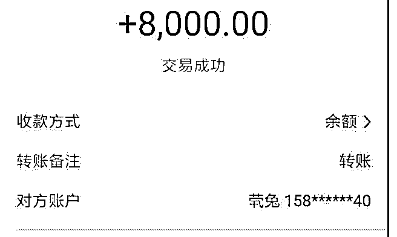
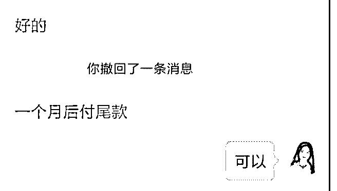
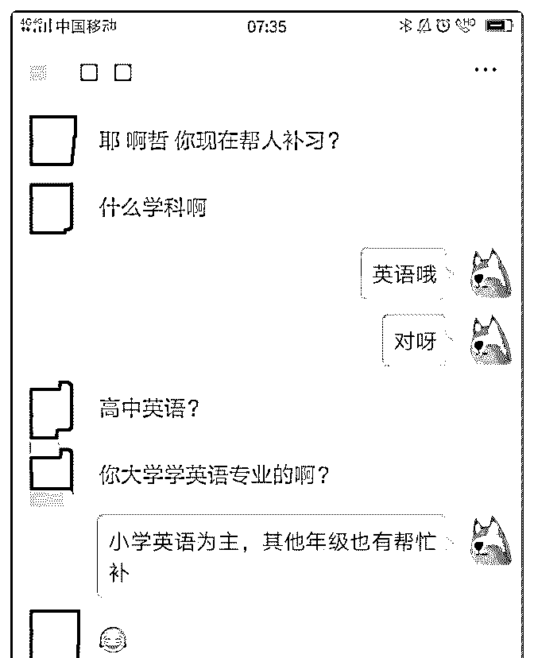
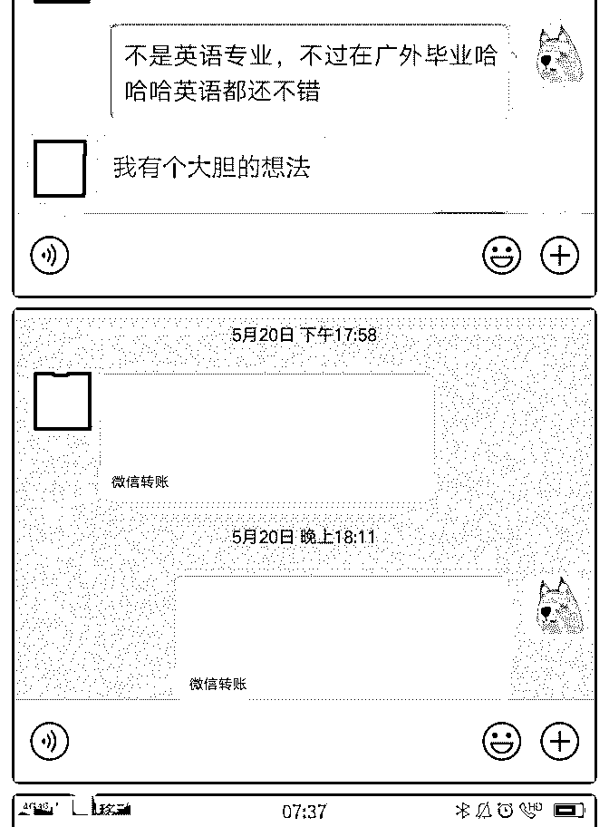
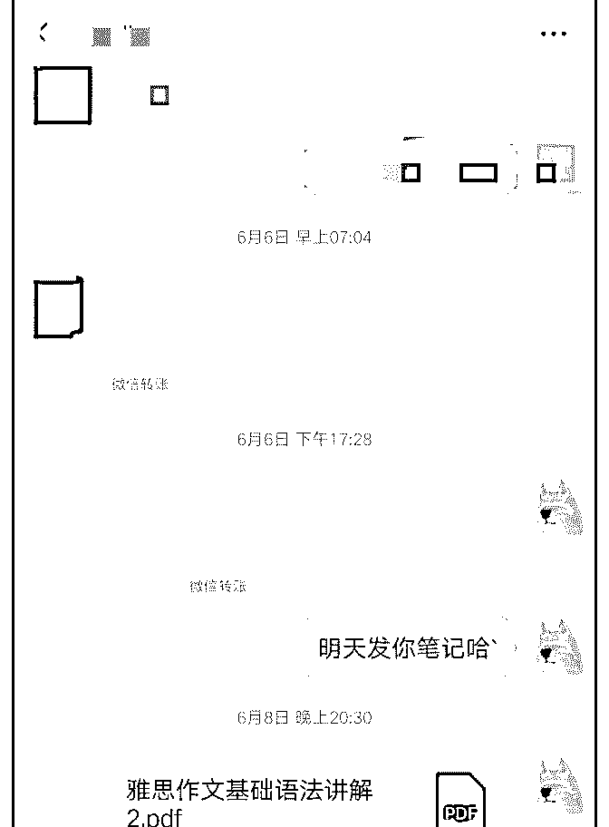
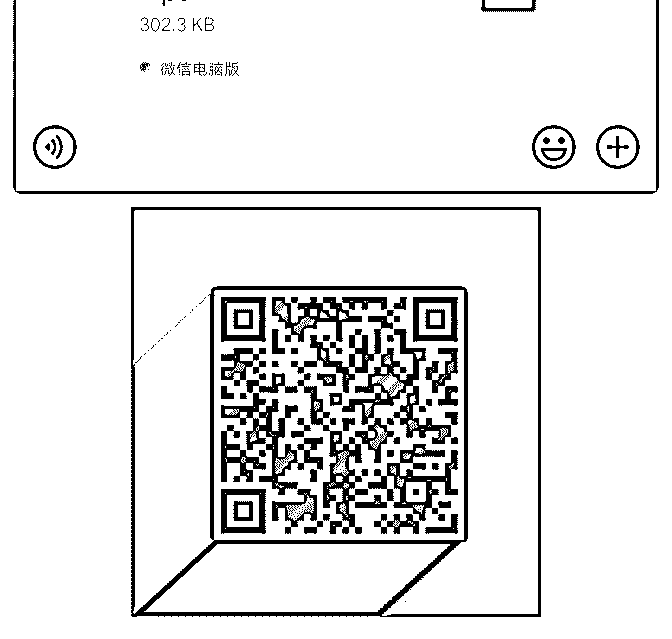

# 加入核心课好像有 1

风轻云淡 : 加入核心课好像有 1 个月，变现 13000 多，核心课学 费是加入第二天就挣回来了，其实目前收的还都是低价口语 俱乐部的。主要有个 12000 的口语课，其实那个学生咨询我的 时候我没有把握她会跟我学，因为我要的价格太高了原因是 我知道我要帮她达到她想要的状态真的需要付出很多努力。 后来我把她拉进我免费教口语的群，可能是我用实力征服了 她吧，突然有一天要听我讲课，结果一节课下来，直接转了 8000 块，还有 4000 一个月后付尾款。当时我看到支付宝一下 子多了 8000 块钱的时候我其实是没有想象中的那么开心，我 知道这是一份沉甸甸的责任，我觉得我收了钱就要好好教人 家，帮她达到她理想的状态。因为她是零基础所以我就没有 直接让她看我录好的课，直接重新根据她的情况每天熬夜给 她做了一份 ppt。每天给她上视频直播课带着她从音标单词到 练习口语，这样我才会觉得对得起她的这个学费，也对的起 我自己的良心吧。目前在我们共同的努力下她学的还不错， 态度也很积极认真。至于从刚开始到现在过程的艰辛不用说 大家做个人品牌的都能理解，我天生有股韧劲可能是上学的 时候养成的，不管未来有多难我都会认真的走下去。虽然我 也有点着急，可是我也知道走的太快了容易摔倒，每收一份 钱都是责任和使命，所以我觉还是脚踏实地的走下去吧。 最后还要感谢一路上帮助我的人，尤其是安娜姐，我觉得我 是让她比较费心的学生，老不听她的话，真的谢谢她一路上 陪伴我。 如果大家对英语感兴趣欢迎添加我也微信，我愿意尽我最大 的努力去教你。

【昵称】英语老师 Monica

【坐标】上海

【从事工作】英语老师

【个人经历】 1.帮助过 100+的学生全面突破听说读写能力，对英语产生兴 趣，掌握高效学习英语能力。 2.本人曾获:专业八级口笔译证书，人事部二级笔译证书等， 翻译过上万字的文献资料。全国大学生英语竞赛二等奖，外 研社英语辩论赛一等奖，本科曾是国家奖学金获得者。 我能提供:英语听说读写高效学习方法，帮助大家使用高效方 法快速学好英语。

2019-06-22(13 赞)

关注公众号"懒人找资源"，星球资源一站式服务

# #庆祝成果#成功赚

哲哟 : #庆祝成果#成功赚回核心课学费

在加入泽宇教育后的 1 个月轻松地通过微信谈下了 1000 元的 单，目前已经实际收取费用 600 元，赚回核心课学费了。为此 还是非常开心，当然我的目标不止于此，就像我之前复盘提 到的，希望月入 1.5w，希望能在今年内实现这个阶段性目标 哈~fighting!

我的职业是教育机构的业务教学管理者(准确来说是管培生出 身)兼小学英语老师，大学在一所以外语为特色的重本学校 读，不过由于个人偏好管理和商科，所以专业选了人力资源 管理。我一开始加入泽宇聊天有很多方向想发展，例如生涯 规划、教育咨询、职场晋升、英语等，不过最后的优先级是 生涯规划(因为这个我喜欢做且有天赋)。于是就进行核心课学 习复盘，也去云盘精英下载一些不错的课程查看，但是由于 有本职工作，行动比较缓慢，所以复盘也还在做，学习也处 于输入阶段还没输出。

这个时候，明哲经常找我，第一句话:你变现了吗？挺感谢明 哲的，因为他总是在我放松的时候提醒我:你还要拼命赚 100w 哈哈。而且一开始他也跟我说:我觉得你是一个很有潜力的 人，照做一定能很快出成果。我内心深受鼓励。

同时，神奇的事情发生了。我身边的很久没联系的小学同学 联系我了，并问我是否在帮其他人补习英语。其实认真一想 也不神奇，这就是泽宇核心课提到的弱链接(我朋友圈有 1500 人左右，不多也不少，所以有一定的转化基数)。至于转化的 话，我觉得很重要的因素是展示自己(虽然生涯规划我还没输 出)，但由于我本身职业原因，我会经常在朋友圈发一些英语

学员的成果或者自身的一些教学奖状，分享喜悦。分享频率 高了，持续的成果展示在朋友，可能自然而然吸引了有需求 的潜在顾客来咨询。而至于成交，我通过专业分析以及对比 价格等方式，并且加上小学同学对于我平时为人的认知(这个 和泽宇提到的社交中的 10 个选择为人靠谱有异曲同工之妙)， 就成功成交谈下 1000 元的辅导单了，之后根据辅导时间安排 具体收费。目前已经安排 3 次课程，收入 600 元，还有 2 次安排 在七月(由于我个人的时间问题)。

其实这次变现，我最大的感受是:打破自我设限是成功的第一 步。为什么这样说呢？因为我虽然是外语重本学校出身，并 不是英语专业出身的:我虽然有在辅导英语，但是更多客户是 小学生，部分初高学生，以前自己也简单接触过雅思但由于 不出国就没有考这类证书。其实按道理，我以前不一定会接 这个辅导，因为我觉得需要准备好才能做，但其实人生不是 这样的。你以为你这次没准备好，下次就会准备好，但实际 是你永远没有准备好的一天。因此，我学着打破自我设限， 这次我觉得我可以，这些都不是问题，因为只有打破自我设 限才能更好的成长和进阶。就像泽宇说的，用输出倒逼输 入。果然，我体会到了打破自我设限的好处，变现，以及你 会发现你可以做到，那么以后做什么都容易。

接下来，英语也好，生涯规划也好，都得继续打破自我设 限，输出倒逼输入。当然，核心课还是要听和复盘的，7 月继 续加油(6 月底在准备晋升)。

最后，分享一个好消息:月底有晋升副主任机会，如果成功， 在晋升的路上又实现里程碑。我是哲哟，两年从专员成为公 益机构负责人，3 个月成为校园媒体的省级区域负责人，1 年 连续顺利晋升主管，即将晋升副主任。如果大家对于英语辅 导、职场晋升、生涯规划等感兴趣，大家都可以加我进行交 流。

最后，再次感谢明哲以及泽宇教育！

2019-06-22(6 赞)

关注公众号"懒人找资源"，星球资源一站式服务