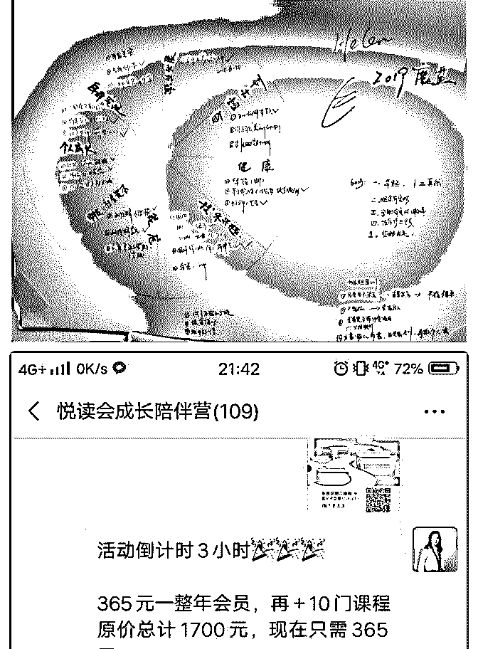
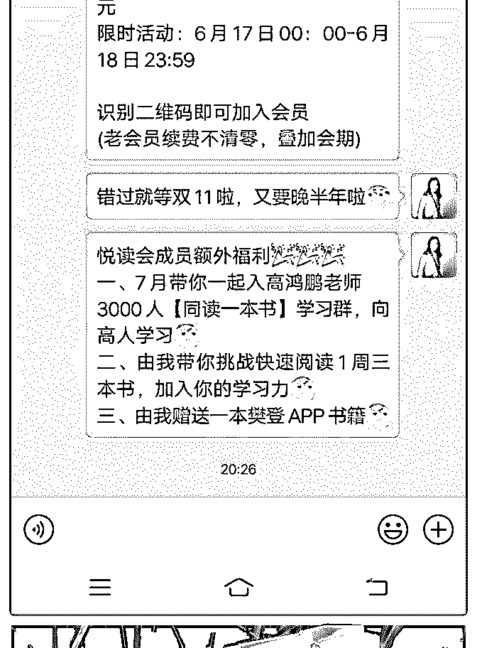
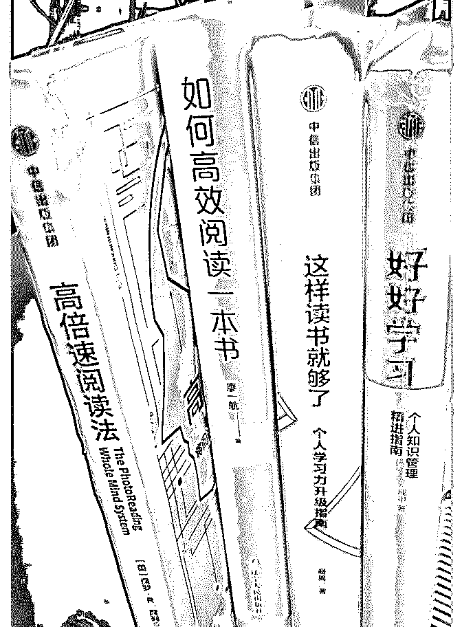
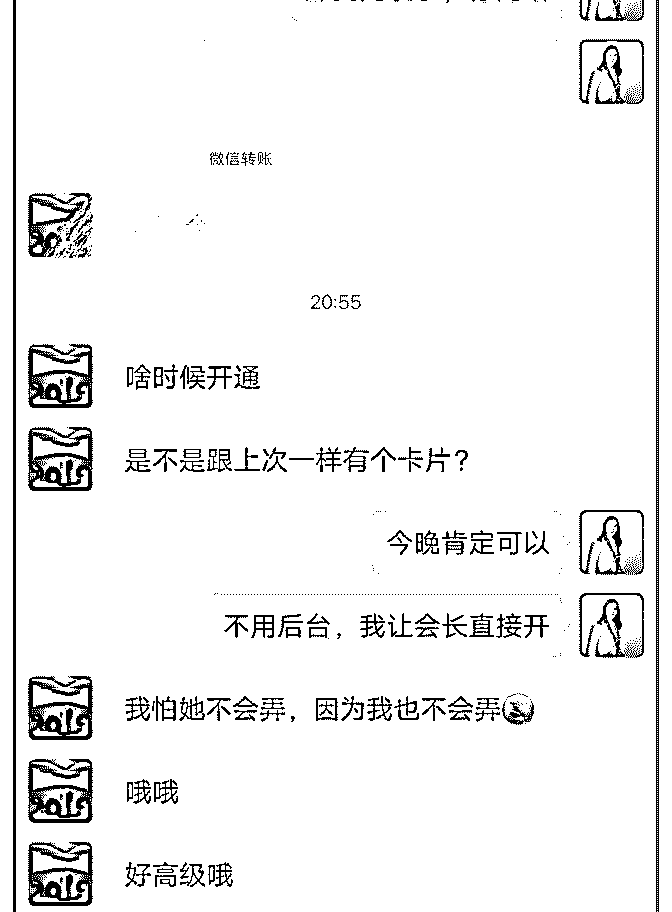

# 从 0 到 1，迈出了第

Helen 伍慧 : 从 0 到 1，迈出了第一步！ 6 月上旬开始加入泽宇核心课程，目前完成第一课的复盘总 结，同时践行分享，前后打卡了三次，就在 6.18 到来之时，抓 住时机，实现 2 倍赚回学费，以下我来和大家分享，如何通过 阅读从 0 到 1，赚到钱，实现个人的突破。 今天还从三方面分享：

一、2019 年为何开启副业？ 在我的 2019 年“魔盘”中，对职业发展、财富计划、健康、娱 乐兴趣、朋友社会资本等，都做了排程计划，我用一张大大 的书画纸，画下来，就粘贴在我的书桌前；原因很简单，时 刻提醒自己要全盘考虑自己如何多一生，计划每一年。同时 我的另一个人生终极追求目标：追求积极、愉悦、平衡生 活！好比人生是一个圆形满气的轮胎时，可以加速向前，如 果有一边不圆是折损，就会减缓你向前的速度，比如健康缺 失、人际关系缺失；那么在我的财富计划栏，除了 2000 元存 款，家庭投资理财 20W,最后一项就是非本职“赢利”计划； 同时开启副业还有一个直接原因，就是 2018 年-2019 年跨年的 三天中，在北京线下课，学习张萌老师的《财富高效能》课 程，初步了解在 5G 到来的时代，即将迎来大众创业，同时更 需要我们快速学习能力的时代，已然到来！ 二、如何开启副业落地； 副业开启计划是在 1 月初，单真正开始启动是在 5 月底，说明 这 5 个月的时间，自己还在迟疑，且仅仅停留在想，没有迈出 去真是的做，同时也没有自己个人副业的定位；当然还有一 个最大的疑虑，正常的创业需要一大笔存款！这些在截至 5 月 底前，我都有没有！ 但这 2 年我没有停止的是阅读学习，从 1 个月一本书，到 1 个月 2 本书，再到学习快速阅读后，达到现在的 1 小时 1 本书，，截 至 6 月中旬已完成听读近 120 本书；回头去看，成就自己阅读

飞跃的是知识 APP 樊登读书，再到参加线下课，再到参加樊 登的微企招商会，6 月的樊登会长注册，于是开启了定位，用 阅读做知识付费方向，副业计划开始着落。。。 三、第一笔小成果的喜悦和总结； 在 5 月底，开始实践微信语音分享，从和家里 2 个姐妹将育儿 书【正面管教】，在朋友 50+人的社群，总结年初的财富高效 能课程收获，半年后的践行体会，6 月初开始在自己拉的小社 群 40+人，分享【如额通过阅读增长见识】，邀约朋友一起来 线上演讲分享 2 场，后续自己再接着分享输出【如何快速阅 读】，结合自己阅读的 4 本书，着重解决三大阅读障碍： 1、精力不集中，为社群伙伴提供橘子集中法，通过假设抛、 放、放置头顶的橘子，集中注意力； 2、学了记不住，为社群伙伴提供简易思维导图笔记法，1 本 书阅读后，记录阅读目的、金句语录 5-10 条、学习致用总 结； 3、学了没有用，为社群伙伴提供用三个便签法，采用自我复 述知识点、结合自身实际对比、写下改进方案标签（贴冰或 笔记本），达到学以致用。 通过真诚的知识分享，并为社群伙伴互动讨论，建立社群朋 友对我的信任，在这个契机，同时联合 6.18 樊登读书卡活动， 成功成交 2 单，分别是 388！365！ 同时招募 3 位好友，带领 12 天找到 3 种快速阅读方法，挑战 3 天 一本书！！！

初创副业的路上，迈出了第一步！ 为加入泽宇而荣幸，在这里学习社群搭建、从 0 到 1 的突破， 感谢小鱼老师，悉心指导！

2019-06-21(3 赞)

孙明容 :

关注公众号"懒人找资源"，星球资源一站式服务