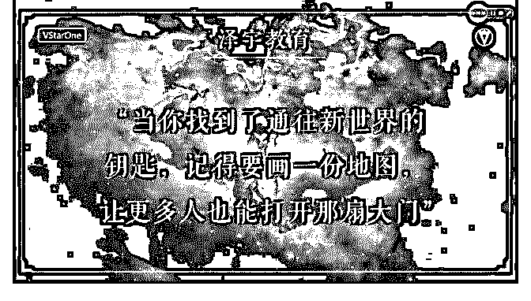

# 通过十五天的学习我

肖惠月 : 通过十五天的学习我在泽宇教育通过聊天变现 2200 元 的过程

一、关于复盘 6 月 1 日，我通过好友巩俐加入了泽宇教育，是抱着定位自 己，解决自己的迷茫期而来。 上了几节课，也没有找到自己想要的答案，头脑里概念非常 模糊。 直到 6 月 6 日晚上 9 点参加了 anna 老师的集体答疑以及分享了关 于焦虑的问题，我明白了我的问题出在了哪里，我前面几天 一次复盘没有写过，只是中间在头脑里思考了一些，思考是 感性的，将理性和感性结合起来，记得动手记录下来，会记 得更牢，俗话说得好“好记性不如烂笔头”。之后就开启了每 日一则复盘的规划。为了更好的监督自己，加入了 anna 老师 的重点培训群，每天打卡写复盘，得感想。

第二、关于借鉴 6 月 8 日的晚上 8 点 anna 老师邀请了金峰老师给我们做分享：如 何快速找到标签，快速学习，包括他的定位干货。 金峰老师讲到一个吸引力法则，对我印象特别深，定位好从 事什么样的事情，自然就会吸引一些相关的资源和人脉来帮 助到你。 我开始寻找一些优秀电话营销人的录音来反复听并进行相关 抄录，先给自己一个模板，模仿别人的比较好的语音语调语 句，每天就这样持续不断下去。就像小时候我们学写作文， 在会写之前老师会让背很多文章一样。 后来才发现这一点在泽宇老师的社交课中都统统讲到了，真 的很神奇，感觉泽宇教育的课程适用于各行各业。 在此重点说一下，自己感觉参加老师们的答疑和分享，比自 己苦苦思索，要更快速解决自己问题，通过聊天方向，让自 己吸收更好更快。

就比如说，我刚开始进去时只是想单纯的解决迷茫，后来在 一次次答疑中，anna 老师告诉我说 90％的人进泽宇教育来学 习都是为了变现，我们要以结果为导向，以变现来激励自 己，这样不断得到反馈，在一条道路上会走得更自信，走得 更远。

第四、自信 之前自我设限还是蛮严重的，经常否定自己，每句话完了之 后就加一个但是，不是特别肯定自己的思想。天呐，这在销 售过程中可是大忌，自己的品牌自己都不相信，自己都没有 自信，还如何说服别人，勾起别人的欲望，本身我们就是给 别人带去帮助的，再说产品本身也不差，非常好。那么有好 的地方就要大胆说出来，即使被拒绝又有什么关系，勇敢迈 出第一步，后面就会有无数个第二步，第三步……一定要相 信自己，不要事情还没有做就给自己设置各种障碍，最后永 远无法突破自己。 因为我们看不见对方，就只能通过自己的声音来表现自己的 感染力，如果不自信的去推荐自己的产品，听者在电话那端 是非常容易听出来的，自信的感染力会引起顾客感性的购买 欲望。 总之不要在做之前就想太多，先行动再行动，自信一点，每 个人都拥有无尽的潜能。 行动行动行动……这个词也是我在学泽宇课程听得最多的一 个词。

第五、专注和时间 泽宇课程有讲，我不怕一个人一天踢一千次腿，我怕一个人 一千天每天踢一次腿。如果一个人每天重复的做同一件事并 乐此不疲，他会不会更容易成功？在这十三天里，我每天都 给自己学习相关的知识，给自己每天制定一个小目标，每天 打多少个人的电话，每天通时多久，每天听多少别人的优秀 录音，运用泽宇说的如何与人社交，打开下面的话题，不断 重复说自己之前不熟练的话语，现在可以熟练的背出，打乱 顺序的组合，当你专注于一件事情，你会忘记你是在销售一

款产品，你只是将一款好的产品带给他，自己只是在帮助一 位需要帮助的朋友而已。都说你的时间花在哪里，哪里就会 开花结果。 不断的进行这样的刻意练习，久而久之，自己不用刻意也已 经形成了一种习惯，它就变成了自己血液的一部分。 第六、真诚 与人打交道，离不开真心，总是计较什么付出与得到，自己 会变成什么样，最后自己也不知道。当自己不知道如何去与 人交谈时，用真诚的话语，微笑的打开彼此之间的连接，更 容易放下别人的本能拒绝，因为每个人都有防御能力，自我 保护意识也很强。在别人未说之前，先亮出自己的真诚的本 意，就是在给对方一个安心。用自己的真情实露来打动对 方，自己还收获了一份友情，一举两得。

第七、学会倾听 之前是自己说话比较多，对方一般回应的是一句嗯嗯什么之 类的简易答复，两个人之间互动的关系不是特别好，你不知 道对方究竟想要解决什么问题，只是一味的表现自己的产品 好处，说到最后，自己越来越困惑，最后关系断裂。 一个好的推销员，无论是推销自己还是推销产品，一定是 80％在听别人说，20％是自己说，学会倾听很重要。自己是 去解决问题的，连对方存在什么问题都不知道，怎么解决问 题呢？ 其实在最后成交，我都很惊讶，因为我不知道我说的哪一个 点打动了对方买单了，我在和他交谈的过程中，我从来没有 想过他会成交，我只是把自己想表达的一些话说了而已，就 像和朋友一起我们只是在谈一个彼此都很感兴趣的事情而 已。

以上基本上就是我的整个变现过程，希望可以帮助到正在看 这篇文章的你，我很喜欢交朋友，如果你也想认识我，请扫 一扫我下方的二维码，很期待遇见你！ 最后非常感谢泽宇教育，以及在此遇到的每一个人，每一位

导师，遇见你们才明白自己原来还是可以去帮助别人的，即 使现在的自己只能发散一些微弱的光！[愉快]

2019-06-21(16 赞)

评论区：

Anna : 恭喜赚回学费，加油加油 Anna : 恭喜赚回学费，加油加油

明明 : [色]

关注公众号"懒人找资源"，星球资源一站式服务

# [色]我上班七年来

我上班七年来一直在做安全培训的工作，从获得第一笔工资

时就在想要怎么处理它，怎么能让它变得越来越多，随即便

开始了投资理财的学习实践道路～偶尔有人来问该怎么理

财、买哪只基金、什么时候卖，当时解答了发现效果并不

好，因为不同情况下需要不同处理措施，当时挣钱了不代表

下次遇到的情况也要这么做。几句话解决的，并不能让大家

真正收益。很感谢遇到明哲和核心课，让我持续输出并持续

思考，授人以鱼不如授人以渔，教会别人指数基金的投资体

系，那他在面临各种情况时都可以做出正确的决策，不仅仅

局限在让你什么时候买卖，而是变成你知道如何配置组合，

如何确定买卖点～

今天是加入核心课的第 24 天，前 23 天我按照核心课的要求， 输入输出，累积写了一万字+的理财文章，加粉 60 人+，可是 只有两位在咨询后发了红包，没想到明哲的一招“开训练 营”竟然就引来了四位付费学员，妥妥的赚回了学费！真是太 神奇了！ 在这 23 天中，每次输出的过程，都是一遍思考的过程。现在 的状态就是“才思泉涌，我要写作，我爱赚钱”~当发现真正喜 欢的事情后，你会情不自禁的去做，你会克服各种困难去 做，你会抓紧一切空闲时间去做~而且，在输出的过程中，我 又进一步整理了指数基金的投资方法，有很多之前没想明白 的地方、没有考虑周到的地方，都发现了解决方法，又一次

升级了自己的投资体系。 当然，这些对自己的提升帮助，都比不上明哲的妙计，让我 尽快实现了变现啊！

2019-06-20(7 赞)

关注公众号"懒人找资源"，星球资源一站式服务