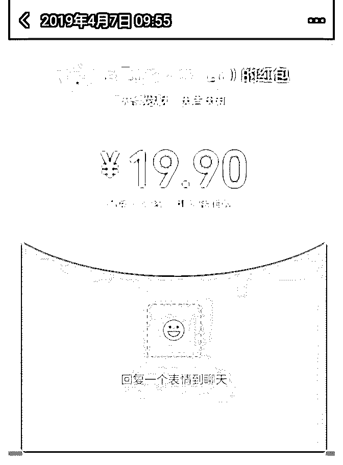
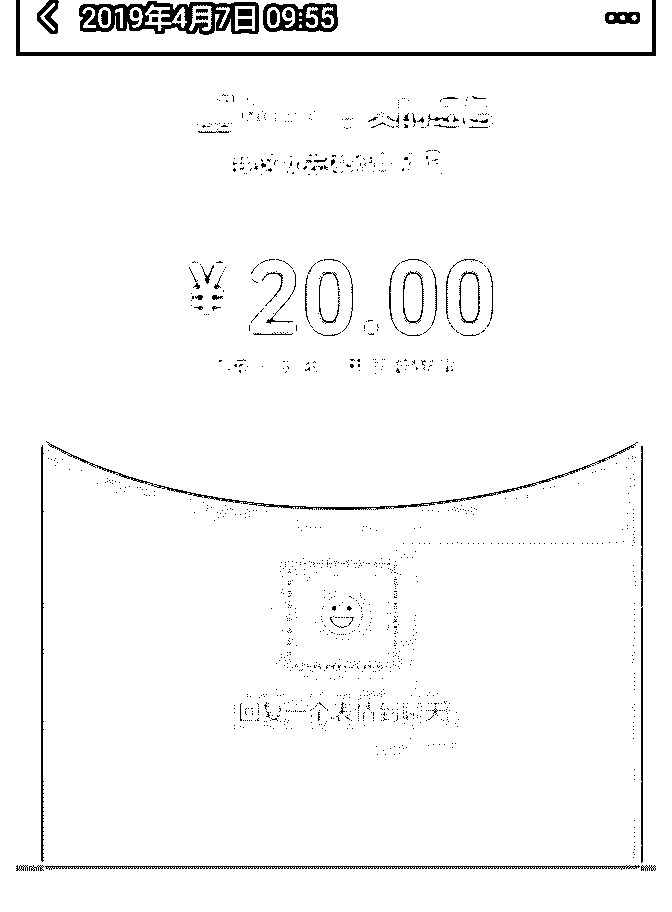
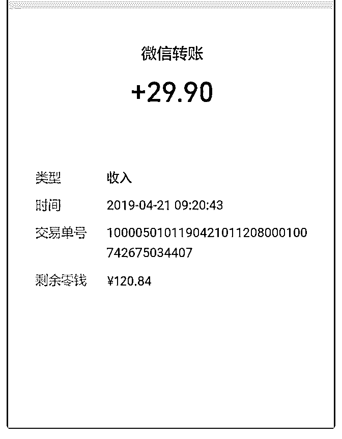
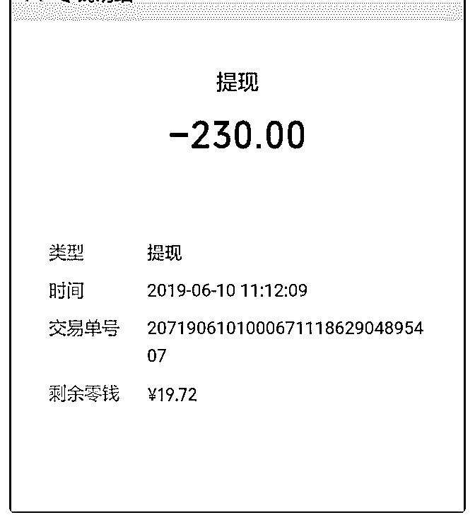
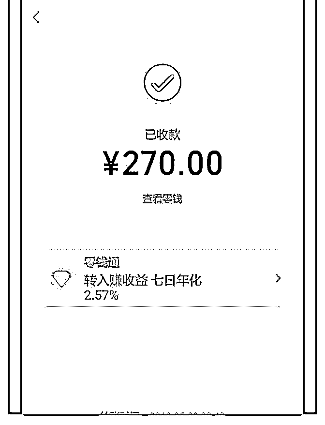

# 我在泽宇教育变现 3

我在泽宇教育变现 3000 元的过程

19 年 2 月份接触泽宇教育以来，通过不断蜕变，一直在成长、 收获。在泽宇教育里，我明白了自身的价值、找到了奋斗的 方向，更找到一条适合我一直走下去的路。

（一）自我介绍的重要性 加入泽宇教育之前，我没有感觉到自己很优秀，只是喜欢读

书写作，每天在各个平台上苦逼地写一些小文章，获得一些

很少的收入，想靠写作为生的梦想一直没有实现。为了生

活，我做过很多的行业：财务管理、直销、培训讲师、房地

产、文案策划等等，但始终没有过上自己想要的生活。

我一直在想，是不是自己的写作能力还不够高。我把我所有 的精力放在提高自己的写作水平上，收入也不是很高。为什 么很多写作爱好者只能把写作做为爱好，不能成为谋生的手 段？为什么很多写作者过着清贫的日子？我是该继续坚持自 己的梦想还是放弃，是不是要重新去选择一个能马上挣钱的 工作？这是当时我心里在纠结的问题。

2 月份，无意之间接触了泽宇教育，感谢带我进入泽宇教育的 苏比，我被她的自信和所描绘的未来所打动，她告诉我泽宇 教育里大咖云集，还会帮助我实现梦想，月入过万。

听泽宇的课，我首先明白了自我介绍的重要性，它能快速地 把自己销售出去，为我们带来被动粉丝和主动链接。以前我

也写过很多自我介绍、作者简介，但是没有一个标准的模 版。我是模仿一下这个人的，再去看看那个人的。泽宇教育 的自我介绍有专门的模板、看起来清晰有吸引力。最主要的 是在写自我介绍的过程中，有助教手把手地指导你找到自己 的标签并付诸于行动，去检测它是否适合你。我在这个过程 中有过困惑，标签也改过很多次，感谢苏比、波力和助教笔 盖，是他们陪我一步步摸索、实践，最终形成今天的版本。

通过这个漂亮的自我介绍和在泽宇教育里学到的思维方式， 让我在读书写作的人群中脱颖而出，5 月份正式成为平台写作 训练营的签约讲师，并全面负责拆书和讲书营的工作。平台 给我提供机会，帮我招收学员，我只管把自己在写作方面的 经验分享给学员，我就可以得到讲师提成收入。5 月份第一笔 钱打过来时，虽然不多，但这是可持续发展的一份收入。通 过这个自我介绍，有学员主动链接我，付费加入我的写作培 训小组。

（二）准确定位的重要性 泽宇教育让我明白可以把自己的爱好作为一种职业，可以无

限地放大自己个人的价值，可以产生很多的收入。刚开始的

时候因为自己的定位不明确，我定位为情感咨询师，因为我

长期在写情感文，给各个平台写的也是一些婚恋情感方面的

文章。感觉对这个领域比较熟悉，也积累了大量的素材，平

时的生活中也给别人解决过一些情感方面的问题。但是定位

情感咨询师后很长一段时间，我觉得和我本身的工作爱好没

有很好地联系起来。运作了一段时间，感觉很困惑，虽然招

到了几个学员，有了一点点变现，但是离我的理想还差很

远。

这个时候笔盖助教主动找到我，问我的变现情况。她非常客

观的告诉我，既然你擅长的是写作，你正在从事的工作也是 写作，你也在教一些人去写作，为什么不直接定位为写作培 训师呢？为什么非要选择情感咨询师？

我恍然大悟，情感文我可以一直写，我也可以教我的学员写 情感文，但我没有必要把自己非要定位为情感咨询师啊！特 别感谢笔盖助教那一次的点拨，让我调整了思路，重新修改 了自己的定位和自我介绍版本。这个定位让我感觉很轻松， 因为我平时也在做一些这样的工作，只不过没有形成个人品 牌，不会更好地发挥自己的价值。

精准定位以后，会吸引更多精准的人群主动链接你，最主要 的是你在提供给别人有价值的东西时，很有自信也很有经 验。我非常喜欢现在这种感觉，轻松驾驭并不断挑战自我完 成新的目标。目前我管理着很多的微信群，已经形成了一个 矩阵：写手群、投稿资源群、拆书群、互阅点赞群等等，这 些都和我的定位有关系，也能带来收入。

（三）思维方式的改变让挣钱变得更容易 泽宇教育让我明白教会别人的过程中可以获得更多收入。以

前我只是把自己定位为一个写手，把更多的精力放在

了“写”上面，靠的是个人的力量，没有组建团队的意识。泽 宇教育彻底改变了我的思维方式，打造了我多角度多维度开

发个人价值的渠道思维，明白了通过“教”更能让我获得想要 的财富。

现在是个“全民写作”的年代，很多人意识到写的重要性、愿 意去写，但是没有一套系统的课程，又没有专业有效的指 导，参加过无数个培训班，在各个平台穿梭，东学一下西学 一点。他们对陪伴式写作培训是有需求的。所以我把多年积 累的一些写作方面的经验做成微课的形式，或者是各种各样

的形式去输出，那么在输出的过程中也吸引到很多的学员， 他们会主动加我。我也招募到我的学员，我有自己的编辑 部，我会帮助他们去对接各个平台，让他们去写，并且提供 修改建议，帮助学员过稿。

这样的被动收入，我觉得非常的快。现在我可以说不仅仅是 一个写手，当然了，我有时间的时候我也会去写。但是没有 时间的时候，通过讲课有收入，通过招收学员有收入，虽然 收入不是特别的高，也是让我很满意的。泽宇教育的学费早 已经几倍地赚回来了，最主要的是在泽宇教育的思维方式， 让我感觉挣钱不再那么艰难了。

（四）找到持续发展的一条路

“找钱容易找路难”现在这个社会，靠苦力、脑力都能挣点 钱，但能找到一条可持续发展的路很难。泽宇教育让我最大 的收获是找到了一条适合我的路子，再也不用换跑道了。

假如没有泽宇教育，也许我还会去找到传统的一些职业去 做，也许我还是一个很苦逼的写手，也许我未来的路还不知 道该怎么走。通过加入泽宇教育这一段时间的实践，让我明 白，我这条路是选对了，写作培训师将是我接下来一段时 间，要奋斗，要努力的方向，我再也不用去做那些能赚钱但 不太喜欢的职业了。

方向不对，努力白费。很多人都很努力，但是他没有方向， 不知道该往哪里努力，最终没有很好的结果。所以说泽宇教 育最主要的就是给人们一条适合自己的路去走、去奋斗，这 是我在泽宇教育中最大的收获。

开始的时候，我只是想听一听他的课程，得到一些写作的灵

感、赚钱的门路，而没有想到的是他给了我一个全新的人 生，让我以后的成长之路上不再困惑，让我懂得了自我的价 值，让我找到了我自己奋斗的方向。我只想要一片树叶，却 给了我整个森林，我只想要一片雪花，却给了我整个冬天， 我只想挣到一些小钱却给了一个事业的机会、一条持续发展 的路子。感谢泽宇教育，感谢帮助我的各位助教，感谢所有 的人，感谢笔盖助教一次又一次的激励我。

良好的沟通来自于真诚的自我介绍：

【姓名】娟子

【坐标】广西

【标签】写作培训导师

【经历】1 爱好写作，参加过魔鬼训练营等知名写作培训课程 多平台情感爆款文作者、40 天写出 10W+小说 平台签约写作训练营讲师、拆书、讲书营导师，公众号编辑 建立多个写作+自媒体矩阵微信群

【我能提供】

1.零基础写作培训、陪伴式服务

2.一对一辅导，提供修改建议

3.对接写作平台，提供变现渠道

4.写作讲师培训，打造个人品牌

4 月份做情感咨询的时候，因为不太自信，只敢收 19.9 元，后 来把定位改为写作培训师以后，一开始收 29.9 元，后来变为 88 元。截止现在，我变现超过 3000 元，我根据不同的人群需求 定位不同的收费标准，感觉非常好！很多收款截图都没有保 存下来，这只是其中的一部分。

2019-06-20(10 赞)

评论区：

宋涛@小米大叔 : 没有留二维码

娟子 : 谢谢提醒[呲牙]

宋涛@小米大叔 : 想加你好友都没机会

娟子 : shj18634385752

娟子 : 请加我微信 shj18634385752

情感导师柠檬 : 优秀，向有结果的人学习。 gnm20110609，借楼，情感咨询一对一私教

Gemini : 终于找到娟娟老师的笔记了，学习，受用[强]

Helen 伍慧 :

关注公众号"懒人找资源"，星球资源一站式服务