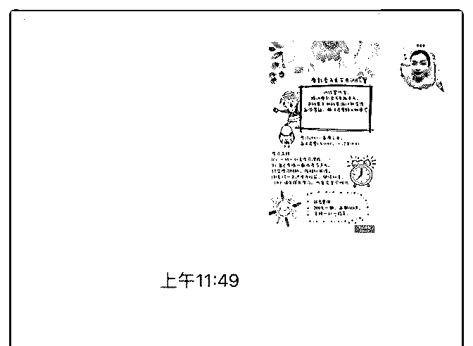
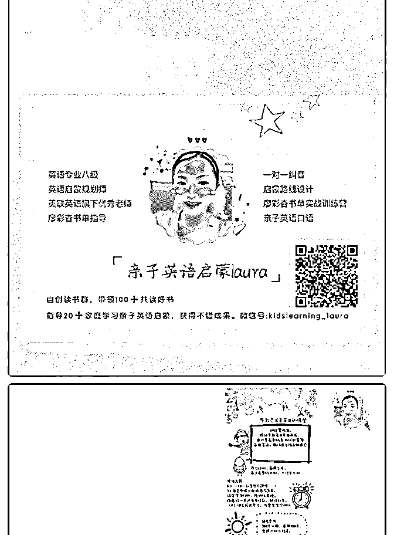
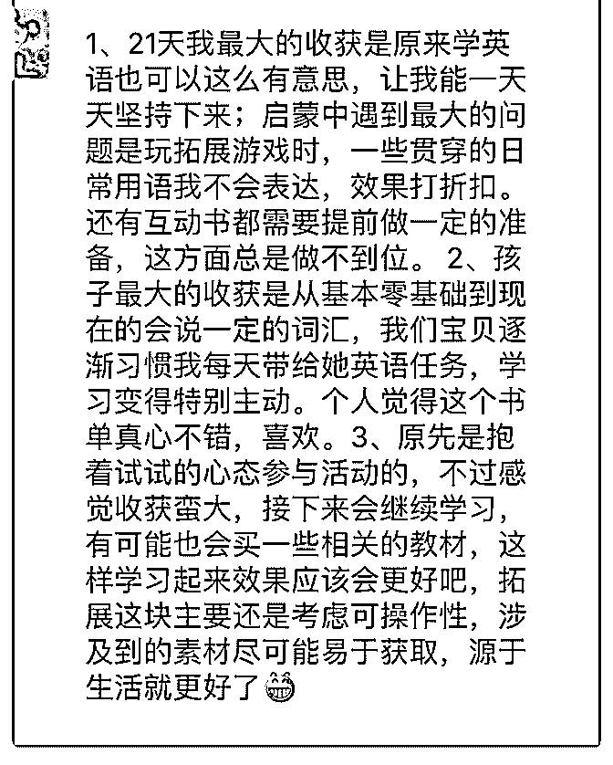

# ＃庆祝成果＃

laura_ 李 : ＃庆祝成果＃ 经过了一个月的核心课的学习和实践，终于实现了第 1 次和第 2 次变现，把核心课的学费赚了回来。还因为推荐了新的学员 加入泽宇，获得了又一次的变现。以下是我的心得。 第一步，找标签定位 刚开始加入的时候，我是听泽宇老师的课程开始思考自己的 标签和定位。在经过了云盘精灵的学习和市场分析之后，选 择了英语亲子英语启蒙这个标签，然后细分到了具体的产 品。项工作做好之后就开始准备概念验证，大概在五月 22 日 发布了自己的第 1 条，免费的招募启事。因为英语这个领域， 做 1 对 1 的话，很难短时间内看到效果。所以我选择直接用训 练营的方式，结合 1 对 1 的辅导，开始了我的概念验证。刚开 始招募的时候，有大概十几个人进来，因为我按照之前发 的，满 15 人就封群。强调的是小班化的教学，所以后来有， 想要加入的朋友，我就直接变现了。第 1 次变现是 68 元提 21 天 的服务，虽然金额比较少，但是至少是对我品牌的一个认 可。 找到标签，定位精准，是你能否成功的关键。标签可以来源 于你的兴趣爱好，也可以是你擅长的工作，最好是有一定的 专业背景和背书的支撑，这样子建立信用信任感更容易一 些。比如说，如果你喜欢跑步，并且你坚持了很久，你在这 方面也非常有经验那么你就可以你这个为你标签。你可以为 别人提供什么样的服务，或者咨询。你需要学习什么样的专 业技能？才能够让你的目标群体信任你。跟着你学以后，可 以从原来的状态达到理想的状态。这些都跟你的最初的标签 定位息息相关。 第 2 步。深度的学习，你需要的标签的相关的专业知识，并且 在朋友圈坚持输出。发朋友圈的频率参照老师课程上说的， 每天 2-3 条可以是干货也可以是生活。还要注意发圈的时间

段，在合适的时间下单，可以吸引到更多的流量。 除了发布 朋友圈干货之外，我都有坚持在简书上面写文章，坚持复 盘。针对体验中的用户，主动的沟通，提供服务，让他们更 加信任我。 第 3 步，发布免费的训练营，或者是咨询名额，刺激咨询。在 与目标客户交谈的时候，重点要把握你能够为他提供什么， 他需要你给他解决什么。你做什么可以帮他达到理想的状 态？有没有一定的数据的支撑。你想想你自己产品的优势是 什么？为什么我不选择其他品牌，要在你这里买产品？这个 产品可以给我带来什么样的体验，等等，这些都是需要一些 话术的。当有客户来咨询的时候，一定要把握机会，用数据 说话。比方说，客户说，我是英语小白，真的能给孩子启蒙 吗？我就跟她说，我训练营里面的宝妈，她说她已经有十几 年没有开口讲说过英语，对自己不是很自信。但她天都会找 我纠音，认真学习每天的内容，所以孩子就很容易出结果， 对英语很有兴趣。 第 4 步，与客户交谈之后，让她免费的试用产品，并鼓励她去 尝试，不过你得对自己的产品很有信心，相信用过之后，就 能够对她有帮助，这样子的话才会有回头客。 我的这个顾客 就是在试用了我的课程之后，觉得可以实行，然后付费参加 我的训练营。当然我在发圈的时候，有运用老师说的提问式 的方法，就是把自己的专业的一面展示在客户的面前，让她 对我建立信任感。 比如说我的本职工作是教师，我就把我上 课的一些视频或者是一些可以证明我是这个工作的，图片发 到朋友圈。

PS:实践中碰到的困难及解决方案。 在 21 天免费训练营结束之后，我就开始想目标用户推广我自 己的付费课程，并且开启了朋友圈的第 2 轮招募。其实在第 1 次招募收费课程的时候，我是失败了的，当时，笔盖老师跟 我说，让我试试做一下概念验证，结果一个人都没有。后来 找老师分析原因，她说可能是价值塑造不够。还需要积累案 例，所以我就想先把我的第 1 个训练营做好。把里面的目标用

户，深度的沟通和指导，让他们进入到我的付费训练营里 面。后来，21 天的免费体验结束了，里面一共有 3 位用户坚持 打完卡。我本以为他们一定会付费，结果他们虽然都给了我 好评，也认可这套课程确实能够帮助他们的孩子，喜欢英 语。但是因为接下来两个月，没有足够的时间，所以，准备 过段时间再说。这个真的让我很受挫，我一度想要放弃这个 标签和定位，但是，就在这个时候朋友圈的发布收到了一条 留言，一个客户的咨询。我就主动的为她答疑解惑，并且让 她免费试用产品。最终成交了我的第 1 个用户。虽然过程很曲 折，但至少结果还不错。后面再系统的学习一些引流的技 巧，希望能够受到更多的变现。 总结:坚持自己喜欢的事情，并且能够获得一定的收益的感觉 真的很不错。要大家坚持复盘，持续的学习，有问题及时的 找老师问，就一定可以实现自己的目标。

2019-06-17(5 赞)

关注公众号"懒人找资源"，星球资源一站式服务