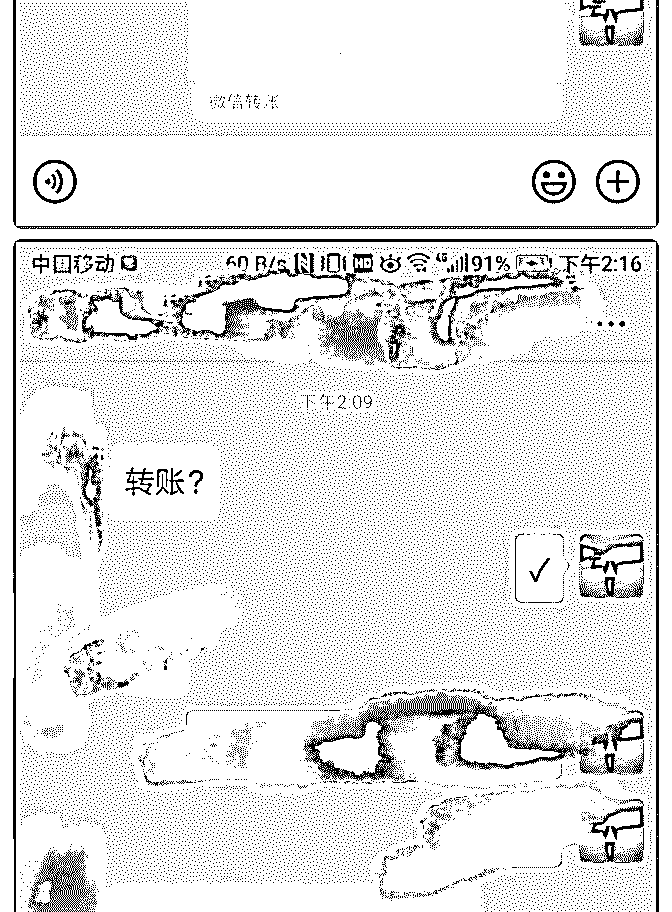

# 加入泽宇 24 天赚回

大鱼 : 加入泽宇 24 天赚回学费

我是一名大二的学生，从刚开始的观望——加入泽宇教育

——收到咨询小红包——开训练营赚回学费。我的心路历程

算的上是跌宕起伏，中间也碰到很多难题，有失落有崩溃有

惊喜，在这里要特别感谢两个人——一个是助教明哲，不管 遇到什么问题都去找他，助教都会及时给我提建议解决；还

有就是唐芳，她是我最早在泽宇认识的人，在我一度崩溃甚 至差点打算甩手不干的时候拉回了我。

在泽宇教育的这些天，感觉自己完全就是活在两个世界里

——

一个是泽宇教育给我打开的世界，另一个就是现在身处的原 来的世界。在这两个世界所认识的人，所接触的价值观简直 是翻天覆地。比如我发一条有关于我最近学习内容的朋友 圈，身边的人会给我评论“进传销了？”“你是僵尸吧？”，而这 些天从泽宇认识的人会给我评论“牛逼”“加油”。

其实这些天已经看开了，有些事其实也不用去跟别人反驳， 也许你俩思维根本就不在一个水平线，把精力花费在那些相 信你，和你同频的人身上就好。

说了这么多，其实就是想感谢一下泽宇教育，给了我一把开 启新世界大门的钥匙，引领我进入了之前自己想都不敢想的 世界。

定位精力管理，初衷就是看到身边很多人对时间根本没有概 念、规划，流水账式生活，拖延，迷茫。

这其实是和我的大一生活是非常像的，每天就教室宿舍餐厅 三点一线，除了游戏就是看剧，现在回头想想自己当时真的 是想玩游戏想看剧吗？不不，只是如果不去找点事做，这么 多空闲时间去干嘛呢？

所幸自己及时察觉到并且开始进行改变，通过精力管理这段 时间的学习更是让自己摆脱了这种状态。所以就想帮助更多 的人，摆脱这种无意义的状态，去回归正道，实现自己的人 生价值。

人都是遵循最小阻力原则的，都会偏向于做那些不用动脑 子，最简单的事去做，所以我们一有空闲时间，就会去做这 些对自己成长没有意义的事。

要想成长，去实现自己理想的人生价值，精力管理是必不可 少的一部分。其实我们管理的其实不是时间，而是价值观和 目标，我们是根据自己的目标来安排每天的计划，从而最大 可能利用好每天的时间。

所以一定是要明确什么对自己是有价值的事、什么是重要的 事，这样才会创造更大的价值。关于这点有幸认识了一位精 准定位个人品牌咨询师，来帮我一块管理一个训练营。

说到训练营，就是我赚回学费的方式，主要就是帮助大家通 过这个训练营，能找到自己的人生目标并应用精力管理去实 现它。

由于这些天自己专注学习课程，也没有怎么引流，所以找的 学员也是这些天自己主动去加的一些小伙伴，所以在这里感 谢信任自己的小伙伴

这里再给大家分享一些小干货:

1.其实我们每个人，每天给自己规定三件对自己来说重要的有 意义的事，然后下一天让自己必须去完成，实行一段时间之 后，你会发现自己的生活发生很大的变化。

2.我们应该把 80％的精力去安排在 20％对自己重要的事上，而 把剩下的 20％精力去安排到那 80％的琐事上

3.效率非常重要，有的人想一度增加时间的长度去迫使自己完 成任务，最典型的就比如加班加点，其实应该回头想想怎么 去提高效率。比如你可以试着给自己规定一个限定时间去做 任务，培养自己的专注力等。

4.其实每个人的睡眠周期五个小时就够的，早起最大的困难其 实就是不愿意离开床，只要想办法让自己离开床以后，早起 也会变得很容易的。

最后，第一期 21 天训练营成功举办！

2019-06-17(17 赞)

评论区：

颖雪晓晴 : 我的微信 15833915026，希望链接你

霜夜 :

关注公众号"懒人找资源"，星球资源一站式服务