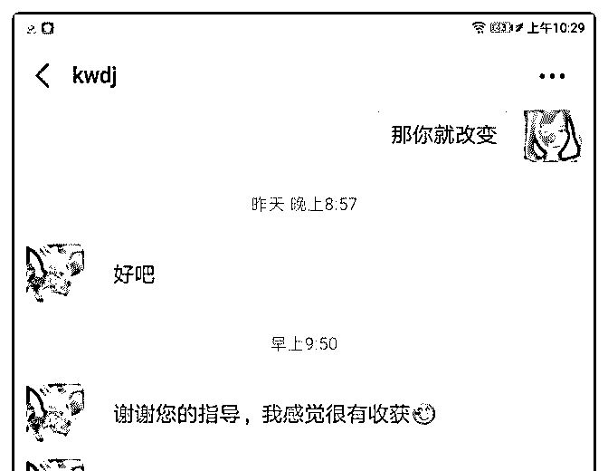
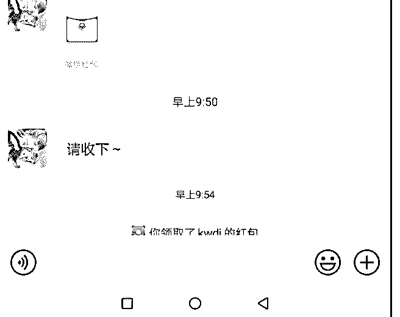
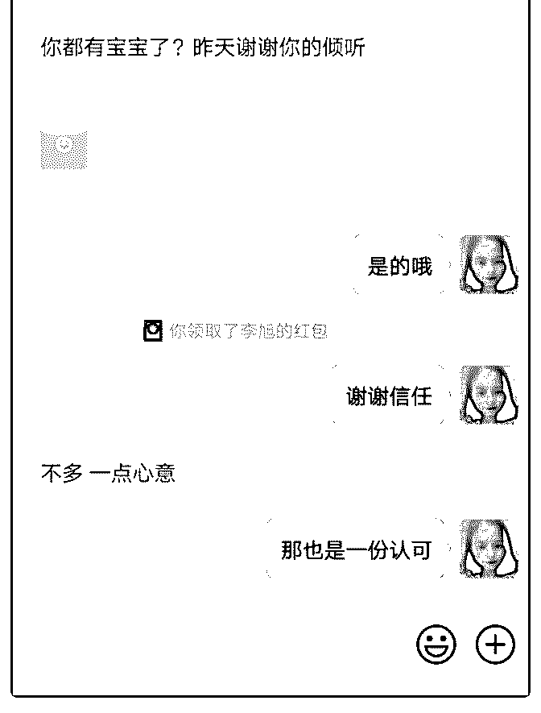

# 终于把核心课的学费

终于把核心课的学费赚回来了，这个过程有点慢，但还好不

迟。其实我一直都在摸索，我到底适合做什么。其实我觉得

不管做什么都贵在一个坚持，贵在一个执行力。在这里我要

感谢执导过我的人，特别是明哲，同时呢，还要感谢在此过

程中鼓励过我的泽宇学员们。

刚开始定位我很着急，甚至很迷茫，几乎快放弃了。现实告

诉我不能放弃，因为我现在是一名孕妈，我不想总是靠老

公。我总得有自己的一份收入，我才过的更踏实。我定位过

朋友圈为学，但是我发现这个并不适合我。因此，我总结了

一下: 不是别人能够赚钱的副业就适合自己，而是适合自己的副

业，才能够赚钱。 然后我经过了几天的思考，最后选择了情感咨询。因为我喜 欢跟别人解答情感方面的困惑，平时我也喜欢倾听。我的朋 友们都喜欢找我谈心，在我这里都能找到一些安慰和建议。 再加上我自己也经历过一些情感问题，自己调节情绪，自己 安慰自己，从中走出来。到现在找到一个真正相爱的伴侣。 一开始定位情感咨询，我是不自信的

，我总是觉得自己专业水平不够，所以，当有人来向我咨询 的时候，我都不敢开口向别人说，我这是要收费的。因此， 只要别人不提费用的问题，我就不提能免费咨询，就免费咨 询，毕竟帮助别人也是帮助自己。 前前后后有 10 几个人向我咨询，刚开始我比较热情，可是后 来发现有的并不是很渴望得到解决，回消息有一条没一条 的。这很浪费时间，因此我的重心也不在他们身上。 所以我把重心放在那些愿意听我解答的咨询者身上，毕竟时 间有限。 引流虽然不多，但是比较精准。刚开始我还很急躁，因为我

用小号做的，好友很少。我在想要怎么引流来扩大好友呢， 后面我发现并不是好友多，才有精准的客户。好友不在多， 在于精。 其实我很感谢来向我咨询的一个高中生小妹妹，她前后向我 咨询了两次，而且她是一个很懂得感恩的人。两次都用实际 行动来表示对我的感谢。这段时间我学了很多引流的方法， 自己也摸索了一些，比如去贴吧、今日头条、百度知道。也 有不小的收获。 现在呢别人向我咨询，我还会送他们一本照片书。因为我总 觉得自己做的不好，不够专业，所以在咨询结束以后送一本 照片书表示感谢。 如果你有情感方面的问题，可以来找我。如果你有引流方面 的问题可以一起交流。我是霜夜：Yedda94166

2019-06-17(11 赞)

绿指 :

关注公众号"懒人找资源"，星球资源一站式服务