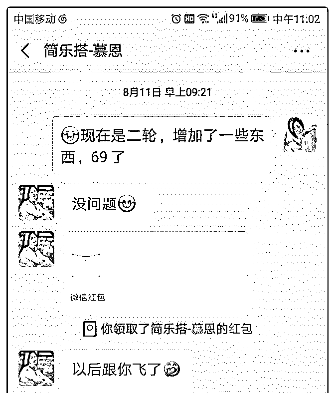
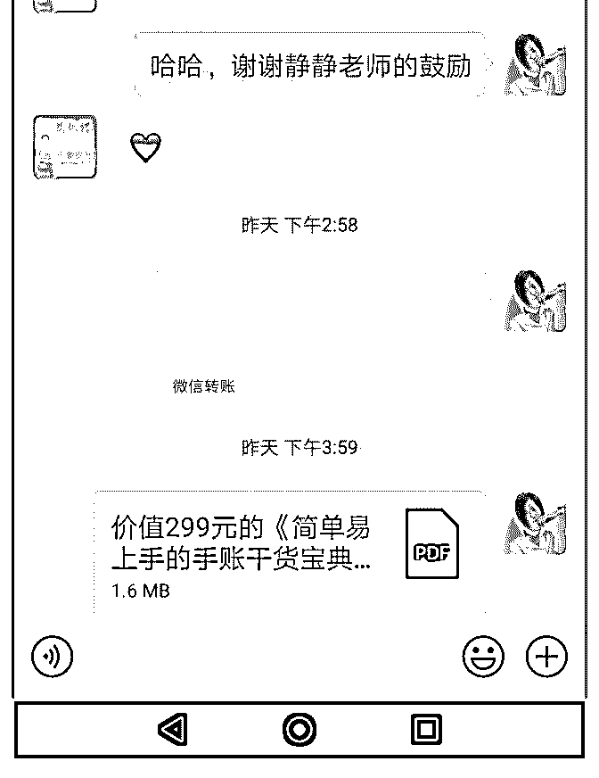

# #庆祝成果 如何从

林子预 : #庆祝成果 如何从零快速开始，赚回学费，收款 5100，实现投资回报率 70%

我是 51 劳动节休假结束后开始定位开始做投资理财的，短短 一个月不到的时间赚回了学费，而且还有 70%的收益，在这 里真的真的非常感谢小鱼老师，也感谢专注，拼搏的自己。

在这里写下自己的复盘，和前行的大家一起努力前行。

(一)重新开始不可怕，可怕的是没有行动力，也不愿意沉下来 去学习，去不断培养自己的专业能力和专注力。

其实我加入泽宇教育已经快一年了，但是这一年里，我不知 道自己适合做什么，也不知道到底什么是自己真的喜欢的 事，一直处于，迷茫焦虑，痛苦中，经常看别人晒单，会让 我很难受。一起同学，突然的就变得比自己厉害进步好大好 大。曾一度我还想放弃自己，认为自己不适合做个人品牌。

一直到我开始做情感咨询，然后到转到现在无比热爱的投资 理财。才发现，原来，零基础小白只要你愿意行动，愿意积 累，时间会带给我们结果。而且小鱼老师说的特别高价值， 你只有做一个打通以后，转到其他才能做起来，毕竟，赚钱 的渠道，能力是互通的。 说起自己做情感咨询，确实也做出了结果，百万营销话术基 本掌握，已经能成交价格 998 的咨询。但是，自己做起来没有 那么喜欢。相比之下，我更喜欢研究投资理财，可能是做为 从小的财迷，就觉得，真的没有什么钱，比投资理财钱生钱 再简单不过了，而且需要付出的时间精力也没那么多，稍微

努力学习，掌握投资逻辑，钱生钱会变得很容易。

自 5 月开始定位投资理财后，我特别专注，认真，去沉淀自 己，曾经熬夜去学习银行螺丝钉的课，下班路上听简七理 财，秦小明的金融思维，等等，笔记码字超过 5 万。当然，在 去年 10 月开始我就已经开始找有结果的的老师认真学习，践 行，也取得了较好的实践成果，所以才有了 5 月的勇敢决定。

所以，我想分享的是，当自己还是一张白纸时，可以不着急 变现，但是，一定要去学习和积累，重要的还要自己去践 行。曾经在小鱼老师的访谈里我记得一句很经典的话，我们 做为一种商业行为，可以先学会，而且自己践行出结果，再 去教给别人，给别人解决问题。这句话给了我很大启发，确 实啊，这也是一种价值感的传递。

(二)决定做了，开始了，行动力一定要持续。 可以说从定位理财开始，我基本没有一天不在学习，不在认

真写朋友圈，不在认真服务学员，哪怕会学校了，有事，但

是，只要有时间，还是会去解答学员的问题，还是会去看

书。

之前有朋友问我，你怎么会那么多流量，你怎么做到的，短

短一个月不到，招募学员 50 ，其实不夸张的说很多学员是来 自我的朋友圈。朋友圈很多时候不仅我们自己在看，别人也

会注意我们，所以，一定要大胆得去展示自己的价值，告诉 别人你在做什么，实事求是你给他带来什么结果，别人是怎 么反馈你的，这些都非常重要。

(三)承诺别人的一定要做到，辅导学员一定要耐心，这样更容 易收集好评，激励我们成长。

我的理财训练营报名 50+到现在我已经完成个案辅导 70％ 且

80%的学员已经真得开始实操起来，跟我一起节流，开源， 保护自己的信用，积累财富。这种成就不仅利他，也是非常 利己的，因为你会越来越有使命感，成就感，特别是当学员 跟着自己一起看推荐的书单，大家会有一种比赛的感觉，甚 至是打怪升级的上瘾感觉，因为投资理财真的不是一件事， 而要想大家进步，我自己就得倒逼自己成长，才能把更多知 识去教会她们，而且她们如果看了书单，这样交流起来话题 也会更多，更轻松。

最后感谢泽宇教育，感谢我的助教小鱼老师的耐心辅导，也 感谢相信我的朋友。希望未来的自己能越来越好，带给别人 更多价值。

在泽宇教育，未来可期。 期待链接优秀的你，一起赋能前行

2019-06-06(14 赞)

Eric :

昨天听完了核心课程

昨天听完了核心课程的所有内容，接下来开始听导师计划。

一边听课一边执行，这个过程还是挺有趣的。

从 5 月 20 日（520 特别好记）加入到现在，学到了不少升级思 维的内容，通过咨询师这个角色赚回了核心课程的学费，合 计收入 516.56 元。

“超好超值的攻略”是付费用户的评价，这些红包和转账，体 现的是有人愿意为价值的旅游咨询买单。

在概念验证上又更上一个台阶，从免费咨询到付费咨询的成 功过度。

对外引流也吸引了很多喜欢旅游的伙伴，他们跟我有着同样 的热爱，有的缺乏经验。你们的链接，代表着兴趣和需求。

非常感谢，给予红包支持和鼓励的伙伴。 感谢助教龙哥，好朋友荣玲的一路支持，还有感谢我自己的

坚持 0.0。这是我的第一步，也是一个新的起点。祝愿我自己 通过咨询师，早日实现下一个目标月收入 2 万，加油！

2019-06-06(2 赞)

评论区：

丽君 : 加油！你的目标一定会实现！

自然健身 :

重振旗鼓的麦克 三

重振旗鼓的麦克

三天斩获两单，收入 1300 一个是聚星会成员，简单的沟通就锁定了增肌塑形的目标；

一位是学员介绍，第一件事就是让我收费，接着进行语音咨 询，对我的专业知识非常认可！

我的定位是健身，科班出身的健身教练，花费大量精力时间 打磨出了一套系统的减脂增肌知识，本以为能够帮助很多人 解决减脂增肌问题，但是今天的引流让我认识到了问题所 在： 一、碎片化知识时代，大家习惯了当伸手党，付费意识不 强。面对这个问题，我们不能压低姿态，而是需要精准定位 目标用户，从朋友圈判断个人的付费意识，这点很关键，不 然聊了很久虽然锻炼就百万营销话术，但是浪费了许多时间 精力。 二、个人定位的专业知识还需要更精更细，准备好常见的问 题回答，这可以节省时间精力。 三、做个人品牌时间精力就是金钱！ 目前要做的就是三个字，出效果，效果好了，招牌打起来 了，学员就来了。

我是麦克，有一套系统的减脂增肌知识，已经帮助 300+小伙 伴解决减脂增肌难题，欢迎链接我。

2019-06-06(5 赞)

评论区：

A 阿伟私教 : 加油！！！

关注公众号"懒人找资源"，星球资源一站式服务

加入泽宇教育 15 天

星儿 : 加入泽宇教育 15 天，突破了自己，第一次带团队 4 天拼

15 万业绩 pk 第一，个人业绩 16000+，完美蜕变！

终于来做此次复盘，有点激动，前几天的 pk 太过于专注，松 懈下来很是疲劳。今天，状态良好，我来仔细复盘下。

大家好，我是星儿，标签是护肤达人，在代理纯天然自然洗 护品牌。5.28-6.2 公司展开了为期六天的销售实战课程，其中 四天实操。当天要求用 1 分钟语音竞选的方式自愿参与竞选， 团队打乱，自愿选择队长组建新的团队。共九组，每组 13 人。很荣幸我走出了第一步，勇敢地语音参加竞选，并成功 被选为团队长，带着 12 名陌生队友进行 pk 比赛，平生第一 次，紧张又兴奋。

对我而言，没有太多的带队经验，经验也只限在我的会员顾 客群，从没真正打理过代理群，不知道怎么培养，其实心里 还是有点没底的。所以，这次的竞选是对自我的一次挑战， 也对我半个月泽宇学习的一个检验，突破自己，尝试对立 面，不要自我限制，人生无所不能。

当 pk 开始后，第一天我们团队业绩从第四名到第五第六，再 到最后。后来经过鼓舞士气，第二天业绩逆袭第一，并一直 保持稳定，拿得最终的第一。其中做了很多的努力，不仅为 团队做业绩，也一边为每个人做私信辅导。这里，我想和大 家分享下销售和带团队方面的心得，因为这是我这次收获最 大的地方。

第一，关于销售心法：

❶销售是人心交易。 为什么这么说，来举两个例子。即便是我们心仪很久的商 品，如果是一个你不信任或者印象不怎么样的销售人员的话 你可能不会购买，转身离去了，对不对？但，相反，即使你 没有消费的欲望，但也有可能被一个销售员莫名成交，付款 购买。

这就是说，销售是门人心学，有时真的是非理性行为。你要 懂得洞察人性，不然，永远走不进顾客的心，想成交那就更 是难上加难了。所以，往后千万别自顾自地宣传产品，你要 互动要交流，要走进对方的心。什么破冰啊，痛点啊，都是 为了引起对方的情绪共鸣，让人感同身受。

晓之以理，动之以情，基本成交在望。

❷销售是信念的传递。 很多人买单不是因为你的产品广告，你宣传的效果，而是你 对产品的信念和热爱。

你对产品有 50 分信心，对方能感知 30 分； 你对产品有 100 分信心，对方能感知 50 分；

所以，只有你对产品有 200 分信心，对方才能感知 100 分。信 心不只体现在付钱购买环节，还会持续到顾客使用产品的效 果体验上，这也就是常说的，信者医治。你可能会觉得不可 思议，那我再说几个。你肯定知道庸人自扰，杞人忧天等的 故事，也听过自我幻想疾病并最终真的因疾而终的悲痛案 例。

这点我认为是我们大脑的认知系统，大脑分不清现实和虚 幻，它的运作模式全屏你的感知、情绪，然后按着你的情感 传递来运作。这点很玄妙，但是真的奏效，这也就是很多人

说的心想事成。

❸销售除了植入观念，还要点燃情绪。 其实大部分消费者，都是被市场教育好的了，如果你的产品 符合这个定位，那么顺水推舟很容易，如果反其道而行，就 要教育在先，先给顾客植入符合你产品定位的一个观念，再 去点燃情绪。

什么是点燃情绪，就是你继续使用了之前的产品会怎样，用 我这个产品会怎样，也就是痛点挖掘和功能匹配。只有情绪 到为了，顾客才会有付款的行动。

这就是观念-情绪-行为模式。很奏效，因为是最本质的行为逻 辑。所以适用任何事人和事。

第二，关于销售十大素质。

❶准确定位自己 销售者不是产品的解说员，而是问题的解决者。所以，要准 确定位自己。把自己放在问题的解决者上，勇气和底气会更 多些。我们不是说要挣谁的钱，但我们肯定是解决了谁的问 题，不然交易肯定不会成立。

❷充分了解产品 作为销售人员，你要充分了解你所销售的产品卖点和优点， 也就是你这个产品的与竞品的差异点，以及优点。这是最基 本的知识，也只有在充分了解的基础上，才能灵活运用。

❸胆大厚脸皮 销售不能太被动，有可能你的那一句多余的话，就引起了消 费者的注意，所以，想要成为销售高手，离不开胆大厚脸皮 的推荐产品。当然，要先看对象，不是逢人都推荐的。话术

要私人订制。

❹需求匹配 这也就是常说的见人说人话，见鬼说鬼话。如果你的产品卖 点，不匹配消费者，你浪费了一天口舌，也是徒劳无功。所 以，我们要学会见机行事，看人下单。 曾经我也不是很理解这句，但现在越来越深有感触，匹配需 求，才有交易的可能性。

❺掌握人性学 销售是基于产品和消费者之间的一个连接，左手产品，右手 消费者。所以，懂点消费心理及人性学，会对我们的销售工 作起到推波助澜的作用。 当然，掌握了人性学，可以应用在与人社交的任何场合，是 作为高情商的必备素质。

❻懂得感恩 作为普通人，也提倡做个感恩的人，那作为销售者，更应懂 得感恩。 销售都是基于信任的行为，所以，我们要对相信我们的顾客 表达感恩。正如著名推销员乔·吉拉德的所作所为。他向所有 的顾客一一表示感谢，邮寄感恩明信片，记得对方的好。只 有做好了人情铺设，销售自然不那么难。毕竟每个人的背 后，都有 250 位亲朋好友。也就是“250 定律”。

❼懂得学习 销售好做，也不好做。遇到的人是形形色色的，就会有不一 样的聊天话题。想要快速赢得陌生人的好感，就要在掌握对 方的兴趣爱好之后，还能调侃上几句，拉近彼此的距离。因 为谁都喜欢和自己相像的人，情感到位，下单就位。

❽掌控情绪

销售可以说是信念的传递，也可以是情绪的传递，所谓销售 者，不仅要对自己的产品信心百倍，还要情绪高昂的进行解 说，因为情绪也是可以传递的。也就是，你多么热爱和信任 产品，对方下单的概率就有多高。 所以，销售人员，要时刻让自己情绪爆棚，尤其和消费者进 行沟通时。情绪感染到位，才能促进快速下单。

❾诚信为本 这是基于以上所有点的最基本的要素，以诚信为本，不是为 了卖而卖，懂得实事求是，毕竟消费者也不是傻子。但他可 能因为你的诚信而对你更加的信任，由买卖关系变成朋友关 系，那这个关系就是很牢靠的了。 赚钱是一方面，做人又是另一方面。先做人，而后销售，会 让你在销售这条路上越来越好走。

❶ 爱赞美 赞美是超级大的正能量，因为你的赞美，别人就会一天好心 情，而好心情会带来更多的好事情。所以，学会赞美，鼓 励，更让交易过程充满甜蜜。 要知道，没有人不喜欢被赞美，被欣赏，运用在日常省中， 包括对老婆对老公对孩子对父母对朋友，都是特别好的，就 像孩子都是夸着进步的。因为你的夸赞，别人会变得越来越 优秀，这是一种福报。

以上，就是我总结的销售十大必备素质，最根本的还是懂得 如何做高情商的人。学会了销售，你也会学到很多知识，懂 得与人交流，懂得大胆行事，懂得感恩赞美，懂得掌控情 绪，就连生活都在甜甜的氛围中，彼此成就，彼此欣赏。

第三，关于带团队。 我用最通俗易懂的方法告诉你，团队到底应该怎么去带。

❶明确群流程

1\. 自我介绍，介绍自己并让组员自我介绍，互相了解是增进 感情的第一步。可以附带一张生活照，能更有亲切感。

2\. 分工明确，要把工作分工，因为一个人的时间精力是有限 的，所以，要学会权力下放，分工协调，不仅工作效率更 高，而且互动率也会更高。

3\. 建立群规，明确群精神。人都是要有精神导向的，这是我 们要抵达的目的地。只有有了目标，才更有动力，而且容易 凝聚人心，因为大家都是向着一个方向努力使劲。

❷作为团队长，你要这么做 团队长是一个风向标型的人物，团队长的所作所为对一个团 队影响具大。

1\. 给目标：作为团队长，首先要给队员一个目标，这是努力 的方向，也是动力来源。

2\. 给激励：了解每个人的动态和状态，及时鼓励，给到信 心。

3\. 给方法：当团队员遇到问题时应该及时给予帮助和解决， 做到一对一培训和辅导。

4\. 给方向：团队长，要掌握好团队的发展方向，做到始终在 正确的航线上行驶。

5\. 给方案：根据每一个人当下的不同问题，应该针对个人的 情况，给到对应的方案。

6\. 给培训：知识总要迭代，我们也要同步更新，所以，勤培 训团队员是共同提升的良方。

团队的气氛靠团队长带动，当然一对一是提高凝聚力的特别 好的方法。通过这次培训，我一对一咨询了不下 50 人次，每 天几乎和队员一对一沟通，及时解决问题，梳理思路，给到 方法和信心，也正因为这样，我们团队的士气特别强，一直 战到最后一刻。我心里由衷高兴的一点是，每个人都不是微 商大咖，很多人都是处于自用小白，没有自己的团队，所以

这个业绩对我们来说，就是完美的蜕变，对于每个人都是成 长，往后，这次经历也会是很大的鼓舞。

这之后，她们也是有问题和我一对一沟通，后来，因为发了 团队的圈，还主动接受了陌生人的一次咨询，又惊又喜，我 的咨询之路要上道了，往后会渐渐起飞。

以上就是我在本次销售 pk 中的收获，毫无保留地分享了出 来，希望对大家有所帮助。也祝大家早日找到自己的标签， 并开始变现，有时厚脸皮一下也未必是坏事，很多事自己不 主动就无法得到。

感谢大家，我是星儿，是护肤达人，也是正走向个人品牌咨 询之路的精进管理陪练师。

2019-06-05(5 赞)

评论区： 泳儿 Wing : 优秀

关注公众号"懒人找资源"，星球资源一站式服务